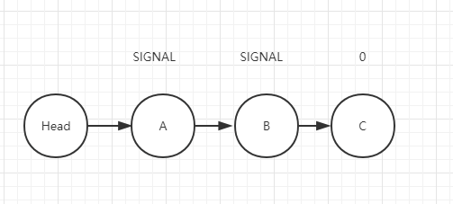
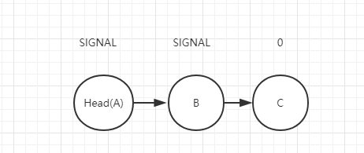
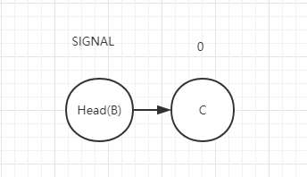
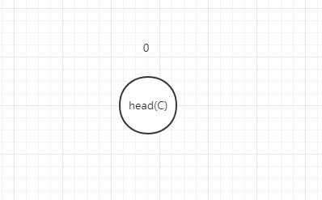

上篇文章是AQS的简单介绍和通过ReentranLock来分析了AQS的独占模式。这篇通过CountDownLatch继续分析AQS的共享模式。

感谢末尾参考的文章，知道怎么学习源码以及不懂的地方去寻找答案。学无止境，奋斗奋斗

<!-- more -->

### CountDownLatch原理

CountDownLatch也是JUC包下的一个并发工具，主要是用在某个线程等待其他线程全部执行完毕后再执行的场景。

CountDownLatch是通过一个计数器来实现的，这个计数器就是我们在（一）里面将的state。当new 一个CountDownLatch对象时需要传入该计数器值。每当一个线程执行完后就调用countDown将计数器值减1。当计数器为0时，则表示所有线程都完成任务，然后调用await()方法的线程就可以恢复执行了。

### CountDownLatch源码分析

#### 构造函数

```java
public CountDownLatch(int count) {
    if (count < 0) throw new IllegalArgumentException("count < 0");
    this.sync = new Sync(count);
}
```

传入count参数，然后调用内部类Sync，该内部类继承于AQS。

```java
private static final class Sync extends AbstractQueuedSynchronizer {
    private static final long serialVersionUID = 4982264981922014374L;

    Sync(int count) {
        setState(count);
    }

    int getCount() {
        return getState();
    }

    protected int tryAcquireShared(int acquires) {
        return (getState() == 0) ? 1 : -1;
    }

    protected boolean tryReleaseShared(int releases) {
        // Decrement count; signal when transition to zero
        for (;;) {
            int c = getState();
            if (c == 0)
                return false;
            int nextc = c-1;
            if (compareAndSetState(c, nextc))
                return nextc == 0;
        }
    }
}
```

可以看出 tryAcquireShared/tryReleaseShared均是重写AQS的中的方法。

#### await()

我们先看await方法，该方法会使当前线程阻塞，等待计数器为0后再次实行。

```java
public void await() throws InterruptedException {
    sync.acquireSharedInterruptibly(1);
}
```

这里跟ReentrantLock一样，先调用内部子类Sync的的方法。子类Sync再调用AQS的*acquireSharedInterruptibly*方法。

```java
public final void acquireSharedInterruptibly(int arg)
        throws InterruptedException {
    //如果线程被中断则抛出异常
    if (Thread.interrupted())
        throw new InterruptedException();
    //尝试获取共享锁，该方法在sync中重写
    if (tryAcquireShared(arg) < 0)
        //如果获取失败，则根据当前线程创建一个mode为SHARE的Node节点放入队列中并循环获取
        doAcquireSharedInterruptibly(arg);
}
```

### CountDownLatch重写tryAcquireShared方法

```java
protected int tryAcquireShared(int acquires) {
    return (getState() == 0) ? 1 : -1;
}
```

这里直接判断state计数器是否为0，为0则返回1表示成功获取共享锁，返回-1表示失败。

#### doAcquireSharedInterruptibly方法

```java
private void doAcquireSharedInterruptibly(int arg)
    throws InterruptedException {
    //创建一个共享模式的节点，并且入队。
    final Node node = addWaiter(Node.SHARED);
    boolean failed = true;
    try {
        //死循环获取锁
        for (;;) {
            //获取当前节点的前驱节点
            final Node p = node.predecessor();
            //如果前驱节点为head
            if (p == head) {
                //那么就去获取共享锁
                int r = tryAcquireShared(arg);
                if (r >= 0) {
                    //成功获取后，设置当前节点为head
                    setHeadAndPropagate(node, r);
                    p.next = null; // help GC
                    failed = false;
                    return;
                }
            }
            //如果前驱节点不为头结点，那么就去判断是否需要中断。
            //ReentrantLock已经分析过，大概就是将前驱节点不为CANCELLED的节点设置为SIGNAL
            //然后调用park方法阻塞线程
            if (shouldParkAfterFailedAcquire(p, node) &&
                parkAndCheckInterrupt())
                throw new InterruptedException();
        }
    } finally {
        if (failed)
            cancelAcquire(node);
    }
}
```

#### setHeadAndPropagate方法

```java
private void setHeadAndPropagate(Node node, int propagate) {
    //记录head节点
    Node h = head; 
    //将当前节点设置为头结点
    setHead(node);
    /*
     * Try to signal next queued node if:
     *   Propagation was indicated by caller,
     *     or was recorded (as h.waitStatus either before
     *     or after setHead) by a previous operation
     *     (note: this uses sign-check of waitStatus because
     *      PROPAGATE status may transition to SIGNAL.)
     * and
     *   The next node is waiting in shared mode,
     *     or we don't know, because it appears null
     *
     * The conservatism in both of these checks may cause
     * unnecessary wake-ups, but only when there are multiple
     * racing acquires/releases, so most need signals now or soon
     * anyway.
     */
    if (propagate > 0 || h == null || h.waitStatus < 0 ||
        (h = head) == null || h.waitStatus < 0) {
        Node s = node.next;
        if (s == null || s.isShared())
            doReleaseShared();
    }
}
```

又来到了大段判断的逻辑，稳住，不要慌，慢慢分析。

首先这个方法的前一步 ***int r = tryAcquireShared(arg)***的返回值有可能是1或者-1，要明确的是进入这个方法的前提条件是r>=0，那必然是r = 1即propagate=1时，说明已经获取了共享锁，因此第一个propagate > 0为true。因为整个判断都是“或”操作，因此直接进入if方法体。

**那么什么时候propagate会小于等于0呢？**反正CountDownLatch是不会出现这种情况。我们等以后分析到其他同步组件再说。

回到上面 if 方法体。获取node的下一个节点s，**s == null || s.isShared()**则执行doReleaseShared()。那么为啥后续节点为null也要执行doReleaseShared(）执行唤醒操作呢？

```java
 * The conservatism in both of these checks may cause
 * unnecessary wake-ups, but only when there are multiple
 * racing acquires/releases, so most need signals now or soon
 * anyway.
```
这段注释说 这两项检查中的保守型可能会导致多次不必要的唤醒，但是这些情况仅存在于多线程并发的acquires/releases中，所以大多数线程需要立刻或者很快的信号。这个信号就是unpark方法。因为LockSupport的unpark方法可以在park方法之前调用，相当于提前给了“许可证”。因此，在极端的情况下，虽然后续节点为空，但是唤醒过程中，刚好下一个节点添加到队列中，那么就可能不需要先进行阻塞，再唤醒操作。

只能说 ，卧槽~~~~大佬的代码就是不一般。

#### doReleaseShared()方法

执行到这里，说明前面 已经成功的把当前节点设置为head，此时只需要唤醒自己就行，然后把状态传播下去。

```java
private void doReleaseShared() {
    for (;;) {
        //头结点
        Node h = head;
        //头结点 ！= 尾结点，说明队列里面有元素
        if (h != null && h != tail) {
            int ws = h.waitStatus;
            //如果头结点是SIGNAL，证明是一个等待信号
            if (ws == Node.SIGNAL) {
                //用CAS将状态置为0
                if (!compareAndSetWaitStatus(h, Node.SIGNAL, 0))
                    continue;            // loop to recheck cases
                //然后把头结点的下一个节点唤醒
                unparkSuccessor(h);
            }
            //如果头结点状态为0，尝试设置状态为传播状态，表示节点向后传播
            //一直到成功为止。
            else if (ws == 0 &&
                     !compareAndSetWaitStatus(h, 0, Node.PROPAGATE))
                continue;                // loop on failed CAS
        }
        //如果头部有变化，则继续循环
        if (h == head)                   // loop if head changed
            break;
    }
}
```
我们来分析下这种情况，就可以明白这两个if条件分别什么时候执行 以及 最后循环退出的条件 h==head怎么理解？

假设同步队列里面现在有A---->B---->C三个节点。
我们在第一篇文章里讲过 当C节点入队后，会执行 shouldParkAfterFailedAcquire判断是否需要中断，这里会把自己的前驱节点状态都设置为SIGNAL，所以此时A B 的状态都为SIGNAL。如果此时A获取到锁，会执行doReleaseShared()方法唤醒B。

因为A节点的状态是SIGNAL，所以会执行第一个判断。

```java
    if (ws == Node.SIGNAL) {
        if (!compareAndSetWaitStatus(h, Node.SIGNAL, 0))
            continue;            // loop to recheck cases
        unparkSuccessor(h);
    }
```
此时，B节点也很快获得共享锁，成为了新的头节点。同时调用doReleaseShared去唤醒C。

但是此时A的循环有可能还没有结束，当运行到if(h == head)发现头结点已经发生了变化，因此会继续循环，同时线程B也在继续循环。
因此，我看别人的博客把这形容为“调用风暴”，大量线程都在执行doReleaseShared，极大的加速了唤醒后续节点的速度，又因为唤醒前是通过compareAndSetWaitStatus(h, Node.SIGNAL, 0)cas操作保证了同时唤醒一个节点，只有一个线程能够成功。

当C成为头结点时，队列中已经没有其他节点了，自己成为最后一个节点

此时C节点的状态为0，所以会执行第二个else if
```java
    else if (ws == 0 &&
             !compareAndSetWaitStatus(h, 0, Node.PROPAGATE))
        continue;   
```
将节点状态设置为PROPAGATE（-3）状态。如果这一步失败，说明在执行的过程中，ws不等于0了，说明有新的节点入队，把自己的状态修改了Node.SIGNAL。因此会continue继续循环，下次循环中会把新入队但准备挂起的线程唤醒。这种极端的情况作者也能考虑到，可以看出对于AQS的优化到了多么恐怖的地步。又要说一句：

#### countDown方法

```java
    public void countDown() {
        sync.releaseShared(1);
    }
```
调用Sync内部的releaseShared(1)方法。

```java
    public final boolean releaseShared(int arg) {
       //尝试释放共享节点，如果成功则释放和唤醒
        if (tryReleaseShared(arg)) {
            doReleaseShared();
            return true;
        }
        return false;
    }
```
这里先调用tryReleaseShared(arg)尝试释放节点，成功的话调用doReleaseShared();已经在上面分析过了。

#### tryReleaseShared

```java
    protected boolean tryReleaseShared(int releases) {
        // Decrement count; signal when transition to zero
        for (;;) {
            int c = getState();
            //如果等于0，说明不需要释放
            if (c == 0)
                return false;
            //将计数器减1
            int nextc = c-1;
            //最后返回是否等于0。等于0说明释放成功
            if (compareAndSetState(c, nextc))
                return nextc == 0;
        }
    }
}
```

### 总结

CountDownLatch是通过AQS的共享模式实现的。使用state作为计数器。
await方法获取共享锁，获取成功后唤醒后续节点，并传播下去。失败则入队。
countdown方法将state减1，等于0后则唤醒节点。不等于0则不释放锁，队列节点继续阻塞。