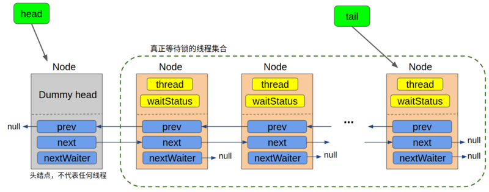
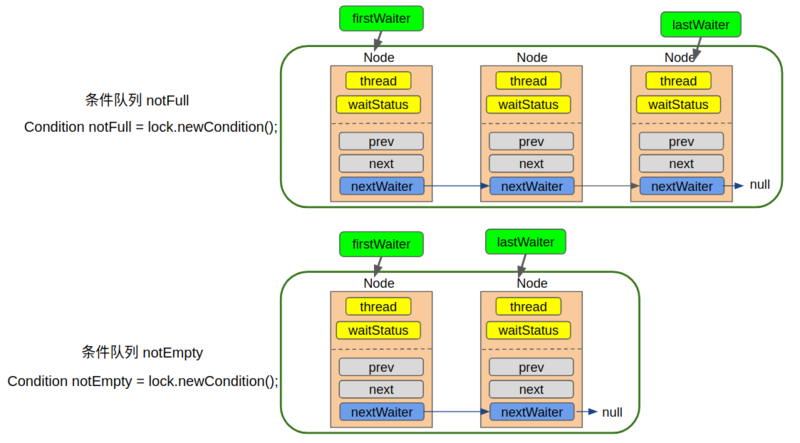

前面两篇分析了AQS的两种模式：独占模式和共享模式。AQS还提供了Condition功能，使得对线程的等待、唤醒更加灵活。
每篇文章的开头也是对自己的打气环节。加油，沉得住气，既不为来没有来临的黑暗担忧，但同时也要为了将来的光明而奋斗！

<!-- more -->

### Condition
在介绍Condition之前，我们先看没有Condition线程之间是如何通信的？

我们自然可以想到 wait()/notify()/notifyAll()方法。这三个方法的前提条件是获取到对象锁，一般和synchronized关机字配合使用。当我们notify()唤醒线程时，被唤醒的线程是有JVM随机唤醒的。notifyAll()则是唤醒所有等待的线程。如果我们想有条件的唤醒某些线程，是很难办到的。而且使用synchronized关键字，没有获取到锁的线程都会被放到一个队列中，而实际上可能会需要多个队列。

因此，Conditon机制的设计就是替换监视器锁的wait/notify机制的。一个lock里面可以创建多个Condition对象，相当于多路通知。并且可以根据不同的condition实现有条件的通知。因此是用lock下的condition会更加灵活。

我们可以将wait/notify机制和await/signal机制进行类比：

1. wait/notify机制必须配合synchronized关键字使用，await/signal机制必须配合lock使用。
2. 调用wait之后，线程会释放锁，进入waitset等待队列里。调用await之后，同样释放获取的lock，进入condition对应的队列中。
3. 调用notify会唤醒等待队列的线程，重新竞争锁。同样调用signal会唤醒condition对应等待队列中的线程重新竞争锁。
区别就是，一个队列和多个队列。

#### 实例
```java
public class BoundedBuffer {

    final Lock lock = new ReentrantLock();
    final Condition notFull = lock.newCondition();
    final Condition notEmpty = lock.newCondition();

    final Object[] items = new Object[100];
    int putptr, takeptr, count;

    public void put(Object x) throws InterruptedException {
        lock.lock();
        try {
            while (count == items.length) {
                notFull.await();
            }
            items[putptr] = x;
            if (++putptr == items.length) {
                putptr = 0;
            }
            ++count;
            notEmpty.signal();
        } finally {
            lock.unlock();
        }
    }

    public Object take() throws InterruptedException {
        lock.lock();
        try {
            while (count == 0) {
                notEmpty.await();
            }
            Object x = items[takeptr];
            if (++takeptr == items.length) {
                takeptr = 0;
            }
            --count;
            notFull.signal();
            return x;
        } finally {
            lock.unlock();
        }
    }
}
```

这是Condition接口注释里面的示例。这是一个典型的生产者消费者例子。put函数相当于生产者的操作，take则是消费者的操作。put操作会往数组里面添加元素然后调用notEmpty.signal()通知其他线程从数组中取数据，直到满了为止，从而在notFul条件上等待。take操作会取出数组里面的数据，然后notFull.signal();通知其他线程可以向数组中添加数据，直到数组没有数据为止，从而在notempty条件上等待。

这里所说的等待是在condition上的等待队列，当线程被唤醒之后，要重新竞争锁，如果竞争失败会进入到AQS的同步队列上。两个队列中元素相互转移，是理解condition原理的重要基础。

#### 等待队列、同步队列

在前面两篇文章我们知道，AQS是通过CLH队列变形的FIFO同步队列来实现线程的管理，当抢锁失败后包装成Node进入同步队列。这个同步队列是一个双向链表，通过prev、next指针连接前后节点。入队的时候如果队列没有初始化，则new Node作为head，这是一个没有实际意义的节点，仅作为头结点使用。这里借用一张图来说明：



而每创建一个condition，则相当于创建一个等待队列。如下图所示：



正是因为这样，我们才能够对不同队列进行精准的唤醒，这就是与wati/notify最大的不同。与同步队列不同的是，等待队列是一个单向链表，通过nextWaiter与后续节点进行联系。

#### 同步队列、等待队列相互转移

我们上面提到，理解两个队列是如何转移的，是理解condition原理的基础。

当线程lock获取锁的时候，如果获取不到锁，则进入同步队列sync queue。如果锁释放后，其他线程唤醒同步队列里面的节点，节点获取到锁后则从同步队列中出队，如果再调用condition.await，则进入condition的等待队列。
当持有锁的线程，调用condition.signal后，则唤醒等待队列的节点，从等待队列出队，去竞争锁，如果竞争失败，则进入到同步队列中。

### condition实现原理

我们以ReentrantLock为例，condition必须跟ReentrantLock绑定使用。

>    Lock lock = new ReentrantLock();
>    Condition notFull = lock.newCondition();

newCondition方法调用了Sync中的newConditon方法。

```java
        final ConditionObject newCondition() {
            return new ConditionObject();
        }
```

ConditionObject是AQS的一个内部类。实现Condition接口，其中有两个属性：
```java
        /** First node of condition queue. */
        private transient Node firstWaiter;
        /** Last node of condition queue. */
        private transient Node lastWaiter;
```

这两个属性表示等待队列的对首和对尾。

### Condition源码分析

#### await方法

https://segmentfault.com/a/1190000016462281

http://www.ideabuffer.cn/2017/03/20/%E6%B7%B1%E5%85%A5%E7%90%86%E8%A7%A3AbstractQueuedSynchronizer%EF%BC%88%E4%B8%89%EF%BC%89/