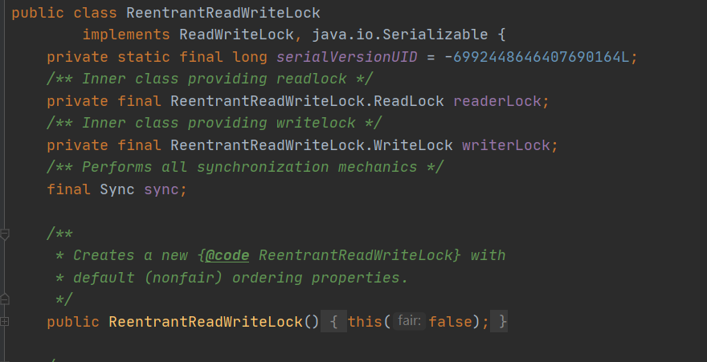
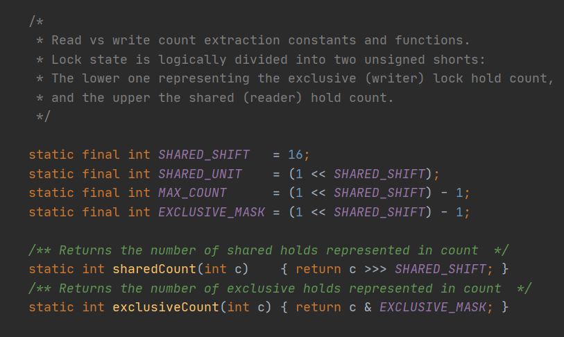

前面介绍了AQS的共享模式和独占模式，以及Condition功能，共享锁以CountDownLatch为例，排他锁则是以ReentrantLock为例。这篇文章就一起学习ReentrantReadWriteLock，在ReentrantReadWriteLock中包括读锁和写锁，读锁可以多线程访问，属于共享锁，写锁属于排它锁，更改的时候不允许其他线程访问。同时写锁也提供了Condition机制。不允许读写共存，但是可以读读共存。

<!-- more -->

### ReentrantReadWriteLock原理

很多场景下，大部分时间提供读服务，而写服务占用的时间比较少。因为如果读操作相关互斥的话，那么势必会带来性能的下降。因此读写锁适合于读多写少的场景 ，能够提高并发效率。

ReentrantReadWriteLock实现了ReadWriteLock接口，该接口维护着两把锁，一把读锁，一把写锁。

```java
public interface ReadWriteLock {
    Lock readLock();
    Lock writeLock();
}
```

因此，ReentrantReadWriteLock通过readLock()/writeLock()方法对外提供读锁/写锁。同时内部类Sync继承于AQS，读锁、写锁都是依靠Sync来实现的。



同时，我们还记得介绍AQS提到，用volatile修饰的state，不同子类实现有不同的含义。在ReentrantReadWriteLock中，就是通过state来维护读锁、写锁的状态。采用“按位切割使用”的方式来维护这个变量。

因为state是int型，共有32bit，ReentrantReadWriteLock将其分为两部分，高16表示读，低16位表示写。



可以看出来，通过位运算来 计算读写锁的装填。用state & 0x0000FFFF（抹去高16位）表示写状态，state >>> 16 (右移 16位，抹去低16位)表示读状态。 

### ReentrantReadWriteLock源码实现

#### WriteLock写锁获取

可以看到，写锁的获取跟ReentrantLock获取一样。主要调用ReentrantLock中的Sync类的tryAcquire(arg)方法。Sync继承AQS。
```java
    public void lock() {
        sync.acquire(1);
    }

    public final void acquire(int arg) {
        if (!tryAcquire(arg) &&
            acquireQueued(addWaiter(Node.EXCLUSIVE), arg))
            selfInterrupt();
    }


```


```java
        protected final boolean tryAcquire(int acquires) {
            //当前线程
            Thread current = Thread.currentThread();
            int c = getState();
            //获取排它锁的次数
            int w = exclusiveCount(c);
            //如果 c!=0，说明有其他线程获取读锁和写锁
            if (c != 0) {
                // 如果w == 0说明没有人获取写锁，但有人获取读锁，此时返回false
                //如果有人获取写锁，但持有锁的不是自己，也返回false.
                if (w == 0 || current != getExclusiveOwnerThread())
                    return false;
                //判断锁的获取次数不能超过最大值
                if (w + exclusiveCount(acquires) > MAX_COUNT)
                    throw new Error("Maximum lock count exceeded");
                // 当前线程获取写锁，锁重入
                setState(c + acquires);
                return true;
            }
            //走到这里说明写锁读锁都没被获取
            //判断是否需要阻塞，不需要则尝试将state+获取锁次数
            if (writerShouldBlock() ||
                !compareAndSetState(c, c + acquires))
                return false;

            //获取写锁成功，设置独占线程。
            setExclusiveOwnerThread(current);
            return true;
        }
```

当首次获取锁的时候，需要判断是否需要阻塞。在非公平模式下，永远不需要阻塞。
```java
        final boolean writerShouldBlock() {
            return false; // writers can always barge
        }
```

在公平模式下，需要判断当前节点前有没有等待时间更长的节点。如果有，则返回false，然后入队阻塞。
```java
        final boolean writerShouldBlock() {
            return hasQueuedPredecessors();
        }
```

所以写锁总结：

1. 如果state不为0，判断有线程是否获取读锁，有则抢锁失败，入队阻塞，否则2
2. 如果有线程获取写锁，判断是不是自己，不是则入队阻塞。是自己则判断获取锁次数有没有超上限，没有则将锁的重入次数更新，抢锁成功。
3. 如果state为0，则判断当前线程是否需要阻塞（非公平模式永远不需要，公平模式需要判断是否有前驱节点），需要阻塞，则抢锁失败入队阻塞。不需要阻塞则修改锁的state值
4. 最后将独占线程设置为自己，抢锁成功。


#### WriteLock写锁释放

可以看到，写锁的释放跟ReentrantLock获取一样。主要调用ReentrantReadWriteLock中的Sync类的tryRelease(arg)方法。Sync继承AQS。

```java
        public void unlock() {
            sync.release(1);
        }

    public final boolean release(int arg) {
        //释放锁
        if (tryRelease(arg)) {
            //成功后，唤醒后续接地那
            Node h = head;
            if (h != null && h.waitStatus != 0)
                unparkSuccessor(h);
            return true;
        }
        return false;
    }
```

```java
        protected final boolean tryRelease(int releases) {
            if (!isHeldExclusively())
                throw new IllegalMonitorStateException();
            int nextc = getState() - releases;
            boolean free = exclusiveCount(nextc) == 0;
            if (free)
                setExclusiveOwnerThread(null);
            setState(nextc);
            return free;
        }
```

写锁的释放很简单，先判断获取锁的线程是不是自己，不是自己则抛出异常。

然后将state减去释放次数，然后判断写锁获取次数是不是0，是0则将独占线程设置为null。否则释放的仅仅是一次重入锁。

#### ReadLock读锁获取

读锁的获取同样道理，最终调的是sync的tryAcquireShared方法。

```java
        protected final int tryAcquireShared(int unused) {
            //获取当前线程
            Thread current = Thread.currentThread();
            int c = getState();
            //如果有人持有写锁，并且写锁持有者不是自己，则抢锁失败，入队阻塞
            if (exclusiveCount(c) != 0 &&
                getExclusiveOwnerThread() != current)
                return -1;
            //获取读锁的次数
            int r = sharedCount(c);
            //判断是否需要阻塞，不需要判断次数是否超限，没有超限则修改state。
            if (!readerShouldBlock() &&
                r < MAX_COUNT &&
                compareAndSetState(c, c + SHARED_UNIT)) {
                //如果r==0，说明是第一次获取读锁
                if (r == 0) {
                    //将自己设置赋值给firstReader
                    firstReader = current;
                    //将firstReaderHoldCount值设置为1
                    firstReaderHoldCount = 1;
                //如果firstReader是自己，说明是读锁重入
                } else if (firstReader == current) {
                    //那么将firstReaderHoldCount值加一
                    firstReaderHoldCount++;
                } else {
                    //走到这里说明之前有人获取过读锁了
                    //先取出cachedHoldCounter缓存
                    HoldCounter rh = cachedHoldCounter;
                    //如果rh为null，或者rh 不是自己
                    if (rh == null || rh.tid != getThreadId(current))
                        //就要从readHolds中取出自己的HoldCounter赋值给cachedHoldCounter
                        cachedHoldCounter = rh = readHolds.get();
                    //如果rh 不为null，且是自己，但如果count等于0，说明上次获取锁的是自己，但是自己已经释放了
                    else if (rh.count == 0)
                        readHolds.set(rh);//那么加入到readHolds
                    rh.count++;//计数加1
                }
                return 1;
            }
            return fullTryAcquireShared(current);
        }
```

读锁过程稍微有点复杂。先判断有没有写锁，有的话是不是自己，否则返回。随后判断读线程是否需要阻塞，不需要则分为三种情况设置：

1. 如果是第一次获取读锁，则设置firstReader和firstReaderHoldCount
2. 如果有人获取读锁了，并且firstReader是自己，说明是读锁重入，则firstReaderHoldCount++
3. 如果之前有人获取过读锁了，但是firstReader不是自己。
    1. 如果通过cachedHoldCounter判断上次获取读锁的是不是自己，如果是则看一下count是不是0，如果是0说明上一次获取读锁的是自己，但是已经释放了，因此将自己的HoldCounter加入到readHolds，然后count++;
    2. 如果cachedHoldCounter缓存没有或者cachedHoldCounter不是自己，那么将从readHolds取出自己的HoldCounter赋值给cachedHoldCounter。

我们来了解一下 HoldCounter 和 ThreadLocalHoldCounter readHolds 就能够更好的理解读锁的获取过程。

HoldCounter:

```java
        static final class HoldCounter {
            //某个读线程重入的次数
            int count = 0;
            //Use id, not reference, to avoid garbage retention
            // 记录线程ID，而不是引用，这样能避免辣鸡保留 
            final long tid = getThreadId(Thread.currentThread());
        }
```

ThreadLocalHoldCounter:將HoldCounter绑定到对应线程上。同时重写initialValue方法，当第一次get的时候，直接返回new HoldCounter()。

```java
        static final class ThreadLocalHoldCounter
            extends ThreadLocal<HoldCounter> {
            public HoldCounter initialValue() {
                return new HoldCounter();
            }
        }
```

以及几个辅助属性：

```java
        //记录上次获取读锁的线程
        private transient HoldCounter cachedHoldCounter;

        //记录第一次获取读锁的线程
        private transient Thread firstReader = null;
        private transient int firstReaderHoldCount;

```

因此我们可以总结：当只有一个线程时，只需要使用firstReader和firstReaderHoldCount记录线程和锁重入次数，当有第二个线程来的时候，就需要使用ThreadLocal去获取自己的HoldCounter，同时将自己的HoldCounter赋值给cachedHoldCounter缓存。这样等有第三个线程来的时候，就可以用缓存判断自己是不是上一次获取锁的线程。

#### ReadLock读锁释放

读锁的释放也是同样道理，最终调的是sync的tryReleaseShared方法。

```java
        public void unlock() {
            sync.releaseShared(1);
        }

        public final boolean releaseShared(int arg) {
        if (tryReleaseShared(arg)) {
            doReleaseShared();
            return true;
        }
        return false;
    }
```

```java
        protected final boolean tryReleaseShared(int unused) {
            //获取当前线程
            Thread current = Thread.currentThread();
            //如果自己是第一个读锁获取者
            if (firstReader == current) {
                // 如果只获取了一次，那么就将firstReader置空
                if (firstReaderHoldCount == 1)
                    firstReader = null;
                else
                    //否则锁重入减一
                    firstReaderHoldCount--;
            } else {
                //如果不是第一个读锁获取者
                HoldCounter rh = cachedHoldCounter;
                //如果是上一次的获取者
                if (rh == null || rh.tid != getThreadId(current))
                    //从ThreadLocal中取出HoldCounter
                    rh = readHolds.get();
                int count = rh.count;
                //如果获取锁的次数小于等于1
                if (count <= 1) {
                    //将自己的HoldCount从readHolds中去掉
                    readHolds.remove();
                    if (count <= 0)
                        throw unmatchedUnlockException();
                }
                //将count减1
                --rh.count;
            }
            //最后统一修改state
            for (;;) {
                int c = getState();
                int nextc = c - SHARED_UNIT;
                if (compareAndSetState(c, nextc))
                    // Releasing the read lock has no effect on readers,
                    // but it may allow waiting writers to proceed if
                    // both read and write locks are now free.
                    return nextc == 0;
            }
        }
```

理解了读锁的获取，那么读锁的释放就手到擒来了。妙啊！

#### 锁降级

在读锁获取的代码中，如果判断有人持有写锁，如果不是自己的话，则返回-1，如果是自己的话就可以继续获取读锁。也就是 获取写锁----->获取读锁，如果先释放写锁，继续持有读锁，那么就完成了锁的降级。

### 总结

读读可以共存。在持有读锁的情况下，当前线程和其他线程都不可以持有写锁。当持有写锁的时候，当前线程还可以获取读锁，而其他线程则既不能获取写锁，也不能够获取读锁。