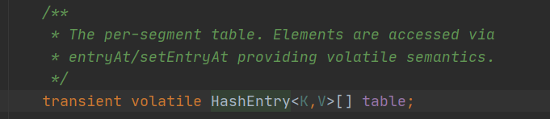
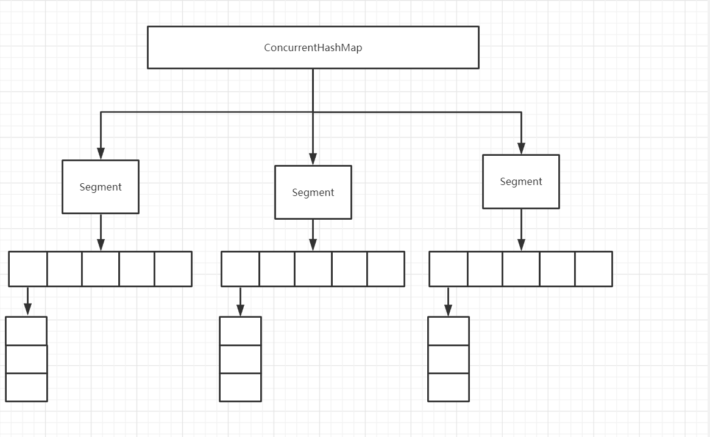
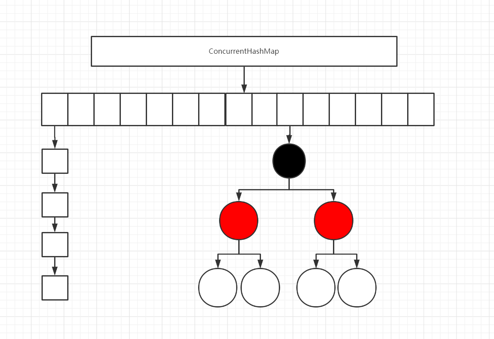
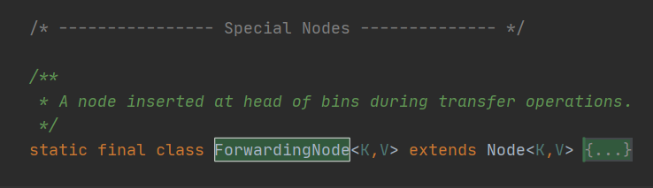
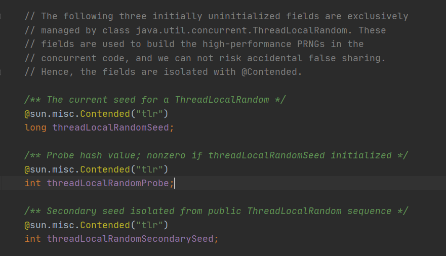

前面分析了HashMap，我们知道HashMap是线程不安全的。我们可以通过HashTable和Collections工具包下的synchronizedMap来解决，但是这两种都是对读写加锁，阻塞线程，性能不高。因此，ConcurrentHashMap应运而生。而且在面试中，HashMap问完，大概率是要问ConcurrentHashMap。下面我们按照1.7 1.8不同的实现来进行分析。

来吧，开启今天的学习模式。

<!-- more -->

### JDK1.7基于分段锁的ConcurrentHashMap

正如1.7的HashMap一样，ConcurrentHashMap在JDK1.7中，底层数据结构仍然是数组加链表。但是不同的是，ConcurrentHashMap是基于Segment数组来实现的，Segment继承ReentrantLock，要想访问Segment要先获取同步锁。而每一个Segment则类似于HashMap一样，基于数组和链表实现，不过在Segment内部数组是HashEntry。





#### put操作

**Segment的大小ssize默认为** DEFAULT_CONCURRENCY_LEVEL =**16**

```java
public V put(K key, V value) {
    Segment<K,V> s;
    if (value == null)
        throw new NullPointerException();
    //获取hash值
    int hash = hash(key);
    //定位segments数组的位置 假如 hash >>> segmentShift是取高N位 segmentShift低N位，两者取 &
    int j = (hash >>> segmentShift) & segmentMask;
    if ((s = (Segment<K,V>)UNSAFE.getObject          // nonvolatile; recheck
         (segments, (j << SSHIFT) + SBASE)) == null) //  in ensureSegment
        s = ensureSegment(j);
    return s.put(key, hash, value, false);
}

final V put(K key, int hash, V value, boolean onlyIfAbsent) {
    //是否获取锁，没有获取则自旋直到成功
    HashEntry<K,V> node = tryLock() ? null :
    scanAndLockForPut(key, hash, value);
    V oldValue;
    try {
        HashEntry<K,V>[] tab = table;
        //计算所在segment里面数组的位置
        int index = (tab.length - 1) & hash;
        //获取所在桶的第一个元素
        HashEntry<K,V> first = entryAt(tab, index);
        for (HashEntry<K,V> e = first;;) {
            //如果第一个元素不为null,说明此处有链表，一直循环知道e== null
            if (e != null) {
                K k;
                //如果key相同
                if ((k = e.key) == key ||
                    (e.hash == hash && key.equals(k))) {
                    oldValue = e.value;
                    //则替换原来的值
                    if (!onlyIfAbsent) {
                        e.value = value;
                        ++modCount;
                    }
                    break;
                }
                e = e.next;
            }
            else {//如果没有数据或者链表中没有找到替换的元素
                //如果node不为null,则将待插入元素放到node后面。
                if (node != null)
                    node.setNext(first);
                else//node为空，则创建头节点
                    node = new HashEntry<K,V>(hash, key, value, first);
                //判断是否需要扩容
                int c = count + 1;
                if (c > threshold && tab.length < MAXIMUM_CAPACITY)
                    //扩容
                    rehash(node);
                else
                    //将创建的头节点设置到table的inedx位置
                    setEntryAt(tab, index, node);
                ++modCount;
                count = c;
                oldValue = null;
                break;
            }
        }
    } finally {
        unlock();
    }
    return oldValue;
}
```

可以看出来，map的put方法就完成三件事。

1. 找出所在segments数组中所在位置，如果当前位置没有初始化，则调用ensureSegment()方法初始化，然后将元素put到相应segment里面。
2. put的时候先获取锁，失败则调用scanAndLockForPut方法自旋获取锁，否则往下执行
3. 通过hash计算出所在table的位置，如果可以找到相同key的则替换，否则设置节点，设置之前判断是否需要扩容，不需要则设置后释放锁。

而put操作是仅对相应的segment进行加锁，其他segment并没有加锁，所以理论上支持concurrencyLevel即segment个数的线程安全并发读写。

#### get 操作

```java
public V get(Object key) {
    Segment<K,V> s; // manually integrate access methods to reduce overhead
    HashEntry<K,V>[] tab;
    int h = hash(key);
    long u = (((h >>> segmentShift) & segmentMask) << SSHIFT) + SBASE;
    if ((s = (Segment<K,V>)UNSAFE.getObjectVolatile(segments, u)) != null &&
        (tab = s.table) != null) {
        for (HashEntry<K,V> e = (HashEntry<K,V>) UNSAFE.getObjectVolatile
                 (tab, ((long)(((tab.length - 1) & h)) << TSHIFT) + TBASE);
             e != null; e = e.next) {
            K k;
            if ((k = e.key) == key || (e.hash == h && key.equals(k)))
                return e.value;
        }
    }
    return null;
}
```

get操作与put操作最大的不同就是不需要加锁。get方法使用getObjectVolatile方法可以保证读取到的数据都是最新的。

#### size操作

```java
public int size() {
    // Try a few times to get accurate count. On failure due to
    // continuous async changes in table, resort to locking.
    final Segment<K,V>[] segments = this.segments;
    int size;
    boolean overflow; // true if size overflows 32 bits
    long sum;         // sum of modCounts
    long last = 0L;   // previous sum
    int retries = -1; // first iteration isn't retry
    try {
        for (;;) {
            //重试次数达到3次，则对所有segment进行加锁
            if (retries++ == RETRIES_BEFORE_LOCK) {
                for (int j = 0; j < segments.length; ++j)
                    ensureSegment(j).lock(); // force creation
            }
            sum = 0L;
            size = 0;
            overflow = false;
            for (int j = 0; j < segments.length; ++j) {
                Segment<K,V> seg = segmentAt(segments, j);
                if (seg != null) {
                    sum += seg.modCount;
                    int c = seg.count;
                    if (c < 0 || (size += c) < 0)
                        overflow = true;
                }
            }
            //如果前后两次计算没有发生变化，则跳出循环
            if (sum == last)
                break;
            last = sum;//记录这次计算值，下次循环时进行比较
        }
    } finally {
        if (retries > RETRIES_BEFORE_LOCK) {
            for (int j = 0; j < segments.length; ++j)
                segmentAt(segments, j).unlock();
        }
    }
    return overflow ? Integer.MAX_VALUE : size;
}
```

size操作的实现方案是：在不加锁的前提下，逐个计算segment的size之和。如果某相邻两次计算的所有segment的更新次数**modCount**相同，则说明这两次计算过程中没有发生数据变化，则这次计算的总size可直接最终结果返回。若重试三次之后，仍不能计算出总size，则对所有segment进行加锁计算。

#### 总结

JDK1.7的ConcurrentHashMap使用了分段锁的思想提高了并发量。底层使用unsafe的方法和volatile关键字来替代锁。计算sizes时，先尝试不加锁计算，如果没有变化则返回，超过重试次数之后，再加锁，提高了性能。

### JDK1.8基于CAS+Sychronized的ConcurrentHashMap

JDK1.7引入segment方式，利用分段锁的思想，理论上最大并发数跟segment个数相同，JDK1.8进一步提高并发性，抛弃了分段锁的方式，利用CAS+Synchronized来保证并发更新的安全。跟JDK1.8的hashmap一样，JDK1.8的ConcurrentHashMap底层也是使用数组+链表+红黑树实现。



与hashmap一样，**table**用来存放Node节点。默认大小为16，容量总为2的N次方。

```java
/**
 * The array of bins. Lazily initialized upon first insertion.
 * Size is always a power of two. Accessed directly by iterators.
 */
transient volatile Node<K,V>[] table;
```

**nextTable**扩容时数据存放的数组，大小为原来的2倍。

```java
/**
 * The next table to use; non-null only while resizing.
 */
private transient volatile Node<K,V>[] nextTable;
```

**Node**节点，JDK1.7时为HashEntry。

**ForwardingNode**只有在发生扩容时，作为首节点放在table中。



**sizeCtl**控制标识符，用来标识table初始化和扩容时，负数为正在初始化或者扩容；-1正在初始化；-N标识有N-1个线程正在扩容；0或者正数标识还没初始化


#### put操作

```java
/**
 * Initializes table, using the size recorded in sizeCtl.
 */
private final Node<K,V>[] initTable() {
    Node<K,V>[] tab; int sc;
    while ((tab = table) == null || tab.length == 0) {
        //如果sizeCtl小于0，则说明其他线程正在初始化，当前线程挂起
        if ((sc = sizeCtl) < 0)
            Thread.yield(); // lost initialization race; just spin
        //否则，使用CAS将sizeCtl设置为-1，表示当前线程正在初始化
        else if (U.compareAndSwapInt(this, SIZECTL, sc, -1)) {
            //进行初始化
            try {
                if ((tab = table) == null || tab.length == 0) {
                    int n = (sc > 0) ? sc : DEFAULT_CAPACITY;
                    @SuppressWarnings("unchecked")
                    Node<K,V>[] nt = (Node<K,V>[])new Node<?,?>[n];
                    table = tab = nt;
                    //阈值
                    sc = n - (n >>> 2);
                }
            } finally {
                //将阈值赋值给sizeCtl
                sizeCtl = sc;
            }
            break;
        }
    }
    return tab;
}
```


```java

public V put(K key, V value) {
    return putVal(key, value, false);
}

/** Implementation for put and putIfAbsent */
final V putVal(K key, V value, boolean onlyIfAbsent) {
    //1. key 和 value 都不能为空
    if (key == null || value == null) throw new NullPointerException();
    //计算hash值。
    int hash = spread(key.hashCode());
    int binCount = 0;
    for (Node<K,V>[] tab = table;;) {
        Node<K,V> f; int n, i, fh;
        //如果table为空，则进行初始化操作
        if (tab == null || (n = tab.length) == 0)
            tab = initTable();
        //如果 i = (n - 1) & hash求出在数组的位置，如果i位置为空，则使用CAS直接插入。
        else if ((f = tabAt(tab, i = (n - 1) & hash)) == null) {
            if (casTabAt(tab, i, null,
                         new Node<K,V>(hash, key, value, null)))
                break;                   // no lock when adding to empty bin
        }
        //如果找出数组所在位置节点的hash值为-1，说明正在扩容，则帮助扩容
        else if ((fh = f.hash) == MOVED)
            tab = helpTransfer(tab, f);
        else {
            V oldVal = null;
            //对该节点加锁，进行插入操作。
            synchronized (f) {
                if (tabAt(tab, i) == f) {
                    //hash值大于0，则证明有元素，将该节点插入到链表尾部
                    if (fh >= 0) {
                        binCount = 1;
                        for (Node<K,V> e = f;; ++binCount) {
                            K ek;
                            //key hash值都一样，则替换value
                            if (e.hash == hash &&
                                ((ek = e.key) == key ||
                                 (ek != null && key.equals(ek)))) {
                                oldVal = e.val;
                                if (!onlyIfAbsent)
                                    e.val = value;
                                break;
                            }
                            //将插入元素插入到尾部。
                            Node<K,V> pred = e;
                            if ((e = e.next) == null) {
                                pred.next = new Node<K,V>(hash, key,
                                                          value, null);
                                break;
                            }
                        }
                    }
                    //说明hash值小于0，因为上面判断了不是-1，因此可能是-2，所以这里判断类型
                    //如果是树节点，则按照树的插入操作进行插入
                    else if (f instanceof TreeBin) {
                        Node<K,V> p;
                        binCount = 2;
                        if ((p = ((TreeBin<K,V>)f).putTreeVal(hash, key,
                                                       value)) != null) {
                            oldVal = p.val;
                            if (!onlyIfAbsent)
                                p.val = value;
                        }
                    }
                }
            }
            if (binCount != 0) {
                //如果链表长度大于等于8，则把链表转换为树结构
                if (binCount >= TREEIFY_THRESHOLD)
                    treeifyBin(tab, i);
                if (oldVal != null)
                    return oldVal;
                break;
            }
        }
    }
    addCount(1L, binCount);
    return null;
}
```

##### 1. 寻址方式

跟HashMap一样，hash值计算只是进行右移16位进行异或。并且与HASH_BITS进行与操作保证为正数。

```java
static final int spread(int h) {  return (h ^ (h >>> 16)) & HASH_BITS;}
```

##### 2. 初始化

初始化过程中，使用sizeCtl，如果值小于0，说明有其他线程正在初始化，线程挂起。否则先用**CAS**(CAS第一次出现)将值设为-1，然后初始化数组。最后将sizeCtl值设为阈值。

##### 3. addCount()

addCout()主要更新**baseCount**(用来计算size)，以及检测是否需要**扩容**。

```java
private final void addCount(long x, int check) {
    CounterCell[] as; long b, s;
    //size部分我们后面分析
    if ((as = counterCells) != null ||
        !U.compareAndSwapLong(this, BASECOUNT, b = baseCount, s = b + x)) {
        CounterCell a; long v; int m;
        boolean uncontended = true;
        if (as == null || (m = as.length - 1) < 0 ||
            (a = as[ThreadLocalRandom.getProbe() & m]) == null ||
            !(uncontended =
              U.compareAndSwapLong(a, CELLVALUE, v = a.value, v + x))) {
            fullAddCount(x, uncontended);
            return;
        }
        if (check <= 1)
            return;
        s = sumCount();
    }
    if (check >= 0) {
        Node<K,V>[] tab, nt; int n, sc;
        //如果容量大于阈值，table不为空，并且tale长度小于MAXIMUM_CAPACITY，则进入while方法体
       //进行扩容
        while (s >= (long)(sc = sizeCtl) && (tab = table) != null &&
               (n = tab.length) < MAXIMUM_CAPACITY) {
            int rs = resizeStamp(n);
            //sc = sizeCtl 如果小于0，说明正在扩容
            if (sc < 0) {
                if ((sc >>> RESIZE_STAMP_SHIFT) != rs || sc == rs + 1 ||
                    sc == rs + MAX_RESIZERS || (nt = nextTable) == null ||
                    transferIndex <= 0)
                    break;
                if (U.compareAndSwapInt(this, SIZECTL, sc, sc + 1))
                    transfer(tab, nt);
            }
            else if (U.compareAndSwapInt(this, SIZECTL, sc,
                                         (rs << RESIZE_STAMP_SHIFT) + 2))
                transfer(tab, null);
            s = sumCount();
        }
    }
}
```

上面调用transfer前的那坨验证看的**头皮发麻**，先跳过，看不懂了。

transfer方法也是够呛。总之是，构建一个nextTable，大小为原来的两倍。然后将原table里面的内容复制到nextTable里，多线程可以协助转移。

##### 4. 整个过程

1. 如果table为空，则调用initTable()方法进行初始化
2. 根据hash值计算所在数组位置（hash & n -1），如果这个位置为空则用CAS直接插入
3. 如果这个位置的元素hash值为-1，说明是ForWardingNode节点，说明正在扩容，则帮助扩容
4. 如这个位置的元素hash大于等于0.，说明是遍历，则遍历链表，如果key相同则替换value，否则将带插入元素插入到链表尾部。如果hash值小于0，则判断是否为树节点，如果是则按照红黑树的方法插入。
5. 如果链表长度>8，则将链表转为红黑树
6. 调用addCount方法，size+1。

#### get操作

相比较，get方法就少多了。哈哈。

```java
public V get(Object key) {
    Node<K,V>[] tab; Node<K,V> e, p; int n, eh; K ek;
    //计算hash值
    int h = spread(key.hashCode());
    //如果table 不为空，并且数组下标为(n - 1) & h的元素也不为空，则进入方法体
    if ((tab = table) != null && (n = tab.length) > 0 &&
        (e = tabAt(tab, (n - 1) & h)) != null) {
        //如果 找到的key相同hash值相同，且key相同，则返回
        if ((eh = e.hash) == h) {
            if ((ek = e.key) == key || (ek != null && key.equals(ek)))
                return e.val;
        }
        //如果是树，则查找
        else if (eh < 0)
            return (p = e.find(h, key)) != null ? p.val : null;
       //链表，则遍历链表
        while ((e = e.next) != null) {
            if (e.hash == h &&
                ((ek = e.key) == key || (ek != null && key.equals(ek))))
                return e.val;
        }
    }
    return null;
}
```

#### 计算元素个数

回到上面put里面的addCount方法，先看新增的时候，是如何进行修改数量的。可以看到，先尝试修改baseCount，如果失败了说明是发生了竞争，然后随机从CounterCells中取出一个CounterCell，尝试修改。如果也失败了，则调用fullAddCount，死循环进行修改。

```java
private final void addCount(long x, int check) {
    CounterCell[] as; long b, s;
    //如果counterCells == null，则用CAS对baseCount进行自增操作
    //如果cas失败，则说明存在并发，则使用counterCells。
    if ((as = counterCells) != null ||
        !U.compareAndSwapLong(this, BASECOUNT, b = baseCount, s = b + x)) {
        CounterCell a; long v; int m;
        boolean uncontended = true;
        //如果cas修改counterCells也失败了，则调用fullAddCount方法
        if (as == null || (m = as.length - 1) < 0 ||
            (a = as[ThreadLocalRandom.getProbe() & m]) == null ||
            !(uncontended =
              U.compareAndSwapLong(a, CELLVALUE, v = a.value, v + x))) {
            //这个方法也贼长，就不贴了，就是死循环不断进行修改，直到成功。
            fullAddCount(x, uncontended);
            return;
        }
        if (check <= 1)
            return;
        s = sumCount();
    }
	//头疼的扩容。。。。。。。
}
```


由下面可以看出，计算数量大小，将baseCount和counterCells的总量相加返回。

```java
public int size() {
    long n = sumCount();
    return ((n < 0L) ? 0 :
            (n > (long)Integer.MAX_VALUE) ? Integer.MAX_VALUE :
            (int)n);
}
```

```java
final long sumCount() {
    CounterCell[] as = counterCells; CounterCell a;
    long sum = baseCount;
    if (as != null) {
        for (int i = 0; i < as.length; ++i) {
            if ((a = as[i]) != null)
                sum += a.value;
        }
    }
    return sum;
}
```

#### 缓存行 伪共享

这里插播一下，看看countercell是个啥？

它内部有一个volatile的变量，来保持可见性。但这个***@sun.misc.Contended***这个就有点意思了，这个就跟缓存行和伪共享有关。

```java
/**
 * A padded cell for distributing counts.  Adapted from LongAdder
 * and Striped64.  See their internal docs for explanation.
 */
@sun.misc.Contended static final class CounterCell {
    volatile long value;
    CounterCell(long x) { value = x; }
}
```

所谓伪共享指的是多个线程同时读写同一个缓存行的不同变量导致cpu缓存失效。尽管这些变量之间没有关系，但是唯一同个缓存行之中，他们之中有一个发生变化，就会导致缓存失效，引发性能下降。

那么缓存行又是啥？

缓存行又称为Cache Line。我们知道cpu有多级缓存，每级缓存都是由若干个缓存行组成，一个缓存行的大小一般是64个字节，并且它有效的引用主内存中的一块地址。缓存的存在意义是因为局部性原理，又分为空间局部性和时间局部性。

那么Java中伪共享如何解决呢？

1. 字节填充，保证不同线程的变量在不同的缓存行即可。使用多余的字节来填充，典型的空间换时间思想。

2. 还有就是上面提到的***@sun.misc.Contended***这个注解了。JDK1.8中新增的这个注解，可以使各个变量在缓存行中分隔开。（JVM需要添加参数-XX:-RestrictContended才能开启此功能）

   1. 这个注解使用的地方出了我们这篇文章的ConcurrentHashMap

   2. 还有就是Thread类中生成随机数。

   

   3. Disruptor框架其中的RingBuffer中继承关系的填充，不会出现伪共享问题。

   

   先到这了，不扯了。这又证明了一点，知识是相通的。

   

### 总结

**ConcurrentHashMap** 太鸡儿复杂了，tranfer方法和fullAddCount都没怎么看懂，留着以后作业，还有很多很多没涉及的，慢慢来吧。

总结部分，我们主要总结**ConcurrentHashMap**  JDK1.8 和JDK1.7对比，做了哪些优化？有什么不同？

从底层数据结构来讲，1.7中是使用数组+链表。1.8是使用数组+链表+红黑树。

从结构上来讲，1.7是由segments数组组成，segment中是由HashEntry类型的table数组。1.8则是Node类型的table数组。

从实现来讲，1.7是基于segment继承ReentrantLock分段锁来实现线程同步。而1.8中则抛弃了分段锁的思想，使用CAS+synchronized关键字来实现的。

从源码实现细节上来讲，1.7中get put首先要计算出在哪个segment中，然后再计算出所在数组中的位置，put操作要对所在segment加锁，然后执行put操作，头插法。1.8中，只需要计算出所在数组中的位置，put时候，如果所在位置没有元素，使用CAS插入，如果在扩容，则帮助扩容，都不是，则使用synchronized加锁，最后完成插入，尾插法。

计算size的方法也不同，1.7是先尝试计算所有segment的总size，如果有相邻两次相同，则认为没有发生改变，直接返回size，重试三次之后仍不能计算出，则对所有segment加锁，计算。而1.8中计算baseCount和counterCells的总量。put的时候会先尝试对baseCount进行CAS操作，失败了则对counterCells进行修改，所以计算的时候要讲baseCout+counterCells。

等等，等遇到面试题了再补充总结。


> 参考列表
>
> 1. http://cmsblogs.com/?p=2283
> 2. http://www.jasongj.com/java/concurrenthashmap/
> 3. https://juconcurrent.com/2018/12/11/ConcurrentHashMap-source-04-size/
> 4. https://www.jianshu.com/p/749d1b8db066
> 5. https://www.cnkirito.moe/cache-line/
> 6. https://blog.csdn.net/qq_27680317/article/details/78486220