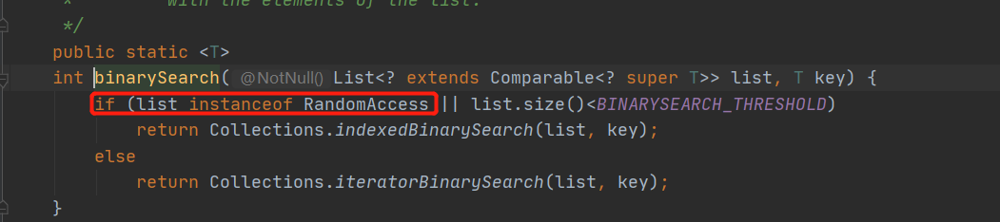
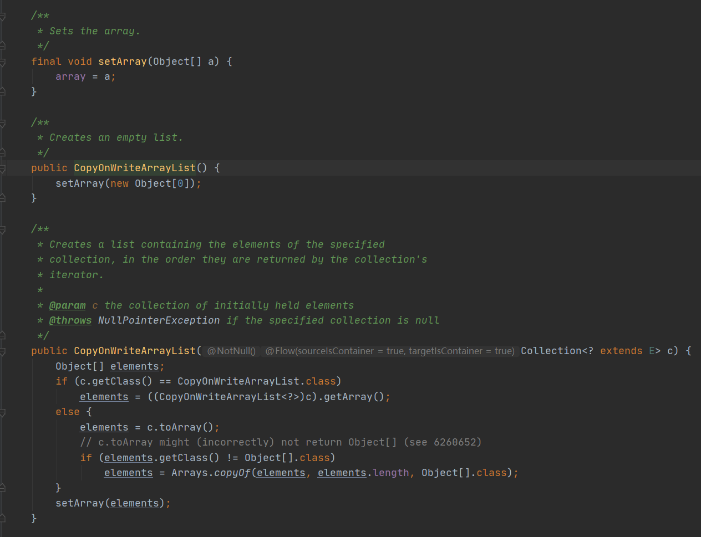

众所周知，ArrayList是线程不安全的。如果想要实现线程安全，可以选择Vector，Collections工具包下的synchronizedList()，但是Vector将所有方法都加sychronized关键字，严重影响性能，因此不推荐使用。而Collections.synchronizedList是通过对Object mutex加关键字sychronized实现同步，但是仍有部分操作是不安全的。比如listIterator迭代方法，需要用户进行保证。今天，介绍另外一种ArrayList的同步机制：CopyOnWriteArrayList。

<!-- more -->

### CopyOnWriteArrayList实现原理

#### 实现原理

CopyOnWriteArrayList是ArrayList的线程安全版本。内部跟ArrayList一样，也是通过数组实现的。不同的是，CopyOnWriteArrayList是以利用一种**写时复制**的思想，**每次对数组的修改都会重新拷贝一份新的数组来修改，修改完之后再替换老的数组**。这样不影响读操作，只阻塞写操作，实现读写分离。因此是线程安全且读操作无锁的ArrayList，适合于**读多写少**的并发场景。

CopyOnWriteArrayList实现了RandomAccess接口，提供了随机访问的能力。RandomAccess是一个空的**标记接口**，用来表示其支持快速随机访问。

这里插一个知识：但是RandomAccess这个空的标记接口有什么用呢？



我们查看Collections类binarySearch 二分方法，发现通过*instanceof*判断list是否实现RandomAccess接口，从而选择使用for循环遍历还是通过迭代器进行循环。例如ArrayList底层数据结构是数组，因此随机访问较快，同时实现了RandomAccess接口，因此可以使用for循环，而LinkedList基于链表的，采用顺序访问，并没有实现RandomAccess接口，因此采用迭代器循环进行遍历。

#### 优缺点分析

优点：因为读操作没有阻塞，因此读操作性能很高，适合于读多写少的场景。同时因为其读写分离的思想，从而避免了**ConcurrentModificationException**异常。

缺点：一是因为每次写操作都要拷贝一份原数据，因此占用内存会比较大。二是读写并行的时候，因为读操作跟写操作发生在不同数组，因此读操作可能会滞后，可能读取不到最新的数据。

### 源码分析

#### 内部属性

CopyOnWriteArrayList仅有两个属性：

> ```java
> /** The lock protecting all mutators */
> final transient ReentrantLock lock = new ReentrantLock();
> 
> /** The array, accessed only via getArray/setArray. */
> private transient volatile Object[] array;
> ```

CopyOnWriteArrayList内置**ReentrantLoack**锁，而ReentrantLoack基于AQS实现的代码层面的锁，而AQS则是JUC包的核心，这个等后面重开文章细细道来。

而Object[] array则是CopyOnWriteArrayList的底层结构，使用**volatile**关键字修饰，表示该array数据具有可见性，发生修改后对其他线程立即可见。

#### 构造方法

可以看到，空构造函数调用setArray创建一个空的数组。



而带参构造函数，如果C是CopyOnWriteArrayList类型，则直接将C的数组赋值elements，最后调用setArray()方法，进行赋值。

如果c不是CopyOnWriteArrayList类型，则调用toArray()方法将集合元素转化为数组，然后拷贝给elements，最后调用setArray()方法，进行赋值。

#### add()方法

添加一个元素到数组末尾。

```java
public boolean add(E e) {
    //先加锁
    final ReentrantLock lock = this.lock;
    lock.lock();
    try {
        //获取旧数组
        Object[] elements = getArray();
        int len = elements.length;
        //拷贝到新数组中
        Object[] newElements = Arrays.copyOf(elements, len + 1);
        //将待添加元素添加到新数组中
        newElements[len] = e;
        //将新数组覆盖旧数组。
        setArray(newElements);
        return true;
    } finally {
        //释放锁。
        lock.unlock();
    }
}
```

### add(int index, E element)

将元素加入到指定位置，步骤见代码注释。

```java
public void add(int index, E element) {
    //同样也是加锁
    final ReentrantLock lock = this.lock;
    lock.lock();
    try {
        //获取旧数组
        Object[] elements = getArray();
        int len = elements.length;
        //如果数组越界，则抛出异常
        if (index > len || index < 0)
            throw new IndexOutOfBoundsException("Index: "+index+
                                                ", Size: "+len);
        Object[] newElements;
        int numMoved = len - index;
       //如果添加的位置是最后一位
        if (numMoved == 0)
             
            //则拷贝一个len+1的新数组
            newElements = Arrays.copyOf(elements, len + 1);
        else {//如果添加的位置不是最后一位
            //新建一个len+1的数组
            newElements = new Object[len + 1];
            //将旧数组index之前的元素拷贝到新数组中
            System.arraycopy(elements, 0, newElements, 0, index);
            //将旧数组index及之后的元素拷贝到全部往后移一位，这样index位置就空了出来
            System.arraycopy(elements, index, newElements, index + 1,
                             numMoved);
        }
        //最后将元素放到index位置，完成插入到执行位置
        newElements[index] = element;
        setArray(newElements);
    } finally {
        //解锁
        lock.unlock();
    }
}
```

#### 写操作总结

因此我们可以得出，CopyOnWriteArrayList写操作，均是复制一份数组，在新数组上修改，并不影响原数组，因此写操作并不影响读操作。

### get(int index)

读操作则相对简单，直接读取数组中指定位置。

```java
@SuppressWarnings("unchecked")
private E get(Object[] a, int index) {
    return (E) a[index];
}

/**
 * {@inheritDoc}
 *
 * @throws IndexOutOfBoundsException {@inheritDoc}
 */
public E get(int index) {
    return get(getArray(), index);
}
```

### remove(int index)方法

删除操作与写操作一样，先加锁。

```java
public E remove(int index) {
    //加锁
    final ReentrantLock lock = this.lock;
    lock.lock();
    try {
        //获取旧数组
        Object[] elements = getArray();
        int len = elements.length;
       	//获取待删除元素
        E oldValue = get(elements, index);
        int numMoved = len - index - 1;
        //如果是删除最后一位，则拷贝一份len-1的数组
        if (numMoved == 0)
            setArray(Arrays.copyOf(elements, len - 1));
        else {
            //不是删除最后一位，则新建len-1数组，先拷贝0到index之前的数组，然后将index后的数据拷贝进去，就相当于删除了index处的元素。
            Object[] newElements = new Object[len - 1];
            System.arraycopy(elements, 0, newElements, 0, index);
            System.arraycopy(elements, index + 1, newElements, index,
                             numMoved);
            setArray(newElements);
        }
        return oldValue;
    } finally {
        //解锁
        lock.unlock();
    }
}
```

### CopyOnWriteArrayList总结

CopyOnWriteArrayList源码还是相对容易理解的，读起来很舒服（可能是因为简单，哈哈哈哈）。

有几点是：使用ReentrantLock锁保证写操作时线程安全。写操作都会拷贝一份旧数据到新数组，然后进行修改，最后再替换老数组。通过这种思想是写时复制，读写分离思想，读操作不加锁，写操作时加锁，实现线程安全。但是这只能保证最终一致性，而不能保证实时一致性。

### 写时复制 COW延伸

写时复制这种思想很常见。

在Java中，CopyOnWriteArrayList、CopyOnWriteArraySet使用了写时复制技术手段。

在Linux中，创建新进程的**fork()**函数也使用了copy-on-write机制。fork创建出来的子进程，与父进程共享内存空间。fork()之后，内核会把父进程所有的内存页权限设置为read-only，子进程的地址空间指向父进程。父子进程共享同一块内存空间。当某个进程需要写内存时，cpu检测到内存页是read-only之后，会触发页异常中断，内核会把触发异常的页复制一份，于是父子进程各自独自持有独立的一份数据。

而fork子进程的应用，在**Redis的持久化和AOF重写时**时应用。

1. RDB持久化Redis如果调用bgsave（异步持久化），Redis会fork一个子进程出来读取数据，将数据集写入到一个临时RDB文件中，当子进程完成对新的RDB文件的写入时，Redis会用新的RDB文件替换原来的RDB文件，并且删除旧的RDB文件。
2. Redis调用BGREWRITEAOF（AOF重写），Redis会执行fork()，子进程开始对AOF内容写到临时文件中，对于这个过程中的写入命令，父进程一遍将它们累积到内存缓存中，同时将改动追加到现有AOF文件末尾。当子进程完成重写工作后，给父进程发出信号，父进程在接受到信号后，将内存缓存中的数据追加到新的AOF文件末尾。最后将新AOF替换旧的AOF，完成AOF重写。

因此Redis 的RDB持久化和AOF重写可以从写时复制机制中 获益。

由此可见，知识都是相同的，都是由点到面的。学无止境，及时总结啊少年们。RDB这块都看了好多次了，这次想起来还是模糊的，这不，趁这个机会又重温了一把。美滋滋~~~

这篇就到这里，拜~下篇见~！

> ​	参考列表
>
> 1. http://cmsblogs.com/?p=4729
> 2. https://juejin.im/post/5bd96bcaf265da396b72f855#heading-5