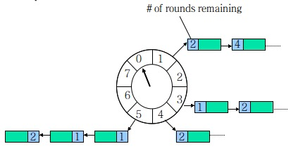

这篇文章，主要的分布式锁相关知识体系进行总结。因为啥呢，Redis不仅是最常用的中间件，也是面试高频话题。谈到Redis，绕不开的必然是分布式锁。这篇文章主要关注点由单点Redis实现分布式锁，延伸到集群Redis实现分布式锁，再到Zookeeper实现分布式锁，以及对Redisson的部分源码解析。还是那句话，把知识由点总结成面，加深理解，让各个知识点不再是一个个孤岛。

<!-- more -->

## Redis分布式锁

### 单点Redis分布式锁

在单点部署的Redis中，如何使用Redis来作为分布式锁呢？关键点主要有三：

* **原子命令加锁**

  > SET key random_value NX PX 30000

  NX:表示只有当要设置的 key值不存在时，才能Set成功。这样可以保证只有第一个用户能够成功设置锁。

  PX 30000: 表示该锁存活时间为30秒，即使没有主动释放锁，该锁在30秒后也会自动释放。

* **设置value，要设置随机数**

为什么设置的value要是随机数？

这是因为 释放锁的时候要检查key是否存在，如果存在还要进行value的比较，看这个value值是不是自己设的，一样才能释放锁，这样可以避免 A设置的锁却被B释放的情况。

* **释放锁要使用lua脚本**

释放锁整个过程要 获取--->判断--->删除 三个步骤，这三个步骤不是原子性的，所以为了保障原子性，要是用lua脚本。


但是，单点部署的Redis节点，当实例挂掉之后，Redis锁会全部失效，导致系统不可用。这个时候就需要Redis的集群方式部署实现Redis的高可用。

### Redis集群

Redis实现集群有多种方案。例如 主从模式 哨兵模式 cluster模式 利用中间件代理等。这里只大概描述主要的集群方式，详细内容以后再用专门文章来描述Redis如何实现高可用。

* 主从模式

主从模式包括一个master和多个salve，客户端对master进行读写操作，对slave进行读操作。master写入的数据会自动同步给salve，但是主从模式最大的问题是 当主节点挂掉之后，需要手动切换salve为master，因此实际生产中很少用到。

* 哨兵模式

哨兵模式基于主从复制模式，多了哨兵来监控和自动进行故障迁移。该模式下，哨兵会监控主节点，当主节点异常时，会标记为主观下线或客观下线，并进行主从切换。因此可以保障高可用。

* cluster集群

这是Redis官方推出的集群方案。保证了高并发，整个集群通过不同的槽位分担所有数据，不同的key会分发到不同的Redis。


但是不管是什么集群方案，都会存在一种极端情况下的问题：**当master节点上新加了锁，但是由于主从异步通信同步，数据还没有同步到slave上，此时master挂掉，master上的锁就会失效。等新的master重新设好之后，可以再次设置同样的锁，这样就会出现同一把锁设置两次的问题**。一把锁，不管在什么情况下，只能保证设置一次，不然锁就失去了锁的意义。

### Redlock算法

为了解决集群下可能出现的问题，官方提出了RedLock算法。现在假设有5台Redis master节点。
> 以下获取锁步骤来自http://redis.cn/topics/distlock.html

1. 获取当前Unix时间，以毫秒为单位。
2. 依次尝试从N个实例，使用相同的key和随机值获取锁。在步骤2，当向Redis设置锁时,客户端应该设置一个网络连接和响应超时时间，这个超时时间应该小于锁的失效时间。例如你的锁自动失效时间为10秒，则超时时间应该在5-50毫秒之间。这样可以避免服务器端Redis已经挂掉的情况下，客户端还在死死地等待响应结果。如果服务器端没有在规定时间内响应，客户端应该尽快尝试另外一个Redis实例。
3. 客户端使用当前时间减去开始获取锁时间（步骤1记录的时间）就得到获取锁使用的时间。当且仅当从大多数（这里是3个节点）的Redis节点都取到锁，并且使用的时间小于锁失效时间时，锁才算获取成功。
4. 如果取到了锁，key的真正有效时间等于有效时间减去获取锁所使用的时间（步骤3计算的结果）。
如果因为某些原因，获取锁失败（没有在至少N/2+1个Redis实例取到锁或者取锁时间已经超过了有效时间），客户端应该在所有的Redis实例上进行解锁（即便某些Redis实例根本就没有加锁成功）

上面步骤意思就是，只要在大多数节点上加锁成功，则获取锁成功。但是这样也并不能解决故障重启后带来的锁安全问题。假如一共有5台实例且Redis没有使用持久化策略，一个客户端获取到3个实例的锁。此时其中一个客户端实例重启，在这个时间点，可能出现3个节点没有设置锁。此时如果有另外一个客户端来设置锁，锁有可能被再次获取，这样就违背了锁的互斥原则。

即使启用了AOF持久化策略，AOF默认情况下每秒写一次磁盘，即fsync操作，因此最坏情况下丢失一秒的数据。但是，即使只有一秒，也有可能出现未来得及持久化，仍会出现重复加锁的情况。

因此Redis的作者提出延时重启的方案，即节点崩溃之后，不要立即重启它，而是等待超过锁的过期时间后重启，保证自身上的锁都过期。但是这样做，有可能会让系统彻底转化为不可用状态。例如大部分redis实例崩溃，系统在这个时间段内任何锁都无法加锁成功。

因此，可以看出，在集群情况下，没有一种完美的方案，任何方案都会有极端的情况出现。如果系统可以接受极端情况下可能发生的问题，这种方案也是可以使用的，这就要看系统的需求取舍。

### Redisson实现原理

先来看一下网上找的一张Redisson原理图，我觉得画的还是挺清晰的


#### 代码示例


#### 加锁源码

相比看到这里，肯定会有疑问，基于我们上面说的

> SET key random_value NX PX 30000

为什么RLock lock = client.getLock("lcc");lock.lock();就能加锁成功呢？value又是多少呢？ 设置的过期时间又是多少？
带着这些疑问，我们进入源码一探究竟。
首先lock会执行到这里:
> org.redisson.RedissonLock#lock(long, java.util.concurrent.TimeUnit, boolean)


这里可以看到，将当前线程的线程ID作为参数传入，后续会用到这个ID。
接着继续Debug，会进入：

> org.redisson.RedissonLock#tryAcquireAsync
> 其中一个参数为：commandExecutor.getConnectionManager().getCfg().getLockWatchdogTimeout()，可以看到这个时间默认为private long lockWatchdogTimeout = 30 * 1000;

这关键参数就是 设置锁的默认过期时间。
继续往下看


其中 internalLockLeaseTime 是过期时间，而getLockName(threadId)是拼接ID+线程ID


* 而ID是从commandExecutor.getConnectionManager()中获取，


* 继续网上找，connectionManager是在Redisson构造函数时创建

* 一路跋山涉水终于找到 ID的来源是 UUID。


由此可以推断，虽然获取锁时没有显式执行value，但是**Redisson会默认帮我们生成UUID + 线程ID 作为 value,过期时间为默认30s**。我们等会进行验证。

我们接着分析加锁这段的这段lua脚本。
```lua
//第一段代码
if (redis.call('exists', KEYS[1]) == 0) then  
  redis.call('hincrby', KEYS[1], ARGV[2], 1);  
  redis.call('pexpire', KEYS[1], ARGV[1]);  
  return nil;  
end; 
//第一段代码
if (redis.call('hexists', KEYS[1], ARGV[2]) == 1) then 
  redis.call('hincrby', KEYS[1], ARGV[2], 1); 
  redis.call('pexpire', KEYS[1], ARGV[1]); 
  return nil; 
end; 
return redis.call('pttl', KEYS[1]);
```


可以看到，这段脚本中，keys：是我们getLock时设置的key，params是lua脚本的参数，其中ARGV[1]是 30000，ARGV[2]是 UUID+线程ID。

第一段脚本中 判断 key是否存在，如果不存在，则使用hincrby命令。


可以看出来，value的数据结构是hash,hincrby 将哈希表 key 中域 field 的值设置为1。

最后返回nil，这样完成加锁操作。


通过客户端检测，发现确实如我们上面猜测的那样，Redisson加锁操作会自动帮我们通过 **hincrby**命令生成 数据类型为hash的 key由 UUID + 线程ID，value 为 进入次数 的 value。

第二段代码 则是判断 key 为 KEYS[1] ,field为ARGV[2]的数据是否存在，如果存在，说明是**重入锁**，则用hincrby 命令对ARGV[2] 字段进行加一操作。然后重新设置过期时间为 30s。

第三段代码则返回KEYS[1]的存活时间。

因此，三段代码组合在一起的逻辑是：当一个key加锁成功或者重入成功，则将过期时间重新设置为30s，如果加锁失败，则返回存活时间。

#### 解锁源码

加锁的时候，可以看到，成功加锁一次，则filed加一，那么解锁自然可以想到，解锁一次，将filed减1，直到field值为0，才算解锁成功。

> ​	在源码org.redisson.RedissonLock#unlockInnerAsync里


通过debug，可以看到，KEYS[1]为“lcc”，ARGV[1] 为0 ，ARGV[2]为30000，ARGV[3]为 UUID + 线程ID，因此解锁逻辑如下：

判断 key 为lcc 且filed 为 uuid + 线程ID 的数据是否存在，不存在这直接返回nil不需要解锁 。

> ```lua
> if (redis.call('hexists', KEYS[1], ARGV[3]) == 0) then 
>     return nil;
> end;
> ```

然后如果存在，则将field 用 hincrby命令 减1，然后判断 counter是否为0，如果不为0，说明还没使用完毕，再重新将过期时间设置为30s。

>```lua
>local counter = redis.call('hincrby', KEYS[1], ARGV[3], -1); 
>	if (counter > 0) then 
>redis.call('pexpire', KEYS[1], ARGV[2]); 
>return 0;  
>```

如果counter为0，则删除key，同时，要进行**publish**。

```lua
else 
    redis.call('del', KEYS[1]); 
    redis.call('publish', KEYS[2], ARGV[1]); 
    return 1; 
end; 
```

看到 publish 命令，立马会想到 Redis 的发布/订阅功能。那这里是发布什么事件？既然是分布式锁，自己解锁成功，说明是用完了这把锁，那么自然是告诉其他线程，可以来进行竞争锁操作。那么可以联想到自然是加锁失败时候，订阅事件。加锁时，我们只关注了lock里面的tryAcquire，此时我们回看 tryAcquire后面的操作。 

> ​	org.redisson.RedissonLock#lock(long, java.util.concurrent.TimeUnit, boolean)


因此，整个链路就清楚了。加锁--->释放锁整个过程是：

**判断 key 是否存在，如果不存在，则用 hincrby 将 field 进行加一操作，将过期时间设为默认30s，然后返回空。如果key存在，说明这次是重入锁，则对field进行加一操作。此时field代表锁进入次数。如果加锁失败，则对该key进行订阅。** 

**解锁时，判断key是否存在，如果不存在则不需要进行解锁，如果存在，将field减1，然后计算counter，如果counter不为0，说明此时还在使用锁，则将过期时间重新设置为30s。如果counter为0，说明解锁成功，然后对该key进行发布操作，通知其他程序进行加锁操作。**

### 看门狗watch dog

Redisson还有一个重要的功能就是看门狗自动延期机制。我们思考一下，如何能够在 持有锁时间超过了过期时间，这把锁仍存在。最简单的办法就是 起一个后台线程，不断循环检查，如果我们还持有这把锁，就把这把锁延期。那么怎么样才能是看门狗机制生效？什么时候加锁成功会启动看门狗机制？循环查询频率是多少？看门狗什么时候能知道不需要在续期了？带着这些疑问，再次回到加锁的逻辑


首先，当leaseTime == -1时，才会走下面逻辑，否则直接return tryLockInnerAsync()方法。这里说明，**只有在 用 lock()时，不指定leaseTime即过期时间时，才能启动看门狗机制**。

其次，我们在加锁的时候知道，当首次加锁成功或者再次重入加锁成功，都会返回nil，因此 红线框的部分，只有在加锁后才会进入。没有加锁成功，则不会进入scheduleExpirationRenewal方法。那么肯定会有疑问，那么当重入的时候，会再次开启看门狗机制吗？

答案是不会。如下图所示，只有在首次加锁后，ConcurrentMap的putIfAbsent 返回为null，此时进入renewExpiration()方法，重入加锁后，putIfAbsent 返回不为null，因此不会执行renewExpiration()方法。因此**只有在首次加锁才会启动看门狗机制**。


继续进入 renewExpiration()方法，


发现这里启动了一个Task，run()方法为自动续期的逻辑方法，dealy为 internalLockLeaseTime / 3。

首先分析核心的续期方法renewExpirationAsync()。


这里判断 key是否存在，如果存在，则 pexpire 续期 30s。如果不存在，也就不需要进行续期了，则返回0。

其次， 该任务每 internalLockLeaseTime/3 后执行一次，默认时间为30s，则说明该任务每10s执行一次。也就是说在默认30s下，会在20s的时候执行一次renewExpirationAsync()方法，将过期时间设置为30s。


上图可以发现，当重新设置过期时间后，会重新调用renewExpiration()，再次增加任务。至于Timeout是个什么东西？点进去发现是Netty包下面，因为对Netty不是很熟悉，查阅相关资料之后，发现是基于netty时间轮实现的。



网上搜一下，时间轮可以用这个图来描述。假设时间轮大小为8，1s转一格，每格指向一个链表。假设要增加一个3s后的任务，则在第3格的链表中添加一个任务节点，并且标识该节点round=0。超过8的则取模增加到相应格子里，例如添加17s后的任务，（0+17）%8 = 1，并且经过两轮，因此标记round=2，时间轮经过第一格后，对应链表里的任务round会减一，当时间轮第3次经过第一格时，会执行该任务。时间轮每次只会执行round=0的任务。


至于最后一个问题，看门狗什么时候能知道不需要在续期了？答案是在解锁后


因此可以看出来，在解锁后，会调用cancelExpirationRenewal()，取消定时任务。

### Redis分布式锁总结

以上是Redis由单点部署版到集群方案，再到Redisson 单机模式具体实现的分析。其实Redisson里面还有哨兵模式、集群模式的实现，区别就是Config 的构造不同。Redison中RedLock的实现则是RedissonRedLock(RLock... locks)。Redis分布式锁不管什么方式，都会存在安全性问题，但是由于Redis的特性，Redis的性能明显优于其他分布式锁。因此根据自己业务进行取舍。如果对性能要求不高，则可以使用zookeeper分布式锁。接下来对Zookeeper分布式锁进行研究。

## Zookeeper分布式锁