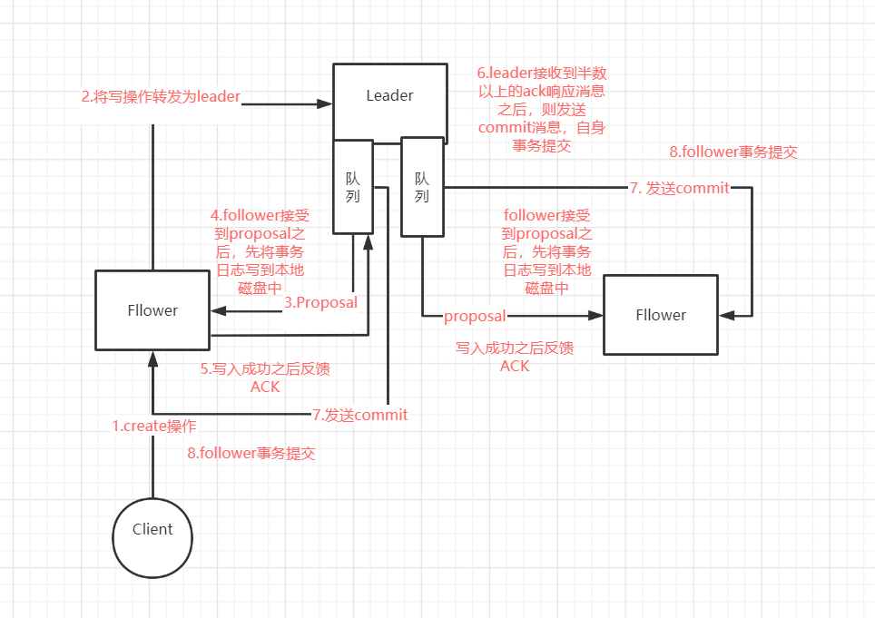
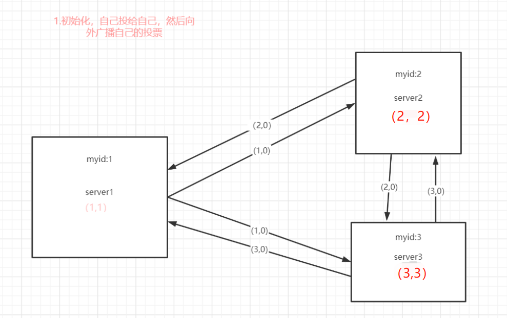
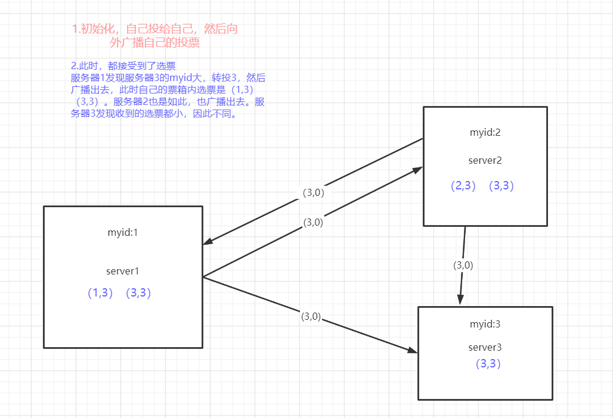
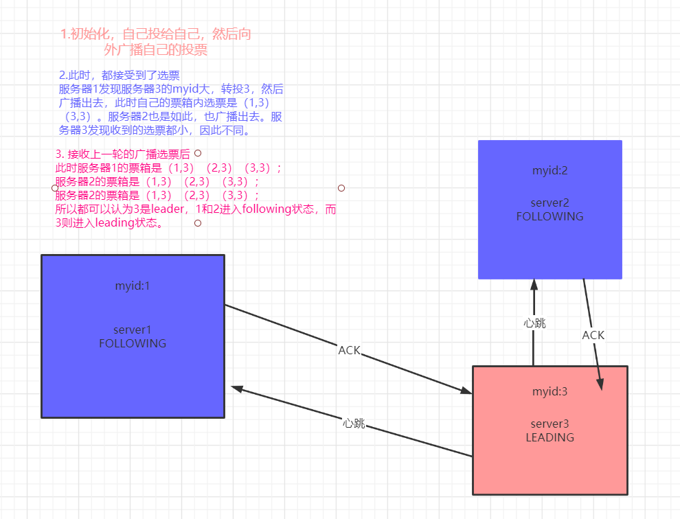
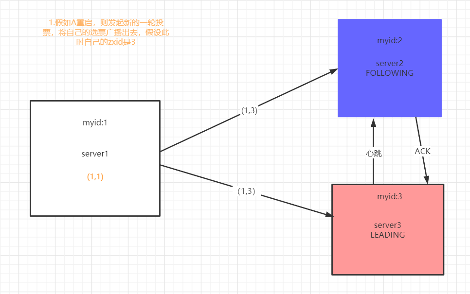
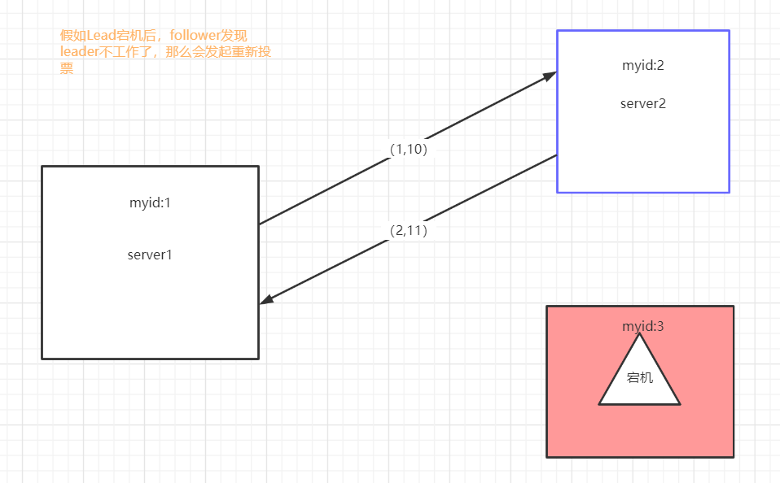
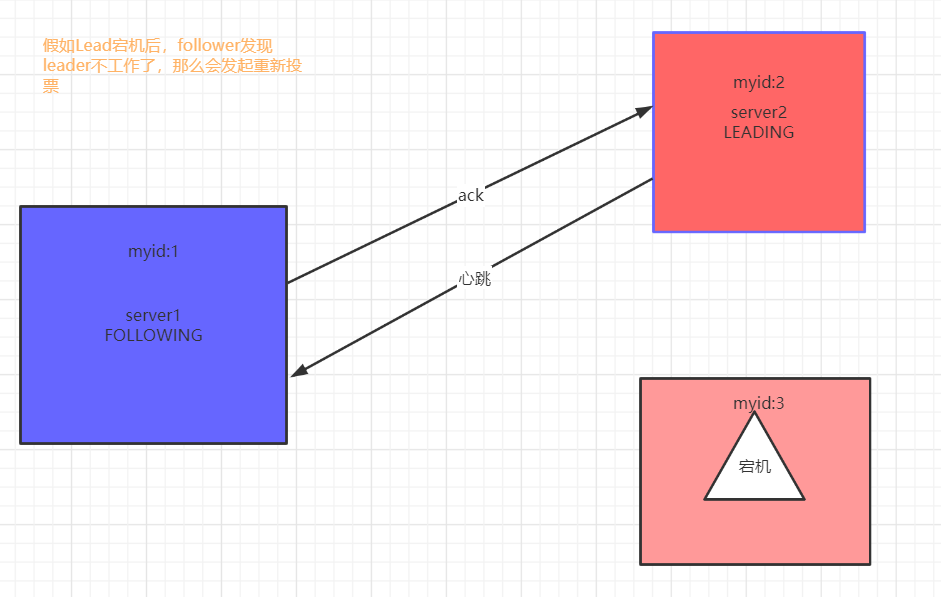

之前讨论研究Redis分布式锁的时候，提到过Zookeeper分布式锁。这篇文章来研究一下zk的相关原理。

<!-- more -->

## Zookeeper有什么用？

我们能接触ZK最常见的场景就是作为Dubbo的注册中心。这正是因为ZK是一个分布式协调服务，可以用来服务发现、分布式锁、分布式领导选举、配置管理等场景。

### Node节点

这所有功能的基础是因为ZK维护着一个类似文件系统的数据结构。整体上可以看做是一棵树，每个节点称作一个ZNode。有四种类型的znode:
1. PERSISTENT 持久化目录节点
客户端与zk断开连接后，依然存在
2. PERSISTENT_SEQUENTIAL 持久化顺序编号目录节点
客户端与zk断开连接后，依然存在，并且每个节点有顺序编号
3. EPHEMERAL 临时节点
客户端与zk断开后节点就被删除
4. EPHEMERAL_SEQUENTIAL 临时顺序编号目录节点
客户端与zk断开连接后，节点就被删除，只不过这些节点都有顺序

### Watcher机制

zk的另外一个机制就是 通知机制。ZK允许客户端在指定节点上注册一些watcher，当目录节点发生变化时，如数据修改、删除等，zk会将事件通知到感兴趣的客户端上，这也是实现分布式协调服务的重要特性。

Watcher机制主要包括客户端、客户端WatcManager 和 ZooKeeper服务器三部分。在具体工作流程上，简单的说，就是客户端在向zk服务器注册watcher的同时，将watcher对象存储在客户端的watchManager中。当服务器出发watcher事件后，会向客户端发送通知，客户端线程从watchManager中取出对应的Watch对象来执行回调逻辑。

代码实现：

在WatchManager中是使用HashMap来存放Watcher对象。
```java
public class WatchManager {

    private final HashMap<String, HashSet<Watcher>> watchTable =
        new HashMap<String, HashSet<Watcher>>();
    }
```

执行watcher对象的回调函数是执行watcher的process方法。
```java
public interface Watcher {
     abstract public void process(WatchedEvent event);
}
```

### ZooKeeper服务器角色

ZK集群是一个基于主从复制的高可用集群，每个服务器可以承担如下三种角色中的一种：
1. Leader 
一个ZK集群同一时间只会有一个实际工作的Leader,它会发起并维护与各个Follower及Observer间的心跳。所有写操作必须通过Leader完成再由Leader将写操作广播给其他服务器。
2. Follower
一个ZK集群可能有多个Follower，它会响应Leader的心跳。Follower可以处理并返回客户端的读请求，并且将写请求转发给Leader处理，并且负责在Leader处理写请求时对写请求进行投票。
3. Observer
与Follower相同，但是没有投票权。

### ZAB协议

Zookeeper是通过Zab协议来保证分布式事务的最终一致性。
Zab协议主要包括两种基本模式：**崩溃恢复** 和 **原子广播**。

整个协议切换过程是：

当整个集群启动过程中或者Leader出现网络中断、崩溃退出等异常后，Zab协议就会进入**奔溃恢复模式**，选举产生新的Leader。当选举产生新的leader之后，同时集群中有过半的机器与该Leader服务器完成了状态同步，那么zab协议就退出崩溃恢复模式，进入**消息广播模式**。

**1.原子广播**

zk集群中，数据副本的传递策略是采用消息广播模式，zk中数据副本的同步方式跟2pc类似，但又有不同。二阶段提交要求协调者必须等到所有参与者全部反馈ack确认消息之后，再发送commit消息。要求所有的参与者要么成功，要么全部失败，因此会产生严重的阻塞问题。

而Zab协议中，Leader等待Follower的ACK反馈消息是指，只要**有半数以上的follwer成功反馈**即可，不需要全部follwer反馈。

因此整个过程如下图所示：



1. 客户端发起一个写请求，如果相应写请求的不是leader，那么follower将写请求转发给leader。
2. leader服务器将客户端的请求转换为事务Proposal提案，同时为每个proposal分配一个全局的ID，即Zxid。
3. leader服务器为每个follower服务器分配一个单独的队列，然后将需要广播的proposal依次放到队列中，并根据FIFO策略进行消息发送。
4. Follower接受到Proposal后，会首先将其事务日志写入到本地磁盘中，写入成功后向Leader反馈一个ACK响应信息。
5. Leader 接受到超过半数以上的follower的ack响应消息后，即认为消息发送成功，可以发送commit消息。
6. Leader向所有follower广播commit消息，同时也会完成自身事务提交。Follower接受到commit消息后，会将上一条事务提交。

因此可以总结：**zookeeper采用Zab协议的核心，就是只要有一台服务器提交了Proposal，那么就要确保所有的服务器最终都能正确提交Proposal，这也是CAP/BASE实现最终一致性的体现**。

**2.崩溃恢复**

一旦Leader服务器出现崩溃或者由于网络原因导致Leader服务器失去了与过半Follower的联系，那么就进入崩溃恢复模式。在Zab协议中，为了保证程序的正确运行，整个恢复过程结束需要选举出一个新的leader服务器，并且还要让其他机器快速感知到选举产生的新的leader。

因此，整个崩溃恢复包括： **Leader选举 和 数据恢复**。

**数据恢复：**

那么Zab协议如何保证数据的一致性呢？

Zab协议崩溃恢复选举出来的Leader需要满足一下条件：

1. **新选举出来的Leader 不能包含未提交的Proposal。**这样新选举的Leader必须是已经提交了Proposal的Follower服务器节点。
2. **新选举出来的Leader节点中必须含有最大的zxid。**这样可以避免Leader服务器检查Proposal的提交和丢弃工作。

那么Zab协议如何完成数据同步呢？

1. 完成Leader选举之后，在正式开始工作之前，leader服务器会确认事务中的所有proposal是否已经被集群过半的服务器commit。
2. Leader服务器需要确保所以的follower服务器能够接受到每一条事务的proposal，并且能将所有提交的事务Proposal加载到内存。

那么Zab协议同步过程中，如何处理掉需要丢弃的proposal？

**Zab协议通过epoch编号来区分leader变化周期**。因此，当有上一个leader周期中未提交过事务proposal的服务器启动时，并且加入到集群中，以follower角色连接到leader之后，leader服务器会根据自己服务器上最后提交的proposal来和follower服务器的proposal进行对比，那么对比的结果肯定是让follower回退到一个已经被集群中过半机器commit的最新proposal。

**Leader选举**

1. **选举阶段**。只要该节点超过半数节点的票数，那么就可以当选为准Leader。但只有到第三个同步阶段才会成为真正的Leader。协议并没有规定详细的选举算法，ZK中有具体的实现。
2. **发现阶段**。这个阶段主要是发现当前大多数节点接受的最新Proposal，并且准Leader生成新的epoch，让follower接受，更新他们的epoch。
3. **同步阶段**。利用前一阶段获得的最新的proposal历史，同步集群中所有的副本。当超过半数的节点同步完成，那么准leader将成为真正的leader。
4. **广播阶段**。到了这个阶段，zk集群才能正式对外提供事务服务。

### Zab实现在Zookeeper中的实现

ZK使用基于TCP的**FastLeaderElection**算法来实现leader选举。在介绍FastLeaderElection前需要先介绍几个概念：

1. myid
  zk搭建集群时，需要为每个zk服务器配置全局唯一的myid.

2. zxid
  zk状态的每一次改变，都对应这一个递增的Transaction id，该id就是zxid。zk使用一个64位的数来表示，高32位表示Leader的epoch，从1开始，每次选出新的Leader，epoch加1。低32位为该epoch内的序号，每次epoch变化，都将低32位的序号重置。这样保证zkid的全局递增型。

3. 选票数据结构
每个服务器在进行领导选举时，都会发送如下关键信息：
    logicClock:表示该服务器发起的第几轮投票
    state: 当前服务器的状态
    self_id：当前服务器的myid
    seif_zxid : 当前服务器上保存的数据的最大zxid
    vote_id：被推举服务器的myid
    vote_zxid : 被推举服务器上保存的数据的最大zxid  
  
4. 投票流程
    
  **自增选举轮次：**

  所有有效的投票必须在同一轮次。每个服务器开始新一轮投票钱，先将logicClock进行自增操作。
  **初始化选票：**

  每个服务器在广播自己的选票前，会将自己的投票箱清空。票箱中只会记录每一个投票者的最后一票。例如：服务器2投给3，服务器3投给1，那么服务器1投票箱数据就是（2,3）（3,1）（1,1）
  **发送初始化选票：**

  每个服务器最开始都是通过广播把票投给自己
  **接受外部选票：**

  服务器会尝试从其他服务器获取投票，并计入自己的票箱。如果无法获取，则判断自己是不是断线。如果是断线了，则再次发送自己的投票。
  **判断选举轮次：**

    每次收到选票，判断选票的logicBack和自己logicBack，如果外部的logicBack较大，说明该服务器的选举轮次落后于其他服务器的选举轮次，那么清空自己的投票箱并将自己的logicBack更新为收到的logicBack，然后对比自己的之前的选票与收到的投票以确定是否需要变更自己的投票，最终将自己的投票广播出去。如果外部的logicBack小，则忽略该选票。如果相等，则进行选票PK。
  **选票PK：**
    
    选票PK是基于（self_id,self_zxid）与（vote_id，vote_zxid）的对比：
    
    如果外部的vote_zxid比较大，那么将自己选票的vote_zxid 和 vote_myid更新为收到选票的vote_zxid 和 vote_myid并广播出去。同时将收到的票和自己更新后的票放入自己的票箱。
    
    如果vote_zxid一样，则比较vote_myid，谁的myid大，则广播谁的。
    
    **统计选票：**

    最后统计选票，如果有过半服务器认可自己的选票，那么终止投票，否则继续接收其他服务器选票。
    **更新服务器状态：**

    最后服务器更新自己的状态，若过半的票投给自己，就将自己的服务器状态更新为Leading，否则将自己的状态更新为Following。

#### 1.集群启动领导选举

需要注意的是：**图中票箱里面的数据是（谁，投给了谁），而广播出去的选票则是投给人的（myid,zxid）；例如服务器1投给了服务器3，那么自己的票箱里面数据就是（1,3），广播出去的是（3，0），其实都一个意思**







#### 2.Follower重启

Follower重启或者发生网络错误找不到leader，那么会进入looking状态发起新的一轮投票。



当服务器3接收到1的投票后，将自己的LEADING状态以及选票返回给服务器1，服务器2收到服务器1的投票后，将自己的状态Following及选票返回给服务器1。此时服务器1知道服务器3是leader，并且通过服务器2的选票与服务器3的选票可以确定服务器3的确超过半数同意，那么就放弃唤醒，也进入Following状态。

#### 3.Leader重启



此时有两种情况：

1. 服务器1 和  服务器2 的zxid不同，那么zxid大的成为leader。
2. 如果服务器1 和 服务器2 的zxid相同，那么比较myid，谁的大，谁就是leader。

所以按照，图上的结果，那么服务器2就变成Leader。



如果此时，原来的leader恢复后，进入Locking状态， 并发起新一轮的选举。那么自然如同上面一样，原来的leader变成了follower，进入了following状态。

## Zookeeper分布式锁

我们讲过Redis分布式锁的时候留了个坑，那就是Zookper分布式锁。趁这个机会来讲zk分布式锁一起阐述一下。

zk实现分布式锁的原理靠的是zk的：

1. 临时顺序节点：多个客户端同一时间只能创建一个临时节点，创建成功，则意味着获取到锁。当客户端会话终止或者超时后，zk会自动删除临时节点。这样就可以避免死锁。
2. Watcher机制：当临时顺序节点的状态发生变化时，能够及时的通知到订阅watcher的节点。

所以，我们可以有两种创建方式：

1. 非公平锁：

检查锁节点是否已经创建，若未创建则尝试创建一个临时节点，如果创建成功，则说明成功加锁。如果持有锁的客户端崩溃或者网络异常无法维持session，那么锁节点会被自动删除，不会产生死锁。

如果创建临时节点失败，则说明加锁失败，则watch锁节点的exists事件，当接收到节点被删除的通知后再次尝试加锁。因为zk的watch是一次性了，当加锁失败后，要重新设置watch。

持有锁的节点，操作完成后，则删除锁节点释放锁。

该方案存在的问题是，当锁被释放时，zk需要通知大量订阅了该事件的客户端，容易造成羊群效应。

2. 公平锁

创建一个永久节点作为锁节点，试图加锁的客户端在锁节点下创建临时顺序节点，zk会保证子节点的有序性。

如果锁节点下id最小的节点是当前客户端创建的节点，说明加锁成功。

否则加锁失败，则订阅上一个顺序节点。当上一个节点被删除时，当前节点最小，则说明加锁成功。

操作完成后，删除临时顺序节点。


而具体在我们项目中用到的场景是用来保证单据接收不会重复，因为有可能上游一个单据同时发了两遍，此时因为创建单据的时候，会先根据提单到库里面查是否存在，不存在才会继续创建。但是并发的情况下，还是有可能会出现同时生成两张相同的单据。因此通过zk的分布式锁，创建单据时，先将单据号作为路径在定义的一个永久节点下创建临时节点，如果创建成功，则获取锁，可以继续创建单据。如果创建失败，说明此时正有相同的单据在创建中，直接抛出异常，记录日志。也算是zk分布式锁的一种应用。


> 参考列表：
>
> 1. http://www.jasongj.com/zookeeper/fastleaderelection/
> 2. https://www.ibm.com/developerworks/cn/opensource/os-cn-apache-zookeeper-watcher/index.html
> 3. 等等，参考了很多文章


