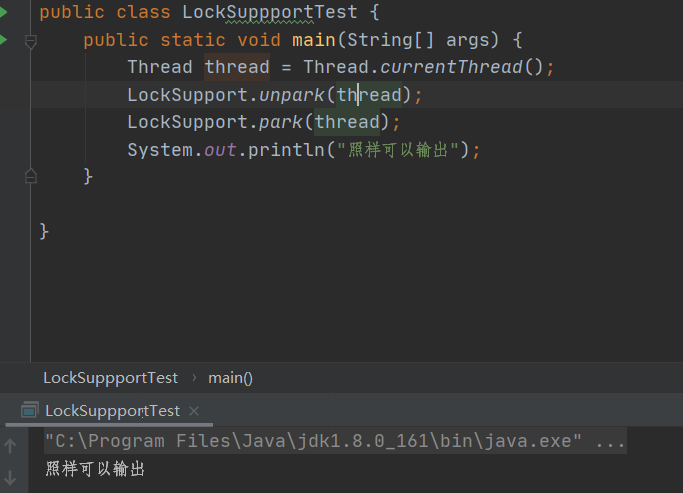
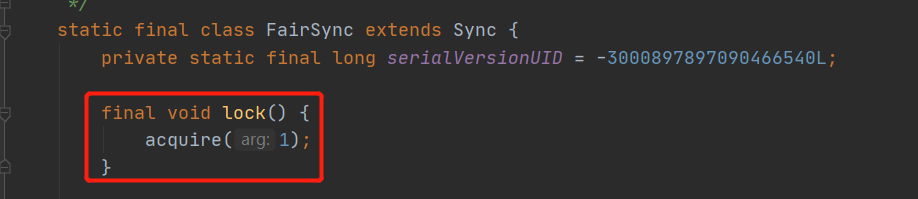
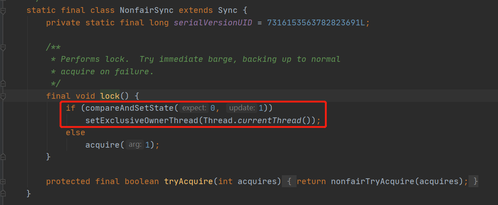
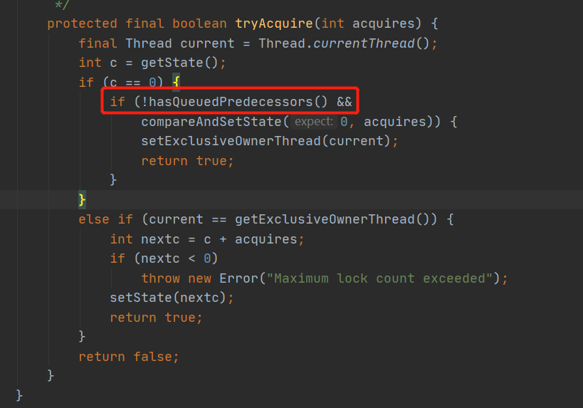
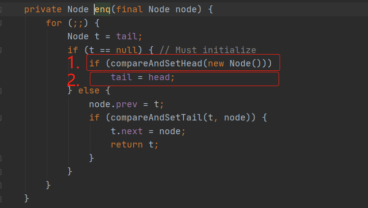
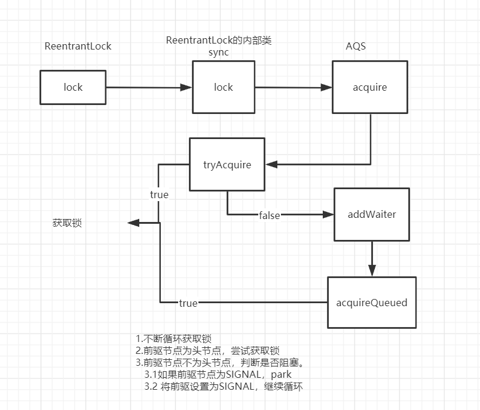
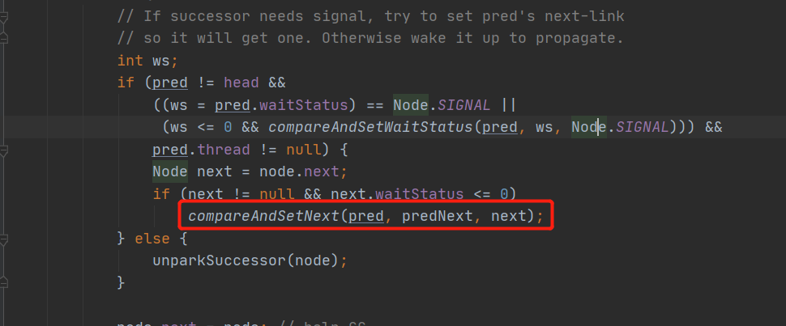

之前太多次提到AQS了，JDK1.7的ConcurrentHashMap的segment继承ReentrantLock，而ReentrantLock是基于AQS实现的。线程池的Worker类继承线程池，实现了不可重复的锁机制，从而通过能否获取锁判断线程是否处于运行状态。可见AQS的重要性。

而且，整个JUC包都是基于AQS实现的，而且AQS是面试必问的，咋说都要学懂学透。之前也看过好多次，这次以文字记录，加深印象。

<!-- more -->

### AQS简介

JDK1.5之后，大神**Doug Lea**编写了JUC包，从而一定程度上代替了Synchroniezed。而**AQS（AbstractQueuedSynchronizer）**则是JUC包下的核心组件，JUC包下大部分同步组件都是基于AQS的。AQS的设计模式采用了**模板设计模式**，主要使用方式是继承，子类通过继承AQS并实现它的核心抽象方法，即可轻松的管理同步问题。

从功能上来讲，AQS主要分为两种：**独占**和**共享**。JUC下的ReentrantLock就是一种独占锁，当一个线程获取锁之后，其他线程只能阻塞等待持有锁的线程释放锁。ReentrantReadWriteLock 中的读锁，则是一种共享锁，多个线程可以共享一把锁，同时执行任务。

### AQS原理

AQS的核心思想是：如果请求的共享资源空闲，则当前请求线程将自己设置为有效的工作线，同时锁定共享资源，如果其他线程获取同步状态失败，则将其他线程加入到某个容器中并阻塞，等同步状态释放时，则把阻塞的线程唤醒，使其可以再次尝试获取锁。

#### CLH队列

而这个AQS是通过CLH队列的变体实现线程排队阻塞的，将暂时获取不到的线程加入到队列中。

CLH是Craig、Landin and Hagersten队列，是一个单向链表。而AQS中的队列是**CLH变体的虚拟双向队列**。队列中的每一个元素就是一个Node节点。


```java
static final class Node {
    //共享节点
    static final Node SHARED = new Node();
    //独占节点
    static final Node EXCLUSIVE = null;
    //超时或者中断，则会被设置为取消
    static final int CANCELLED =  1;
    //后继节点处于等待状态
    static final int SIGNAL    = -1;
    //这个是Condition使用的。当其他线程对Condition调用了singal之后，会把节点从等待队列转移到同步队列
    static final int CONDITION = -2;
 	//表示releaseShared需要被传播给后续节点（仅在共享模式下使用）
    static final int PROPAGATE = -3;
 	//等待状态
    volatile int waitStatus;
 	//前驱节点
    volatile Node prev;
 	//后驱节点
    volatile Node next;
 	//获取同步状态的线程
    volatile Thread thread;
 	//存储condition队列中的后继节点
    Node nextWaiter;
 	
    final boolean isShared() {
        return nextWaiter == SHARED;
    }
 	//
    final Node predecessor() throws NullPointerException {
        Node p = prev;
        if (p == null)
            throw new NullPointerException();
        else
            return p;
    }

    Node() {    // Used to establish initial head or SHARED marker
    }

    Node(Thread thread, Node mode) {     // Used by addWaiter
        this.nextWaiter = mode;
        this.thread = thread;
    }

    Node(Thread thread, int waitStatus) { // Used by Condition
        this.waitStatus = waitStatus;
        this.thread = thread;
    }
}
```


```java
/**
 * The synchronization state.
 */
private volatile int state;
```

#### state变量

AQS内部通过维护一个volatile修饰的state变量。对于不同的子类，有不同的意义。在ReentrantLock，state当为0时，意味着没人获取锁，当大于0时，则表示锁的重入次数。

#### LockSuport

AQS主要是通过LockSuport提供的park 和 unpark方法来对线程进行阻塞和唤醒的。这是JDK1.6之后引入的一个类，提供了基本的线程同步原语。LockSupport实际上是调用了Unsafe里面的函数。

park 和 unpark方法最大的特点就是可以灵活使用，比如，unpark可以在park之前执行。



这样做的好处就是不需要担心park的时序问题。

回想之前线程的同步，是使用wati/notify/notifyAll来实现同步的。比如线程B需要notify通知线程A，必须保证线程A已经执行wait方法。而且唤醒线程用notify还是notifyAll，notify只会唤醒任意一个线程，但是不能指定唤醒某个线程。

所以，park/unpark模型真正解耦了线程之间的同步，线程之间不需要Oject或者其他变量来存储状态，不在需要关心对方的状态。

### ReentrantLock

我们从ReentrantLock开始，以ReentrantLock原理来逐步解剖AQS。

S

首先，我们明确ReentrantLock是一种独占锁。

其次，ReentrantLock的几个内部类中：

1. sync继承AQS。
2. FairSync则继承Sync，是一种**公平锁**
3. NonfairSync继承Sync，是一种**非公平锁**。


#### ReentrantLock获取锁

公平锁：



非公平锁：



可以看出，公平锁和非公平锁获取锁的时候，区别在于，非公平模式会尝试用CAS将state修改为1，并讲当前线程设置为独占线程，失败后才会执行acquire(1)方法。而公平模式则会直接调用acquire(1)方法。

##### AQS定义acquire方法

acquire方法是AQS里面的方法，

```java
public final void acquire(int arg) {
    if (!tryAcquire(arg) &&
        acquireQueued(addWaiter(Node.EXCLUSIVE), arg))
        selfInterrupt();
}
```

这方法主要执行：

1. 尝试获取独占锁tryAcquire(arg)，这个方法需要同步组件自己实现。

2. 获取成功则返回
3. 不成功，则先执行addWaiter将当前线程加入队列
4. 然后acquireQueued自旋获取锁，并且返回当前下次线程在等待过程中是否中断过
5. selfInterrupt()产生中断。

我们接着对获取锁整个过程进行分析。

##### 子类定义tryAcquire

公平锁：

```java
    /**
     * Fair version of tryAcquire.  Don't grant access unless
     * recursive call or no waiters or is first.
     */
    protected final boolean tryAcquire(int acquires) {
        final Thread current = Thread.currentThread();
        //获取当前state
        int c = getState();
        //如果state等于0，说明没有加锁
        if (c == 0) {
            //判断有没有前驱节点，如果没有则尝试CAS修改state,获取锁，并设置当前线程所有
            if (!hasQueuedPredecessors() &&
                compareAndSetState(0, acquires)) {
                setExclusiveOwnerThread(current);
                return true;
            }
        }
        //如果state不等于0，说明已经有人获取锁了，则判断获取锁的是不是自己
        else if (current == getExclusiveOwnerThread()) {
            //如果是自己，则重入次数+1，
            int nextc = c + acquires;
            if (nextc < 0)
                throw new Error("Maximum lock count exceeded");
            //设置state，此时state表示获取锁的次数
            setState(nextc);
            return true;
        }
        return false;
    }
}
```


非公平锁：

```java
protected final boolean tryAcquire(int acquires) {
    return nonfairTryAcquire(acquires);
}

final boolean nonfairTryAcquire(int acquires) {
    final Thread current = Thread.currentThread();
    int c = getState();
    if (c == 0) {
        if (compareAndSetState(0, acquires)) {
            setExclusiveOwnerThread(current);
            return true;
        }
    }
    else if (current == getExclusiveOwnerThread()) {
        int nextc = c + acquires;
        if (nextc < 0) // overflow
            throw new Error("Maximum lock count exceeded");
        setState(nextc);
        return true;
    }
    return false;
}
```

对比上面两个方法，发现公平锁和非公平锁方法只有一个区别，公平锁需要多加***!hasQueuedPredecessors()***，我们过会在来分析这个方法，先分析当首次尝试获取锁不成功，是如何入队和自旋获取锁的。

我们来看在公平锁下，hasQueuedPredecessors判断等待队列中是否存在有效节点，如果false，说明当前线程可以获取锁，如果返回为true，说明队列中存在有效节点，当前线程必须先加入到等待队列中。

```java
public final boolean hasQueuedPredecessors() {
    Node t = tail;
    Node h = head;
    Node s;
    return h != t &&
        ((s = h.next) == null || s.thread != Thread.currentThread());
}
```

> h != t && ((s = h.next) == null || s.thread != Thread.currentThread())

这里判断队列中前面是否有等待的节点，为何要这样判断？



当head == tail 为false时，直接返回false，说明队列中没有有效节点，上面图片红线框的地方为true，则可以进去获取锁。

当head != tail 为true时，要看下面判断:

>  (s = h.next) == null || s.thread != Thread.currentThread()

如果 (s = h.next) == null，说明等待队列正在初始化，但是还没有完成，此时只执行到了1，而2还没有执行到。此时队列中有元素，需要返回true，上面图片红线框出为false，则获取锁失败。

如果 (s = h.next) != null，说明队列中至少有一个元素，要看*s.thread != Thread.currentThread()*。如果s.thread == Thread.currentThread()，说明等待队列中第一个有效节点就是当前线程。那么 这个或 判断 为false，整个判断为false。上图红线框出为true，则可以去获取锁资源。如果s.thread != Thread.currentThread()，说明当前队列中的第一个有效节点与当前线程不同，那么 这个 或 判断为ture，整个判断为true，红线框出为false，则获取锁失败。



所以这块代码，主要考虑的入队时候极端并发情况，当头结点初始化一半的时候，是不能够获取锁的。

##### addWaiter 创建节点入队

 把当前线程创建为一个Node节点，然后入队。
```java
    private Node addWaiter(Node mode) {
        Node node = new Node(Thread.currentThread(), mode);
        // Try the fast path of enq; backup to full enq on failure
        Node pred = tail;
        //先判断尾结点存不存在
        if (pred != null) {
            node.prev = pred;
            //存在的话，用CAS将tail指向node
            if (compareAndSetTail(pred, node)) {
                //将当前节点入队，置于对尾。
                pred.next = node;
                return node;
            }
        }
        //如果失败或者尾结点不存在，则不断尝试。
        enq(node);
        return node;
    }
```
当初看到这里时，不太明白，compareAndSetTail(pred, node)这里不是将pred指向node了吗?为什么下面还要pred.next = node;
后来发现是自己错了。
```java
>    private final boolean compareAndSetTail(Node expect, Node update) {
>        return unsafe.compareAndSwapObject(this, tailOffset, expect, update);
>   }
```
这个pred是expect值，这个compareAndSetTail意思是，判断偏移量为tailOffset的值是否等于expect，如果是则将这里的值替换为update。位于tailOffset的值是tail。
因此compareAndSetTail(pred, node)这里是将tail指向node，然后pred.next = node;是将pred指向node，完成 node 的入队，此时 node 位于对尾。 妙啊！ 

###### enq


```java
    private Node enq(final Node node) {
        //不断循环，直到成功。
        for (;;) {
            Node t = tail;
            //如果尾结点为空，说明队列还没初始化，先创建一个空的头结点
            if (t == null) { // Must initialize
                if (compareAndSetHead(new Node()))
                    tail = head;
            } else {//用CAS将当前节点入队
                node.prev = t;
                if (compareAndSetTail(t, node)) {
                    t.next = node;
                    return t;
                }
            }
        }
    }
```
入队过程图示如下：

* 通过当前线程创建节点。
* pred指向尾结点tail
* 如果尾结点为空，先初始化一个头结点，头结点是个无参构造的头节点
* CAS将tail指向当前节点
* 最后pred的next指针指向当前节点完成入队。


##### acquireQueued 不断循环获取锁

```java
    final boolean acquireQueued(final Node node, int arg) {
        boolean failed = true;
        try {
            //中断标记位
            boolean interrupted = false;
            for (;;) {
                //当前节点的前驱节点
                final Node p = node.predecessor();
                //如果前驱节点为头结点，那么就去尝试获取锁
                if (p == head && tryAcquire(arg)) {
                    //获取锁成功后，将自己设置为头结点
                    setHead(node);
                    p.next = null; // help GC
                    failed = false;
                    return interrupted;
                }
                //如果前驱节点不为头结点，那么就去判断是否需要中断。
                if (shouldParkAfterFailedAcquire(p, node) &&
                    parkAndCheckInterrupt())
                    interrupted = true;
            }
        } finally {
            if (failed)
                cancelAcquire(node);
        }
    }
```
我们来看看什么情况下需要中断？
shouldParkAfterFailedAcquire()----true---> parkAndCheckInterrupt()

```java
    private static boolean shouldParkAfterFailedAcquire(Node pred, Node node) {
        int ws = pred.waitStatus;

        if (ws == Node.SIGNAL)
            /*
             * This node has already set status asking a release
             * to signal it, so it can safely park.
             */
            return true;
        if (ws > 0) {
            /*
             * Predecessor was cancelled. Skip over predecessors and
             * indicate retry.
             */
            do {
                node.prev = pred = pred.prev;
            } while (pred.waitStatus > 0);
            pred.next = node;
        } else {
            /*
             * waitStatus must be 0 or PROPAGATE.  Indicate that we
             * need a signal, but don't park yet.  Caller will need to
             * retry to make sure it cannot acquire before parking.
             */
            compareAndSetWaitStatus(pred, ws, Node.SIGNAL);
        }
        return false;
    }
```

1. 如果当前节点已经被设置为signal了，标识当前节点处于等待状态,那么可以return true
2. 如果前驱节点>0，说明cancelled，说明该节点已经超时或者中断，那么需要从同步队列中取消，一直往前找，直到找到不是取消的节点。然后返回false。
3. 走到compareAndSetWaitStatus(pred, ws, Node.SIGNAL);说明前驱节点不是取消，那么肯定就是0 or PROPAGATE，那么用CAS将前驱节点设置为SINNAL，返回true.

可以看出，当shouldParkAfterFailedAcquire返回true时，执行parkAndCheckInterrupt方法， 即只有前驱节点是SINNAL时，才需要当前节点PARK。

```java
    private final boolean parkAndCheckInterrupt() {
        LockSupport.park(this);
        return Thread.interrupted();
    }
```
将当前线程阻塞，然后返回当前线程的中断状态true。
这个地方又思考了半天才想明白。
首先这里要分两种情况来讲，如果当前线程为非中断状态，那么执行到LockSupport.park(this);线程就会阻塞在这里，等待其他线程释放锁后唤醒。
如果当前线程处于中断状态，那么执行到LockSupport.park(this);后，会***继续执行***，然后执行***Thread.interrupted()***; 然后我就疑问，那这不是死循环了吗？一直抢锁失败，然后又阻塞不了，不就死循环了。。。
我天真了，不，确切说是我太菜了。都是满满的知识点。

```java
    public static boolean interrupted() {
        return currentThread().isInterrupted(true);
    }

        /**
     * Tests if some Thread has been interrupted.  The interrupted state
     * is reset or not based on the value of ClearInterrupted that is
     * passed.
     */
    private native boolean isInterrupted(boolean ClearInterrupted);
```
看注释，interrupted这个方法返回中断状态，同时***重置***了中断状态。
所以，如果当前线程是中断状态，当第一次进来时，park方法是无效的，此时会返回true，并且重置中断状态为false，由于外面是个死循环，所以，再次进来时，此时线程已经不是中断状态了，所以执行park的时候就会成功阻塞。
因此这样不管线程是中断还是非中断状态，都不会死循环，导致cpu飙高。妙啊！！

##### cancelAcquire(node) 获取锁发生异常状态置为CANCELLED

cancelAcquire是在acquireQueued方法中的Finally代码，当出现异常是，会进入这个方法，将该节点置为CANCELLED状态。
```java
    private void cancelAcquire(Node node) {
        // 当节点不存在，忽略。
        if (node == null)
            return;
        //把该节点不再关联任何线程
        node.thread = null;

        // 从后向前找，跳过取消状态的节点。
        Node pred = node.prev;
        while (pred.waitStatus > 0)
            node.prev = pred = pred.prev;

        // 获取过滤的前驱节点的后继节点
        Node predNext = pred.next;

        // 把当前节点状态设置为取消
        node.waitStatus = Node.CANCELLED;

        // 如果当前节点是尾结点，则把从后往前第一个非取消的节点设置为尾结点
        // 因为自己是尾结点，所有expect= node,upadte= pred.
        if (node == tail && compareAndSetTail(node, pred)) {
            // 成功后，将尾结点的next设置为null.
            compareAndSetNext(pred, predNext, null);
        } else {
            int ws;
            // 如果当前节点不是头结点的后继节点 //1.判断当前节点的前驱节点是否为SIGNAL.
            //2.如果不是，把前驱节点设置为SIGNAL看是否成功。
            //如果1 2 中有一个为true,在判断当前节点线程是否为null
            //如果上面条件都满足，则把当前节点的前驱节点的后继节点指向当前节点的后继节点
            if (pred != head &&
                ((ws = pred.waitStatus) == Node.SIGNAL ||
                 (ws <= 0 && compareAndSetWaitStatus(pred, ws, Node.SIGNAL))) &&
                pred.thread != null) {
                Node next = node.next;
                if (next != null && next.waitStatus <= 0)
                    compareAndSetNext(pred, predNext, next);
            } else {
                //如果当前节点是head的后继节点，或者上述条件不满足
                //那么就唤醒当前节点的后继节点
                unparkSuccessor(node);
            }

            node.next = node; // help GC
        }
    }
```
这个方法有点复杂。我也是读了好多遍才搞懂。
首先，找到当前节点的前驱节点，如果是CANCELLED状态，就一直往前找，找到不是CANCELLED状态未知，然后把自己和前驱节点建立联系。然后将自己设置为CANCELLED状态。
然后，1.如果自己是尾结点，则把tail向前移动一位，把前驱节点的next设为null,自己就出队了。但是此时自己的prev还指向前一个节点。
2.如果当前节点既不是head节点的后继节点，也不是尾结点，就把当前节点的前驱节点的next指向当前节点的next.然后自己的next指向自己。
3.如果当前节点是head的后继节点，则唤醒后继节点。自己的next指向自己。

这里有个问题，既然这里是将自己设置为CANCELLED，然后出队。那么**为啥只修改next指针，而不修改prev指针呢？**
在执行*cancelAcquire*方法时，当前节点的前驱节点可能已经移除出队了（如果前驱节点释放锁了），如果这里修改自己的prev，有可能指向一个已经出队的节点，所以这里要从前往后修改next指针。而在shouldParkAfterFailedAcquire方法中，已经从后往前，将CANCELLED的节点给去掉了。

**还有什么时候修改prev指针呢？**

那在执行***shouldParkAfterFailedAcquire***时修改**prev指针**呢？从后往前把所有取消的节点去掉。因为进入这个方法的**前提条件是获取锁失败，即已经有人获取锁了，所以当前节点的前面节点都是稳定的**。

而且在cancelAcquire修改next指针是通过CAS修改的（不稳定，所以CAS尝试修改），shouldParkAfterFailedAcquire是直接修改的（因为稳定），也可以体现这一点。 魔鬼啊！！

CANCELLED状态的节点只有在获取锁发生异常后将状态置为CANCELLED，shouldParkAfterFailedAcquire方法会将断开CANCELLED节点的prev，然后调用cancelAcquire方法后将自己的next指向自己。一来一回，将CANCELLED状态的节点的前后指针都给修改了，随后该节点会被JVM给回收掉。

因此可以总结 ReentrantLock 加锁过程是：


#### ReentrantLock释放锁

释放锁则是通过unlock来实现的。代码调用链同样是unlock------>AQS.release------->sync.tryRelease。跟获取锁不同的是，ReentrantLock公平锁和非公平锁调用的是同样的tryRelease方法。

```java
public void unlock() {
    sync.release(1);
}
```


```java
public final boolean release(int arg) {
    //尝试释放锁
    if (tryRelease(arg)) {
        //释放锁成功之后，获取头结点
        Node h = head;
        //如果头结点不为空，并且状态不是初始化状态，则唤醒后续节点
        if (h != null && h.waitStatus != 0)
            unparkSuccessor(h);
        return true;
    }
    return false;
}
```

tryRelease(arg)是由子类实现的。

```java
protected final boolean tryRelease(int releases) {
    //将锁的数量减1
    int c = getState() - releases;
    if (Thread.currentThread() != getExclusiveOwnerThread())
        throw new IllegalMonitorStateException();
    boolean free = false;
    //如果数量等于0，说明没有锁在用了
    if (c == 0) {
        free = true;
        //将独占线程去掉
        setExclusiveOwnerThread(null);
    }
    //记录state值。
    setState(c);
    return free;
}
```

当state等于0时，说明释放锁了，需要调用unparkSuccessor(h)唤醒后续节点。

```java
private void unparkSuccessor(Node node) {
    //获取头结点状态值
    int ws = node.waitStatus;
    if (ws < 0)
        compareAndSetWaitStatus(node, ws, 0);
    //获取头结点的下一个节点
    Node s = node.next;
    //下一个节点为null或者下一个节点是CANCELLED状态，就从队尾往前找非cancelled的节点。
    if (s == null || s.waitStatus > 0) {
        s = null;
        for (Node t = tail; t != null && t != node; t = t.prev)
            if (t.waitStatus <= 0)
                s = t;
    }
    if (s != null)
        LockSupport.unpark(s.thread);
}
```

那么这里为啥**从队尾开始找**呢？

还记得上面入队的那个图吗？1.**addWaiter**方法，先执行node.prev = pred; compareAndSetTail(pred, node);最后执行pred.next = node;但如果此时pred.next = node还没执行，那么此时执行了unparkSuccessor方法，那么从前往后就没法找节点了，这个一个地方有可能有问题。


还有一个地方就是，2. 在循环获取锁出现异常后，会**执行cancelAcquire方法**。先断开的是next节点，prev节点并没有断开。所以唤醒后续节点都必须从后往前遍历才能遍历完所有的node。



#### ReentrantLock 公平锁 非公平锁对比

我们通过加锁、释放锁的区别，来看非公平锁到底比公里锁不公平在哪里？

加锁时：

1. 公平锁直接调用AQS 的 acquire(1)方法获取锁。非公平锁则先尝试CAS获取锁，失败之后在尝试调用AQS的acquire(1)方法。
2. 当acquire(1)调用子类实现tryAcquire方法时，当没有人获取锁时，FairSync要先判断队列中有没有正在等待的节点，如果没有，才去尝试CAS获取锁。如果有，则返回false。而NonFairSync则不管有没有等待的节点，直接先CAS试了再说。

但是，到了队列中了就要老老实实排队等待其他线程唤醒了。

> 参考资料
>
> 1. http://cmsblogs.com/?cat=151&paged=2
> 2. https://tech.meituan.com/2019/12/05/aqs-theory-and-apply.html
> 3. https://blog.csdn.net/hengyunabc/article/details/28126139
> 4. http://www.ideabuffer.cn/2017/03/15/%E6%B7%B1%E5%85%A5%E7%90%86%E8%A7%A3AbstractQueuedSynchronizer%EF%BC%88%E4%B8%80%EF%BC%89/

