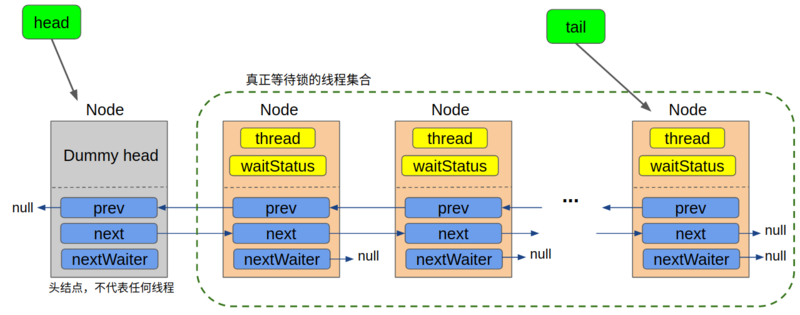
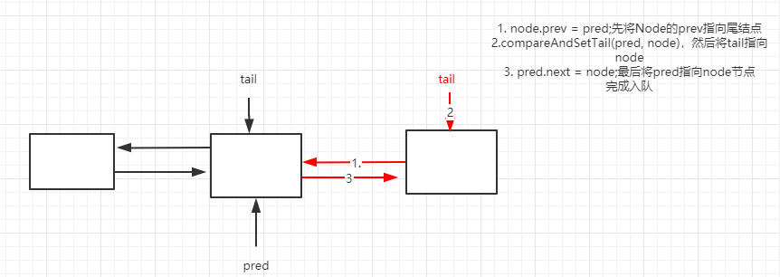
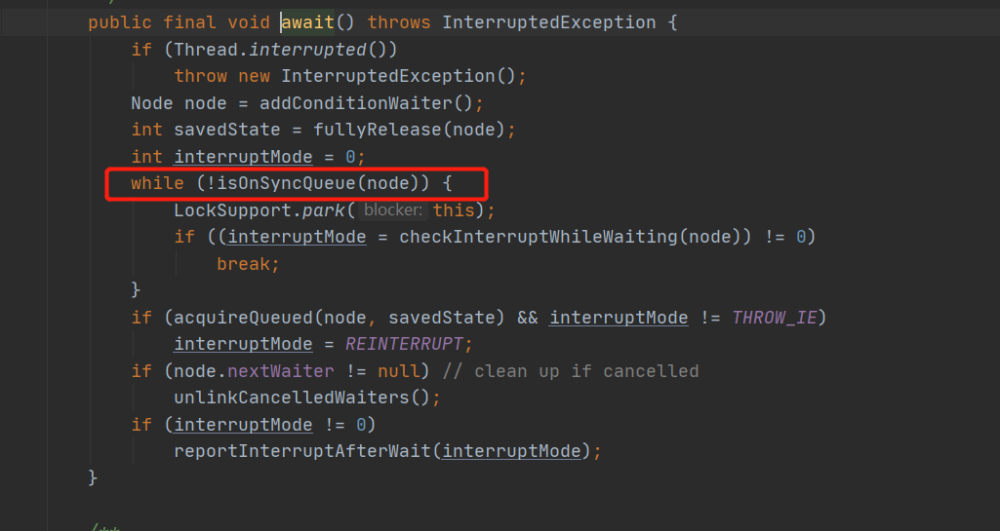
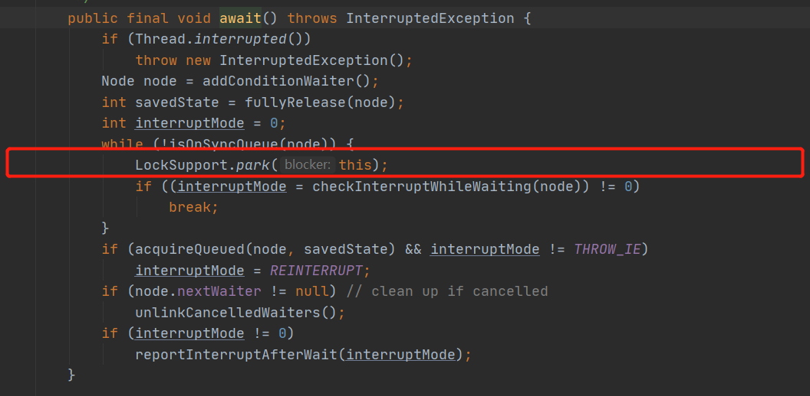
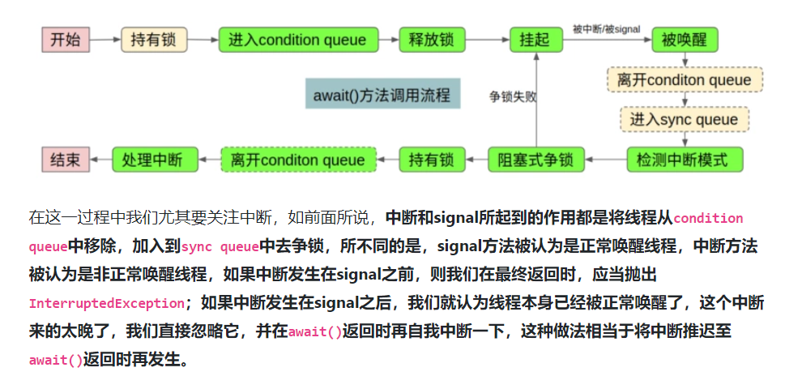

前面两篇分析了AQS的两种模式：独占模式和共享模式。AQS还提供了Condition功能，使得对线程的等待、唤醒更加灵活。
每篇文章的开头也是对自己的打气环节。加油，沉得住气，既不为来没有来临的黑暗担忧，但同时也要为了将来的光明而奋斗！

<!-- more -->

### Condition

在介绍Condition之前，我们先看没有Condition线程之间是如何通信的？

我们自然可以想到 wait()/notify()/notifyAll()方法。这三个方法的前提条件是获取到对象锁，一般和synchronized关机字配合使用。当我们notify()唤醒线程时，被唤醒的线程是有JVM随机唤醒的。notifyAll()则是唤醒所有等待的线程。如果我们想有条件的唤醒某些线程，是很难办到的。而且使用synchronized关键字，没有获取到锁的线程都会被放到一个队列中，而实际上可能会需要多个队列。

因此，Conditon机制的设计就是替换监视器锁的wait/notify机制的。一个lock里面可以创建多个Condition对象，相当于多路通知。并且可以根据不同的condition实现有条件的通知。因此是用lock下的condition会更加灵活。

我们可以将wait/notify机制和await/signal机制进行类比：

1. wait/notify机制必须配合synchronized关键字使用，await/signal机制必须配合lock使用。
2. 调用wait之后，线程会释放锁，进入waitset等待队列里。调用await之后，同样释放获取的lock，进入condition对应的队列中。
3. 调用notify会唤醒等待队列的线程，重新竞争锁。同样调用signal会唤醒condition对应等待队列中的线程重新竞争锁。
   区别就是，一个队列和多个队列。

#### 实例

```java
public class BoundedBuffer {

    final Lock lock = new ReentrantLock();
    final Condition notFull = lock.newCondition();
    final Condition notEmpty = lock.newCondition();

    final Object[] items = new Object[100];
    int putptr, takeptr, count;

    public void put(Object x) throws InterruptedException {
        lock.lock();
        try {
            while (count == items.length) {
                notFull.await();
            }
            items[putptr] = x;
            if (++putptr == items.length) {
                putptr = 0;
            }
            ++count;
            notEmpty.signal();
        } finally {
            lock.unlock();
        }
    }

    public Object take() throws InterruptedException {
        lock.lock();
        try {
            while (count == 0) {
                notEmpty.await();
            }
            Object x = items[takeptr];
            if (++takeptr == items.length) {
                takeptr = 0;
            }
            --count;
            notFull.signal();
            return x;
        } finally {
            lock.unlock();
        }
    }
}
```

这是Condition接口注释里面的示例。这是一个典型的生产者消费者例子。put函数相当于生产者的操作，take则是消费者的操作。put操作会往数组里面添加元素然后调用notEmpty.signal()通知其他线程从数组中取数据，直到满了为止，从而在notFul条件上等待。take操作会取出数组里面的数据，然后notFull.signal();通知其他线程可以向数组中添加数据，直到数组没有数据为止，从而在notempty条件上等待。

这里所说的等待是在condition上的等待队列，当线程被唤醒之后，要重新竞争锁，如果竞争失败会进入到AQS的同步队列上。两个队列中元素相互转移，是理解condition原理的重要基础。

#### 等待队列、同步队列

在前面两篇文章我们知道，AQS是通过CLH队列变形的FIFO同步队列来实现线程的管理，当抢锁失败后包装成Node进入同步队列。这个同步队列是一个双向链表，通过prev、next指针连接前后节点。入队的时候如果队列没有初始化，则new Node作为head，这是一个没有实际意义的节点，仅作为头结点使用。这里借用一张图来说明：



而每创建一个condition，则相当于创建一个等待队列。如下图所示：


正是因为这样，我们才能够对不同队列进行精准的唤醒，这就是与wati/notify最大的不同。与同步队列不同的是，等待队列是一个单向链表，通过nextWaiter与后续节点进行联系。

#### 同步队列、等待队列相互转移

我们上面提到，理解两个队列是如何转移的，是理解condition原理的基础。

当线程lock获取锁的时候，如果获取不到锁，则进入同步队列sync queue。如果锁释放后，其他线程唤醒同步队列里面的节点，节点获取到锁后则从同步队列中出队，如果再调用condition.await，则进入condition的等待队列。
当持有锁的线程，调用condition.signal后，则唤醒等待队列的节点，从等待队列出队，去竞争锁，如果竞争失败，则进入到同步队列中。

### condition实现原理

我们以ReentrantLock为例，condition必须跟ReentrantLock绑定使用。

>    Lock lock = new ReentrantLock();
>    Condition notFull = lock.newCondition();

newCondition方法调用了Sync中的newConditon方法。

```java
        final ConditionObject newCondition() {
            return new ConditionObject();
        }
```

ConditionObject是AQS的一个内部类。实现Condition接口，其中有两个属性：

```java
        /** First node of condition queue. */
        private transient Node firstWaiter;
        /** Last node of condition queue. */
        private transient Node lastWaiter;
```

这两个属性表示等待队列的对首和对尾。

### Condition源码分析

#### await方法（释放锁---->阻塞）

我们上面讲过，执行await方法，说明已经获取锁了，此时会加入到condition的队列中，并且线程会释放掉自己持有的锁。

```java
public final void await() throws InterruptedException {
    //如果线程在执行await前被中断，则抛出异常
    if (Thread.interrupted())
        throw new InterruptedException();
    //1.创建Node节点，并且加入到condition队列
    Node node = addConditionWaiter();
    //2.释放掉当前线程只用的锁
    int savedState = fullyRelease(node);
    int interruptMode = 0;
    //3.判断当前节点是不是在同步队列中
    while (!isOnSyncQueue(node)) {
        //3.如果不在，则阻塞
        LockSupport.park(this);
        //4.根据中断发生的时机返回后续需要处理此次中断的方式，如果发生中断，退出循环
        if ((interruptMode = checkInterruptWhileWaiting(node)) != 0)
            break;
    }
    //如果在同步队列中，那么就acquireQueued获取锁并返回当前线程是否中断
    //如果线程被中断，并且中断的方式不是抛出异常，则将中断后续的处理方式设置为REINTERRUPT（1）
    if (acquireQueued(node, savedState) && interruptMode != THROW_IE)
        interruptMode = REINTERRUPT;
    //从头到尾遍历condition队列，移除cancel的节点
    if (node.nextWaiter != null) // clean up if cancelled
        unlinkCancelledWaiters();
    //如果线程已经被中断，根据之前获取的interruptMode值来判断是否继续中断还是抛出异常。
    if (interruptMode != 0)
        reportInterruptAfterWait(interruptMode);
}
```

##### 1.addConditionWaiter方法

我们来看当前线程是如何进入到等待队列中

```java
private Node addConditionWaiter() {
    Node t = lastWaiter;
    // 如果尾节点被取消了。则
    if (t != null && t.waitStatus != Node.CONDITION) {
        //1.1遍历整个链表，将calcel的节点都清除
        unlinkCancelledWaiters();
        t = lastWaiter;
    }
    //将当前线程包装成node的节点
    Node node = new Node(Thread.currentThread(), Node.CONDITION);
    //如果没有尾结点，说明等待队列还没有创建
    if (t == null)
        //将node赋值给firstWaiter
        firstWaiter = node;
    else
        //将node放在给尾结点后面
        t.nextWaiter = node;
    //最后将node赋值给lastWaiter
    lastWaiter = node;
    return node;
}
```

因为能够调用await方法，说明肯定已经持有锁了，所以不会有并发的情况出现，因此入队过程不需要CAS进行操作。

我们从整个入队过程可以发现与同步队列入队过程有几点不同：

1. 同步队列入队时创建的节点waitStatus为0，而等待队列创建的节点waitStatus是CONDITION
2. 同步队列的头节点是 new Node()，其实是一个空节点，不代表任何线程。而等待队列的头结点则是一个的入队的节点，firstWaiter和nextWaiter都指向该节点。
3. 我们上面比较同步队列和等待队列时说过，同步队列是一个双向链表，因此同步队列在入队的时候先将节点的prev指向tail，然后CAS修改tail为node，最后再修改前一个节点的next执行node。而等待队列是一个单向链表，只需要修改nextWaiter即可。

##### 1.1unlinkCancelledWaiters()

如果发现尾结点是取消状态的话，需要遍历整个链表，去掉所有取消的节点。

```java
private void unlinkCancelledWaiters() {
    Node t = firstWaiter;
    //先将trail置为null
    Node trail = null;
    //如果头节点不为空
    while (t != null) {
        //记录头结点的下一个节点
        Node next = t.nextWaiter;
        //如果t不是Node.CONDITION的节点
        if (t.waitStatus != Node.CONDITION) {
            //则将t从链表中去除
            t.nextWaiter = null;
            //如果trail为null，说明当前节点不是CONDITION节点，则往下进行
            if (trail == null)
                //将firstWaiter指向下一个节点
                firstWaiter = next;
            else//如果trail不为null,且当前节点不是CONDITION节点，则将trail往后指
                trail.nextWaiter = next;
            if (next == null)
                lastWaiter = trail;
        }
        //将trail指向CONDITION的节点
        else
            trail = t;
        t = next;
    }
}
```

通过while循环，从头节点开始遍历，去掉所有waitStatus不为 Node.CONDITION的节点。其中用firstWaiter记录头结点，通过trail记录最后一个不为Node.CONDITION的节点。

##### 2. fullyRelease方法

当前线程成功加入到等待队列之后，通过fullyRelease释放掉持有的锁。

```java
final int fullyRelease(Node node) {
    boolean failed = true;
    try {
        //获取当前线程重入锁的次数
        int savedState = getState();
        //尝试释放掉所有的锁
        if (release(savedState)) {
            failed = false;
            //如果成功释放，则应该返回0
            return savedState;
        } else {
            //没有释放成功，则抛出异常
            throw new IllegalMonitorStateException();
        }
    } finally {
        //抛出异常后
        if (failed)
            //将当前节点状态设置为取消
            node.waitStatus = Node.CANCELLED;
    }
}
```

释放锁的过程不再赘述，在我们第一篇文章已经讲过。

```java
public final boolean release(int arg) {
    if (tryRelease(arg)) {
        Node h = head;
        if (h != null && h.waitStatus != 0)
            unparkSuccessor(h);
        return true;
    }
    return false;
}
```

这里注意的是，release(savedState)释放掉所有的锁，不管重入几次，都将state置为0。如果失败，要讲节点状态置为 CANCELLED。所以我们在入队的时候要讲所有的CANCELLED节点去掉。

##### 3.isOnSyncQueue方法

所以此时我们await方法，当我们执行完***fullyRelease***方法后，先判断***isOnSyncQueue(node)***是不是在同步队列，不是才调用***LockSupport.park(this);***将自己挂起。那这里为什么要判断是否在同步队列呢？

```java
final boolean isOnSyncQueue(Node node) {
    if (node.waitStatus == Node.CONDITION || node.prev == null)
        return false;
    if (node.next != null) // If has successor, it must be on queue
        return true;
    /*
     * node.prev can be non-null, but not yet on queue because
     * the CAS to place it on queue can fail. So we have to
     * traverse from tail to make sure it actually made it.  It
     * will always be near the tail in calls to this method, and
     * unless the CAS failed (which is unlikely), it will be
     * there, so we hardly ever traverse much.
     */
    return findNodeFromTail(node);
}
```

1. 如果节点状态为CONDITION或者节点没有prev指针说明已经在等待队列中了，所以返回false。

2. 如果节点的next指针不为null，说明在同步队列中，因为等待队列不会用到next prev指针。

3. 如果两个if都未return，说明**节点状态不是CONDITION，prev指针不为null，next指针为null**。说明了啥？我们思考下什么时候会将prev不为null，next指针是为null？

   还记得我画的这张图吗？当自己节点已经入队后，又有节点来入队，但是只执行了第一步，第二步compareAndSetTail还没完成，此时节点的next就有可能为null。或者自己作为最后一个节点入队时，第三步还没执行，此时也有可能prev不为null，next指针为null。所以就要从尾往前找看是否在同步队列中。

   

   那么为什么会出现执行await，加入了等待队列，已经释放锁了，又被加入到同步队列中？说明此时其他获取锁的线程又调用了signal方法。


###### 3.1 findNodeFromTail方法

```java
private boolean findNodeFromTail(Node node) {
    Node t = tail;
    for (;;) {
        if (t == node)
            return true;
        if (t == null)
            return false;
        t = t.prev;
    }
}
```

该方法从队尾开始找，因为node.prev一定不是null，但是这是node可能还没完全加入sync中 ，因为之前判断了next为null。所以当t == node，说明当前节点已经在同步队列中了，因此返回true。如果t != node，就一直往前找，如果没找到，说明不在同步队列中，那么返回false。

所以我们回到最初的await方法：



如果不在同步队列中，则进入while循环，然后调用park将自己阻塞。此时已经加入到等待队列中，等待唤醒去重新竞争锁了。

如果在同步队列中，则往下执行。


#### signalAll()方法

调用signalAll方法的线程肯定是已经持有了锁。此时唤醒的是等待队列中线程，唤醒之后去争抢锁。

```java
public final void signalAll() {
    if (!isHeldExclusively())
        throw new IllegalMonitorStateException();
    Node first = firstWaiter;
    if (first != null)
        doSignalAll(first);
}
```

这里会先调用***isHeldExclusively()***判断当前线程是不是持有锁的线程。该方法是有AQS的子类实现的，即ReentrantLock的Sync类。

```java
protected final boolean isHeldExclusively() {
    // While we must in general read state before owner,
    // we don't need to do so to check if current thread is owner
    return getExclusiveOwnerThread() == Thread.currentThread();
}
```

如果是当前线程持有锁，当firstWaiter不为null时，调用d***oSignalAll(first)***唤醒所有线程。

```java
private void doSignalAll(Node first) {
    //先清空整个队列
    lastWaiter = firstWaiter = null;
    do {
        //先取出下一个节点
        Node next = first.nextWaiter;
        //将当前节点断开
        first.nextWaiter = null;
        //调用方法将该节点添加到同步队列队尾
        transferForSignal(first);
        //然后执行下一个节点
        first = next;
    } while (first != null);
}
```

这里主要是一个一个从头开始将节点调用***transferForSignal(first)***转移到同步队列中。

```java
final boolean transferForSignal(Node node) {
    //如果不能将节点状态由CONDITION置为0，则跳过这个节点
    if (!compareAndSetWaitStatus(node, Node.CONDITION, 0))
        return false;
	//将节点入队同步队列中
    Node p = enq(node);
    int ws = p.waitStatus;
    if (ws > 0 || !compareAndSetWaitStatus(p, ws, Node.SIGNAL))
        LockSupport.unpark(node.thread);
    return true;
}
```

需要注意的是***Node p = enq(node);***返回的入队节点的前驱节点。

将节点成功加入同步队列后，通过CAS将当前节点的前驱节点的状态改为SIGNAL，这样就可以唤醒当前节点了。我们知道，在ReentrantLock 抢锁***acquireQueued--->shouldParkAfterFailedAcquire***中，就是把前驱节点修改为SIGNAL后，自己再阻塞。

所以总结一下***signalAll***方法：

1. 判断当前节点是否为持有锁的线程
2. 是的话先将lastWaiter = firstWaiter = null使得队列清空。然后从firstWaiter开始，将nextWaiter置为null，然后如果通过enq进入到同步队列队尾，返回当前节点在同步队列中的前驱节点
3. 只要前驱节点处于被取消的状态或者无法将前驱节点的状态修成Node.SIGNAL，那我们就将Node所代表的线程唤醒。但是唤醒并不代表这取得了锁，还需要重新竞争，如果竞争不到，则重新挂起。

#### signal()方法

```java
public final void signal() {
    if (!isHeldExclusively())
        throw new IllegalMonitorStateException();
    Node first = firstWaiter;
    if (first != null)
        doSignal(first);
}
```

signal方法和signalAll方法一样，只不过通过doSignal唤醒头结点。

```java
private void doSignal(Node first) {
    do {
        // 将firstWaiter指向条件队列队头的下一个节点
        if ( (firstWaiter = first.nextWaiter) == null)
            lastWaiter = null;
        // 将条件队列原来的队头从条件队列中断开，则此时该节点成为一个孤立的节点
        first.nextWaiter = null;
    } while (!transferForSignal(first) &&
             (first = firstWaiter) != null);
}
```

因此，signal方法会从当前条件队列中取出第一个没有被cancel的节点加入到同步队列的尾部。

#### await方法（唤醒-->抢锁）

既然唤醒的方法signal/signalAll方法我们分析完了，我们从await方法阻塞的地方继续先往下看，也就是红线框的地方。



##### checkInterruptWhileWaiting方法

执行到这个方法时，说明已经执行了***signal***方法。

```java
private int checkInterruptWhileWaiting(Node node) {
    return Thread.interrupted() ?
        (transferAfterCancelledWait(node) ? THROW_IE : REINTERRUPT) :
        0;
}
```

如果当前线程被中断，则返回true，此时调用***(transferAfterCancelledWait(node) ? THROW_IE : REINTERRUPT)***方法判断后续处理是应该抛出InterruptedException还是重新中断。

如果当前线程没有被中断，则返回0.

###### transferAfterCancelledWait方法

```java
final boolean transferAfterCancelledWait(Node node) {
    if (compareAndSetWaitStatus(node, Node.CONDITION, 0)) {
        enq(node);
        return true;
    }
    /*
     * If we lost out to a signal(), then we can't proceed
     * until it finishes its enq().  Cancelling during an
     * incomplete transfer is both rare and transient, so just
     * spin.
     */
    while (!isOnSyncQueue(node))
        Thread.yield();
    return false;
}
```

进入到这个方法，说明线程被中断过。

如果 ***compareAndSetWaitStatus(node, Node.CONDITION, 0)***执行成功，我们知道执行signal方法会把CONDITION状态修改为0，所以说明当前节点一直在 等待队列中，没有被唤醒过。然后执行***enq(node)***，将node加入到sync队列中，并且返回true，表示中断在***signal***唤醒之前。

如果***compareAndSetWaitStatus(node, Node.CONDITION, 0)***执行失败，则检查当前线程的node是否已经在同步队列中，如果不在同步队列中，则执行***yield***方法，让给其他线程执行。直到当前node被***signal***方法添加到sync队列中。

如果在同步队列中，则返回false。

所以总结下来，有三种情况。

1. **中断发生在唤醒之前，也就是在阻塞的时候，线程被中断**。**interruptMode = THROW_IE = -1**
2. **中断发生在唤醒之后**，**interruptMode = REINTERRUPT= 1** 
3. **一直没有中断发生**

接下来执行

```java
if (acquireQueued(node, savedState) && interruptMode != THROW_IE)
    interruptMode = REINTERRUPT;
```

这里再次争抢锁，也就是之前释放了多少次，就重新获取多少次。因为现在我恢复执行了，之前业务我需要重入N次锁，现在我唤醒后再去抢锁，肯定要抢回我之前加的锁。

***acquireQueued(node, savedState)***，我们在ReentrantLock中已经分析过了，如果抢锁失败后，会再次阻塞。

```java
final boolean acquireQueued(final Node node, int arg) {
    boolean failed = true;
    try {
        boolean interrupted = false;
        for (;;) {
            final Node p = node.predecessor();
            if (p == head && tryAcquire(arg)) {
                setHead(node);
                p.next = null; // help GC
                failed = false;
                return interrupted;
            }
            if (shouldParkAfterFailedAcquire(p, node) &&
                parkAndCheckInterrupt())//再次阻塞。
                interrupted = true;
        }
    } finally {
        if (failed)
            cancelAcquire(node);
    }
}
```

如果interruptMode不是THROW_IE，则将interruptMode = REINTERRUPT。

然后执行：

```java
if (node.nextWaiter != null) // clean up if cancelled
    unlinkCancelledWaiters();
```

因为在当前节点的nextWaiter一直都有值，因为进入到同步队列只需要修改prev和next，并没有修改nextWaiter，所以这里需要将它从等待队列中移除。因为等待队列时一个单项队列，所以从头开始遍历整个条件队列，找到并移除。

```java
private void unlinkCancelledWaiters() {
    Node t = firstWaiter;
    Node trail = null;
    while (t != null) {
        Node next = t.nextWaiter;
        if (t.waitStatus != Node.CONDITION) {
            t.nextWaiter = null;
            if (trail == null)
                firstWaiter = next;
            else
                trail.nextWaiter = next;
            if (next == null)
                lastWaiter = trail;
        }
        else
            trail = t;
        t = next;
    }
}
```

awaite最后一步，根据中断类型，来进行相应的处理。

```java
if (interruptMode != 0)
    reportInterruptAfterWait(interruptMode);
```

可以看出，当***interruptMode == THROW_IE***时，抛出异常，当***interruptMode == REINTERRUPT***时，执行***selfInterrupt***

```java
private void reportInterruptAfterWait(int interruptMode)
    throws InterruptedException {
    if (interruptMode == THROW_IE)
        throw new InterruptedException();
    else if (interruptMode == REINTERRUPT)
        selfInterrupt();
}
```

#### await方法总结

1. 进入awati必定是获取了lock
2. 离开await也是获取了lock，不然会在***acquireQueued***阻塞
3. 调用await会使当前线程进入等待队列，并释放手中持有的锁。
4. 释放锁后，当前线程会在等待队列中挂起，然后等待唤醒或者中断
5. 线程被唤醒后离开等待队列进入同步队列进行抢锁。
6. 如果线程在抢锁之前发生过中断，则根据中断发生前后记录中断模式
7. 抢到锁之后，将自己的nextWaiter节点置为null，离开等待队列
8. 最后await方法调用完毕

整个过程，最复杂的地方是对于中断的处理：



### 总结

这个condition代码读的有点难懂，现在也只是知道了个大致流程，等再屡屡思路，画个流程图，印象更加深刻。（待更新）


> 参考列表
>
> 1. https://segmentfault.com/a/1190000016462281#item-6-8（强烈推荐）
> 2. http://www.ideabuffer.cn/2017/03/20/%E6%B7%B1%E5%85%A5%E7%90%86%E8%A7%A3AbstractQueuedSynchronizer%EF%BC%88%E4%B8%89%EF%BC%89/