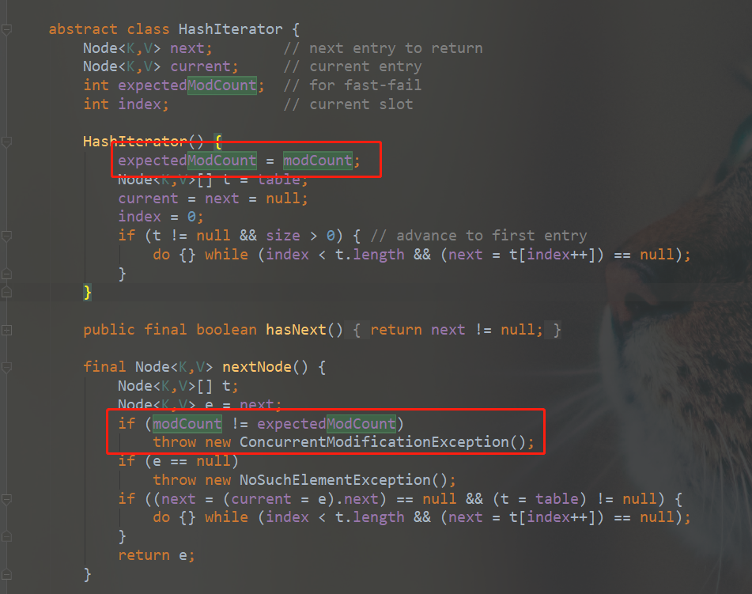
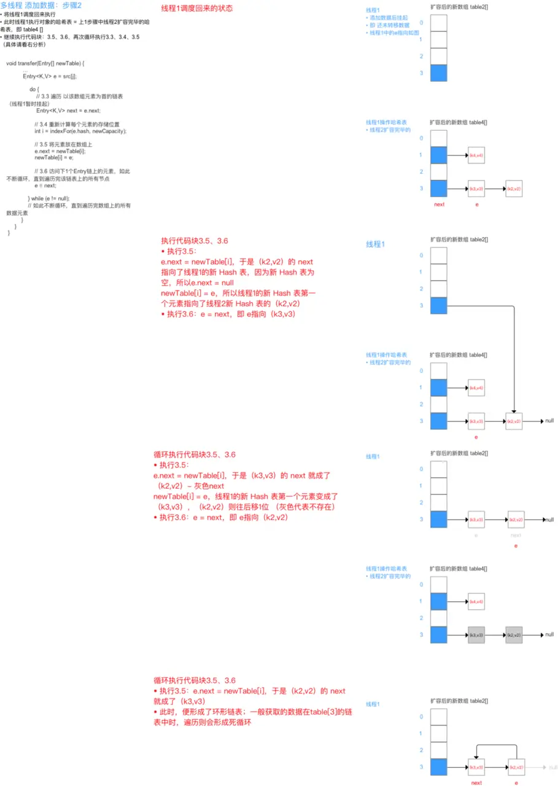

博客里面没有一篇HashMap的总结，不能叫做技术博客。且不说HashMap也是面试中的重头戏，每个Java Coder都需要掌握的吧。先不说红黑树这么左旋右旋删除添加这种有难度的操作，其他问题总归该掌握的。比如JDK 1.7 1.8 中红黑树区别？HashMap的数组长度为何要是2的整数次幂？如何解决Hash冲突的？HashMap又是如何扩容的？JDK1.8比JDK1.7中优化点在哪？HashMap是线程不安全的，体现在哪里？甚至还可以引申出ConcurrentHashMap，然后又是一大堆问题。哈哈哈哈，光随便想想，就头皮发麻。

时刻记住，稳住，不要慌。现在来一一击破。

<!-- more -->

### HashMap


JDK1.7中，HashMap底层数据结构为 **数组 + 链表**。JDK1.8中，HashMap底层数据结构为 **数组 + 链表 + 红黑树**。（第一个区别点就出来了）

HashMap默认**初始值**为 16 ，最大为2的30次方。当没有指定默认值时，new HashMap()，并不会初始化数组，而是等到第一次put时，会调用resize()进行初始化。

HashMap默认**加载因子**为0.75，扩容阈值为 数组长度 * 加载因子。

HashMap当链表**长度达到8时且容量达到64**时，进行**树化**。当链表**长度小于6时进行反树化**。这里可能会有人问为什么反树化是6？假设当树化、反树化都是8的话，如果在hashmap中频繁插入删除，那么hashmap就有可能频繁进行树化反树化。让这两个值有一定的差值，可以防止树和链表频繁转换。

HashMap使用链地址法解决hash冲突。简单来说，就是数组加链表的结合。

### put过程

1. 计算key的hash值

这里JDK1.7和JDK1.8稍有不同（第二个区别点）。**扰动函数**：JDK1.7是进行四次右位移异或，而JDK1.8简化为只做一次16位右位移异或混合。右位移16位，正好是32bit的一半，自己的高半区和低半区做异或，这样可以混合原始哈希码的高位和低位。以此加大低位的随机性，而且混合后的低位掺杂了高位的部分特征，这样高位的信息也被变相保留下来。

为什么JDK1.8只需要进行一次右位移异或呢？因为一方面较少扰动次数也能够增加效率，零一方面JDK1.8引入了红黑树，利用红黑树可以快速进入增删改查，即使发生了hash冲突，但是查找效率也会变高，另

2. 如果数组数量为0，则初始化数组。

3. 将hash值与数组长度-1 (n - 1) & hash 进行 “与”操作计算出元素所在数组位置。

这里可以体现出为什么 HashMap的数组长度要取2的整次幂？因为数组长度-1 正好相当于一个**低位掩码**，hash值是一个int型，直接拿hash值所谓数组下标的话，int型的值范围从-21亿到+21亿，前后加起来大约40亿的映射空间，内存是放不下的，因此与操作的结果将hash值高位全部归零，只保留低位值，用做数组下标访问。例如初始长度16,16-1=15，相当于00001111，因此hash值 & 00001111，相当于只截取最低四位位。再加上扰动函数，使得碰撞次数大大降低。

4. 如果key所在位置没有元素，则直接创建新的Node。如果不等于空，说明有元素存在，判断第一个元素的key与待插入key相同，则替换旧值。如果第一个元素是树节点TreeNode，则调用树节点的putTreeVal()寻找元素和插入树节点。都不是，则说明是链表，按照链表的形式插入，遍历链表查找key是否存在链表中，如果找到了，则判断是否替换旧值。如果没有找到，则在链表最后插入一个新节点并判断是否树化。

5. 最后数量+1，并且判断是否需要扩容。

### 扩容 resize()方法
JDK 1.7 与 JDK1.8扩容方法不同。可以看出，JDK1.7中，遍历数组元素，将当前元素的next节点保存下来，然后计算再新数组的下标，使用头插法，插入元素，接着处理下一个节点。但是头插法在多线程的情况下会出现死循环的情况。
而JDK1.8中，则是利用lohead lotial，hihead hitail,将链表分为高低两个两边，通过判断 hash & oldcapity，如果等于0 ，则加入到低位链表，如果不等于0，则加入高位链表。最后低位链表保持不变，高位链表加入到原来位置+旧容量的槽位。这样就避免了重新计算hash值，实现高效转移。同时使用尾插法，避免了死循环的出现。
这样实现的理由是：扩容为原来的两倍，n-1相当于左边高位多了个1，假如原容量为16，只有后4位1111与运算，扩容后容量为32，则为后5位11111参与运算。如果hash & n-1后高位为0，则在原位置，如果高位为1，则得到的值相当于原位置+oldcapity。因此可以判断扩容后高位是否为1判断位置是否变化。那为什么hash &  oldcapity就能判断高位是否为1呢，因为oldcapity 16二进制10000， 高5位为1，后4位为0，因此可以判断hash第5位是否为1，如果为0，则与出来的值为0，则说明在原位置，如果与出来的值不等于0，则说明第5位为1，则位置是原位置+oldcapity。

```java
    //JDK 1.7
    void resize(int newCapacity) {
        Entry[] oldTable = table;
        int oldCapacity = oldTable.length;
        if (oldCapacity == MAXIMUM_CAPACITY) {
            threshold = Integer.MAX_VALUE;
            return;
        }

        Entry[] newTable = new Entry[newCapacity];
        transfer(newTable, initHashSeedAsNeeded(newCapacity));
        table = newTable;
        threshold = (int)Math.min(newCapacity * loadFactor, MAXIMUM_CAPACITY + 1);
    }

        void transfer(Entry[] newTable, boolean rehash) {
        int newCapacity = newTable.length;
        for (Entry<K,V> e : table) {
            while(null != e) {
                Entry<K,V> next = e.next;
                if (rehash) {
                    e.hash = null == e.key ? 0 : hash(e.key);
                }
                int i = indexFor(e.hash, newCapacity);
                e.next = newTable[i];
                newTable[i] = e;
                e = next;
            }
        }
    }
```


```java
    //JDK 1.8
        final Node<K,V>[] resize() {
        Node<K,V>[] oldTab = table;
        int oldCap = (oldTab == null) ? 0 : oldTab.length;
        int oldThr = threshold;
        int newCap, newThr = 0;
        if (oldCap > 0) {
            if (oldCap >= MAXIMUM_CAPACITY) {
                threshold = Integer.MAX_VALUE;
                return oldTab;
            }
            else if ((newCap = oldCap << 1) < MAXIMUM_CAPACITY &&
                     oldCap >= DEFAULT_INITIAL_CAPACITY)
                newThr = oldThr << 1; // double threshold
        }
        else if (oldThr > 0) // initial capacity was placed in threshold
            newCap = oldThr;
        else {               // zero initial threshold signifies using defaults
            newCap = DEFAULT_INITIAL_CAPACITY;
            newThr = (int)(DEFAULT_LOAD_FACTOR * DEFAULT_INITIAL_CAPACITY);
        }
        if (newThr == 0) {
            float ft = (float)newCap * loadFactor;
            newThr = (newCap < MAXIMUM_CAPACITY && ft < (float)MAXIMUM_CAPACITY ?
                      (int)ft : Integer.MAX_VALUE);
        }
        threshold = newThr;
        @SuppressWarnings({"rawtypes","unchecked"})
            Node<K,V>[] newTab = (Node<K,V>[])new Node[newCap];
        table = newTab;
        if (oldTab != null) {
            for (int j = 0; j < oldCap; ++j) {
                Node<K,V> e;
                if ((e = oldTab[j]) != null) {
                    oldTab[j] = null;
                    if (e.next == null)
                        newTab[e.hash & (newCap - 1)] = e;
                    else if (e instanceof TreeNode)
                        ((TreeNode<K,V>)e).split(this, newTab, j, oldCap);
                    else { // preserve order
                        Node<K,V> loHead = null, loTail = null;
                        Node<K,V> hiHead = null, hiTail = null;
                        Node<K,V> next;
                        do {
                            next = e.next;
                            if ((e.hash & oldCap) == 0) {
                                if (loTail == null)
                                    loHead = e;
                                else
                                    loTail.next = e;
                                loTail = e;
                            }
                            else {
                                if (hiTail == null)
                                    hiHead = e;
                                else
                                    hiTail.next = e;
                                hiTail = e;
                            }
                        } while ((e = next) != null);
                        if (loTail != null) {
                            loTail.next = null;
                            newTab[j] = loHead;
                        }
                        if (hiTail != null) {
                            hiTail.next = null;
                            newTab[j + oldCap] = hiHead;
                        }
                    }
                }
            }
        }
        return newTab;
    }
```

什么情况下会发生扩容？

1. 初始化时，当put第一个元素时
2. 链表长度大于8时，判断数组容量是否小于64，如果小于则扩容。
3. 当数组容量大于阈值 数组容量 x 装载因子。

### get 过程

get过程相对比较简单。

1. 计算key的hash值
2. 根据hash & (length -1) 得到所在数组下标。
如果找的key就是数组下标所在元素，则直接返回。
如果数组index位置元素是TreeNode类型，则按照红黑树查询方式来进行查找。
如果数组index位置元素非TreeNode类型，则按照链表的方式进行遍历查询。

### HashMap线程不安全体现在哪里？

1. HashMap没有使用同步锁，因此会出现线程不安全的情况。JDK1.7中，多线程会出现resize()死循环问题，并发执行put操作导致扩容发生，从而导致环形链表，在获取数据遍历链表时，出现死循环。
2. 在使用迭代器过程中出现并发操作，即多个线程同时修改HashMap，会抛出ConcurrentModficationExeption异常。fail-fast，快速失败机制。它的原理是：存在一个modCount变量，用来记录修改次数。每修改一次HashMap，就会增加该变量值。当迭代器初始化时，将该值赋值给迭代器的expectedModCount，执行next操作时，判断modCount 是否与 expectedModCount相等。如果不相等，说明有其他线程修改了HashMap，因此抛出ConcurretnModificationException异常。

因此，在多线程情况下，推荐使用ConcurrentHashMap。（此时，悄悄的将话题引到oncurrentHashMap，不过谁知道呢，也有可能是面试官在引导你。当你凝视深渊时，深渊也在凝视你。→_→）


当然，也有可能问，那具体是怎样引起死循环呢？

那么，就要掏出纸和笔，来写写画画了。
```java
    void transfer(Entry[] newTable, boolean rehash) {
        int newCapacity = newTable.length;
        //遍历旧tabel，将旧数组上的数据转移到新数组上。
        for (Entry<K,V> e : table) {
            while(null != e) {
                //先保存当前元素下一个节点，防止转移后，链表断开。
                Entry<K,V> next = e.next;
                //重新计算hash值
                if (rehash) {
                    e.hash = null == e.key ? 0 : hash(e.key);
                }
                //计算新数组下标位置
                int i = indexFor(e.hash, newCapacity);
                //头插法，将当前元素e的next指针指向newTable[i]，断开e与下一个元素之间的指针 e--->a
                e.next = newTable[i];
                //将当前元素挡在数组首位，[i]--->e--->a
                newTable[i] = e;
                //访问下一个元素，不断循环
                e = next;
            }
        }
    }
```

可以看出，头插法在扩容之后会出现链表逆序的情况（因此，算法题中从尾到头逆序输出链表可以使用头插法）。
若多线程并发put操作，一旦出现扩容现象，则容易出现环形链表，从而获取数据时出现死循环。下面借一幅图，来说明。其实简单的就是 线程1 e指向A，next执行B，线程扩容完成后，因为头插法，所以B--->A。导致e执行B，next指向A。



JDK1.8之后，因为是尾插法，所以不会出现逆序、死循环的情况。但仍不能保证并发安全。


> 参考列表
> 
> 1. https://segmentfault.com/a/1190000012926722
> 2. http://cmsblogs.com/?p=4731
> 3. https://juejin.im/post/5aa5d8d26fb9a028d2079264#heading-21