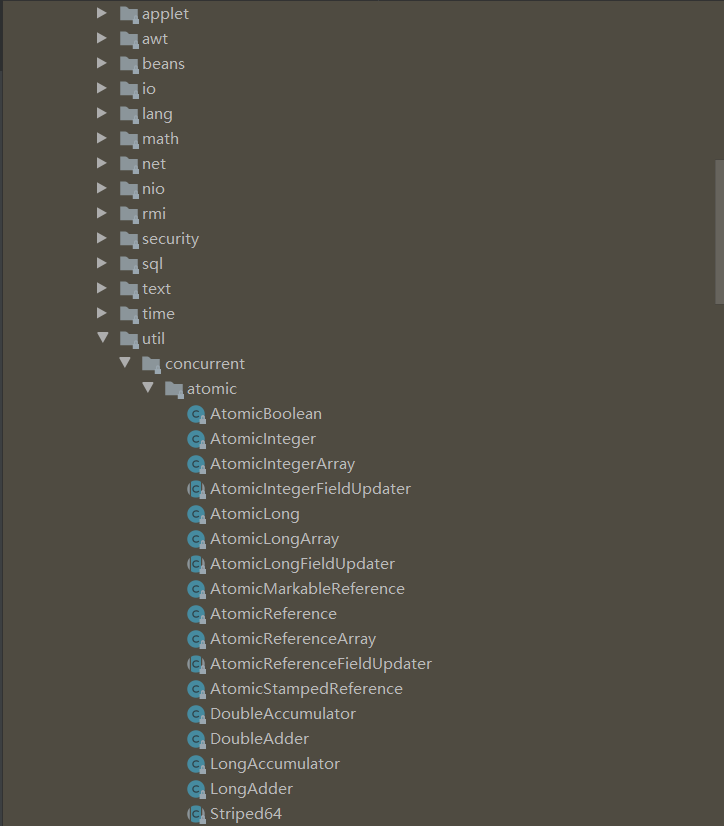
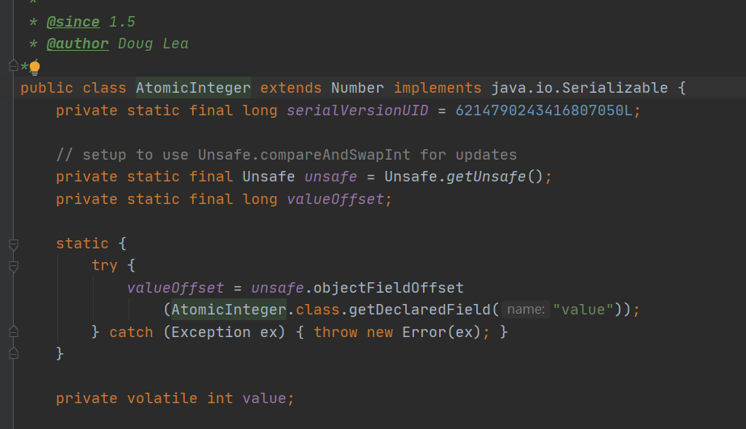
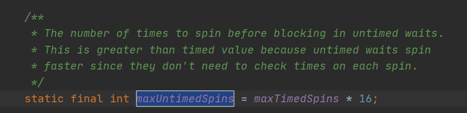

前面我们讲了Synchronized关键字。如果从锁的分类上来看，Synchronized以及后面要讲到的Lock都属于一种悲观锁。那Java中存在乐观锁吗？答案是存在的。乐观锁在Java中是通过使用无锁编程来实现的，最常用的就是CAS算法，JUC下的原子类的递增操作就是通过CAS自旋实现的，并且可以说CAS是整个JUC的核心。

<!-- more -->

## 什么是CAS

CAS，全称是Compare and Swap。比较交换，在不使用锁的情况下实现多线程之间的变量同步。

CAS算法涉及到三个值：

1. 内存地址
2. 预期值
3. 更新值

只有当内存地址的值等于预期值时，才会用原子的方式把内存中的值修改为更新值。比较+更新是一个原子操作。

## CAS原理



我们以AtomicInteger为例，



可以看到主要有:

1. unsafe : 获取并操作内存的数据
2. valueOffset ：内存中的偏移量
3. value : volatile修饰的int值，从而保证其在线程间的可见性。

观察其***incrementAndGet***方法：

```java
public final int incrementAndGet() {
    return unsafe.getAndAddInt(this, valueOffset, 1) + 1;
}
```

这里使用到**Unsafe类**。Unsafe类是CAS的核心类，AtomicInteger类就是靠Unsafe完成CAS操作。

我们知道 在Java中，我们是无法直接访问到操作系统的，只能通过本地方法来访问。本地方法不是使用Java实现的，是由C/C++语言在另外的文件中编写，遵循Java本地接口的规范（简称JNI）。但是Java提供Unsafe类可以实现硬件级别的原子操作。

```java
//sun.misc.Unsafe#getAndAddInt
public final int getAndAddInt(Object var1, long var2, int var4) {
    int var5;
    do {
        var5 = this.getIntVolatile(var1, var2);
    } while(!this.compareAndSwapInt(var1, var2, var5, var5 + var4));

    return var5;
}

//// ------------------------- OpenJDK 8 -------------------------
// Unsafe.java
public final int getAndAddInt(Object o, long offset, int delta) {
   int v;
   do {
       v = getIntVolatile(o, offset);
   } while (!compareAndSwapInt(o, offset, v, v + delta));
   return v;
}
```

通过OpenJDK 8的源码我们可以看出，不断取出对象o在内存偏移量offset处的值，判断内存中的值是否等于v，如果等于则把内存中的值设置为 v + delta，否则返回false，循环继续执行，直到设置成功后退出并返回旧值。整个比较+更新的操作封装在***compareAndSwapInt***中，在JNI中，是通过一个cpu指令完成的，属于原子操作，所以可以保证多个线程能够看到同一个变量的修改值。

通过查看Hotspot源码，在Unsafe.cpp类中最终是调用了 ***Atomic::cmpxchg***方法。***Atomic::cmpxchg***在不同平台上有不同的实现 （这里就涉及到知识盲区），总之**JDK通过CPU的cmpxchgl指令的支持，实现AtomicInteger的CAS操作的原子性**。

```c
UNSAFE_ENTRY(jboolean, Unsafe_CompareAndSwapInt(JNIEnv *env, jobject unsafe, jobject obj, jlong offset, jint e, jint x))
  UnsafeWrapper("Unsafe_CompareAndSwapInt");
  oop p = JNIHandles::resolve(obj);
  jint* addr = (jint *) index_oop_from_field_offset_long(p, offset);
  return (jint)(Atomic::cmpxchg(x, addr, e)) == e;
UNSAFE_END
```

### CAS的问题

CAS虽好，但是也存在着一些问题，例如：

1. 循环时间不确定，有可能太长。如果while循环一直不能退出，那么就会给cpu带来很大开销。JUC中有些地方就限制了CAS自旋的次数，例如阻塞队列中的SynchronousQueue，如果cpu数量大于等于2则默认32*16次，否则为0。



2. 只能保证一个共享变量原子操作。对一个共享变量操作时，cas能保证原子操作，但对多个共享变量操作时，cas是无法保证操作的原子性的。但是JDK1.5之后提供了**AtomicReference**类来保证引用对象之间的原子性，可以把多个变量放在一个对象里面进行CAS操作。
3. ABA问题。通俗就是将内存的值是A，后来变成了B，然后又变成了A，cas检查发现没有变化，实际上是有变化的。解决办法就是添加版本号，JDK1.5之后提供AtomicStampedReference类来解决ABA问题，通过标记stamp来代表版本号。

## Unsafe类

Unsafe类是位于sun.misc包下的类，主要用于执行一些不安全的操作，例如直接访问操作系统资源。

我们一般开发不会用到，JDK1.9之前可以通过反射来获取单例对象。

主要功能：

1. 进行内存分配、拷贝等操作。例如：堆外内存DirectByteBuffer，在通信中用做缓冲池，在Netty等NIO框架中广泛使用。
2. CAS相关操作。例如我们上面所说的原子类。
3. 线程调度。例如JUC中锁使用中线程的阻塞唤醒就是通过LockSupport实现的。LockSupport实际上是通过调用Unsafe的park、unpark方式来实现的。
4. Class相关。

等等........

就不过多涉及了，因为这个类一般我们也用不到，已经超出我的理解能力了~


>参考列表
>
>1. https://tech.meituan.com/2018/11/15/java-lock.html
>2. https://tech.meituan.com/2019/02/14/talk-about-java-magic-class-unsafe.html
>3. https://juejin.im/post/5a73cbbff265da4e807783f5
>
>

