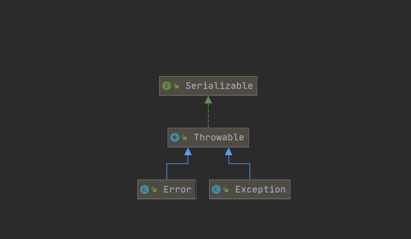
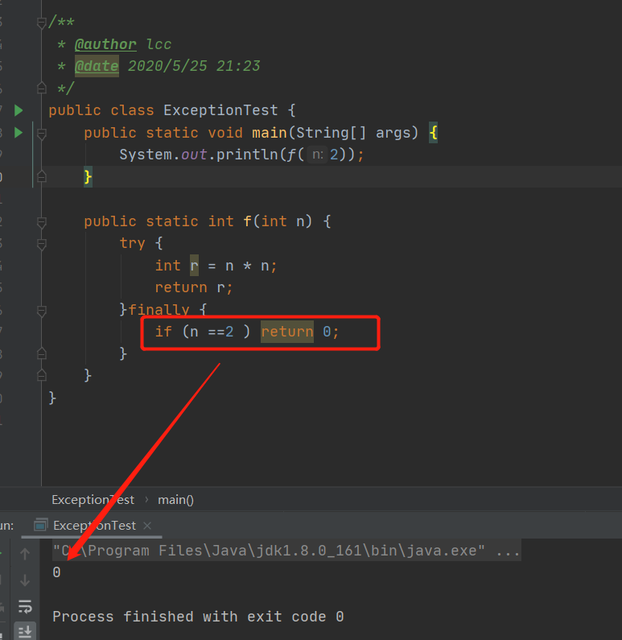

趁热打铁，刚进行了30分钟的灵魂发问，发现好多基础的知识反而忘了，比如Error和Exception的父类是什么？。。。太惭愧了。

不过问题不大，学到了就是赚到了。这篇文章主要来讲述Java的异常体系。

<!-- more -->

### Java异常体系

首先解决第一个问题：**Error和Exception的父类是什么？**

在Java语言中，异常对象都继承于**Throwable类**。两大子类分别是Error和Exception。

Error类描述了Java运行时系统内部错误和资源耗尽错误，这种情况对于程序本身来说是无法处理的，只能尽力使程序安全的终止。最为常见的就是Java虚拟机崩溃，比如：**OutOfMemoryError、NoSuchFieldError、NoSuchMethodError**等。

Exception类又分为RuntimeException和其他异常。两者划分的区别在于由程序错误导致的异常属于RuntimeException；而程序本身没有问题，但是由于像IO错误这类问题导致的异常属于其他异常。

1. **RuntimeException**主要是：

   错误的类型转换：**ClassCastException**、

   数组访问越界：**IndexOutOfBoundsException**、

   访问null指针：**NullPointerException**。

2. **其他异常**主要是：编译期间可以检查到的异常，必须显式的进行处理（捕获或者抛到上一层），例如：

   试图在文件尾部后面读取数据、

   试图打开一个不存在的文件、

   试图根据给定的字符串查找Class对象，而这个字符串表示的类并不存在

   还有就是Thread.sleep时，需要捕获的InterruptedException异常等等。

Java语言规范将派生与Error类或者RuntimeException类的所有异常称为非受查异常，所有其他的异常为受查异常。

### 异常处理

对于异常的处理，常用的关键字就是 try/catch/throw/throws/finally。

一般使用有 try......catch; try.......catch.....finally；或者try........finally。catch可以有多个，但是最多只会匹配其中一个异常类且只执行该catch的代码，而且会先catch子类异常再catch父类异常。

而对于**finally**来说，无论try代码块里面是否抛出异常，亦或者代码抛出了异常，但是这个异常不是由catch子句所捕获，finally中的代码一定会得到执行。因此，我们finally语句为异常处理提供一个统一的出口，使得在能够对程序的状态进行统一的管理，例如进行资源的清除工作，如文件的关闭、删除临时文件、数据库连接的关闭等。但是需要注意的是，当try代码块中有return语句，finally子句中也包含return语句，那么在方法返回之前，会先执行finally子句的内容，因此finally中的返回值将会覆盖原始的返回值。例如：

对于**throw**关键字来说，主要用于抛出一个Throwable类型的异常，并且作用在方法语句中，如果所有方法层层往上抛，那么最终由JVM进行处理，即打印异常信息和堆栈信息。而**throws**则是方法体上抛出一个异常，并且其他方法调用这个方法时知道要捕获这个异常。