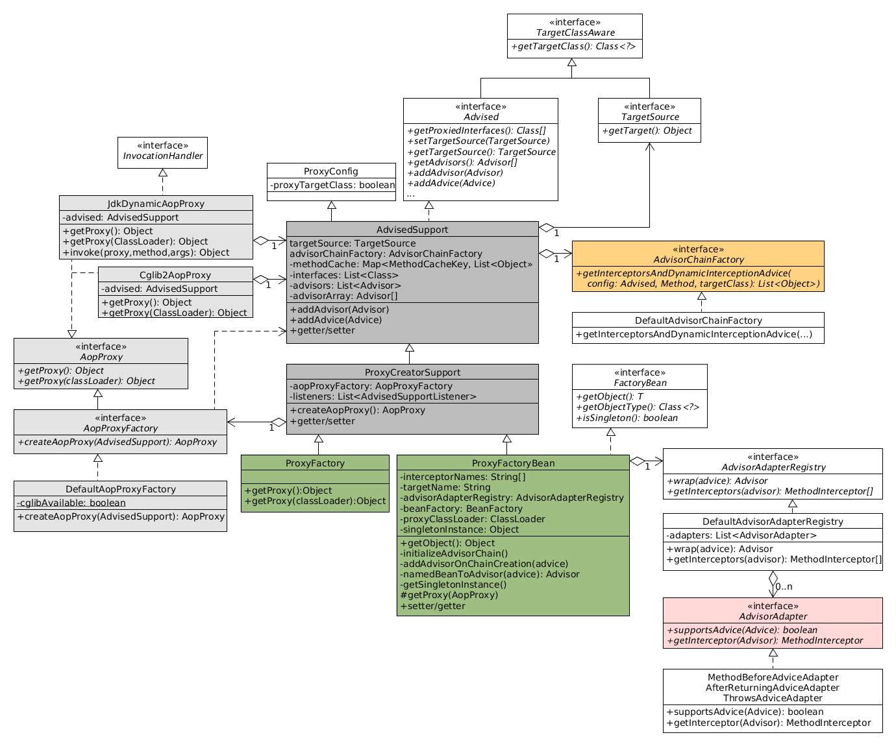
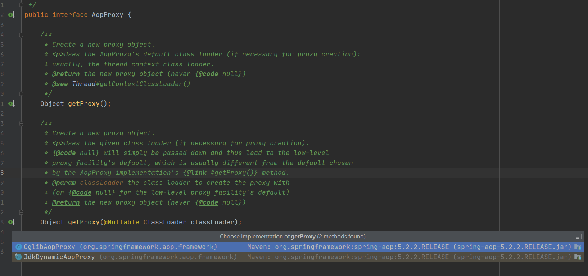

我们知道在Spring AOP和事务中，均用到了动态代理技术。今天回顾这部分知识的时候，觉得不够深入，因此专门进行这个知识点的复习。

<!-- more -->

### 动态代理及原理

动态代理是指程序在运行期间动态的创建代理对象和动态调用代理方法的一种机制。

动态代理的常用实现方式是**反射**。**反射机制**是指程序在运行期间可以访问、检测和修改其本身状态或者行为的一种能力，使用反射我们可以调用任意一个类对象，以及类对象中包含的属性以及方法。

但是动态代理不止有反射一种实现方式。例如，在CGLib实现动态代理，是基于**ASM框架**而非反射实现的。ASM是一种字节码处理框架，用来转换字节码并且生成新的类，不鼓励直接使用ASM，因为它要求必须对JVM内部结构包括class文件的格式和指令集都很熟悉。

JDK Proxy和CGlib的区别主要体现在以下几个方面：

1. JDK Proxy是Java语言自带的功能，不需要加载第三方类实现。JDK Proxy是通过拦截器加反射的方式实现的，只能代理实现接口的类。
2. CGLib是第三方提供的工具，基于ASM实现的，性能比较高，无需通过接口来实现，而是通过子类的方式来完成调用。

### 再次回顾Spring AOP




上图就是一个Spring AOP的总类图。

我们之前分析Spring AOP是通过ProxyFactoryBean为入口的。这次我们通过ProxyFactory来为入口。

我们可以直接通过**ProxyFactory**的**getProxy**方法获取代理对象。

```java
//org.springframework.aop.framework.ProxyFactory#getProxy()
public Object getProxy() {
   return createAopProxy().getProxy();
}
```

其中createAopProxy()方法则跟我们在Spring AOP文章里面一样，先通过**AopProxyFactory**创建AopProxy，然后AopProxy的getProxy()方法产生具体的代理对象。

```java
protected final synchronized AopProxy createAopProxy() {
   if (!this.active) {
      activate();
   }
   return getAopProxyFactory().createAopProxy(this);
}
```

getAopProxyFactory()方法：这个方法虽然直接返回了aopProxyFactory，但是通过查看其构造方法，发现用的是new DefaultAopProxyFactory()方法。

```java
public AopProxyFactory getAopProxyFactory() {
   return this.aopProxyFactory;
}

//构造函数
public ProxyCreatorSupport() {
    this.aopProxyFactory = new DefaultAopProxyFactory();
}
```

因此，通过查看DefaultAopProxyFactory的createAopProxy()方法：又见到了熟悉的方法，通过验证是否强制使用cglib代理或者目标类有没有实现接口等条件来判断使用JDK动态代理还是CGLIB动态代理。

```java
@Override
public AopProxy createAopProxy(AdvisedSupport config) throws AopConfigException {
   if (config.isOptimize() || config.isProxyTargetClass() || hasNoUserSuppliedProxyInterfaces(config)) {
      Class<?> targetClass = config.getTargetClass();
      if (targetClass == null) {
         throw new AopConfigException("TargetSource cannot determine target class: " +
               "Either an interface or a target is required for proxy creation.");
      }
      if (targetClass.isInterface() || Proxy.isProxyClass(targetClass)) {
         return new JdkDynamicAopProxy(config);
      }
      return new ObjenesisCglibAopProxy(config);
   }
   else {
      return new JdkDynamicAopProxy(config);
   }
}
```

我们可以看出，JdkDynamicAopProxy和CglibAopProxy都实现AopProxy接口。



### JDK Proxy

```java
org.springframework.aop.framework.JdkDynamicAopProxy#getProxy()
@Override
public Object getProxy() {
   return getProxy(ClassUtils.getDefaultClassLoader());
}

@Override
public Object getProxy(@Nullable ClassLoader classLoader) {
   if (logger.isTraceEnabled()) {
      logger.trace("Creating JDK dynamic proxy: " + this.advised.getTargetSource());
   }
   Class<?>[] proxiedInterfaces = AopProxyUtils.completeProxiedInterfaces(this.advised, true);
   findDefinedEqualsAndHashCodeMethods(proxiedInterfaces);
    //使用JDK自带的动态代理生成代理对象。
   return Proxy.newProxyInstance(classLoader, proxiedInterfaces, this);
}
```

### CGLIB Proxy

可以看出CGLIB通过Enhancer类来创建代理对象。

```java
org.springframework.aop.framework.CglibAopProxy#getProxy()
@Override
public Object getProxy() {
   return getProxy(null);
}

@Override
public Object getProxy(@Nullable ClassLoader classLoader) {
   if (logger.isTraceEnabled()) {
      logger.trace("Creating CGLIB proxy: " + this.advised.getTargetSource());
   }

   try {
      Class<?> rootClass = this.advised.getTargetClass();
      Assert.state(rootClass != null, "Target class must be available for creating a CGLIB proxy");

      Class<?> proxySuperClass = rootClass;
      if (rootClass.getName().contains(ClassUtils.CGLIB_CLASS_SEPARATOR)) {
         proxySuperClass = rootClass.getSuperclass();
         Class<?>[] additionalInterfaces = rootClass.getInterfaces();
         for (Class<?> additionalInterface : additionalInterfaces) {
            this.advised.addInterface(additionalInterface);
         }
      }

      // Validate the class, writing log messages as necessary.
      validateClassIfNecessary(proxySuperClass, classLoader);

      // Configure CGLIB Enhancer...
      Enhancer enhancer = createEnhancer();
      if (classLoader != null) {
         enhancer.setClassLoader(classLoader);
         if (classLoader instanceof SmartClassLoader &&
               ((SmartClassLoader) classLoader).isClassReloadable(proxySuperClass)) {
            enhancer.setUseCache(false);
         }
      }
      enhancer.setSuperclass(proxySuperClass);
      enhancer.setInterfaces(AopProxyUtils.completeProxiedInterfaces(this.advised));
      enhancer.setNamingPolicy(SpringNamingPolicy.INSTANCE);
      enhancer.setStrategy(new ClassLoaderAwareGeneratorStrategy(classLoader));

      Callback[] callbacks = getCallbacks(rootClass);
      Class<?>[] types = new Class<?>[callbacks.length];
      for (int x = 0; x < types.length; x++) {
         types[x] = callbacks[x].getClass();
      }
      // fixedInterceptorMap only populated at this point, after getCallbacks call above
      enhancer.setCallbackFilter(new ProxyCallbackFilter(
            this.advised.getConfigurationOnlyCopy(), this.fixedInterceptorMap, this.fixedInterceptorOffset));
      enhancer.setCallbackTypes(types);

      // Generate the proxy class and create a proxy instance.
      return createProxyClassAndInstance(enhancer, callbacks);
   }
   catch (CodeGenerationException | IllegalArgumentException ex) {
      throw new AopConfigException("Could not generate CGLIB subclass of " + this.advised.getTargetClass() +
            ": Common causes of this problem include using a final class or a non-visible class",
            ex);
   }
   catch (Throwable ex) {
      // TargetSource.getTarget() failed
      throw new AopConfigException("Unexpected AOP exception", ex);
   }
}

protected Object createProxyClassAndInstance(Enhancer enhancer, Callback[] callbacks) 		{
    enhancer.setInterceptDuringConstruction(false);
    enhancer.setCallbacks(callbacks);
    return (this.constructorArgs != null && this.constructorArgTypes != null ?
            enhancer.create(this.constructorArgTypes, this.constructorArgs) :
            enhancer.create());
}
```


> 参考
>
> 1. https://blog.csdn.net/yujin753/article/details/46691149

