今天开启JUC系列的第一篇，ThreadPoolExecutor线程池。通过这篇文章，彻底把线程池给搞懂。

来吧~

<!-- more -->

### 先看几个关于线程池的阿里规范

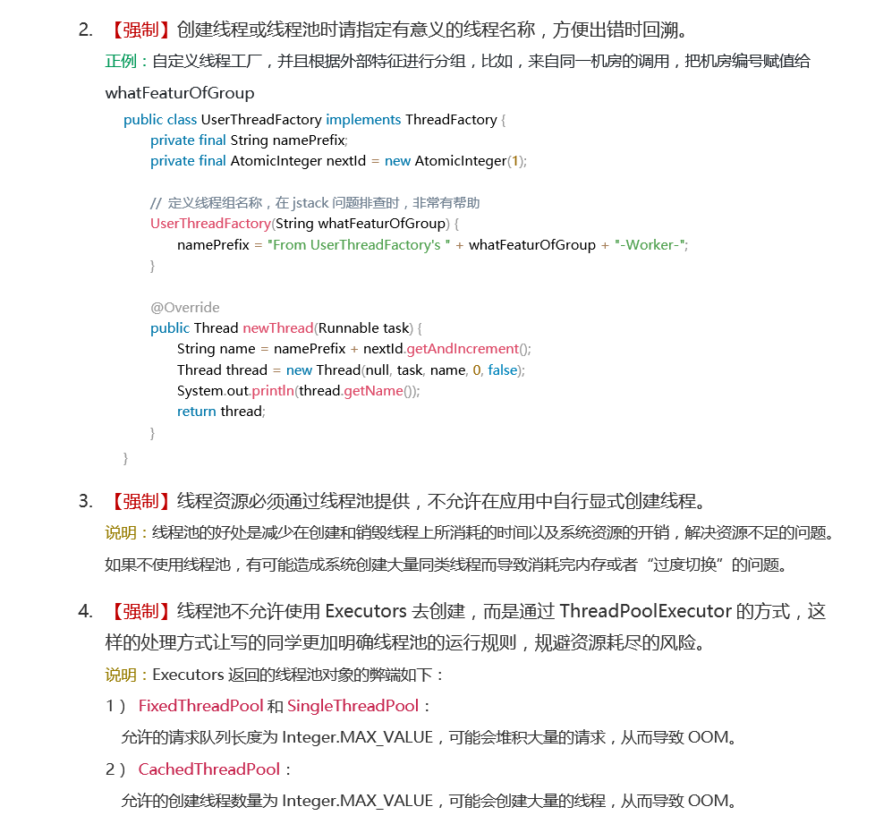

阿里的《Java开发手册》中，并发处理的第三条，**线程资源必须通过线程池提供，不允许在应用中自行显式创建线程**。其实下面的说明也说的很清楚，线程池的好处在于减少在创建和销毁线程上所消耗的时间和系统资源开销。其实这类利用了一种“池化”的思想，比如本次说讲述的线程池，数据库连接池、JVM的常量池等，都是一种空间换时间的思想。

那么怎么利用线程池呢？第三条中**不允许通过Executors进行创建，而是通过ThreadPoolExecutor的方式**。那么问题来了，为什么不允许呢？Executors这个工具类提供哪些默认的实现呢？那么到底该怎样使用ThreadPoolExecutor呢？开发手册说这样的处理方式能够让写的同学更加明确线程池的运行规则，那么我们接下来就从源码的分析线程池验证开发手册这样说的规则意义在哪里？

### ThreadPoolExecutor的重要参数

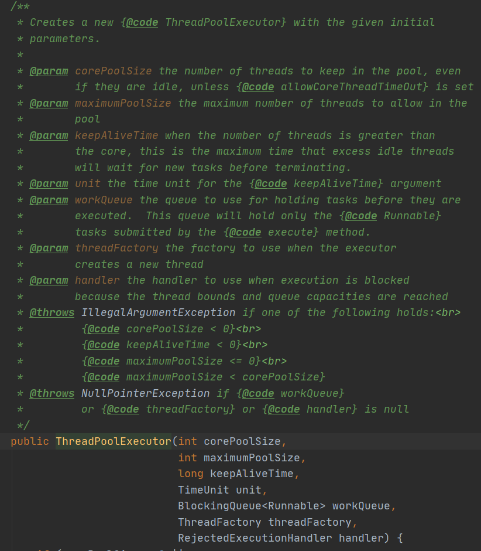

通过构造函数我们可以看出来，线程池一共有7个重要的参数，他们的意义在注释里面也很清楚。

1. **corePoolSize**: 核心线程数，不管创建以后是否空闲，线程池都需要保持的线程数，除非设置了**allowCoreThreadTimeOut**。

   这里我们知道如果想管理核心线程池的数量，可以设置**allowCoreThreadTimeOut**这个参数为true时，核心线程在空闲了keepAliveTime 时候也会被回收。

2. **maximumPoolSize**：线程池中最多可以允许创建的线程个数

3. **keepAliveTime**：线程存活时间。当线程数超过core时，这是最大可以让空闲线程存活的时间。

4. **unit：**线程存活时间的单位。

5. **workQueue**：存放待处理的任务。当线程数超过核心线程数大小后，提交的任务就会被存放在这里。这里要注意，注释里这样写：*This queue will hold only the {@code Runnable} tasks submitted by the {@code execute} method.* 这些Runnable任务只能被**execute**方法执行。

6. **threadFactory**：线程工厂，用来创建线程的工厂。

   上面开发手册第2条要求：创建线程或线程池时请指定有意义的线程名称。这里就是要求我们自己实现线程工厂，定义线程组名称，在jstack问题排查时，非常有帮助。

7. **handler** ：拒绝策略。当队列任务满了之后，工作的线程数也到了maximumPoolSize，这个时候再提交的任务就需要执行拒绝策略。

   具体的拒绝策略有：抛出异常、交还给调用线程来执行、丢弃掉最老的任务、直接丢弃。

   因为我用Springboot项目看的源码，第五种是Tomcat的拒绝策略，我们最后分析下Tomcat的线程池有什么区别。

   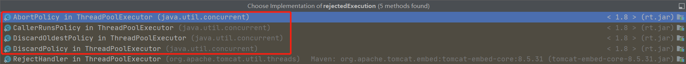

### 线程池执行过程

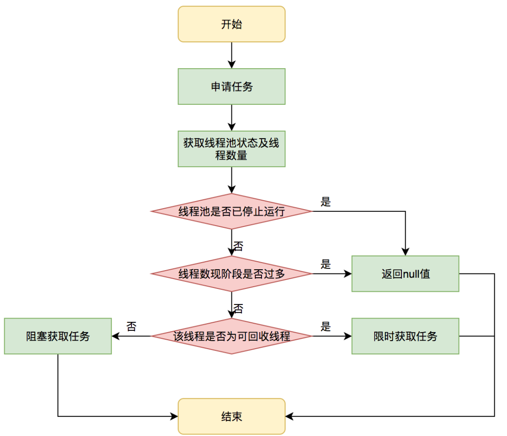

这里借用美团的线程池技术文章里面的一张图。美团其他的技术文章都很优秀，推荐学习。

文字描述就是：当有新任务来临时，判断线程池中活跃的线程数是否小于核心线程数，如果是，则创建线程。这里需要注意的是，**即便有小于核心线程数的线程存活，也是创建新线程，直到数量达到核心线程数**。直到线程数达到核心线程数时，会把任务放入到阻塞队列中。如果阻塞队列也满了之后，则创建小于最大线程数的线程。直到线程数达到最大线程数，如果此时还有任务，则执行拒绝策略。

### 为什么不允许使用Executors创建线程？

回答这个问题，我们先看下有哪些阻塞队列呢？


再瞅瞅Executors有哪些默认的实现？

1. **newFixedThreadPool**固定线程数的线程池。线程数量由用户传入，核心线程数等于最大线程数。阻塞队列使用**LinkedBlockingQueue**。这是一个由链表结构组成的有界队列，默认队列长度为Integer.MAX_VALUE。这意味着不管有多少任务来，都会放到阻塞队列里，**可能会堆积大量的请求，导致OOM**。

```java
public static ExecutorService newFixedThreadPool(int nThreads) {
    return new ThreadPoolExecutor(nThreads, nThreads,
                                  0L, TimeUnit.MILLISECONDS,
                                  new LinkedBlockingQueue<Runnable>());
}
```

2. **newSingleThreadExecutor**单线程线程池。只有一个线程，核心线程数等于最大线程数等于1。阻塞队列同样使用**LinkedBlockingQueue**，**可能会堆积大量的请求，导致OOM**。

```java
public static ExecutorService newSingleThreadExecutor() {
    return new FinalizableDelegatedExecutorService
        (new ThreadPoolExecutor(1, 1,
                                0L, TimeUnit.MILLISECONDS,
                                new LinkedBlockingQueue<Runnable>()));
}
```

3. **newCachedThreadPool**可缓存线程池。核心线程数等于0，最大线程数为Integer.MAX_VALUE。使用SynchronousQueue队列，这是一个不存储元素的队列，意味着来一个任务就生成一个线程处理。**可能会创建大量的线程，导致OOM。**

```java
public static ExecutorService newCachedThreadPool() {
    return new ThreadPoolExecutor(0, Integer.MAX_VALUE,
                                  60L, TimeUnit.SECONDS,
                                  new SynchronousQueue<Runnable>());
}
```

4. **ScheduledThreadPoolExecutor**定时线程池。核心线程数由用户传入，最大线程数为Integer.MAX_VALUE，阻塞队列使用DelayedWorkQueue，这是一个无界队列。

```java
public ScheduledThreadPoolExecutor(int corePoolSize) {
    super(corePoolSize, Integer.MAX_VALUE, 0, NANOSECONDS,
          new DelayedWorkQueue());
}
```

还有就是**NewSingleThreadScheduledExecutor** 单线程用于定时周期性执行任务，**NewWorkStealingPool** 创建一个工作窃取。

### ThreadPoolExecutor分析

#### ctl和线程状态

先看下ThreadPoolExecutor的几个关键属性。

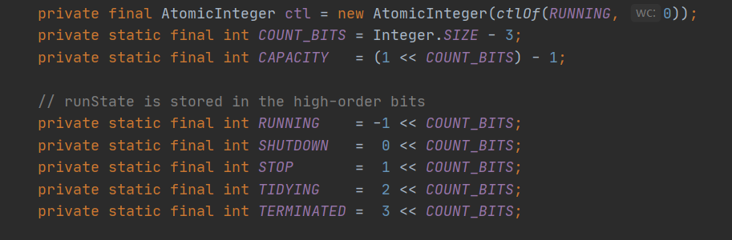

**ctl**是描述线程池运行状态和线程池中有效线程数量的一个字段。包括两部分数据：线程池的运行状态（runState）、线程池内有效线程数量（workerCount）。可以看出，ctl 高3位保存runState，低29位保存workerCount。

线程池运行状态主要有五种：

1. **RUNNING**： 能够接受提交的任务，也能处理阻塞队列中的任务。
2. **SHUTDOWN**： 关闭状态，不在接受新提交的任务，但继续处理阻塞队列里面的任务。在线程池处于RUNNING状态时，调用**shutdown()**方法会是线程池进入该状态。
3. **STOP**： 不能接受新任务，也不处理队列中的任务，同时会中断正在处理任务的线程。在线程池处于RUNNING或者SHUTDOWN状态时，调用**shutdownNow()**方法时，会是线程池进入该状态。
4. **TIDYING**： 如果所有任务都终止了，workerCount 有效线程数为0，线程池进入该状态后调用terminated() 方法进入TERMINATED 状态。
5. **TERMINATED**： 在terminated() 方法执行完后进入该状态，默认terminated()方法中什么也没有做。

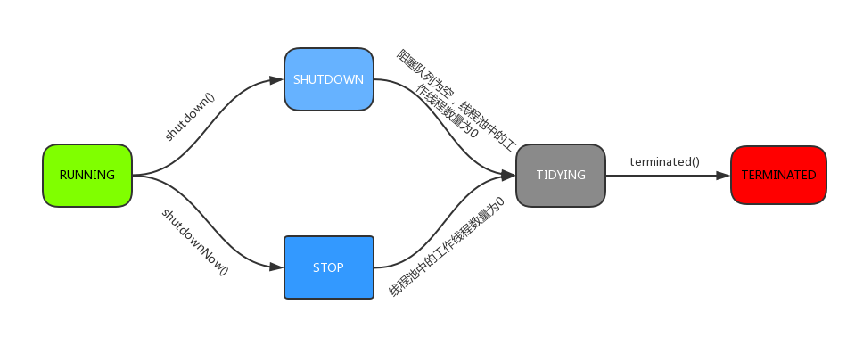

### Worker类

Worker类的主要功能是：每一个**线程**都会被包装为**Worker对象**。可以看到Worker类继承AQS，并实现了Runnable接口。

实现Runnable接口，因此一个worker对象启动之后就会调用worker类中的run方法。

继承AQS，则可以通过AQS来实现独占锁的功能。通过tryAcquire方法，可以看出worker是不允许重入的。只要请不到锁就会返回false。不允许 重入的重要特点是：通过是否能获取锁，可以判断线程是否空闲以及是否可以被中断。

具体Worker类的运行我们 接下来看如何使用的。

```java
private final class Worker
    extends AbstractQueuedSynchronizer
    implements Runnable
{
    /**
     * This class will never be serialized, but we provide a
     * serialVersionUID to suppress a javac warning.
     */
    private static final long serialVersionUID = 6138294804551838833L;

    /** Thread this worker is running in.  Null if factory fails. */
    final Thread thread;
    /** Initial task to run.  Possibly null. */
    Runnable firstTask;
    /** Per-thread task counter */
    volatile long completedTasks;

    /**
     * Creates with given first task and thread from ThreadFactory.
     * @param firstTask the first task (null if none)
     */
    Worker(Runnable firstTask) {
        setState(-1); // inhibit interrupts until runWorker
        this.firstTask = firstTask;
        this.thread = getThreadFactory().newThread(this);
    }

    /** Delegates main run loop to outer runWorker  */
    public void run() {
        runWorker(this);
    }

    // Lock methods
    //
    // The value 0 represents the unlocked state.
    // The value 1 represents the locked state.

    protected boolean isHeldExclusively() {
        return getState() != 0;
    }

    protected boolean tryAcquire(int unused) {
        if (compareAndSetState(0, 1)) {
            setExclusiveOwnerThread(Thread.currentThread());
            return true;
        }
        return false;
    }

    protected boolean tryRelease(int unused) {
        setExclusiveOwnerThread(null);
        setState(0);
        return true;
    }

    public void lock()        { acquire(1); }
    public boolean tryLock()  { return tryAcquire(1); }
    public void unlock()      { release(1); }
    public boolean isLocked() { return isHeldExclusively(); }

    void interruptIfStarted() {
        Thread t;
        if (getState() >= 0 && (t = thread) != null && !t.isInterrupted()) {
            try {
                t.interrupt();
            } catch (SecurityException ignore) {
            }
        }
    }
}
```

### execute方法

execute()方法用来提交任务。

```java
public void execute(Runnable command) {
    if (command == null)
        throw new NullPointerException();
	//ctl高3位记录线程池状态，低29位记录线程数。
    int c = ctl.get();
    //workerCountOf方法取出低29位的值，表示当前活动的线程数。
    //如果小于核心线程数，则新建一个worker放入线程池中，该worker内包含着任务command。
    if (workerCountOf(c) < corePoolSize) {
        if (addWorker(command, true))
            //添加成功后返回
            return;
        c = ctl.get();
    }
    //如果活动线程数大于核心线程数，则判断如果当前线程池处于运行状态，并且将任务成功加入到阻塞队列中
    //则执行if方法内部
    if (isRunning(c) && workQueue.offer(command)) {
        //重新获取ctl值。
        int recheck = ctl.get();
        //再次判断线程池状态，如果不是运行状态，因为刚刚把任务加入到队列中了，此时需要将任务移除队列
        //同时执行拒绝策略对该任务进行处理，方法返回。
        if (! isRunning(recheck) && remove(command))
            reject(command);
        //如果线程池处于运行状态，则获取线程池中有效线程数，如果有效线程数为0，则执行addworker方法。
        //保证有线程执行。
        //addWorker(null, false);null表示线程池中创建一个线程，但不去执行
        // false，将线程池线程数量上限设置为maximumPoolSize
        else if (workerCountOf(recheck) == 0)
            addWorker(null, false);
    }
    //执行到这里，说明：
    //1.线程池不是Running 2. 是running状态，线程数大于核心线程数，且队列满了
    //然后调用addWorker，第二个参数设置为false,将线程池的线程数量上限设置为maximumPoolSize
    else if (!addWorker(command, false))
        reject(command);
}
```

这个方法是线程池执行的入口。如果线程池处于RUNNING状态，则:

1. workerCount < corePoolSize，则addwork创建并启动线程 来执行提交的任务
2. workerCount >= corePoolSize且workQueue.offer(command)，说明阻塞队列未满，则将任务添加到阻塞队列中。
3. 如果workerCount >= corePoolSize && workerCount < maximumPoolSize，则阻塞队列已满，则addwork创建并启动一个线程来执行提交的任务
4. workerCount >= maximumPoolSize且阻塞队列已满，则执行拒绝策略。

下面对addwork方法分析之后，再来看这段逻辑，会理解的更加明白。主要是addwork的两个参数的含义。

### addWorker方法

addwork方法主要是创建一个线程加入到线程池执行。有两个参数，第一个参数Runnable firstTask，用于指定新增的线程执行的第一个任务。core参数为true时，则新增线程时会判断如果当前线程数小于核心线程数。fasle时新增线程前需要判断活动线程数是否小于最大线程数。

```java
private boolean addWorker(Runnable firstTask, boolean core) {
    retry:
    for (;;) {
        int c = ctl.get();
        //获取线程池运行状态
        int rs = runStateOf(c);
		//因为running状态为-1，shutdown状态为0
        //rs >= SHUTDOWN则表示不再接受新任务
        //  !(rs == SHUTDOWN &&firstTask == null &&! workQueue.isEmpty())
        //接着判断以下三个条件，只要有一个不满足，则返回false.
        //1.如果线程池处于shutdown状态，返回false
        //2.firstTask任务为空
        //3.阻塞队列不为空
        if (rs >= SHUTDOWN &&
            ! (rs == SHUTDOWN &&
               firstTask == null &&
               ! workQueue.isEmpty()))
            return false;

        for (;;) {
            //获取线程数
            int wc = workerCountOf(c);
            //如果线程数超过最大数量 （1左移29位减1（29个1））则返回false
            //core为true，则跟corePoolSize比较，为false则跟maximumPoolSize比较
            if (wc >= CAPACITY ||
                wc >= (core ? corePoolSize : maximumPoolSize))
                return false;
            //尝试CAS添加worker，如果成功，则跳出第一个for循环
            if (compareAndIncrementWorkerCount(c))
                break retry;
            //如果添加失败，则重新获取ctl值，判断运行状态，说明状态被改变了，返回第一个for循环继续执行
            c = ctl.get();  // Re-read ctl
            if (runStateOf(c) != rs)
                continue retry;
            // else CAS failed due to workerCount change; retry inner loop
        }
    }

    boolean workerStarted = false;
    boolean workerAdded = false;
    Worker w = null;
    try {
        //程序走到这里，说明尝试增加workerCount成功，则要开始创建线程执行任务了
        //根据firsttask来创建 worker对象。
        w = new Worker(firstTask);
        //worker继承Runnable接口，因此执行 初始化时，会
        //this.thread = getThreadFactory().newThread(this);
        //将自己传进去 ，创建线程。
        final Thread t = w.thread;
        if (t != null) {
            //首先获取锁
            final ReentrantLock mainLock = this.mainLock;
            mainLock.lock();
            try {
                // Recheck while holding lock.
                // Back out on ThreadFactory failure or if
                // shut down before lock acquired.
                int rs = runStateOf(ctl.get());
				//1.rs < SHUTDOWN说明是Running状态
                //2.或者 处于shutdown状态且first为null，向线程池中添加线程。
                //因为处于shutdown状态时，不会添加任务，但是需要执行workQueue中的任务。
                //第二种情况，这里暂时有疑问
                if (rs < SHUTDOWN ||
                    (rs == SHUTDOWN && firstTask == null)) {
                    if (t.isAlive()) // precheck that t is startable
                        throw new IllegalThreadStateException();
                    //将worker添加到workers,workers是一个HashSet。
                    workers.add(w);
                    int s = workers.size();
                    if (s > largestPoolSize)
                        largestPoolSize = s;
                    workerAdded = true;
                }
            } finally {
                mainLock.unlock();
            }
            //如果添加成功，则启动线程。
            if (workerAdded) {
                //启动后，会调用worker类中的run方法。
                t.start();
                workerStarted = true;
            }
        }
    } finally {
        if (! workerStarted)
            addWorkerFailed(w);
    }
    return workerStarted;
}
```

接下来分析线程是如何执行任务的。

### runWorker方法

上面addworker之后，会启动线程，线程会调用worker里面的run方法。

```java
public void run() {
    runWorker(this);
}
```

**beforeExecute**方法和**afterExecute**方法在ThreadPoolExecutor类中是空的，留给子类来实现。这里可以自定义实现，用于记录线程执行前后一些重要信息。

```java
final void runWorker(Worker w) {
    Thread wt = Thread.currentThread();
    //获取第一个任务
    Runnable task = w.firstTask;
    //取出后，将firstTask置为null
    w.firstTask = null;
    //允许中断
    w.unlock(); // allow interrupts
    //是否因为异常退出循环
    boolean completedAbruptly = true;
    try {
        //如果task为空，则getTask来获取任务。
        while (task != null || (task = getTask()) != null) {
            w.lock();
            // If pool is stopping, ensure thread is interrupted;
            //翻译：如果线程池正在停止，则保证线程是中断状态。
            // if not, ensure thread is not interrupted.  This
            // requires a recheck in second case to deal with
            // shutdownNow race while clearing interrupt
            //翻译： 如果线程池不是正在停止，要保证线程不是中断状态
            if ((runStateAtLeast(ctl.get(), STOP) ||
                 (Thread.interrupted() &&
                  runStateAtLeast(ctl.get(), STOP))) &&
                !wt.isInterrupted())
                wt.interrupt();
            try {
                beforeExecute(wt, task);
                Throwable thrown = null;
                try {
                    //执行任务
                    task.run();
                } catch (RuntimeException x) {
                    thrown = x; throw x;
                } catch (Error x) {
                    thrown = x; throw x;
                } catch (Throwable x) {
                    thrown = x; throw new Error(x);
                } finally {
                    afterExecute(task, thrown);
                }
            } finally {
                task = null;
                w.completedTasks++;
                w.unlock();
            }
        }
        completedAbruptly = false;
    } finally {
        //如果取不到任务，则执行
        processWorkerExit(w, completedAbruptly);
    }
}
```

更新：当看到AQS时，发现了一个隐藏的知识点，没有关注到。

```java
if ((runStateAtLeast(ctl.get(), STOP) || (Thread.interrupted() &&  runStateAtLeast(ctl.get(), STOP))) &&
    !wt.isInterrupted())
    wt.interrupt();
```

注释里写到：如果线程池正在停止，则保证线程是中断状态。如果线程池不是正在停止，要保证线程不是中断状态，我们看是如何做到的.

>1.(runStateAtLeast(ctl.get(), STOP) || ( Thread.interrupted() && runStateAtLeast(ctl.get(), STOP)) )

>2.!wt.isInterrupted()

1. 如果(runStateAtLeast(ctl.get(), STOP)为true，说明**线程池处于stop状态**，那么1为true，如果wt不是中断状态，则2条件为true，则执行 wt.interrupt()，从而将线程状态置为中断。

2. 如果(runStateAtLeast(ctl.get(), STOP)为false，会执行 ***( Thread.interrupted() && runStateAtLeast(ctl.get(), STOP))*** ，说明**线程池不是stop状态**，那么Thread.interrupted()判断是否中断后，会**复位中断状态**。如果线程为中断状态，那么 ***( Thread.interrupted() && runStateAtLeast(ctl.get(), STOP))*** 会为true，但是执行完这句话之后，线程状态就变成了非中断状态，所以此时 !wt.isInterrupted()就是true，那么整体条件就是false &&  true == false，就不会执行 wt.interrupt();

以上，从而满足了注释里面要求的 **如果线程池正在停止，则保证线程是中断状态；如果线程池不是正在停止，要保证线程不是中断状态**。

### getTask方法

getTask方法是从队列中获取任务。

```java
private Runnable getTask() {
    //用来标记上一次从阻塞队列中获取任务是否超时
    boolean timedOut = false; // Did the last poll() time out?

    for (;;) {
        int c = ctl.get();
        int rs = runStateOf(c);

        // 如果rs>=SHUTDOWN，则判断是否>=stop，线程池是否在stop，以及队列是否为空
        //是的话就将线程数减少1，并返回空。
        if (rs >= SHUTDOWN && (rs >= STOP || workQueue.isEmpty())) {
            decrementWorkerCount();
            return null;
        }

        int wc = workerCountOf(c);

        // timed字段用来判断是否需要超时控制。allowCoreThreadTimeOut是用来设置核心线//程数的线程是否允许超时。wc > corePoolSize,说明线程数大于核心线程数
        //超过核心线程数的线程需要进行控制。
        boolean timed = allowCoreThreadTimeOut || wc > corePoolSize;

        //如果wc > maximumPoolSize有可能重设了maximumPoolSize
        //timed && timedOut 表明当前操作需要控制超时线程并且上次队列里去任务超时了
        //那么就需要将线程数减1.失败的话则重试。
        if ((wc > maximumPoolSize || (timed && timedOut))
            && (wc > 1 || workQueue.isEmpty())) {
            if (compareAndDecrementWorkerCount(c))
                return null;
            continue;
        }
        //通过timed为true，说明需要进行超时控制。则从队列poll方法，如果keepAliveTime时间内没有取到任务，则返回null,
        //否则通过take方法，如果队列为空，则阻塞。
        try {
            Runnable r = timed ?
                workQueue.poll(keepAliveTime, TimeUnit.NANOSECONDS) :
                workQueue.take();
            if (r != null)
                return r;
            //r == null，说明已经超时，设置为ture,下次循环会返回null。
            timedOut = true;
        } catch (InterruptedException retry) {
            timedOut = false;
        }
    }
}
```
这个方法就是线程池管理线程的核心方法。
boolean timed = allowCoreThreadTimeOut || wc > corePoolSize为false。
Runnable r = timed ?workQueue.poll(keepAliveTime, TimeUnit.NANOSECONDS) :
                workQueue.take();
如果当前线程数小于核心线程数，则timed会是false，会执行take方法，如果队列为空，则一直阻塞，保证了核心线程数的线程不会被销毁。
如果当前线程数大于核心线程数，小于最大线程数，则timed为ture，会执行workQueue.poll(keepAliveTime, TimeUnit.NANOSECONDS)方法，指定时间内取不到任务，则设timedOut为true，说明队列里面没有任务了，不需要这么多线程来执行任务。下次进入循环时，
> if ((wc > maximumPoolSize || (timed && timedOut))
>             && (wc > 1 || workQueue.isEmpty())) {
>             if (compareAndDecrementWorkerCount(c))
>                 return null;
>             continue;
>         }

这个判断会为true，进入if内，将线程数减一，随后返回null。runWorker方法会跳出while循环，最后执行 processWorkerExit(w, completedAbruptly);从workers中去掉该worker，随后由JVM回收。
行云流水，一气呵成，妙啊。

### processWorkerExit方法

```java
    private void processWorkerExit(Worker w, boolean completedAbruptly) {
        //如果completedAbruptly为true,则说明线程出现了异常，则需要将workcount减1
        //如果为false，说明没有出现异常，只是取不到任务了，前面方法已经减过了，这里就
        //不需要了
        if (completedAbruptly) // If abrupt, then workerCount wasn't adjusted
            decrementWorkerCount();
        //加锁
        final ReentrantLock mainLock = this.mainLock;
        mainLock.lock();
        try {
            //完成数+1
            completedTaskCount += w.completedTasks;
            //从workers中取出，也就是去掉一个线程，由JVM自动回收。
            workers.remove(w);
        } finally {
            mainLock.unlock();
        }
        // 根据线程池状态进行判断是否结束线程池
        tryTerminate();
     
        int c = ctl.get();
        //如果线程池处于RUNNING或SHUTDOWN状态时
        if (runStateLessThan(c, STOP)) {
            //如果不是异常结束的
            if (!completedAbruptly) {
                //如果allowCoreThreadTimeOut=true，并且等待队列有任务，至少保留一个worker；
                int min = allowCoreThreadTimeOut ? 0 : corePoolSize;
                if (min == 0 && ! workQueue.isEmpty())
                    min = 1;
                //如果allowCoreThreadTimeOut=false，workerCount不少于corePoolSize
                if (workerCountOf(c) >= min)
                    return; // replacement not needed
            }，则直接新增个线程。
            //如果不是异常结束的，则直接新增个线程。
            addWorker(null, false);
        }
    }
```
以上就是线程池从执行到结束的所有方法。我们可以总结出线程池的声明周期了。从execute()执行任务开始，会addwork新增worker，worker执行之后，会调用runWorker方法。runworker会不断执行getTask任务执行，直到getTask为null，最后调用processWorkerExit删除线程。

### tryTerminate方法

在执行processWorkerExit方法时，会执行tryTerminate()，这个方法的含义是根据线程池的状态决定是否关闭线程池。

```java
    final void tryTerminate() {
        for (;;) {
            int c = ctl.get();
            //如果线程池正在运行则不用关闭
            //或者 TIDYING或TERMINATED 说明已经没有运行的线程了 也不用关闭
            //或者 处于 SHUTDOWN状态但是队列中任务还没完成，也不用关闭
            if (isRunning(c) ||
                runStateAtLeast(c, TIDYING) ||
                (runStateOf(c) == SHUTDOWN && ! workQueue.isEmpty()))
                return;
            //如果线程池数量不为0，则中断一个空闲的线程，并返回。
            if (workerCountOf(c) != 0) { // Eligible to terminate
                interruptIdleWorkers(ONLY_ONE);
                return;
            }
            // 获取main锁。
            final ReentrantLock mainLock = this.mainLock;
            mainLock.lock();
            try {
                //将状态改为TIDYING，成功则调用terminated()
                if (ctl.compareAndSet(c, ctlOf(TIDYING, 0))) {
                    try {
                        //留给子类实现
                        terminated();
                    } finally {
                        //将状态改为TERMINATED
                        ctl.set(ctlOf(TERMINATED, 0));
                        termination.signalAll();
                    }
                    return;
                }
            } finally {
                mainLock.unlock();
            }
            // else retry on failed CAS
        }
    }
```
这里思考为什么当线程数量不为0时，要中断一个空闲线程呢？
首先，要明确前提条件，当程序走到interruptIdleWorkers(ONLY_ONE)这里，肯定线程池已经是SHUTDOWN状态了，并且任务队列已经处理完毕了。因为在getTask方法中，workQueue.take()时，线程会一直阻塞。线程池中 的线程就无法中断回收，所以这里调用interruptIdleWorkers(ONLY_ONE)将阻塞的线程中断，而阻塞的线程中断后也会执行processWorkerExit--->tryTerminate，这样最终就能把所有线程都给中断回收。妙啊。

这里我们可以总结出线程池如何管理线程的？

线程池关闭的关键就在于一个worker退出之后，会调用 tryTerminate() 方法，将退出的信号传递下去，这样其他的线程才能够被依次处理，最后线程池会变为 TERMINATE 态。

### shutdown方法

```java
    public void shutdown() {
        final ReentrantLock mainLock = this.mainLock;
        mainLock.lock();
        try {
            checkShutdownAccess();
            advanceRunState(SHUTDOWN);
            // 中断空闲线程
            interruptIdleWorkers();
            onShutdown(); // hook for ScheduledThreadPoolExecutor
        } finally {
            mainLock.unlock();
        }
        //上面分析的方法。尝试结束线程池
        tryTerminate();
    }
```


### interruptIdleWorkers方法

nterruptIdleWorkers遍历workers中所有的工作线程，若线程没有被中断,即tryLock成功，就中断该线程。

```java
    private void interruptIdleWorkers(boolean onlyOne) {
        final ReentrantLock mainLock = this.mainLock;
        mainLock.lock();
        try {
            for (Worker w : workers) {
                Thread t = w.thread;
                if (!t.isInterrupted() && w.tryLock()) {
                    try {
                        t.interrupt();
                    } catch (SecurityException ignore) {
                    } finally {
                        w.unlock();
                    }
                }
                if (onlyOne)
                    break;
            }
        } finally {
            mainLock.unlock();
        }
    }
```

到这里我们可以总结为什么worker类要继承AQS，并且在执行任务时要加锁。
在工作线程处理任务时会进行lock，在执行shutdown()方法时，interruptIdleWorkers在进行中断时会使用tryLock来判断该工作线程是否正在处理任务，如果tryLock返回true，说明该工作线程当前未执行任务，这时才可以被中断。
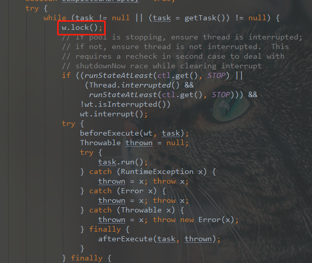

### 线程池在业务中的实践场景

既然线程池这么叼，那么我们应该什么时候去使用线程池呢？不管所有技术方案，只有适合才是最好的。并不是说技术高深的，肯定就是最叼的。
根据[美团](https://tech.meituan.com/2020/04/02/java-pooling-pratice-in-meituan.html)的方案文章中，大概有这两种分类。

1. 快速响应用户请求
   用户发起请求，需要以最快的时间返回响应。比如用户查看商品信息，我们可以将商品的信息以不同维度如详情、库存、图片等整合之后返回。这种情况下我们可以将请求调用封装成任务并行执行，缩短总体响应时间。但是这种情况下不应该设置队列去缓冲并发任务，应该调高corePoolSize和maxPoolSize尽可能创造多的线程快速执行任务。

2.  快速处理批量任务
    离线的大量计算任务，需要快速执行。比如说报表，这种场景不需要响应速度有多快，而是关注如何使用有线的资源，尽可能在单位时间内处理更多的任务。也就是吞吐量优先，所以应该设置队列去缓冲任务。

### 如何合理设置线程池参数？

怎么设置线程池参数，这个并没有一个固定的答案。网上大多数方案是按照IO密集型还是CPU密集型区分。
《Java并发编程实战》对于CPU密集型建议是处理器核心数+1。对于IO密集型则是列出一个公式。
但是不同系统有不同的现实情况，一概而论肯定不是最好的方案。
美团技术团队给出的方案是动态调整线程参数。毕竟世界是动态发展的，少了就加，多了就减，动态调整，才能达到和谐，妙啊。

动态设置线程池参数，我们主要关注的是核心线程数corePoolSize、最大线程数maximumPoolSize、以及队列容量。

而JDK也提供了相应的方法：**setCorePoolSize**(int corePoolSize)方法可以动态调整核心线程数。
```java
    public void setCorePoolSize(int corePoolSize) {
        if (corePoolSize < 0)
            throw new IllegalArgumentException();
        //计算设置的值与当前的值的差值
        int delta = corePoolSize - this.corePoolSize;
        this.corePoolSize = corePoolSize;
        //如果当前活跃的线程数大于所要设置的数，则
        if (workerCountOf(ctl.get()) > corePoolSize)
            //尝试中断空闲的线程。
            interruptIdleWorkers();
        else if (delta > 0) {
            // We don't really know how many new threads are "needed".
            // As a heuristic, prestart enough new workers (up to new
            // core size) to handle the current number of tasks in
            // queue, but stop if queue becomes empty while doing so.
            //上面这段翻译过来就是，不知道到底有多少新的线程是需要的，那么预测一下，就先
            //预先启动足够的线程（接近新的核心线程数）去处理当前队列里面的任务。
            int k = Math.min(delta, workQueue.size());
            while (k-- > 0 && addWorker(null, true)) {
                if (workQueue.isEmpty())
                    break;
            }
        }
    }
```

同理最大线程数也是可以设置的

```java
public void setMaximumPoolSize(int maximumPoolSize) {
    if (maximumPoolSize <= 0 || maximumPoolSize < corePoolSize)
        throw new IllegalArgumentException();
    this.maximumPoolSize = maximumPoolSize;
    //如果线程数大于新设置的最大线程数，则中断空闲的线程。
    if (workerCountOf(ctl.get()) > maximumPoolSize)
        interruptIdleWorkers();
}
```

但是队列的长度我们是无法设置的，JDK并没有内置这个方法，但是我们可以自定义一个队列，然后提供设置capacity的方法。美团也的确是这么做的。

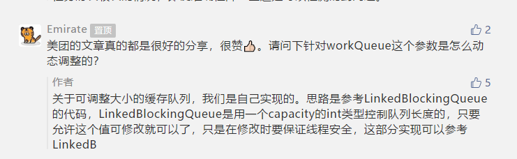

然而，要想使线程池动态化并且健壮性强的话，光支持动态调参，是不够的。配套的应该还有

1. 任务监控，能够监控线程池任务执行情况、最大任务执行时间、平均执行时间等等
2. 负载告警，当线程池队列中任务积压到一定值时能够通知到运维。线程池定义了“活跃度”这个概念，来让用户在发生Reject异常之前能够感知线程池负载问题，线程池活跃度计算公式为：线程池活跃度 = activeCount/maximumPoolSize。这个公式代表当活跃线程数趋向于maximumPoolSize的时候，代表线程负载趋高。
3. 操作监控，创建、修改和删除线程池都要有通知机制
4. 操作日志
5. 权限校验等，并不是所有人都能够改线程池参数。

总之，美团这篇文章，还是给我们提供了很好的思路。并且我们在业务中也是这么实现的，虽然监控还不够到位，但是对于处理报表等相关复杂业务也是给了隐藏入口能够动态调参。

### 其他框架线程池如何实现？

对于之前的文章，我最后都喜欢归纳一下相关知识在其他地方的扩展点，线程池这篇也不例外，让我们瞅瞅其他框架是如何对实现自定义线程池的。这里以Dubbo/Tomcat/Spring为例子，这个也是手边最常用的框架。

#### Tomcat

我们可以看到tomcat下server.xml里面是可以配置线程池的。

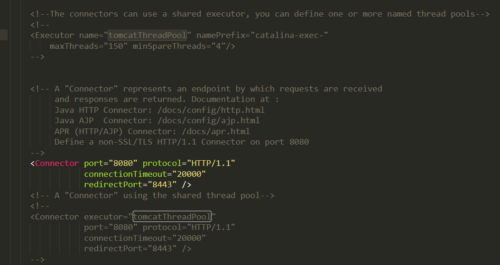

具体参数含义是

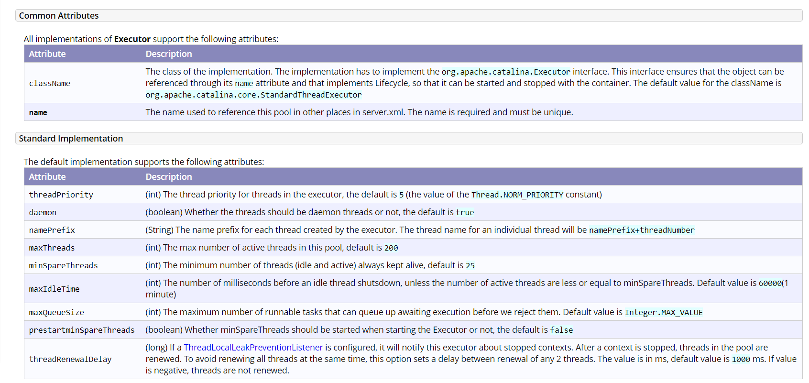

maxThreads，线程池最大 的线程数量，默认200。

minSpareThreads：永远活动的线程数量，默认25。

className：默认实现是 org.apache.catalina.core.StandardThreadExecutor

我们从代码里面看下默认实现是如何构造线程池的。

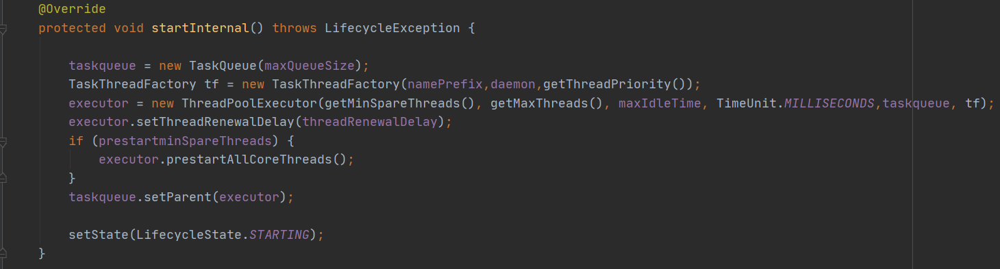

可以看出，TaskQueue继承于LinkedBlockingQueue。而默认队列容量为Integer.MAX_VALUE。

> ```java
> taskqueue = new TaskQueue(maxQueueSize);
> ```

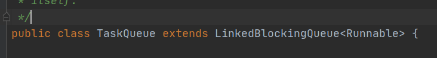

```java
TaskThreadFactory tf = new TaskThreadFactory(namePrefix,daemon,getThreadPriority());
```

然后自定义 实现线程工程，传入参数：

1. namePrefix：名称前缀，默认是“tomcat-exec-”
2. daemon: 是否以守护线程模式启动。默认是true
3. priority: 线程等级，默认为5

```java
executor = new ThreadPoolExecutor(getMinSpareThreads(), getMaxThreads(), maxIdleTime, TimeUnit.MILLISECONDS,taskqueue, tf);
```

然后设置线程池参数，corePoolSize=25，maximumPoolSize=200，keepAliveTime=60000

```java
if (prestartminSpareThreads) {
    executor.prestartAllCoreThreads();
}
```

如果允许预先启动所有核心线程池。但是这个就算设置为false，似乎也没啥子用。因为构造函数时，已经都调用了prestartAllCoreThreads方法了。所以这里不知道是bug还是啥。

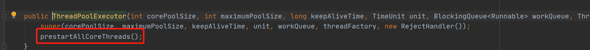

```java
taskqueue.setParent(executor);
```

这里似乎与JDK线程池不太一样。这个参数有啥用？

既然是设置队列的把线程池设置为队列的parent，那我们就进去队列瞅瞅。我们都知道，线程池跟队列打交道的是执行execute时workQueue.offer，getTask时的take或者offer。

那么就看看这个TaskQueue的这几个方法实现如何？

> org.apache.tomcat.util.threads.TaskQueue#offer

```java
@Override
public boolean offer(Runnable o) {
  //如果parten为空，则直接加入
    if (parent==null) return super.offer(o);
    //走到这里，说明运行时线程数肯定大于等于核心线程数，因为都已经往队列里面加数据了
    //所以这里肯定是不成立的，getPoolSize肯定会小于getMaximumPoolSize的
    if (parent.getPoolSize() == parent.getMaximumPoolSize()) return super.offer(o);
  	//getSubmittedCount 获取的是当前已经提交但是还未完成的任务的数量
    //其值是队列中的数量加上正在运行的任务的数量。
    //如果已提交但未完成的数量小于活动线程数，则正常加入，既然有空闲的线程，那么就直接加入队列
    if (parent.getSubmittedCount()<=(parent.getPoolSize())) return super.offer(o);
   //如果运行中的线程小于最大线程数，就返回false。
    //作者注释是：if we have less threads than maximum force creation of a new thread
    //意思是，如果小于最大线程数，则强制创建新的线程！！！！
    if (parent.getPoolSize()<parent.getMaximumPoolSize()) return false;
    //if we reached here, we need to add it to the queue
    return super.offer(o);
}
```

这里看到，只要线程数没有达到最大线程数，则offer返回false。那就直接走到了最后一个if，addWorker了。

由此可以得出，Tomcat处理大多数是IO密集型任务，为了让任务尽快完成，**Tomcat的线程池一直增加线程，直到最大线程数，然后才放入队列。**

只能一个字形容，吊~！

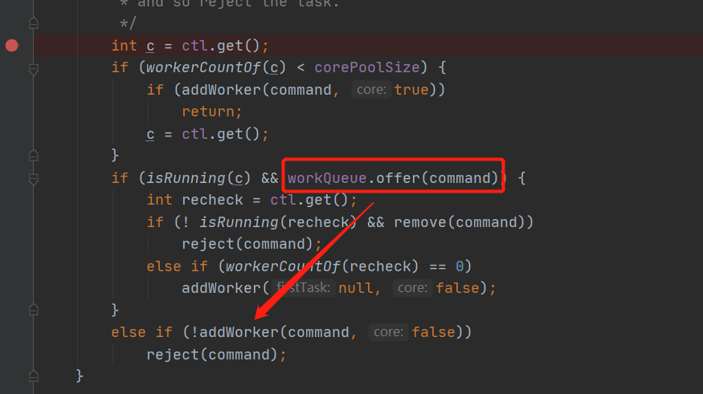

#### Dubbo

Dubbo中的线程池也是这个思想。如果当前线程池数小于最大线程数时，不是加入队列，而是新增线程去执行任务。

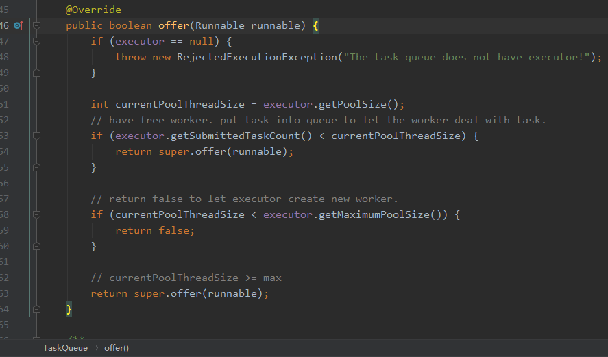

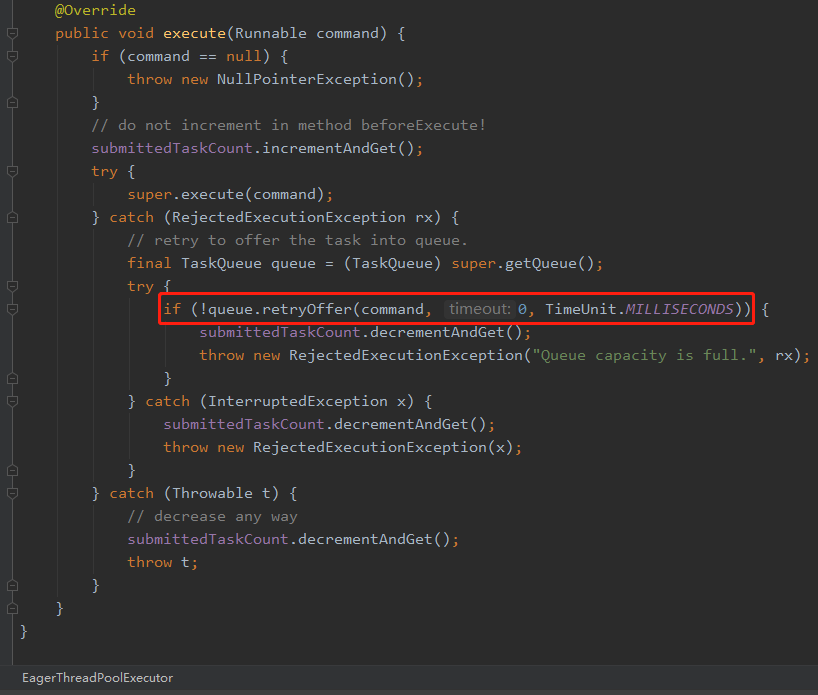

但是Dubbo不同的是，如果线程数达到最大线程数后，队列也满了，那么要执行拒绝策略，但是再拒绝策略前再重试一下，再次offer一下。

#### Spring

ThreadPoolTaskExecutor是Spring 提供的线程池，可以作为Bean注入到容器中，同时增加了 submitListenable 方法，该方法返回 ListenableFuture 接口对象，增加了线程执行完毕后成功和失败的回调方法。从而避免了 Future 需要以阻塞的方式调用 get，然后再执行成功和失败的方法。带来的好处就是异步，不需要阻塞当前线程，从而可以提高系统的吞吐量。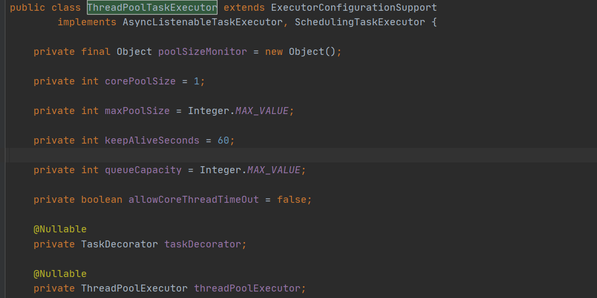


### 总结

线程池先学到这了，还有很多没有提到，先歇歇，下次下次~~~学无止境！


>参考列表
>
>1. http://www.ideabuffer.cn/2017/04/04/%E6%B7%B1%E5%85%A5%E7%90%86%E8%A7%A3Java%E7%BA%BF%E7%A8%8B%E6%B1%A0%EF%BC%9AThreadPoolExecutor/
>2. https://mp.weixin.qq.com/s?__biz=MzIxNTQ4MzE1NA==&mid=2247483741&idx=1&sn=238fc933c3b9b19ab1754b23283ac6fd&chksm=9796d720a0e15e364f4105c29de606e7329760a41607136a722dc97bb177f9362aeacd92f762&scene=21#wechat_redirect
>3. https://mp.weixin.qq.com/s?__biz=MzIxNTQ4MzE1NA==&mid=2247485707&idx=1&sn=237055cf8fe1c2674040a5b1cd65f1f5&chksm=9796df76a0e15660547f649d3ed71e2b648d0c311b73d96814a2b2c1a79b7c06dcc7d0cae1a6&scene=126&sessionid=1587805357&key=8789ad4c0cbeb143d447f685d4f03e5d963a1723f62ac35c68e4aebce994297a2f8f2ea78afd290e36589fae177b5713bdab58259ef6c1fe01e6aeb06d3a9884428695bfd0af6334b2c122f6b5f97841&ascene=1&uin=MzUzODgzMzE1&devicetype=Windows+10&version=62090045&lang=zh_CN&exportkey=AcZGDJYk8ivvrIjje38wVHA%3D&pass_ticket=AOmyib5g8q3bhsRCyHhHt2b013En%2F%2Futtoo0Ibup4qcr73qHE9jUkYG8Mkgpb3Nq
>4. http://www.ideabuffer.cn/2017/04/04/%E6%B7%B1%E5%85%A5%E7%90%86%E8%A7%A3Java%E7%BA%BF%E7%A8%8B%E6%B1%A0%EF%BC%9AThreadPoolExecutor/
>5. https://mp.weixin.qq.com/s?__biz=MjM5NjQ5MTI5OA==&mid=2651751537&idx=1&sn=c50a434302cc06797828782970da190e&chksm=bd125d3c8a65d42aaf58999c89b6a4749f092441335f3c96067d2d361b9af69ad4ff1b73504c&scene=21#wechat_redirect

