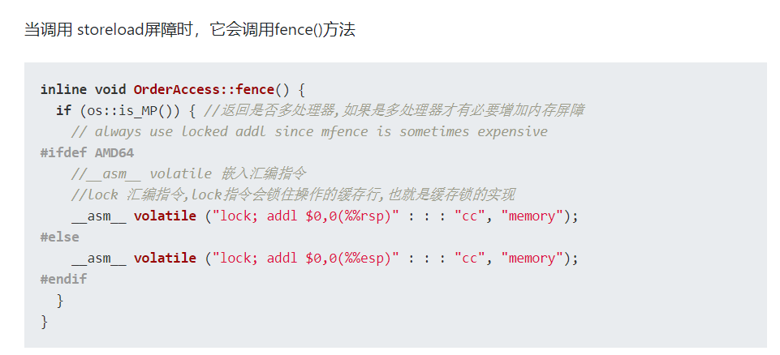
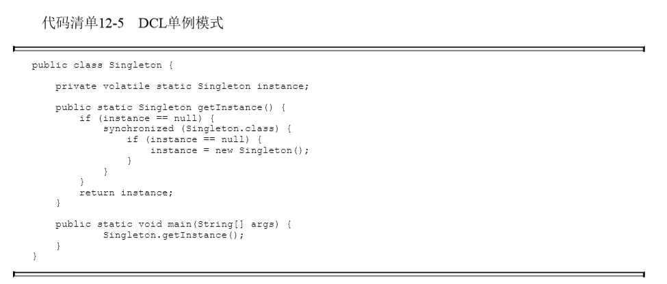

上面介绍了[Java内存模型](https://blog.yzylcc.top/2020/01/18/volatile/)，对于我们接下来分析volatile关键字有了理论基础。

<!-- more -->

## volatile作用

关键字volatile可以说是Java虚拟机提供的最轻量级的同步机制。volatile关键字可以使变量具有：

1. 保证此变量对所有线程**可见性**。这里的可见性是指当一条线程修改了这个变量的值 ，新值对于其他线程来讲是可以立即获知的。
2. **禁止指令重排序优化**，普通变量仅会保证该方法的执行过程中所有依赖赋值结果的地方能获取到正确的结果，不能保证变量赋值操作的顺序与程序代码中的执行顺序一致。

因此可以看出，对于Java内存模型的三个特性，volatile只能保证可见性和有序性，而不能保证原子性。下面我们从源码角度分析volatile。

## volatile源码分析

通过查看字节码文件，发现被volatile修饰的变量，在java字节码中，会多了一个ACC_VOLATILE的flag，因此对堆Hotspot源码无能为力，[这篇文章](https://segmentfault.com/a/1190000017255405#item-7)较为详细的从Hotspot源码角度讲述了volatile的原理。

总结来说就是：通过volatile修饰的变量，赋值后多执行了一个“**lock addl$0x0，(%esp)**”的操作，这个操作的作用是相当于一个**内存屏障**。内存屏障的作用是指令重排序时不能把后面的指令重排序到内存屏障之前的位置。

并且我们在上面提到的那篇文章中看到，只有一个处理器时，是不需要内存屏障的；如果是多处理其访问一块内存，就需要内存屏障来保证一致性了。

这个lock执行的作用是将本处理器的缓存写入内存，该写入动作也会引起别的处理器或者别的内核无效化（Invalidate）其缓存，这种操作相当于对缓存中的变量做了一次上篇Java内存模型中提到的“store和write”操作，所以这样一个指令，可以让前面volatile变量的修改对其他处理器立即可见。

那么是如何做到**禁止指令重排序呢**？从硬件架构上来说，指令重排序是指处理器采用了允许将多条指令不按程序规定的顺序分开发送给各个相应的电路单元进行处理。但并不是说指令任意排序，而是必须正确处理指令依赖情况保障程序能够得到正确的执行结果。所以在同一个处理器中，**重排序过的代码看起来依然有序的**。我个人理解为 指令位置物理上可能无序，但是在逻辑上是有序的。因此“**lock addl$0x0，(%esp)**”这个指令把修改同步到内存，意味着所有之前的操作都已经执行完毕，所以便形成了“指令重排序无法越过内存屏障”的效果，也就是实现了有序性。

JVM层面一般有四种内存屏障，不同硬件可能有不同的实现。JMM对于volatile采用保守策略，要求：

1. 在每个volatile写操作前插入StoreStore屏障
2. 在每个volatile写操作后插入StoreLoad屏障
3. 在每个volatile读操作后面插入一个LoadLoad屏障
4. 在每个volatile读操作后面插入一个LoadStore屏障。

## volatile案例

**Double Check Lock**双锁检测的单例代码：

如果instance没有被volatile修饰，我们知道对象创建过程实例化一个对象一般有三个步骤

1. 分配内存空间
2. 初始化对象
3. 将内存空间的地址赋值给对应的引用。

但是由于重排序的原因，步骤2 3 可能会发生重排序，所以会导致singleton此时只是个半成品，还没有初始化，所以第二个if(instance == null ) 会失效，singleton仅仅是个地址而已。

所以用volatile修饰过后，步骤2 3则不会发生重排序，因此也就没有问题。

## 总结

所以总结，volatile主要能够保证可见性和有序性，但是对于原子性是无法保证的，我们只能通过JUC下的锁或者synchronized关键字来实现。

> 参考列表
>
> 1. https://segmentfault.com/a/1190000017255405#item-7