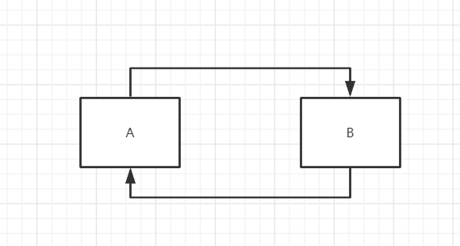
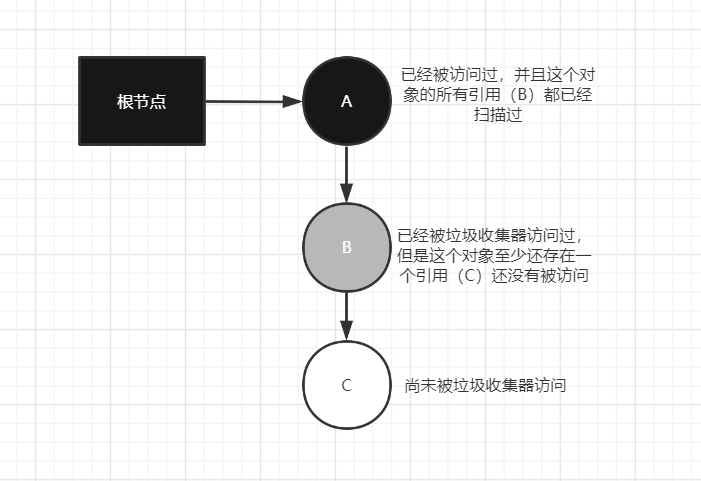
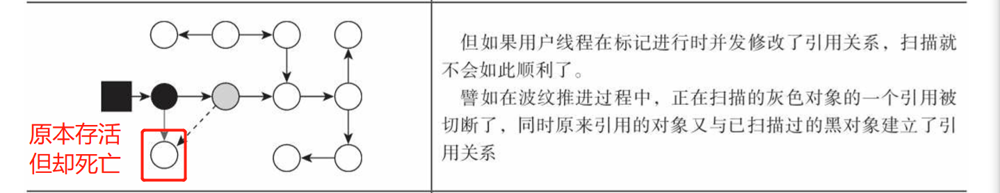
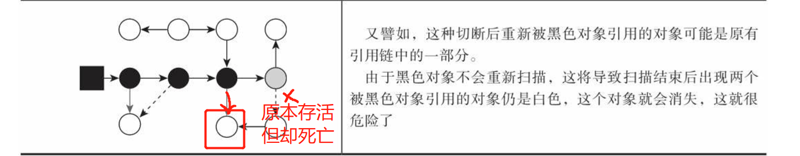

之前在分析volatile关键字的时候，了解过JVM的内存模型。现在我们系统来学习一下JVM相关的知识，然后整理一下工作中JVM调优的实际经验，作为记录。这篇内容我们主要来学习垃圾回收相关算法，我们换个角度，以问题的形式来进行。

go fight!!! 

<!-- more -->

## JVM怎么判断哪些对象应该回收？

### 引用计数法

在对象中添加一个引用计数器，每当一个地方引用它时，计数器加1；当引用失效时，计数器值减1；当计数器为0时，代表对象不再使用。但是引用计数器最大的问题是，不能解决**循环依赖**的问题。

这里A B都可以被回收，但是因为互相引用，导致他们各自计数器为1，不能被回收。

### 可达性分析算法

通过一系列称为'GC Roots‘ 的根对象作为起始节点集，从根节点开始，根据引用关系向下搜索，搜索过程所走过的路称为引用链，如果某个对象到GC Roots间没有任何引用链相连，则证明此对象是不可能被使用的。

## 那什么对象可以称为GC Roots?

1. **栈帧中本地变量表引用的对象**，比如方法堆栈中使用到的参数、局部变量、临时变量等。
2. **方法区中类静态属性引用的对象**，比如类中引用类型静态变量。
3. **方法区中常量引用的对象**，例如字符串常量池中的引用。
4. **本地方法栈中引用的对象**。
5. **虚拟机内部的引用**
6. **所有被同步锁持有的对象**

等等。

## 那既然谈到引用，有几种引用？

1. **强引用**。就是new对象这种引用。
2. **软引用**。还有用，但非必须的对象，只要发生内存溢出，会对软引用的对象进行回收
3. **弱引用**。被弱引用关联的对象只能生存到下次垃圾收集位置。比如 ThreadLocal中的ThreadLocalMap中的value就是弱引用。
4. **虚引用**。

## 被标记为不可达对象，就一定会被回收吗？

可达性分析算法中判定 不可达对象，并不一定会被回收。要经过两次标记才会，才能宣告死亡。

第一次标记是在可达性分析后发现没有与GC Roots相连的引用链。第二次标记是是否有必要执行finalize()方法，如果没有覆盖finalize方法，或者已经执行过了，那么将标记为没有必要执行。

## 有哪些常见的垃圾收集算法？

1. **标记-清除算法**。首先标记出所有需要回收的对象，然后在标记完成之后，统一回收到被标记的对象。但是容易出现空间碎片化的问题。
2. **复制算法**。将内存分为两块容量大小的区域，每次只使用其中一块，当一块内存快用完了，将存活的对象复制到另一块上，再把已经使用过的一块一次性清理掉。缺点就是在于空间浪费。

**新生代**大部分都是使用的**复制算法**。将新生代分为一块较大的Eden区和两块较小的Survivor区。每次分配内存只是用Eden区和其中一块Survivor。发生垃圾收集时，将Eden取和Survivor区存活的对象复制到另一块Survivor空间上。然后直接清理掉Eden区和已经使用过的Survivor区。

HotSpot默认Eden和Survivor大小比例8:1。可以通过**-XX:SurvivorRatio**参数进行修改。

当Survivor不足以容纳一次Minor GC之后存活的对象，则会进行**分配担保**。

**分配担保**：当另一块Survivor不足以容纳上一次新生代收集下来的存活对象，那么这些对象会通过分配担保机制直接进入老年区。但是这个进入也不是一定的，**在Minor GC执行前，会判断老年代的连续空间大于新生代对象总大小或者历次晋升的平均大小，才会进行Minor GC，否则会进行Full GC**。

3. **标记-整理算法**。先标记所有需要回收的对象，然后让所有存活的对象向内存空间一端移动，然后直接清理掉边界以外的内存。

## 出现跨代引用JVM怎么解决？

新生代建立**Remebered Set记忆集**的数据结构，用来避免把整个老年代加入到GC Roots的扫描范围。记忆集是之中抽象的数据结构，具体的实现是叫做 **Card Tbale**的方式实现记忆集。最简单的形式就是一个字节数组。数组中的每一个元素代表的一块特定大小的内存块，这个内存块被称为 Card Page。只要卡页里面有一个对象的字段存在跨代指针，那么就将对应的卡表的数组元素表示为1。在垃圾收集的时候，只要筛选卡表中变脏的元素，就可以轻易得出哪些卡页内存块中包含着跨代指针，把他们加入GC Roots一并扫描。

## 可达性分析是怎样实现的？

**三色标记**算法。把遍历对象图过程中遇到的对象，按照“是否访问过”这个条件标记成三种颜色 ：

1. **白色**。表示对象还没有被垃圾收集器访问过。所以刚开始都是白色的，若在分析结束后，仍然为白色的，即表示对象不可达。
2. **黑色**。表示对象已经被垃圾收集器访问过，且这个对象的所有引用都已经扫描过。
3. **灰色**。表示对象已经被垃圾收集器访问过，但这个对象上至少还存在一个引用没有被扫描过。

因此可以看出，灰色是黑色与白色的中间对象，不可能存在黑色对象直接指向某个白色对象。当标记结束后，就只会存在黑色或者白色的对象。

**但如果用户线程和收集器是并发工作的呢？**即收集器在对象图上标记颜色，同时用户线程在修改引用关系-----即修改对象图的结构。这样会出现两种情况，一种是把**原本消亡的对象错误标记为存活**（即标记时对象还存活，但是标记过后，对象的引用就消失了，此时对象应该是死亡的，但是仍然标记为存活），而是**原本存活的对象被标记为了死亡**（这种情况出现在标记的时候对象死亡，但是标记过后，有其他对象重新引用了该对象，此时对象是存活状态，但是却被标记为了死亡），这种情况是不可接受的。

**那应该怎么解决呢**？

理论上证明，当且仅当一下两个条件同时满足时，会产生对象消失的情况，即即把原本黑色的对象标记为了白色。

1. **赋值器插入了一条或者多条黑色到白色对象的新引用。**
2. **赋值器删除了全部灰色到白色对象的直接或者间接引用。**

我们以这个图分析，正在扫描到灰色对象还没结束，但是切断了灰色对象与白色的联系（条件一），同时建立起黑色与白色关系（条件二），那么此时这个白色就不会被扫描到。这就是原本存活的对象错误的被标记了死亡，造成对象消失的情况。

因此，对于这两个必须同时满足的条件，我们只需要破坏其中一个就可以解决。

1. **增量更新。**

当黑色对象插入新的指向白色对象的引用关系时，就将这个新插入的引用记录下来，等并发扫描结束之后，再将这些记录过的引用关系中的黑色对象为根，重新扫描一次。可以简化的理解为，黑色对象一旦插入了指向白色对象的引用之后，它就变回了灰色对象。

2. **原始快照（SATB）。**

当灰色对象要删除指向白色对象的引用关系时，就将这个要删除的引用记录下来，在并发扫描结束之后，再将这些记录过的引用关系中的灰色对象为根，重新扫描一次。

需要注意的是，以上无论是对引用关系记录的插入还是删除，虚拟机的记录操作都是通过**写屏障**实现的。这里的写屏障不是volatile关键字里面的写屏障，而是可以看做是虚拟机层面的对“引用类型字段赋值”这个动作的AOP切面。在引用对象赋值时会产生一个环形通知，供程序执行额外的动作，也就是说赋值前后都是在写屏障的覆盖范畴里。在赋值前的部分的写屏障叫写前屏障，在赋值后的则叫做写后屏障。

所以，我们可以推导，增量更新用的是写后屏障，即记录了新插入的引用关系。原始快照用的是写前屏障，将所以即将被删除的引用关系的旧引用记录下。

## 总结

以上是垃圾收集器相关理论，我们下面一篇文章进入具体的垃圾收集器来对这些理论进行巩固。

学而不止，学无止境 ，老天会善待每一个努力的人。

>参考列表：
>
>1.《深入理解Java虚拟机》 第三版 周志明