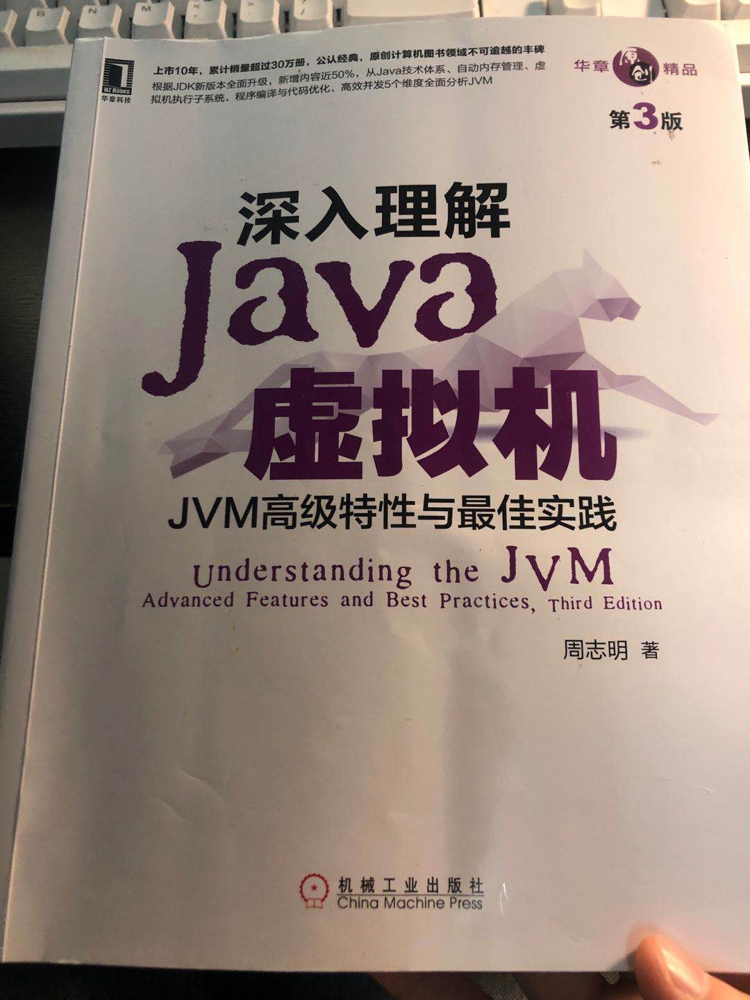

上一篇讲了Java垃圾相关的理论，我们这一篇进入具体的垃圾收集器。

学习不止，努力不停~~~

<!-- more -->

## 介绍你知道的垃圾收集器

上图就是目前能常见并且足够成熟的垃圾收集器了。我们从最经典的Serial开始。

### Serial收集器

这是一个单线程工作的收集器，它的单线程不仅仅是只使用一个处理器或一条线程去完成垃圾收集工作，更重要的是**强调它在进行垃圾收集时，必须暂停其他工作线程，直到它收集结束**。它采用复制算法，可以与Serial Old 或者 CMS 配合使用。 

### ParNew收集器

ParNew收集器实际上是Serial收集器的多线程版本，使用多条线程进行垃圾收集。同样使用复制算法，并且是除了Serial，唯一可以与CMS收集器配合使用的收集器。

### Parallel Scavenge收集器

Parallel Scavenge收集也是一款新生代收集器，同样是基于复制算法实现的收集器，也是能够并行手机的多线程收集器。与其他收集器不同的是，Parallel Scavenge收集器的关注点不同，CMS等收集器的关注点尽可能地缩短垃圾收集时用户线程的停顿时间，而Parallel Scavenge收集器的目标则是**达到一个可控制的吞吐量**。经常被称为“吞吐量优先收集器”，尽力保证内存回收花费的时间不超过用户的设置值，并且可以设置自适应调节的参数。

### Serial Old收集器

Serial Old是Serial收集器的老年代版本，它同样是一个单线程收集器，使用**标记-整理**的算法。作为CMS收集器发生失败时的后备预案，在 并发收集发生Concurrent Mode Failure时使用。

### Parallel Old收集器

Parallel Old是Parallel Scavenge收集器的老年代版本，支持多线程并发收集，基于**标记-整理**算法。因此，注重吞吐量或者处理器资源比较稀缺的场合，可以使用Parallel Scavenge + Parallel Old收集器组合。

### CMS收集器

CMS收集器是一种以获取最短回收停顿时间为目标的收集器。CMS是基于**标记-清除**算法实现的。运行过程分为四个步骤：

1. 初始标记

2. 并发标记

3. 重新标记

4. 并发清除

初始标记、重新标记需要STW。

初始标记仅仅是标记一下GC Roots能直接关联到的对象，速度很快。

并发标记阶段是从GC Roots的直接关联对象开始遍历整个对象图的过程，这个过程耗时较长，但是不需要停顿用户线程，可以与垃圾收集线程一起并发运行。

重新标记阶段则是为了修正并发标记期间，因为用户程序继续运作而导致标记产生变动的那一部分对象的标记记录，采用**增量更新**方式，这个阶段的停顿时间通常会比初始标记阶段稍长一些，但也远比并发标记阶段时间短。

最后是并发清除阶段，清理删除掉标记阶段判断已经死亡的对象，由于不需要移动存活对象，因此，也可以与用户线程同时并发执行。

由于整个过程中最耗时的并发标记和并发清除阶段都可以与用户线程一起工作，因此总体上CMS的内存回收过程是与用于新城一起并发执行。

但是，CMS也存在三个明显的缺点：

1. **CMS收集器对处理器资源非常敏感**，因为并发阶段，总会因为占用了一部分线程而导致程序变慢。CMS默认启动的回收线程数是（处理器核心数量+3）/4，即如果处理器核心数在四个或以上，并发回收时垃圾收集器线程只占用不超过25%的处理器运算资源。但是处理器核心不足四个时，CMS对用户程序的影响就可能变得非常大。
2. **因为“浮动垃圾”可能出现“Concurrent Mode Failure”失败而导致另一次完全STW的Full GC的产生**。浮动垃圾的出现是因为并发标记和并发清理阶段用户程序还在运行，这段时间的产生的垃圾出现在标记过程结束以后，CMS无法集中收集，只能等待下次垃圾收集时再清理。同时，垃圾收集阶段还需要预留足够的内存空间供用户线程使用，因此CMS不能等老年代几乎完全被填满再收集，必须预留一部分空间给并发收集时程序运行使用。CMS收集器的启动阈值默认为92%。因此，CMS运行期间预留的内存无法满足程序分配新对象的需要，就会出现并发失败（Concurrent Mode Failure），这时候虚拟机不得不启用后备预案，冻结用户线程的执行，临时启动Serial Old收集器作为老年代的垃圾收集。这样停顿的时间就更长了。
3. **空间碎片的产生**。因为CMS基于标记-清除算法，所以会导致大量的空间碎片，就会导致老年代还有很多剩余空间，但是无法找到足够大的连续空间来分配当前对象，不得不提前触发一次Full GC的情况。可以通过 -XX: +UserCmsCompactAtFullCollection参数（默认开启），用于CMS收集器不得不进行Full GC时开启内存碎片的合并整理过程。同时提供-XX:CMSFullGCsBeforeCompaction参数要求CMS收集器在执行若干次不整理空间的Full GC之后，下一次进入Full GC前先进行碎片整理（默认为0，表示每次进入Full GC都进行碎片整理）

### G1收集器

G1收集器开创了面向局部收集的设计思路和基于Region的内存布局形式。在JDK9之后，G1取代Parallel Scavenge + Parallel Old组合，成为服务端模式下的**默认垃圾收集器**。

G1收集器的垃圾收集目标范围不是在新生代、老年代、或者是整个堆，而是面向堆内任何部分来组成回收集（Collection Set）进行回收，衡量标准不再是它属于哪个堆，而是哪块内存存放的垃圾数量越多，回收收益最大，这就是G1 的 **Mixed GC模式**。

G1的堆内存布局是基于Region，逻辑上遵循分代收集理论，但是物理上，将Java堆划分为多个大小相等的独立区域（Region），每一个区域都可以根据需要，扮演新生代的Eden区、Survivor空间或者老年代空间。同时还存在一类特殊的Humongous区域，专门存放大对象，可以通过参数 -XX:G1HeapRegionSize来设置，对于超过整个Region容量的超级大对象，将会被存在在N个连续的Humongous Region之中。

G1收集器之所以能够建立可以预测的停顿时间模型，是因为它**将Region作为单次回收的最小单元**，**即每次回收的内存空间都是Region大小的整数倍**。G1收集器跟踪各个Region里面的垃圾堆积的价值大小，价值即回收所获得的空间大小以及回收所需时间的经验值，然后后台维护一个**优先级列表**，每次根据用户设定允许的收集停顿时间，优先处理回收价值最大的Region，保证了在有限的时间获取尽可能高的收集效率。

**那G1 Region 里面的跨Region引用对象如何解决？**

使用**记忆集**避免全堆最为GC Roots扫描，**每个Region都维护着自己的记忆集**，这些记忆集会记录下别的Region指向自己的指针，并标记这些指针分别在哪些卡页的范围之内。G1的记忆集在存储结构上本质上是一种**哈希表**，Key是别的Region的起始地址，value是一个集合，里面存储的元素是Card Table的索引号。这种双向的卡表结构（卡表是我指向谁，还记录了谁指向我）比原来的卡表实现复杂，并且占用内存更高。

**并发标记过程如何保证收集线程与用户线程互不干扰的运行？**

G1采用**原始快照（STAB）**的算法来实现。并且，G1为每个Region设计了两个名为**TAMS（Top at Mark Start）的指针**，把Region中的一部分空间划分出来用于并发回收过程中的新对象分配，并发回收时新分配的对象地址必须都要在这两个指针位置以上，在这两个位置以上的对象默认存活。

**怎么建立起可靠的停顿预测模型？**

在垃圾收集过程中，G1收集器会记录每个Region的回收耗时，每个Region记忆集的脏卡数量等各个可测量的步骤花费的成本，并分析平均值、标准偏差、置信度等统计信息。通过这些信息预测从心在开始回收，由哪些Region组成回收集才可以在不超过期望停顿时间的约束下获得最高的收益。

G1的**运作过程**可以划分一下四个步骤：

1. **初始标记**。仅仅标记GC Roots能直接关联到的对象，并且修改TAMS指针的值，让下一阶段用户线程并发运行时，能正确的在可用的Region中分配新对象。这个过程是在Minor GC的时候同步完成。
2. **并发标记**。GC Roots开始对堆中对象进行可达性分析，递归扫描整个堆的对象图，找出要回收的对象，与用户程序并发运行，扫描完毕后，重新处理SATB记录下的在并发时，有引用变动的对象。
3. **最终标记**。对用户线程做另一个短暂的暂停，用于处理并发标记结束后仍遗留的SATB记录。
4. **筛选回收。**负责 更新Region的统计数据，对 各个Region的回收价值和成本进行排序，根据用户所期望的停顿时间执行回收计划，自由选择任意多个Region构成回收集，然后把决定回收的那一部分Region存活对象复制到空的Region，再清理旧的Region的全部空间。

**G1整体上看是基于“标记--整理”算法实现的收集器，但从局部（两个Region之间）上看又是基于“标记-复制”算法实现**。

### Shenandoah收集器

非官方开发的收集器（后续再研究）

### ZGC收集器

Region大小分为小、中、大型。（后续再研究）

## 总结

以上就是目前常用的垃圾收集器，我们总结一下，

新生代：Serial (单线程、STW、复制算法)、ParNew(多线程、STW、复制算法)、Parallel Scavenge（多线程、吞吐量优先、复制算法）

老年代：Serial Old（单线程、STW、CMS后备预案、标记整理）、Parallel Old(多线程、吞吐量 优先，STW、标记整理)、CMS（并发回收、增量更新、四个阶段只有初始标记、重新标记需要STW、标记清除）

不分新生老年代：G1（Mixed GC、基于Region、只回收收益大的Region、STAB、整体上标记整理、局部上复制算法）

我们下篇文章，将结合实例讲述JVM调优的一些思路。

最后祭出我的神器~~！！！！！！！！！

