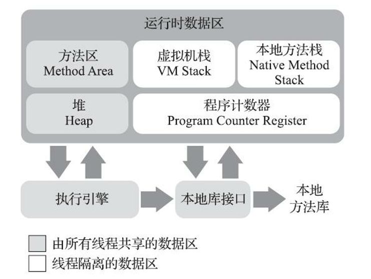
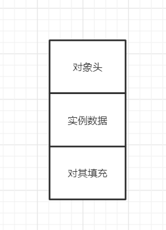
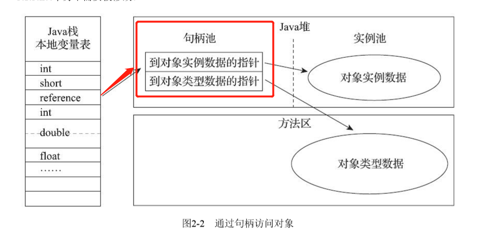
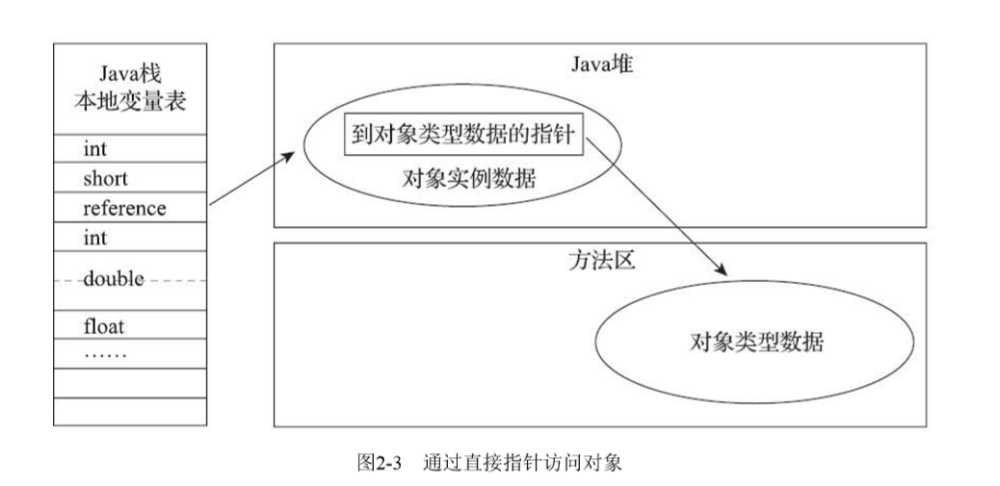
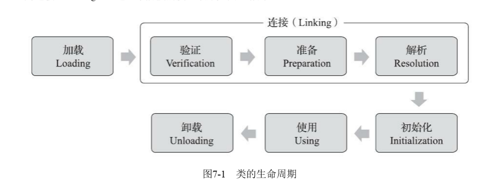
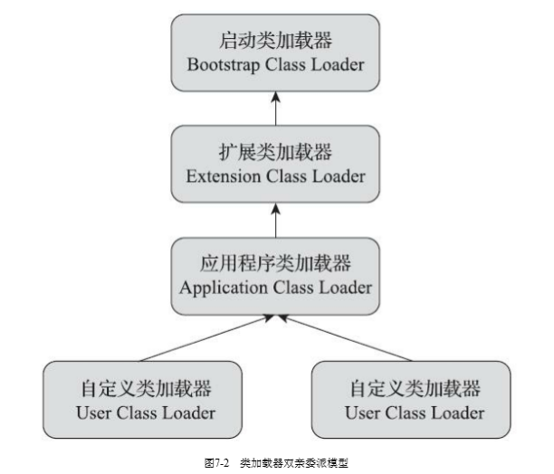
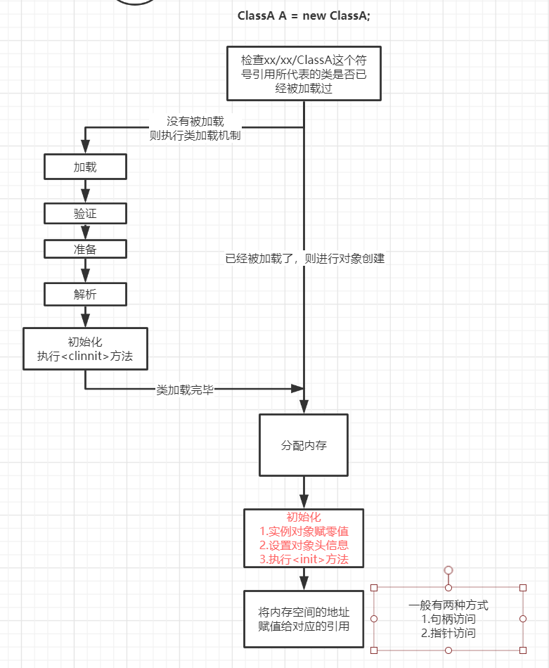

Java虚拟机在执行Java程序的时候，会把内存划分为若干个不同的数据区域。我们这篇文章就来Java的内存区域，注意要跟Java内存模型区分开来。

继续前进，学习不止~~~

<!-- more -->

## Java内存区域

根据Java虚拟机规范的规定，Java虚拟机所管理的内存包括以下几个运行时数据区域。



### 程序计数器

当前程序所执行的字节码的行号指示器，它是程序控制流的指示器、分支、循环、跳转、异常处理、线程恢复等基础工作都需要依赖这个程序计数器。每条线程都需要有一个独立的程序计数器，各个线程之间计数器互不影响，独立存储，这类内存区域为线程私有的内存。如果线程执行的是Java方法，那么这个计数器则记录的是正在执行的虚拟机字节码指令的地址；如果执行的本地方法，那么计数器为空。

### Java虚拟机栈

虚拟机栈也是程序私有的，虚拟机栈描述的是Java方法执行的线程内部模型，生命周期与线程相同。每个方法执行的时候，虚拟机都会同步创建一个栈帧，用于存储局部变量表、操作数栈、方法出口等信息。每个方法被调用直至执行完毕的过程，就对应着一个栈帧在虚拟机栈中从入栈到出栈的过程。

### 本地方法栈

本地方发栈与虚拟机栈所发挥的作用相似，只是虚拟机栈为虚拟机执行Java方法服务，而本地方法栈则是为虚拟机使用到的本地方法服务。

### Java堆

Java堆是所有线程共享的一块内存区域，在虚拟机启动时创建，唯一的作用就是存放对象的实例。

### 方法区

方法区与Java堆一样，是各个线程共享的内存区域，用于存储已被虚拟机加载的类型信息、常量、静态变量、即时编译器编译后的代码缓存等数据。在JDK1.8之前为Perm Gen永久代，JDK1.8后，则在本地内存中实现元空间Metaspace

### 运行时常量池

运行时常量池是方法区一部分，用于存放编译期生成的各种字面量与符号引用。

### 直接内存

直接内存不是虚拟机运行时数据区一部分。在JDK1.4之后新引入的NIO类，引入一种基于通道与缓冲区的I/O方式，它可以使用Native函数库直接分配堆外内存，然后通过一个存储在Java堆里面的DirectByteBuffer对象作为这块内存的引用进行操作，这样在一些场合中显著提高性能，避免了在Java堆和Native堆中来回复制对象。

## 对象的创建

当Java虚拟机遇到一条字节码new 指令后，首先要执行**类加载检查**，去检查这个指令的参数是否在常量池中定位到一个类的符号引用，并且检查这个符号引用（一组符号描述所引用的目标，任何形式的字面量，只要能定位到目标即可）代表的类是否已经被加载、解析和初始化。如果没有，那么将执行相应的类加载过程。

类加载检查通过之后，会为新生对象**分配内存**。分配内存时，根据**Java堆中内存是否规整**，如果规整，那么采用**指针碰撞**的方式：所有使用过的内存放在一边，空闲的内存放在另一边，中间放着一个指针作为分界点的指示器，所分配内存就是仅仅把指针向空闲方向挪动一段与对象大小相等的距离。如果内存不规整，则采用**空闲列表**的方式：虚拟机维护一个列表，记录上哪块内存块时可用的，在分配的时候从列表中找到一块足够大的空间划分给对象实例。为了解决并发情况下的线程安全，对于指针碰撞，在分配对象内存的动作上进行同步处理，即采用CAS+失败重试的方式保证更新操作的原子性。对于空闲列表，在分配对象内存的动作按照线程划分在不同空间之中进行，即每个线程在Java堆中先预先分配一小块内存，称为本地线程分配缓存，哪个线程要分配内存，就在哪个线程的本地缓存区中分配，只有本地缓冲区用完了，分配新的缓存区才需要同步锁定。

内存分配完成之后，要讲分配到的内存空间都**初始化为零值**。这步操作保证对象的**实例对象**在Java代码中可以不赋初值就直接使用，使程序能访问到这些字段的数据类型所对应的零值。

接下来，Java虚拟机对对象进行必要的设置，例如这个对象是哪个类的实例，对象的GC分代年龄等对象的对象头设置。

最后，实际执行<init>方法，按照程序员的意愿对对象进行初始化。

### 对象的内存布局

在Hotspot虚拟机中，对象在堆内存中的存储布局可以划分为三个部分：对象头、实例数据、对齐填充。



**对象头**我们在Synchronized那节里面介绍过。主要包括两部分信息：1. 用于存储对象自身的运行时数据，如哈希码、GC分代年龄、锁状态标志、线程持有的锁、偏向线程ID等，这部分称之为**Mark Word**。2. 对象头的另外一部分是**类型指针**，即对象指向他的类型元数据的指针，Java通过这个指针来确定对象是哪个类的实例。如果是Java数组，那么在对象头中还必须有一块用于记录数组长度的数据，因为虚拟机可以通过普通Java对象的元数据确定Java对象的大小，但是如果数组长度是不确定的，那么无法通过元数据中的信息系推断出数组的大小。

实例对象是对象真正存储的有效信息，即代码里面定义的字段内容。

对象的第三部分是对齐填充，它仅仅起到占位符的作用。因为Hotspot虚拟机自动内存管理系统要求对象起始地址必须是8字节的整数倍。

### 对象的访问定位

经过上面的创建对象，那么我们怎么使用对象呢？就是靠的栈上的reference数据来操作堆上的具体对象。主流的访问方式主要有使用句柄和直接指针两种：

1. 如果使用**句柄访问**，Java**堆**中可能会划分一块内存作为**句柄池**，reference中存储的就是对象的句柄地址，句柄中包含对象实例数据与类型数据各自具体的地址信息。



2. 如果使用**直接指针访问**，Java堆中的对象内存布局必须考虑如何放置访问类型数据的相关信息，reference中存储的就是对象地址，如果只是访问对象本身的话，就不需要多一次间接访问的开销。



两种方式各有好处，句柄访问的好处在于reference中存储的是稳定句柄地址，在对象被移动时只需要修改句柄中的实例数据指针。直接指针访问的好处在于速度更快，节省了一次指针定位的时间开销。H**otspot主要使用第二种方式进行对象访问**。

## 类加载机制

我们在上面的对象创建中提到，第一部是进行类加载检查，如果符号引用所代表的类没有被加载，则执行类加载，我们这一小节就来学习类加载机制是如何运行的。

### 类加载时机

一个类型被加载到虚拟机内存中开始到卸载出内存位置，整个生命周期将经过加载、验证、准备、解析、初始化、使用、卸载七个阶段，其中验证、准备、解析三个部分统称为连接。



加载阶段，Java虚拟机规范并没有强制约束，而初始化阶段则有着严格规定有且只有6中情况，我将我们实际中常见的摘抄出来。

1. 使用new关键字实例化对象、读取或者设置一个类型的静态字段、调用一个类型的静态方法
2. 使用反射调用时，如果没有初始化，则先触发初始化
3. 初始化时，父类没有初始化，则先触发父类初始化
4. 虚拟机启动值要执行一个主类（包含main()方法的那个类），虚拟机会先初始化主类
5. 当接口定义了默认方法（default关键字修饰的接口方法），如果有这个接口的实现类发生了初始化，那么该接口要在其之前被初始化

### 类加载的过程

#### 加载

在加载阶段，主要完成以下三件事情：

1. 通过一个类的全限定名来获取定义此类的二进制字节流
2. 将字节流所代表的静态存储结构转化为方法区的运行时数据接口
3. 在内存中生成一个代表这个类的class对象，作为方法区这个类的各种数据的访问入口

用我自己理解话的就是，**加载过程主要是把将编译后的class文件加载到内存中，然后在方法区生成运行时数据结构，随后内存中生成一个class对象，通过这个对象可以访问方法区的数据结构**。

#### 验证

验证是连接阶段的第一部，这一阶段的目的是确保class文件中的字节流包含的信息符合《Java虚拟机规范》的全部约束要求，保证这些信息被当做代码运行后不会危害虚拟机自身的安全。大白话讲就是检查加载进来的二进制字节流符不符合JVM的要求。主要有四个阶段的校验动作：

1. 文件格式验证，比如字节流是不是以0xCAFEBABE开头、版本号是不是在JVM的接受范围之内等等
2. 元数据验证。这个阶段对字节流的信息进行语义上的分析，比如这个类是否有父类、是否继承了不允许继承的类、这个类不是抽象类，是否实现了父类或者接口要求实现的所有方法等等
3. 字节码验证。这个阶段通过数据流分析和控制流分析，确定程序语义是否合法，比如任何跳转指令不会跳转到方法体以外的字节码指令上等等。
4. 符号引用验证。最后一个阶段的校验行为发生在将符号引用转化为直接引用的时候。

### 准备

准备阶段就是正式为类中定义的**静态变量**分配内存并设置类变量初始值。值得注意的是，这个阶段内存分配的仅包括静态变量，不包括实例变量。实例变量是上面的对象创建阶段会进行分配。

### 解析

解析阶段是将Java虚拟机将常量池内的符号引用替换为直接引用

#### 初始化

类的初始化是类加载过程的最后一个步骤。初始化阶段是执行类构造器的<clinit>方法的过程。<clinit>方法是编译器自动收集类中的所有类变量的赋值动作和静态代码块中的语句合并产生的。

### 类加载器

#### 什么是类加载器

类加载第一个过程--加载就是“根据类的全限定名去获取描述该类的二进制字节流”，完成这个动作的代码就叫做“类加载器”。对于任何一个类，必须由加载它的类加载器和这个类本身一起才能公共确定其在Java虚拟机中的唯一性。也就说，比较两个类是否相等，只有这两个类是同一个类加载器加载的前提下才有意义。

#### 双亲委派模型

提到类加载器，就不得不提大名鼎鼎的双亲委派模型。我们先从传统经典的三层类加载器说起。

启动类加载器 Bootstrap Class Loader。这个类加载器负责加载存在在lib目录下的类。类加载器无法被Java程序直接饮用。

扩展类加载器 Extension Class Loader。这个类加载器主要加载lib\ext目录下的类。

应用程序类加载器 Applicationn Class Loader。这个类加载器负责加载用户类路径上所有的类库。如果没有自定义自己的类加载器，一般这个就是默认的类加载器。



上图就是不同层次之间的类加载器的双亲委派模型，但是它们的关系不是继承关系，而是组合关系。

双亲委派模型的工作过程是:如果一个类加载器收到了类加载的请求，它首先不会自己去尝试加载这个类，而是把这个请求委派给父类加载器去完成，因此所有的加载请求最终会传送到最顶层的Bootstrap Class Loader。只有当父加载器无法完成这个加载时，子加载器才会尝试自己去加载完成。

这样的好处是：Java中的类随着它的类加载器一起具备了带优先级的层次关系。比如Object类，无论哪一个类加载器要加载这个类，都会委派给最顶层的Bootstrap ClassLoader加载，这样保证程序在各种类加载器中都能保证是同一个类。

```java
    protected Class<?> loadClass(String name, boolean resolve)
        throws ClassNotFoundException
    {
        synchronized (getClassLoadingLock(name)) {
            // First, check if the class has already been loaded
            Class<?> c = findLoadedClass(name);
            if (c == null) {
                long t0 = System.nanoTime();
                try {
                    if (parent != null) {
                        c = parent.loadClass(name, false);
                    } else {
                        c = findBootstrapClassOrNull(name);
                    }
                } catch (ClassNotFoundException e) {
                    // ClassNotFoundException thrown if class not found
                    // from the non-null parent class loader
                }

                if (c == null) {
                    // If still not found, then invoke findClass in order
                    // to find the class.
                    long t1 = System.nanoTime();
                    c = findClass(name);

                    // this is the defining class loader; record the stats
                    sun.misc.PerfCounter.getParentDelegationTime().addTime(t1 - t0);
                    sun.misc.PerfCounter.getFindClassTime().addElapsedTimeFrom(t1);
                    sun.misc.PerfCounter.getFindClasses().increment();
                }
            }
            if (resolve) {
                resolveClass(c);
            }
            return c;
        }
    }
```
这段代码的逻辑是：先检查请求加载的类是否被加载过，如果没有，则调用父加载器的loadClass方法，如果父加载器为空，则默认使用启动类加载器作为父记载器。假如父类加载器加载失败，则抛出异常，这才调用自己的findClass方法尝试加载。

因此，如果想要实现自定义类加载器，只需要继承ClassLoader类，重写findClass方法即可。


### 总结

我们知道了大概的类加载过程，那么结合前面的对象创建，我们来从整体角度上来分析一下，当代码中有 **ClassA A= new ClassA ()**会发生什么？




> 参考列表
>
> 1. 《深入理解Java虚拟机》 第三版