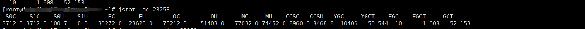
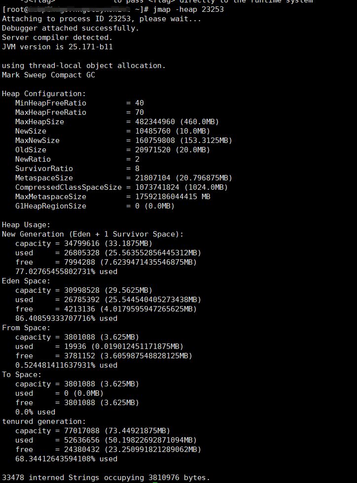
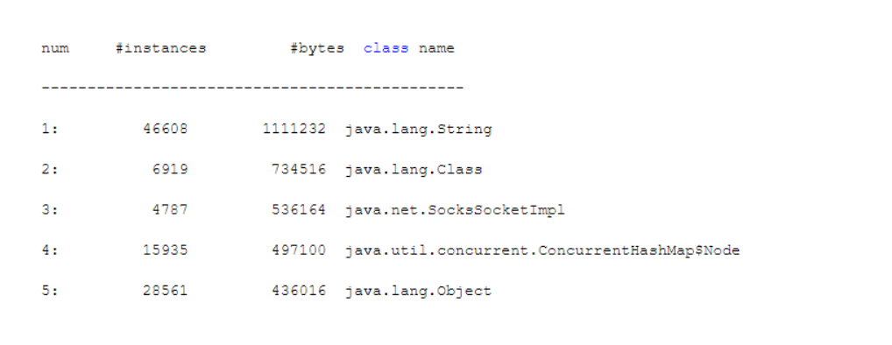
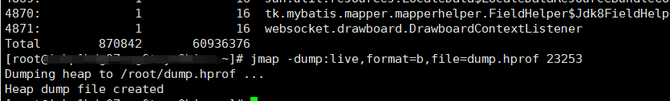
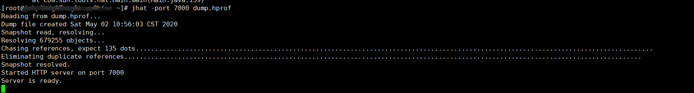
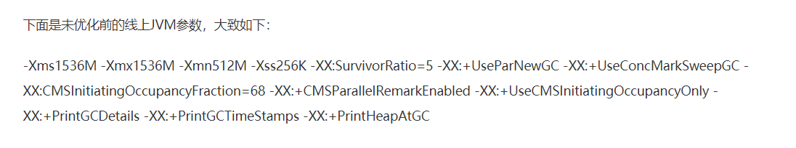
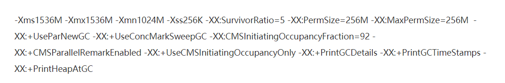

上篇我们分析了常见的垃圾回收器，我们这篇聚焦于内存分配与系统问题定位实践。这部分知识才是体现一个Java工程师的实力，毕竟纯理论知识要落地才有价值。

起飞吧少年~

<!-- more -->

## 内存分配与回收策略

我们先来了解一下内存是如何分配，了解JVM实际运行运行机制，才能分析出JVM出现问题是哪里的原因。

1. **对象优先在Eden区分配**

对象在新生代Eden区中分配。当Eden区没有足够的空间进行分配时，虚拟机将发起一次Minor GC。

2. **大对象直接进入老年代**

大量需要内存空间的Java对象，但是Eden区无法存放，因此大于设置的值的对象直接在老年代分配。

3. **长期存活的对象进入老年代**

对象在Survior区每熬过一次Minor GC，年龄就增加1岁，当它的年龄增加到一定程度后（默认15），就会被晋升到老年代。可以通过 -XX: MaxTenuringThreadhold设置。

4. **动态对象年龄判定**

HotSpot虚拟机并不是永远要求对象的年龄达到 -XX: MaxTenuringThreshold 才能晋升老年代，如果在survivor空间中相同年龄所有对象大小的总和大于Survior空间的一半，年龄大于或者等于该年龄的对象就会直接进入老年代。

5. **空间分配担保**

在发生Minor GC之前，会判断老年代最大可用的连续空间是否大于新生代所有对象空间或者大于历次晋升的平均大小，如果大于，则可以把存活的对象移入到老年代，否则，则要触发full gc。

## GC概念

### 各种GC含义

**Minor GC/Young GC**:

针对新生代的垃圾回收称之为Minor GC/ Young GC。

**Major GC/Old GC**:

针对老年代的垃圾收集。只有CMS会单独收集老年代的行为，其他能收集老年代的GC都会同时收集整个GC堆。

**Full GC:**

收集整个Java堆和方法区的垃圾收集

**Mixed GC:**

收集整个新生代以及部分老年代的垃圾收集。只有G1收集器会有这种行为。

### 什么时候触发GC?

**Young GC:** 当新生代的Eden区分配满的时候会触发Young GC。

**Full GC:** 

1. 当触发Young GC时，发现**历次晋升到老年代对象的平均大小**大于**老年代最大可用连续空间**或者**新生代对象大小**大于**老年代最大可用连续空间**，则不会触发Young GC转而触发Full GC。
2. Perm Gen空间不足以分配 ，也会触发full gc。
3. System.gc()默认也是触发 full gc。
4. 老年代对象大小超过设置的阈值，比如92%，从而触发Full GC

**Mixed GC**:一旦老年代占据堆内存45%，触发Mixed GC。

## 常见工具

### jstat

如果要查看JVM的整体运行情况 ，可以用jstat。可以轻易的看出当前运行中的系统JVM的Eden/Survivor/老年代的内存使用情况，还有Young GC和Full GC的执行次数以及耗时。

**jstat -gc PID**

1. S0C : From Survivor区的大小
2. S0C : To Survivor区的大小
3. S0U :  From Survivor区的使用内存大小
4. S1U : To Survivor区的使用内存代销
5. EC : Eden 区的大小
6. EU : Eden 区当前使用内存的大小
7. OC : 老年代的大小
8. OU : 老年代当前使用内存的大小
9. MC : 方法区的大小
10. MU : 方法区当前使用内存大小
11. YGC : 系统运行迄今为止Young GC次数
12. YGCT : 系统运行迄今为止Young GC耗时
13. FGC : 系统运行迄今为止Full GC次数
14. FGCT : 系统运行迄今为止Full GC耗时
15. GCT : 所有GC的总耗时

#### **应该如何使用jstat工具？**

只要合理分配内存空间，尽可能的让对象留在年轻代不进入老年代，避免频繁发生full gc，就是JVM最好的性能优化。

1. 首先要知道 **新生代对象增长的速率**，即随着系统运行，每秒钟会在年轻代的Eden区分配多少对象。

只需要运行 **jstat -gc PID 1000 10**，意思是每个 一秒钟更新出来一行jstat统计信息，一共执行10次统计。通过这个命令，就可以灵活的对线上机器通过固定频率输出统计信息，观察Eden区对象占用变化。如果系统负载不高，那么可以将时间设置为1分钟、10分钟等，同时在高峰时间段和非高峰时间段查看对象增长速率，这样首先对系统有个清晰的认识。

2. **Young GC的触发频率和每次耗时**

在上一步的对象增长速率能够大概清楚了，那么Young gc就也可以推断出来，比如Eden区1G，每秒新增5MB，那么大概会三四分钟触发一次Young gc。经过多次Young gc后，总耗时/总次数即可大概算出每次耗时，大概就能知道每次Young GC的时候会导致系统停顿多长时间。

3. **每次Young GC后有多少对象是存活和进入老年代**

既然推断出大概3分钟一次Young GC，那么可以执行 jstat -gc PID 180000 10，相当于每隔3分钟执行一次统计，连续执行10次，可以观察每3分钟后Eden  Survivor 老年代的对象变化。比如每次Young GC后老年代新增50MB，那么老年代的增长速率也就可以知道了。

4. **Full GC的触发时机和耗时**

知道了老年代对象的增长速率，那么Full GC的触发时机也就可以知道了。

因此，通过jstat可以知道系统JVM的运行情况，就可以针对性的进行优化。

### jmap/jhat

通过jstat知道了系统的jvm情况，就可以通过jmap 和jhat 观察系统JVM中对象分布，了解大系统平时运行过程中，到底哪些对象占据了主角位置，占据了多少内存空间，对系统可以有更加细致的了解。

#### jmap

当发现JVM新增对象的速度很快时，就可以用jmap去了解系统的对象分布。

**1. jmap -heap PID**可以了解系统运行时的内存区域，不过还是jstat信息全点，一般不用这个。

**2. jmap -histo PID 了解系统运行时的对象**

**3. jmap -dump:live,format=b,file=dump.hprof PID，使用jmap生成堆内存转储快照**

该命令会在当前目录下生成一个dump.hrpof文件，这个文件是二进制格式，不能直接看。因此我们可以用jhat。

#### jhat

我们可以用jhat在浏览器中分析堆转出快照，jhat内置了web服务器，可以通过浏览器来图形化分析堆转储快照。

**jhat  -port 7000 dump.hprof**

## JVM合理设置步骤

1. **系统开发好后的预估性优化**

系统开发完毕，先对系统进行预估性的优化，即估算系统每秒大概多少请求，每个请求会创建多少对象啊，占用多少内存，机器应该选用什么样的配置、年轻代应该给多少内存、Young GC触发的频率、对象进入老年代的速度、老年代应该给多少内存、Full GC触发的频率等。

优化的思路是：尽量让每次Young GC后存活的对象小于Survivor区域的50%，都留存在年轻代。尽量别让对象进入老年代。尽量减少Full GC的频率，避免频繁Full GC对JVM性能的影响。

2. **系统压测时的JVM优化**

预估性优化之后，还要经过一连串的测试，在一定压力下性能、稳定性、和并发能力都正常，会可以部署到生产环境中。

这里有个非常关键的环节就是预发布环境的压力测试。 比如使用压力测试工具模拟1000个用户同时访问系统，造成每秒500个请求的压力，看系统能否支撑每秒500请求的压力，同时看系统各个接口的相应延时能够在200ms之内，也就是接口的性能不能太慢，或者在数据库中模拟出来百万级单表数据，看系统是否能稳定运行。

所以就可以在压测的环节，对测试机器运行的系统，采用jstat工具来分析模拟真实环境下的压力。

根据压测环境中的jvm运行情况，如果发现对象过快进入老年代，那么可能是年轻代太小导致频繁的Young GC，然后Young GC的时候很多对象还是存活的，结果Survivor也太小，导致很多对象频繁进入老年代。

总之就是合理调整新生代、老年代、Eden、Survivor各个区域的内存大小，保证对象尽量留在新生代，不要过快进入老年代。

3. **对线上系统进行JVM监控**

1. 第一种方式比较LOW，就是每天在高峰期、低峰期都用jstat/jmap/jhat工具查看线上系统JVM运行情况，有没有频繁full gc的问题。
2. 部署专门的监控系统，Zabbix/OpenFalcon/Ganglia等。

## JVM优化实际案例

### 定制JVM参数模板

如果不设置JVM参数，用JVM默认参数启动，默认几百MB的堆内存，前期可能没什么问题，但是等业务量上来的时候，GC频率越来越高，会导致系统可用性急剧下降。因此，一套大差不差的JVM参数模板起码能基本保证JVM性能别太差。

>-Xms4096M -Xmx4096M -Xmn3072M -Xss1M  -XX:PermSize=256M -XX:MaxPermSize=256M -XX:+UseParNewGC -XX:+UseConcMarkSweepGC -XX:CMSInitiatingOccupancyFaction=92 -XX:+UseCMSCompactAtFullCollection -XX:CMSFullGCsBeforeCompaction=0 -XX : CMSParallelInitialMarkEnabled  -XX :CMSScavengeBeforeRemark

堆内存4G，新生代3G，进而是Survivor区域达到300M，这样使得不会使新生代对象频繁进入到老年代。

**如何优化Full GC的性能呢？**

参数：-XX : CMSParallelInitialMarkEnabled，这个参数会在CMS垃圾回收器的“初始标记”阶段开启多线程并发执行。

参数：-XX :CMSScavengeBeforeRemark，这个参数会是CMS的重新标记阶段之前，尽量执行一次Young GC。CMS重新标记也是需要STW的，所以如果在重新标记之前，先执行一次Young GC，就会回收一些年轻代里没有人引用的对象，这样使CMS得重新标记阶段就可以少扫描一些对象，提高CMS的重新标记阶段的性能。

### 大对象导致的频繁Full GC

4G机器，堆内存设置1.5G，新生代512G，老年代1G。

系统固定频率发生卡顿，通过在高峰期jstat观察JVM实际运行情况，发现每次Young GC过后进入老年代的对象很少，并不是每次YGC都有几十MB对象进入老年代，而是偶尔一次，正常来说不至于30分钟就会导致老年代占用空间达到68%。通过继续观察，发现系统运行的时候，突然会有几百MB的对象占据在老年代，所以YGC偶尔一次几十MB对象升入老年代，平均30分钟触发一次FGC。所以可以锁定是**大对象导致的频繁FGC**。

所以接下来要做的就是定位大对象，通过后台jstat工具观察，在老年代突然进入几百MB大对象时，立马用jmap工具导出一份dump内存快照，然后MAT工具定位出大对象是几个Map之类的数据结构，大概可以分析出来这是从数据库中查出来的数据，通过排查代码，发现SQL在某种特殊时候，会执行 select * form XXX，但是没有where 条件，因此可以得出结论，是这个代码层面的bug导致把表里的数据全部查询出来，所以会每隔一段时间搞出几百MB的大对象，直接进入老年代，伴随着YGC的对象，所以导致FGC。

所以这个案例的优化可以两个角度解决:

1. 解决代码层面的bug，如果没有条件，直接返回null。
2. 年轻代明显过小，Survivor区域空间不够，每次YGC存活几十MB，如果Survivor只有70MB很容易触发动态年龄判定，让对象进入老年代。JVM参数调整为：年轻代调整为700MB，Survivor为150MB，这样每次YGC的存活对象一般不会进入老年代。同时将永久代大小设置为256MB，因为不设置默认几十兆，如果运用反射之类的机制，动态加载的类过多，会频繁触发FUll GC。

### System.gc()导致频繁GC

新系统上线，在一次业务高峰期，系统直接卡死不动，通过jstat查看运行情况，JVM几乎每秒都会执行一次Full GC，每次耗时几百毫秒。而且通过jstat查看JVM各个内存区域的使用量，基本没什么问题，年轻代对象增长速度并不块，老年代、永久代使用的空间占比也不高。所以定位出可能有人显式调用了**System.gc()**。

通过IDEA里面全局搜索，发现还真有这样写的，经询问同学，同学的思路是：在代码里面一下子会加载出一大批数据，一旦请求处理完毕，觉得这大批数据废弃不用，占据内存过多，完全可以主动调用System.gc来触发一次GC，将它们回收。

因此，针对这个问题，可以在JVM参数里面添加 -XX : +DisableExplicitGC，这个参数的意思是禁止显示执行GC。

其实这个问题，在jxl导出excel的时候，jxl会默认调用gc方法，也会导致系统卡顿。

### 内存泄漏导致频繁FGC

业务背景是线上大促，导致线上一个系统的cpu使用率飙升，cpu使用率太高，导致系统几乎陷入卡死的状态。

CPU负载过高，一般会有两个常见的场景：

1. 系统创建了大量线程，这些线程同时并发运行，而且工作负载都很重，过多线程同时并发运行导致cpu负载过高
2. JVM执行频繁的Full GC，Full GC是一个非常耗费cpu资源的。

通过jstat可以排除法观察FGC频率。如果频率过高，说明是JVM FGC导致的，否则就是线程并发执行负载很重的任务。这个案例发现是发生了频繁GC。

我们知道，发生频繁Full GC一般可能性有三个：

1. 内存分配不合理，导致对象频繁进入老年代，进而引发频繁的FGC
2. 存在内存泄漏问题，内存里驻留了大量的对象塞满了老年代，导致稍微有一些对象进入老年代就会引发Full GC.
3. 永久代的类太多，触发了FGC

通过jstat分析线上系统问题，排除了内存分配不合理、永久代内存使用情况也很正常，因此可能是老年代驻留了大量对象。其实跟上面的案例有些类似。

通过jamp dump出一份内存快照，通过MAT查看系统创建的对象占用量多大，而且GC无法回收，通过排查代码，返现是系统中做的一个JVM本地缓存，把很多数据加载到内存里缓存起来，然后提供查询服务的时候直接从本地内存走，意味本地内存没有限制大小，并且没有使用LRU之类的算法进行定期淘汰，因此导致缓存在内存中的对象越来越多，从而造成了内存泄漏。

解决方案就是通过Redis、EHCache之类的缓存框架即可。

### String.split()造成内存泄漏

线上系统使用JDK1.7，JDK1.7对字符串切分实现原理是给每个切分的出来的字符串都创建一个新的数组，线上系统的处理逻辑是加载大量的数据出来，数据可能是字符串，对这些字符串进行切分，每个字符串都会切割成N个小字符串，瞬间导致字符串数量暴增几倍或者几十倍，系统从而频繁产生大量对象。

## JVM优化总结

JVM优化不是一蹴而就的，而是一个慢慢优化的过程。JVM的优化核心是减少Full GC的发生次数。一个完整的系统从开发到上线运行，JVM优化一般有这几个过程：

1. **新系统开发完毕后，预估设置JVM参数**
2. **压测之后合理调整JVM参数**
3. **线上系统的监控和优化**

同时我们可以总结**线上频繁FGC的几种表现**：

1. 机器cpu负载过高
2. 频繁Full  GC导致系统卡顿
3. 系统无法处理请求或者处理过慢

**频繁Full GC的集中常见原因**：

1. 系统承载高并发请求或者处理数据量过大，导致YGC频繁，而且每次YGC过后存活的对象太多，内存分配不合理，Survivor区域过小，导致对象频繁进入老年代，频繁触发FGC.
2. 系统一次性加载过多数据进入内存，搞出来大对象，导致频繁有大对象进入老年代，进而频繁FGC
3. 系统发生内存泄漏，创建大量对象，始终无法回收，一直占据老年代，进而频繁FGC
4. 永久代因为加载类过多触发FGC
5. 误调用System.gc触发FGC

对于这几种情况，如果是第一种原因，那么就合理分配内存大小，调大新生代、Survivor区域；第二、三种情况，也就是老年代有大量对象，那么就可以dump内存快照，通过MAT工具 进行分析。

## OutOfMemory问题

### 什么地方会发生OOM问题？

我们从Java代码执行开始分析哪些地方会出OOM问题。

当我们写的代码 .java源代码文件首先要被编译成 .class字节码文件，JVM要执行代码，首先要将编译好的class字节码文件类加载到内存中，JDK1.7为永久代Perm Gen，JDK1.8为Meatspace，就是用来存放系统里的各种类信息，所以这块内存区域就有可能发生内存溢出。

每个线程都有一个自己的虚拟机栈，所谓栈内存，每个线程执行一个方法，就会为方法创建一个栈帧，将栈帧放入到自己的虚拟机栈里面，然后在这个栈帧里放入方法中定义的各种局部变量，所以虚拟机栈也会出现内存溢出。

我们的方法会频繁创建各种各样的对象，这些对象都是放在堆内存里面的，所以堆内存也会发生内存溢出。所以最后总结 以下地方会发生内存溢出。

1. **方法区、元空间**

我们JVM参数有专门设置Perm Gen或者Metaspace的指令。如 -XX:PermSize=256M -XX:MaxPermSize=256M 或者 -XX:MetaspaceSize = 512m -XX:MaxMetaspeaceSize=512m。当这个区域满的时候，也会触发FGC，但是不一定所有的类会被回收，比如这个类的类加载器要先被回收、类的所有对象实例都要被回收等，所以FGC未必会回收很多的类，如果继续往这个区域加载类，当然会造成OOM。

一般发生内存溢出是这两个原因：

- 没有设置方法区的大小，使用默认值，而默认值只有几十MB
- 使用cglib之类的技术动态生成一些类，但是代码层面没有控制好，很容易把方法区打满，导致OOM

2. **虚拟机栈**

栈的内存溢出一般是因为不停递归调用方法导致栈帧压栈，最终导致内存溢出。

3. **堆内存**

JVM创建对象首先会在Eden区分配，等Eden区填满之后会触发YGC，然后存活对象进入S区。当出现高并发场景，导致YGC后很多请求没有处理完，存活对象太多，S区放不下，只能进入老年代，很快老年代也会填满，从而触发FGC，当老年区GC后，仍存活对象。此时再有对象进入老年区，就会导致OOM.

一般堆内存发生内存溢出主要是以下两种场景：

-  系统承载高并发，请求量多大，导致大量对象都是存活，对象实在不能放下，从而引发OOM
- 内存存在内存泄漏的问题，大部分对象存活，没有及时取消他们的引用，触发GC仍无法回收

### OOM实际案例

1. 针对MQ消息队列故障高可用方案，当发现MQ发生故障，就将数据存放在内存中，不停重试，等到MQ恢复正常为止。这种方案当真正遇到MQ故障时，系统不断重试，导致内存数据越积累越多，最终导致OOM。这种问题的解决方案也很简单，增加重试次数机制，当重试超过一定次数之后，将数据落本地磁盘，允许内存中的数据可以被回收。
2. 日志监控，将重要日志写入到ES集群中，但是代码中当某个节点写日志发生异常时，也需要将链路节点的异常写入到ES集群中，因此代码实现当ES集群出现故障时，再次调用自己，尝试将日志写入ES集群中，最终循环调用自己log方法，从而导致线程的栈内存溢出，从而导致JVM进程崩溃。解决办法只能是严格的持续继承+严格的Code Reviewl来避免。
3. 通过动态代理机制生成动态代理类，但是并没有将生成的动态代理类缓存起来，而是每次调用就重新生成一次，最终当系统负载过高时，瞬间创建一大堆的类，塞满了方法区无法回收，最终导致OOM。这种问题的解决方案就要通过严格的自动化压力测试来解决。
4. Tomcat的工作线程发现堆内存不够，抛出OOM异常。机器日志异常显示：Exception in thread http-nio-8082-exec-1089 OOM，对dump的内存快照进行分析，发现占据内存最大的是大量的byte[]数组，占了大约4G内存，相当于把jvm堆内存占满了。继续深入查看发现是，tomcat的工作线程大约有400个，每个工作线程会创建两个byte数组，数组大小都是10M。tomcat配置max-http-header-size：10000000。但是每秒请求只有几十个，说明每个请求需要四五秒，导致四五秒内有400个线程在处理。继续查看事故发生时的日志，发现大量rpc请求超时异常。翻看dubbo的配置，发现超时时间就是设的4秒。说明是下游服务故障，导致网络请求失败 ，按照设置好的超时时间一直卡住4秒钟才抛出异常。处理办法：将超时时间修改为1秒，tomcat参数max-http-header-size适当调小。
5. 堆外内存溢出，导致OOM。NIO框架每次分配新的堆外内存的时候，会调用system.gc去提醒JVM主动执行gc去回收一些没有使用的DirectByteBuffer对象，但是因为系统参数禁止了显式调用gc方法，从而导致堆外内存无法释放。
6. 查询条件没有where条件。这个跟上面的FGC案例一样，当内存还能放的下的时候会导致频繁FGC，当放不下时，自然会导致OOM。

因此我们的JVM参数要加上

> -XX:+HeapDumpOnOutOfMemoryErro -XX:HeapDumpPath=XXXXXXXX

当发生OOM时，自动dump出内存快照，通过GC日志来分析。

## 如何定位排查线上cpu 100%的问题

1. **定位耗费cpu的进程**

Top -c 显示进程列表 输入p,按照cpu使用率排序，找出最大占用cpu的PID。

2. **定位耗费cpu的线程**

Top -Hp 43987 ,输入P，按照cpu使用率排序，找出最大占用cpu的线程。

3. **将线程id转换为16进制的**

Printf "%x\n" 16872

4. **定位哪段代码导致的cpu过高**

Jstack 43987 | grep '0x41e8' -C5 -color

例子：往MQ写消息，try_catch之后又扔到MQ。但是MQ集群除了问题，导致cpu负载过高。

>参考列表
>
>1. 《深入理解Java 虚拟机》 第三版
>2. 《从 0 开始带你成为JVM实战高手》 专栏