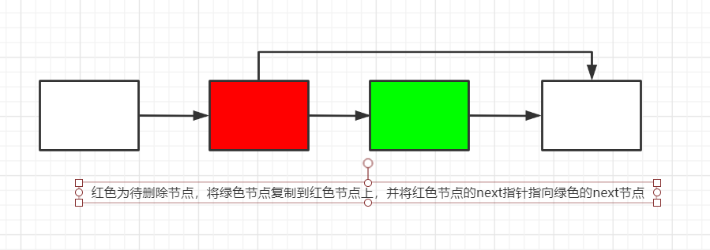
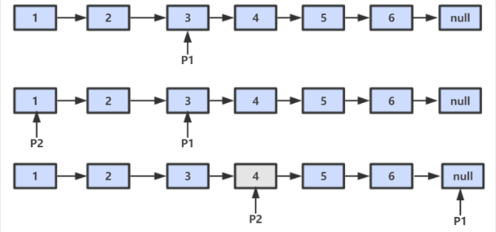
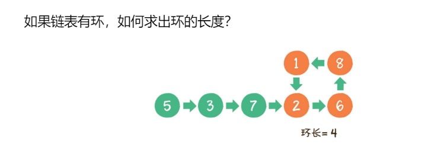
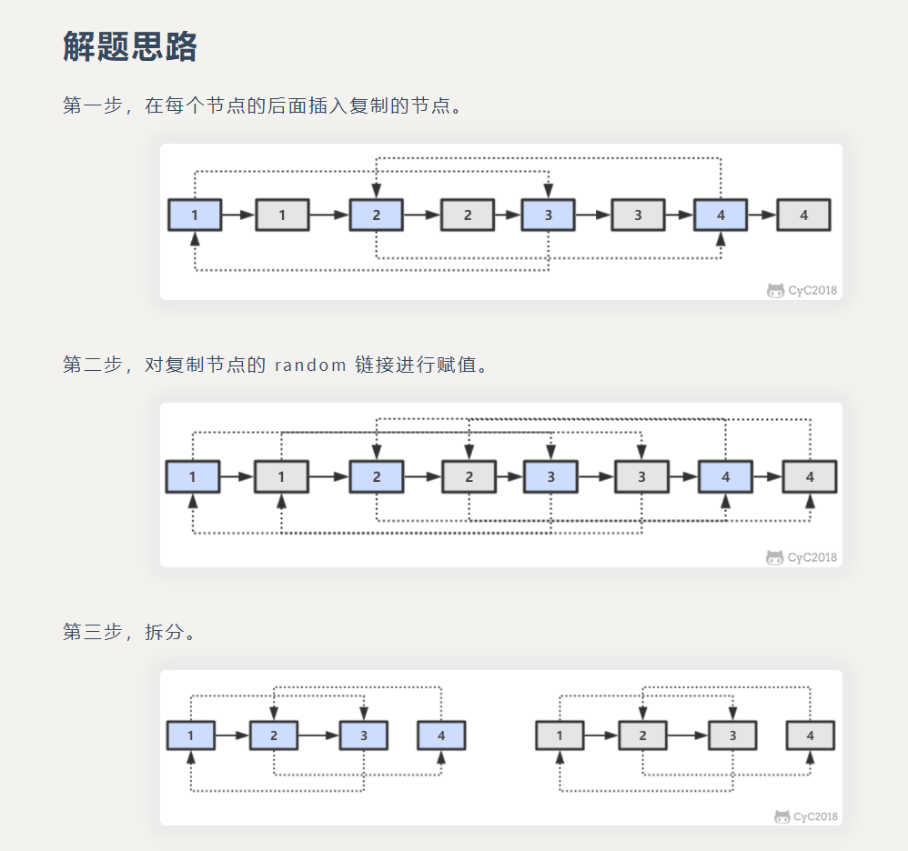
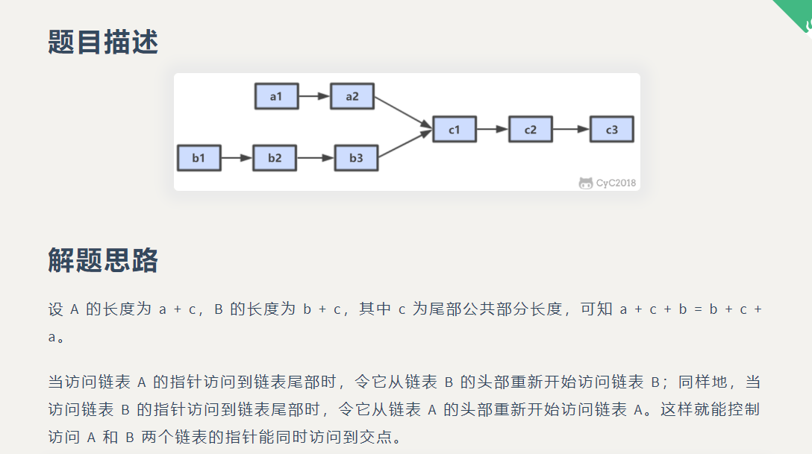

总结了《剑指offer》里面的链表相关的题目，要及时总结复习相关思想。

<!-- more -->

### 从尾到头打印链表

输入一个链表，按链表从尾到头的顺序返回一个ArrayList。

* 递归

要逆序打印1-->2-->3 ，可以先逆序打印 2-->3，最后再打印最后一个节点，而2->3可以看成一个新的链表，要逆序打印该了链表可以继续调用自身函数

```java
public ArrayList<Integer> printListFromTailToHead(ListNode listNode) {
    ArrayList<Integer> list = new ArrayList<>();
    if (listNode != null) {
        list.addAll(printListFromTailToHead(listNode.next));
        list.add(listNode.val);
    }
    return list;
}
```

* 头插法

头插法逆序，JDK1.7中 hashmap就是用的头插法。

```java
public static ArrayList<Integer> printListFromTailToHead2(ListNode listNode) {
    ListNode head = new ListNode(-1);
    while (listNode != null) {
        ListNode nextNode = listNode.next;
        //第一次循环 -1 --》null 2-->3
       //第二次循环 2--》1
        listNode.next = head.next;
        //第一次循环 -1 --》1  2--》3
        //第二次循环 -1--》2--》1
        head.next = listNode;
        //第一次循环 2--》3
        //第二次循环 3
        listNode = nextNode;
    }
    // 构建 ArrayList
    ArrayList<Integer> ret = new ArrayList<>();
    head = head.next;
    while (head != null) {
        ret.add(head.val);
        head = head.next;
    }
    return ret;
}
```

* 栈

栈具有后进先出的特点，因此正序遍历放入栈中，出栈顺序则为逆序。

```java
public static ArrayList<Integer> printListFromTailToHead3(ListNode listNode) {
    Stack<Integer> stack = new Stack<>();
    while (listNode != null) {
        stack.add(listNode.val);
        listNode = listNode.next;
    }
    // 构建 ArrayList
    ArrayList<Integer> ret = new ArrayList<>();
    while (!stack.isEmpty()){
        ret.add(stack.pop());
    }
    return ret;
}
```

### 删除链表中重复的结点

在一个排序的链表中，存在重复的结点，请删除该链表中重复的结点，重复的结点不保留，返回链表头指针。 例如，链表1->2->3->3->4->4->5 处理后为 1->2->5

* 注意题干是**排序**，说明只需要判断当前节点后面有没有重复的，一直到不重复为止。可以设置一个空的头节点。同时设置pre last指针，pre指针指向当前确定不重复的那个节点，而last指针相当于工作指针，一直往后搜索。

```java
public ListNode deleteDuplication(ListNode pHead){
    ListNode head = new ListNode(-1);
    head.next = pHead;
    ListNode pre = head;
    ListNode last = head.next;
    while (last != null) {
        if (last.next != null && last.val == last.next.val) {
            //找到最后一个相同的节点
            while (last.next != null && last.val == last.next.val) {
                last = last.next;
            }
            pre.next = last.next;
            last = last.next;
        } else {
            pre = pre.next;
            last = last.next;
        }
    }
    return head.next;
}
```

* 递归

```java
public static ListNode deleteDuplication(ListNode pHead) {
    if (pHead == null || pHead.next == null) {
        return null;
    }
    ListNode next = pHead.next;
    //如果第一 二个节点就相等
    if (pHead.val == next.val) {
        while (next != null && pHead.val == next.val) {
            next = next.next;
        }
        return deleteDuplication(next);
    } else {
        pHead.next = deleteDuplication(next);
        return pHead;
    }
}
```

### 在 O(1) 时间内删除链表节点

题干：给定链表的头指针和一个结点指针，在O(1)时间删除该结点。

* 在单向链表中删除一个节点，最常规的是从链表的头结点开始遍历，找到需要待删除的节点的**前一个节点**，令该节点的next指向待删除节点的下一个节点即可，平均时间复杂度为O(N)。可以根据需要删除的节点P，找到下一个节点Q，将Q的值赋值给P后再将P的指针指向Q，即用Q覆盖P，则达到删除的目的。



```java
public ListNode deleteNode(ListNode head, ListNode tobeDelete) {
    if (head == null || tobeDelete == null) {
        return null;
    }
    //如果要删除的节点不是尾节点
    if (tobeDelete.next != null) {
        ListNode next = tobeDelete.next;
        tobeDelete.val = next.val;
        tobeDelete.next = next.next;
    } else {//如果是尾节点
        //只有一个头节点
        if (head == tobeDelete) {
            head = null;
        } else {
            ListNode cur = head;
            while (cur.next != tobeDelete) {
                cur = cur.next;
            }
            cur.next = null;
        }
    }
    return head;
}
```


### 链表中倒数第 K 个结点

输入一个链表，输出该链表中倒数第k个结点。

设链表的长度为 N。设置两个指针 P1 和 P2，先让 P1 移动 K 个节点，则还有 N - K 个节点可以移动。此时让 P1 和 P2 同时移动，可以知道当 P1 移动到链表结尾时，P2 移动到第 N - K 个节点处，该位置就是倒数第 K 个节点。



```java
public static ListNode FindKthToTail(ListNode head,int k) {
    if (head == null) {
        return null;
    }
    ListNode p1 = head;
    ListNode p2 = head;
    while (p1 != null && k-- > 0) {
        p1 = p1.next;
    }
    if (k > 0) {
        return null;
    }
    while (p1 != null) {
        p1 = p1.next;
        p2 = p2.next;
    }
    return p2;
}
```

### 如何判断链表有环

快慢指针。首先创建两个指针p1和p2，让他们同时指向这个链表的头结点，然后开始一个大循环，在循环体内，让p1每次向后移动一个节点，让指针p2每次向后移动两个节点，然后比较两个指针是否相同，如果相同，则证明判断有环，如果不同，则继续下一次循环。

```java
public boolean hasCycle(ListNode head) {
    ListNode p1 = head;
    ListNode p2 = head;
    while(p2 != null && p2.next != null){
        p1 = p1.next;
        p2 = p2.next.next;
        if(p1 == p2){
            return true;
        }
    }
    return false;
}
```

### 链表中环的入口结点

快慢指针找到**相交节点**后，把其中一个节点放回到头节点，两个指针每次都向前走一步，那么他们再次相遇的节点，就是入环节点。

```java
public ListNode EntryNodeOfLoop(ListNode pHead)
{
    if(pHead.next == null){
        return null;
    }
    ListNode p1 = pHead;
    ListNode p2 = pHead;
    while(p2 != null && p2.next != null){
        p1 = p1.next;
        p2 = p2.next.next;
        if(p1 == p2){
            p1 = pHead;
            break;
        }
    }

    while(p1 != p2){
        p1 = p1.next;
        p2 = p2.next;
    }
    return p1;
}
```

### 链表中环的长度



p1每次走1步，p2每次走两步，当第一次相遇后，继续循环前进，并统计前进的循环次数，直到两个指针第二次相遇时，p2比p1多走了整整一圈，因此统计出来的前进次数就是环长。

```java
public static int cycleLength(ListNode head) {
    ListNode p1 = head;
    ListNode p2 = head;
    //相遇次数
    int time = 0;
    int length = 0;
    int lastlength = 0;
    while(p2 != null && p2.next != null){
        length++;
        p1 = p1.next;
        p2 = p2.next.next;
        if(p1 == p2){
            time++;
            if (time == 2) {
                return length - lastlength;
            } else {
                lastlength = length;
            }
        }
    }
    return 0;
}
```


### 反转链表

输入一个链表，反转链表后，输出新链表的表头。

* ​	递归

```java
public static ListNode ReverseList2(ListNode head) {
    if (head == null || head.next == null) {
        return head;
    }
    ListNode next = head.next;
    head.next = null;
    ListNode newHead = ReverseList2(next);
    next.next = head;
    return newHead;

}

```

* 头插法

```java
public static ListNode ReverseList3(ListNode head) {
    ListNode newNode = new ListNode(-1);
    while (head != null) {
        ListNode next = head.next;
        head.next = next.next;
        next.next = head;
        head = next;
    }
    return newNode.next;
}
```

### 合并两个排序的链表

输入两个单调递增的链表，输出两个链表合成后的链表，当然我们需要合成后的链表满足单调不减规则。

* 两个链表 从0开始，把小的放在头指针后面，大的不变。

```java
public static ListNode Merge(ListNode list1,ListNode list2) {
    ListNode newHead = new ListNode(-1);
    ListNode cur = newHead;
    ListNode p1 = list1;
    ListNode p2 = list2;
    while (p1 != null && p2 != null) {
        if (p1.val <= p2.val) {
            cur.next = p1;
            p1 = p1.next;
        } else {
            cur.next = p2;
            p2 = p2.next;
        }
        cur = cur.next;
    }
    if (p1 != null) {
        cur.next = p1;
    }
    if (p2 != null) {
        cur.next = p2;
    }
    return newHead.next;
}
```

* 递归

```java
public static ListNode Merge2(ListNode list1,ListNode list2) {
    if (list1 == null) {
        return list2;
    }
    if (list2 == null) {
        return list1;
    }
    if (list1.val <= list2.val) {
        list1.next = Merge(list1.next, list2);
        return list1;
    } else {
        list2.next = Merge(list1, list2.next);
        return list2;
    }
}
```

### 复杂链表的复制

输入一个复杂链表（每个节点中有节点值，以及两个指针，一个指向下一个节点，另一个特殊指针指向任意一个节点），返回结果为复制后复杂链表的 head。



```java
private static class RandomListNode {
    int label;
    RandomListNode next = null;
    RandomListNode random = null;

    RandomListNode(int label) {
        this.label = label;
    }
}
public RandomListNode Clone(RandomListNode pHead) {
    if (pHead == null) {
        return null;
    }
    //循环新建一个节点，加在当前节点和当前节点下一个节点的中间。
    RandomListNode cur = pHead;
    while (cur != null) {
        RandomListNode clone = new RandomListNode(cur.label);
        clone.next = cur.next;
        cur.next = clone;
        cur = clone.next;
    }
    //建立random链接
    cur = pHead;
    while (cur != null) {
        RandomListNode clone = cur.next;
        if (cur.random != null) {
            clone.random = cur.random.next;
        }
        cur = clone.next;
    }

    //拆分
    cur = pHead;
    //克隆的链表
    RandomListNode pCloneHead = pHead.next;
    //从头结点开始，将当前节点的next指针指向next的next,以此拆分成两个链表
    while (cur.next != null) {
        RandomListNode next = cur.next;
        cur.next = next.next;
        cur = next;
    }
    return pCloneHead;
}
```


### 两个链表的第一个公共结点

* 栈
* A+B+C = B+C+A



```java
public ListNode FindFirstCommonNode(ListNode pHead1, ListNode pHead2) {
    ListNode l1 = pHead1;
    ListNode l2 = pHead2;
    while (l1 != l2) {
        l1 = (l1 == null) ? pHead2 : l1.next;
        l2 = (l2 == null) ? pHead2 : l2.next;
    }
    return l1;
}
```


>参考目录
>
>1. https://cyc2018.github.io/CS-Notes/#/notes/%E5%89%91%E6%8C%87%20Offer%20%E9%A2%98%E8%A7%A3%20-%20%E7%9B%AE%E5%BD%951