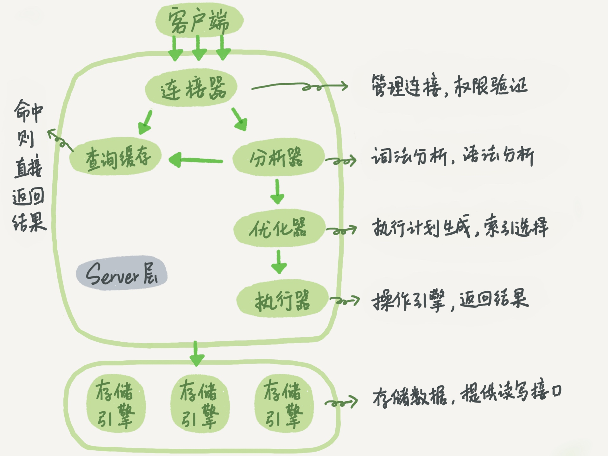
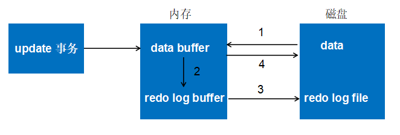
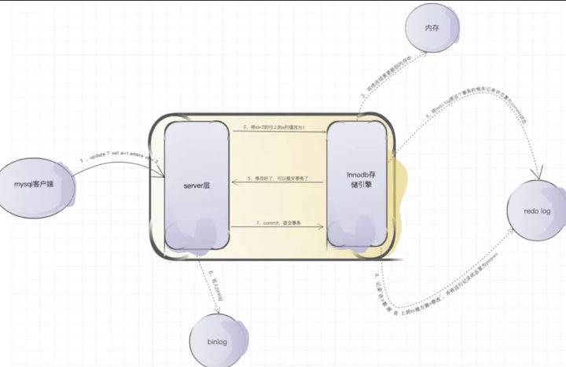

在Mysql上一个系列的事务篇中，提到了Mysql的日志。但是不够详细，加上最近面试问到过，对于其运行机制以及原理还是理解不够深入。这篇文章就来探讨一下这个。

<!-- more -->

## 日志分类

Mysql共有六种日志：重做日志（redo log）、回滚日志（undo log）、二进制日志（binlog）、错误日志（error log）、慢查询日志（slow query log）、一般查询日志（general log）、中继日志（relay log）。一般我们常用的日志有 redo log、undo log、binlog、slow query log。其中redo log是实现mysql事务持久性的保证，undo log是实现原子性的保证，binlog则是用在主从复制的时候，slow query log则是用来查询慢查询的利器。

我们先来分析一下什么是**物理日志**，什么是**逻辑日志**。只有明白了这两个概念，才能更加的理解日志的实现原理。

**物理日志**：存储了数据被修改的值。

**逻辑日志**：存储的是逻辑SQL修改语句。

## 重做日志（redo log）

redo log是InnoDB存储引擎层的日志，叫做重做日志。用于记录事务操作的变化，**记录的是物理日志，即数据修改之后的值**。redo log本身由两部分构成：**重做日志缓冲（redo log buffer）**和**重做日志文件（redo log file）**。

InnoD通过**force log at commit** 机制实现事务的持久性。即在事务提交的时候，必须先将事务的所有事务日志写入磁盘上的redo log file和 undo log file中进行持久化。

**redo的工作过程：**

1. 将原始数据从磁盘中读入内存中来，修改数据的内存拷贝
2. 生成一条重做日志并写入到redo log buffer，记录的是数据被修改后的值
3. 当事务commit时，将redo log buffer中的内存刷新到redo log file，对redo log file 采用追加写的方式
4. 定期将内存中修改的数据刷新到磁盘中。

## 二进制日志（binlog）

binlog属于Mysql Server层面的。binlog是**逻辑格式的日志**，则主要记录的是update/delete/insert这样实际执行的SQL语句。

它的作用主要是用在**复制**，在主从复制中，从库利用主库上的binlog进行重播。同时，可以用于数据库基于某个时间点的**还原**。

redo log和binlog都可以用于还原数据，但是场景不太一样。redo log因为是**循环写**的，当对应事务的数据写入到数据库中，redo log就失去了作用，所有redo log不会存储历史所有数据的变更，文件的内容会被覆盖。

那么redo log 和 binlog的写入顺序是什么？

**Mysql通过两阶段提交来实现redo log和binlog的数据一致。**

通过上图可以知道：

1. InnoDB  redolog写盘，InnoDB事务进入 prepare状态。
2. binlog写盘，InnoDB事务进入commit状态。

这里可以扩展一下Mysql是如果通过binlog来实现**主从复制**的：

1. **主从复制的方式**

   1. **基于语句的复制**，也成为逻辑复制。即主库记录造成数据更改的查询，当备库读取并重放这些事件时，实际上只是把主库上执行过的SQL再执行一遍。
   2. **基于行的复制**。这种方式是将实际数据记录在binlog中。

   MySQL会在这两种复制方式间动态切换，默认情况下使用基于语句的复制方式，如果发现语句无法被正确的复制，那么切换到基于行的复制模式下。

2. **主从复制原理**

   MySQL主从复制涉及到三个线程：一个运行在主节点的**log dump thread**，其余两个**I/O thread**、**SQL thread** 运行在从节点。

   1. 当从节点连接到主节点时，主节点会创建一个log dump 线程，用于发送binlog，在读取binlog中的操作时，此线程会对主节点的binlog加锁，在读取完成发送给从节点之前，释放锁。
   2. 从节点会创建一个I/O线程来连接主节点，当I/O线程接收到主节点的binlog之后，会保存在本地的relaylog。
   3. 当从节点的SQL线程检测到relay log新增内容后，会将relay log的内容解析为实际执行的操作，在从库上执行。

3. **主从复制模式**
   1. **异步模式** 。Mysql主从复制默认的是异步模式。这种模式下，主节点不会主动push binlog到从节点，只只会在事务写入binlog后，通知dump 线程发送这些新的数据，然后继续处理提交操作，不保证这些binlog传到任何一个从库节点。
   2. **全同步模式**。当主库执行完一个事务，所有从库都执行完该事务才返回给客户端。
   3. **半同步模式**。主库在执行完客户端提交的事务后，不是立刻返回给客户端，而是等待至少一个从库接收并写到relay log中才返回给客户端。

4. **主从复制延迟**
   1. 产生延迟的原因：主节点如果执行一个很大的事务，那么就会对主从延迟产生较大的影响；网络延迟，slave数量较多；主节点多线程写入，丛节点只有单线程恢复。
   2. 解决办法：将大事务拆分为事务；减少从节点数量；对延迟要求较高的强制都走主节点。

## 回滚日志（undo log）

undo log主要记录的是数据的逻辑变化，为了在发生错误时回滚之前的操作，需要将之前的操作都记录下来，然后在发生错误时才可以回滚。

undo log主要存储的是**逻辑日志**，比如，一条insert语句，那么undo log会记录一条对应的delete日志；一个update语句，那么则记录着一条相反的update记录。

undo log主要有两个作用：

1. **回滚**。当某些原因的时候事务失败，需要回滚，那么就可以利用undo log进行回滚。
2. **多版本控制（mvcc）**。因为undo log记录着修改之前的数据，mvcc实现的是读写不阻塞，那么读的时候只需要返回前一个版本数据即可。

## 总结

当面试官问我知道mysql中的日志吗？

我回答知道。但是也仅仅说出了这三个日志的作用。当他问我那你知道这日志里面的记录的是什么的时候？我有点懵逼，哈？都问到了实现结构了嘛？现在回想起来，才发现，面试官可能想问的是：**redo log里面记录的是修改后的记录，是物理日志，而undo log里面的则是相反的sql语句，是逻辑日志**。只怪我当时脑子抽了~谨记谨记。

> 参考
>
> 1. https://pjmike.github.io/2019/01/14/%E6%B5%85%E6%9E%90MySQL%E4%BA%8B%E5%8A%A1%E4%B8%AD%E7%9A%84redo%E4%B8%8Eundo/
> 2. https://www.linuxidc.com/Linux/2018-11/155431.htm
> 3. https://zhuanlan.zhihu.com/p/112106862
> 4. https://juejin.im/post/5ca2a176f265da30ba5b0b91