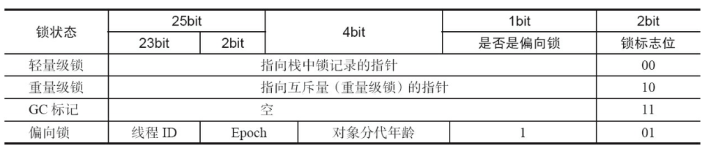

不管在实际开发中，还是在面试中，synchronized一直扮演着重要的角色。因为这个关键字很能体现工程师的技术功底，到底是简单的会用，还是能够深入了解底层实现。简单的一个synchronized，能由浅入深，一直问到底层硬件。因此，借此文章，来梳理一下相关技术体系。

<!-- more -->

### synchronized基本原理及用法

synchronized首先是一种悲观锁，Java中每一个对象都是一把锁。具体用法两种：

* 锁方法，锁普通同步方式是锁的当前实例对象，锁静态同步方法，锁的是当前类的class文件
* 锁代码块，锁的是括号里面的对象。

从字节码角度来看，锁方法和锁代码块生成的jvm字节码是不同的。

```
{
  public void syncBlock();
    descriptor: ()V
    flags: ACC_PUBLIC
    Code:
      stack=2, locals=3, args_size=1
         0: aload_0
         1: dup
         2: astore_1
         3: monitorenter				 	  // monitorenter指令进入同步块
         4: getstatic     #2                  // Field java/lang/System.out:Ljava/io/PrintStream;
         7: ldc           #3                  // String hello block
         9: invokevirtual #4                  // Method java/io/PrintStream.println:(Ljava/lang/String;)V
        12: aload_1
        13: monitorexit						  // monitorexit指令退出同步块
        14: goto          22
        17: astore_2
        18: aload_1
        19: monitorexit						  // monitorexit指令退出同步块
        20: aload_2
        21: athrow
        22: return
      Exception table:
         from    to  target type
             4    14    17   any
            17    20    17   any
 

  public synchronized void syncMethod();
    descriptor: ()V
    flags: ACC_PUBLIC, ACC_SYNCHRONIZED      //添加了ACC_SYNCHRONIZED标记
    Code:
      stack=2, locals=1, args_size=1
         0: getstatic     #2                  // Field java/lang/System.out:Ljava/io/PrintStream;
         3: ldc           #5                  // String hello method
         5: invokevirtual #4                  // Method java/io/PrintStream.println:(Ljava/lang/String;)V
         8: return
 
}
```

从上面字节码可以看出来，对于**锁代码块**来说，javac编译时，会生成monitorenter 和 monitorexit两种 指令，其中两个monitorexit指令是保证异常情况下也能释放锁。对于**锁方法**来说，在方法描述会有ACC_SYNCHRONIZED标识，标识该方法使用该方法的实例对象或者是所属Class在JVM中对应的Klass作为锁对象（类加载过程的第一个阶段 ：加载 完成的事情中 其中之一就是在内存中生成一个代表这个类的java.lang.Class对象，作为方法区这个类的各种数据的访问入口）。

### Java对象头和Monitor

synchronized在操作同步资源之前，会先给同步资源加锁，这个锁是什么？以及存放在什么地方？这就引出了接下来的Java对象头和Monitor。

#### Java对象头

在Hotspot虚拟机中，对象在堆中的内存布局可以划分为三部分：对象头，实例数据和对齐填充。

对象头包括两部分，一部分是Mark Word，默认存储对象的HashCode，分代年龄和锁的标志位信息。

另外一部分是类型指针，即对象指向该对象所属类的指针，即通过这个指针来确定该对象是哪个类的实例。Mark Word默认存储结构如下：

在运行期间，MarkWord里存储的数据会随着锁标志位变化为变化。当对象状态为偏向锁时，存储的是偏向的线程ID；当为轻量级锁时，存储的是指向线程栈中的Lock Record；当为重量级锁时，为指向堆中monitor的指针。

由上图也可以知道，锁的状态变化是 无锁状态-->偏向锁-->轻量级锁-->重量级锁。

#### Monitor

当锁为重量级锁时，MarkWord中存储的是指向重量级锁的指针。这个monitor是什么？