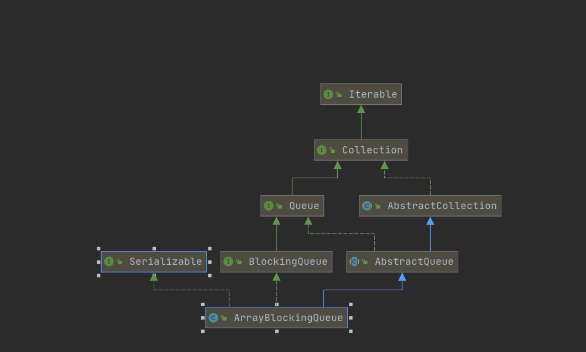

今天在重温线程池源码的时候，看到了阻塞队列，发现并没有对其进行深入了解，因此通过这篇文章来进行源码方面的分析。


<!-- more -->

### 什么是阻塞队列

我们通过查看源码知道，阻塞队列也是JUC包下的类，是一种支持阻塞等待的队列，提供了在多线程下的队列操作。在阻塞队列中，从阻塞对垒中获取数据，如果队列为空，那么线程会阻塞等待知道队列非空。同样的当往阻塞队列中插入数据时，如果队列已满，那么线程会阻塞直到队列非满。

阻塞队列的应用场景，我们前面介绍的线程池，还有就是生产者消费者的场景：生产者往队列里面添加元素，消费者从队列中取出元素。

阻塞队列提供了四种方法，每种方法对应不同的返回值。

| 方法\处理方式 | 抛出异常  | 返回特殊值 | 一直阻塞 | 超时退出           |
| :------------ | :-------- | :--------- | :------- | :----------------- |
| 插入方法      | add(e)    | offer(e)   | put(e)   | offer(e,time,unit) |
| 移除方法      | remove()  | poll()     | take()   | poll(time,unit)    |
| 检查方法      | element() | peek()     | 不可用   | 不可用             |

我们在线程池中就是通过队列的poll和take方法来实现核心线程数线程管理。当线程数大于核心线程数时，那么就从队列中poll数据，如果线程数小于核心线程数，那么就从队列中take数据，如果取不到，那么就一直阻塞，从而实现了核心线程数的保持。

```java
  // Are workers subject to culling?
boolean timed = allowCoreThreadTimeOut || wc > corePoolSize;

Runnable r = timed ?
    workQueue.poll(keepAliveTime, TimeUnit.NANOSECONDS) :
    workQueue.take();
```

### ArrayBlockingQueue源码分析

我们先来分析ArrayBlockingQueue阻塞队列。可以看出，ArrayBlockingQueue继承AbstractQueue，而AbstractQueue继承Queue。



从最上面的图中，我们可以看出ArrayBlockingQueue是用数组实现的有界阻塞队列，我们看其源码属性：

```java
// 存储队列元素的数组，是个循环数组
final Object[] items;
// take, poll, peek or remove方法所使用的数据索引
int takeIndex;
//  put, offer, or add方法所使用的数据索引
int putIndex;
// 元素个数
int count;

// 可重入锁
final ReentrantLock lock;
// notEmpty条件对象
private final Condition notEmpty;
// notFull条件对象
private final Condition notFull;

```

### 构造函数

```java
public ArrayBlockingQueue(int capacity, boolean fair) {
    if (capacity <= 0)
        throw new IllegalArgumentException();
    this.items = new Object[capacity];
    lock = new ReentrantLock(fair);
    notEmpty = lock.newCondition();
    notFull =  lock.newCondition();
}
```

构造函数主要初始化了数组长度，以及创建lock对象，以及两个notEmpty、notFull条件对象。

### 数据添加

可以看出来，**add方法**最终是调用ArrayBlockingQueue的offer方法。当队列满了之后，**offer方法返回false**，那么**add方法直接抛出异常**。

```java
public boolean add(E e) {
    return super.add(e);
}

public boolean add(E e) {
	if (offer(e))
		return true;
	else
		throw new IllegalStateException("Queue full");
}

public boolean offer(E e) {
    //判断不为null,如果为null,则抛出异常
    checkNotNull(e);
    //加锁
    final ReentrantLock lock = this.lock;
    lock.lock();
    try {
        //如果数量等于数组长度，则返回false
        if (count == items.length)
            return false;
        else {
            //否则执行入队操作。
            enqueue(e);
            return true;
        }
    } finally {
        //最后解锁。
        lock.unlock();
    }
}
```

入队方法：

```java
private void enqueue(E x) {
    // 将元素防止在putIndex位置。
    final Object[] items = this.items;
    items[putIndex] = x;
    //如果putIndex等于数组长度了，那么重置为0
    if (++putIndex == items.length)
        putIndex = 0;
    //计数+1
    count++;
    //通知notEmpty等待队列。
    notEmpty.signal();
}
```

可以看出，底层的数组使用循环插入的方式。因为队列的原则的是FIFO，先进先出，所以最先进来的数据会防止在putIndex=0的位置，当取出的时候，也是首先取出数组首位的元素。因此当数组放置满了之后，下次就要从头开始。

我们最后看**put方法**：**put方法**在队列不满的情况下，将元素添加到队列尾部，如果队列已满，则**进行阻塞**。

```java
public void put(E e) throws InterruptedException {
    //判断待插入元素是否为null
    checkNotNull(e);
    //加锁
    final ReentrantLock lock = this.lock;
    lock.lockInterruptibly();
    try {
        //如果队列已满，那么调用await方法，进行阻塞。
        while (count == items.length)
            notFull.await();
        //当唤醒时，再进行入队操作。
        enqueue(e);
    } finally {
        //最后解锁。
        lock.unlock();
    }
}
```

### 数据删除

移除方法 ： remove()  poll()  take()。

remove方法：可以看出remove实际上是调用poll方法，**当队列为空时，poll方法返回false，remove方法抛出异常**。

```java
public E remove() {
    E x = poll();
    if (x != null)
        return x;
    else
        throw new NoSuchElementException();
}

public E poll() {
    final ReentrantLock lock = this.lock;
    lock.lock();
    try {
        return (count == 0) ? null : dequeue();
    } finally {
        lock.unlock();
    }
}
```

而poll方法则调用**dequeue出队**方法：

```java
private E dequeue() {
    final Object[] items = this.items;
    @SuppressWarnings("unchecked")
    E x = (E) items[takeIndex];
    items[takeIndex] = null;
    if (++takeIndex == items.length)
        takeIndex = 0;
    count--;
    if (itrs != null)
        itrs.elementDequeued();
    //能够取出，数据，自然队列没有满，因此唤醒notFull等待对象。
    notFull.signal();
    return x;
}
```

最后我们看take方法：**如果队列为null，则一直阻塞。**

```java
public E take() throws InterruptedException {
    final ReentrantLock lock = this.lock;
    lock.lockInterruptibly();
    try {
        while (count == 0)
            //如果取不到数据，则进行阻塞
            notEmpty.await();
        return dequeue();
    } finally {
        lock.unlock();
    }
}
```

