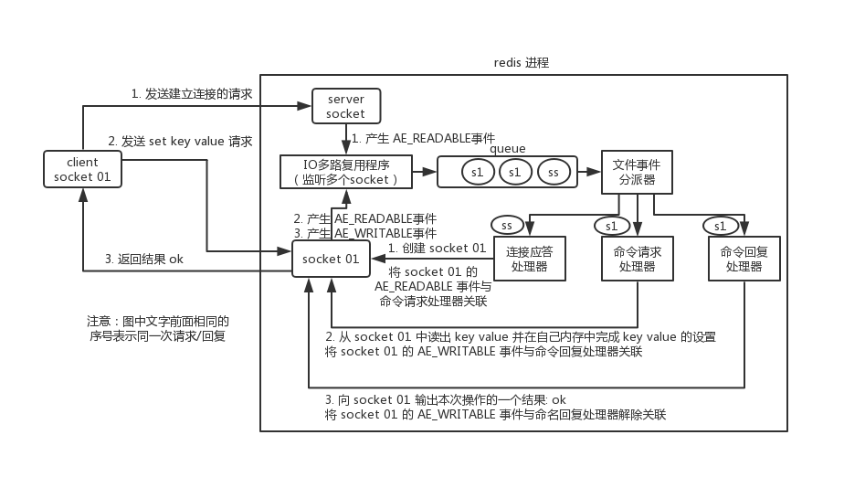

Redis目前可以说是每个工程师必会的。这分布式锁之[Redis分布式锁](https://blog.yzylcc.top/2020/04/19/redisLock/#valine-comments)中，我们对Redis进行了部分讲解。这个系列对Redis进行系统的知识归纳。

### Redis为什么这么快？

我们第一个问题就来探索，Redis为什么这么快？这个问题要从Redis的线程模型说起。

#### Redis的线程模型

Redis内部使用**文件事件处理器 file event hanler**，它的组成是**多个socket**、**I/O多路复用程序**、**文件分派器**、**事件处理器**组成，因为文件事件处理器是单线程的，所以redis 才叫做单线程模型。文件事件处理器会使用I/O多路复用程序来同时监听多个socket，多个文件事件可能并发出现，但是I/O多路复用程序会把所有事件套接字放在一个队列中，然后**同步有序**的向文件分派器传送，当上一个socket的事件处理完，才会传送下一个socket。

上图是一个完整的客户端与Redis通信过程。

1. redis服务端初始化的时候，会将server socket的AE_READABLE事件与连接应答处理器关联。
2. 客户端client向redis进程的server socket请求建立连接，此时server socket会产生一个AE_READABLE事件，IO多路复用程序监听到server socket产生的事件后，将该socket压入队列，文件事件分派器，从队列中获取socket，交给连接应答处理器。连接应答处理器会创建一个能与客户端通信的socket01，并将该socket01的AE_READABLE事件与命令请求处理器关联。

3. 假如此时客户端发送了 set key value请求，此时redis的socket01会产生AE_READABLE事件，IO多路复用程序会将socket01压入队列，此时事件分派器从队列中获取到socket01的AE_READABLE事件，由于前面socket01的AE_READABLE事件与命令请求处理器关联，因此事件分派器将事件交给命令请求处理器来处理。命令处理器读取socket01的key value并在自己内存中完成key value的设置，操作完成后，将socket01的AE_WRITEABLE事件与命令回复处理器相关联。

4. 如果此时客户端准备好接受返回结果了，那么redis中的socket01会产生一个AE_WRITABLE事件，同样压入队列中，事件分派器找到相关联的命令回复处理器，由命令回复处理器对socket01输出本次操作的结果，比如 ok ，之后解除socket01的AE_WRITABLE事件与命令回复处理器的关联。

这样就完成了一次通信过程。

可以看出首先找到请求应答处理器，将AE_READABLE事件与命令处理器关联。当客户端发出命令时，通过AE_READABLE事件找到命令处理器处理命令，同时将AE_WRITABLE事件与命令回复处理器关联。最终 socket01产生AE_WRITABLE事件，再通过该事件找到命令回复处理器，最终完成回复，并解除关联。整个过程串行进行。

#### IO多路复用程序

IO多路复用是用**一个线程监听多个socket**，谁有读写事件就处理谁，减少线程切换开销和IO阻塞。

redis的IO多路复用 程序是包装常见的select poll epoll等IO多路复用库实现的。

1. **select** : 传入的需要检查的描述子个数 fds、读fd_set、写fd_set、异常fd_set参数，数据结构是bitmap。缺点在于fds最大支持1024个，并且每次调用都要把fd集合拷贝到内核态，每次都要遍历所有fds，开销很大
2. **poll** : 跟select差不多，不过数据结构是链表，因此大小没有限制
3. **epoll** : epoll是对select，poll的改进。epoll_create在内核创建一个红黑树，用于存储epoll_ctl产过来的socket，同时创建一个链表，用于存储准备就绪的事件。epoll_wait调用时，只需要观察链表里面有没有数据即可。保证了每个fd在整个过程中只拷贝一次，并且不需要遍历所有fd，效率很高。

#### 总结

所以，我们可以从几个方面总结为什么Redis这么快？

1. 因为Redis的线程模型**文件事件处理器**使用的是IO多路复用模型。
2. 纯内存操作
3. 单线程避免了上下文的切换问题，也避免了多线程可能产生的竞争问题。

