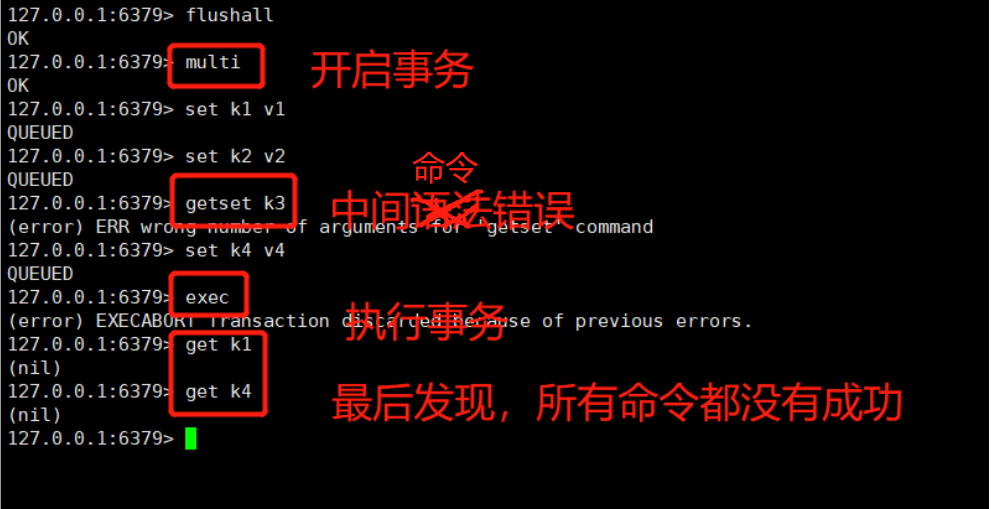
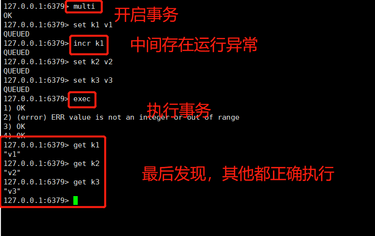

Redis也是有事务的。MULTI，EXEC、DISCARD 和WATCH 是Redis事务相关的命令。

<!-- more -->

事务可以一次性执行多个命令，并且带有一下两个重要的保证：

1. 事务是一个单独的隔离操作：事务中的所有命令都会序列化、按顺序的执行。事务在执行期间，不会被其他客户端发送来的命令打断。
2. 事务是一个原子操作。

### 用法

MULTI 命令用于开启一个事务，当MULTI执行之后，客户端可以继续向服务器发送任意多条指令，这些指令不会被立即执行，而是放在一个队列中，当EXEC命令执行的时候，所有队列中的命令才会被执行。

如果调用DISCARD，客户端可以清空事务队列，并放弃执行事务。

但是需要注意的是：

1. 如果事务队列中存在命令性错误，类似java编译性错误，那么执行exec时，所有命令都不执行。

2. 事务队列中存在语法错误错误，类似java中的1/0的运行时异常，那么执行exec后，其余正确的命令会被执行，错误命令抛出异常。

### 为什么Redis不支持回滚

1. Redis命令只会因为错误的语法而失败或者命令用在了错误类型的键上，这也就是说，从实用性的角度来说，失败的命令是由编程错误造成的，这些错误应该再开发的过程中被发现，而不应该出现在生产环境中。
2. 因为不需要对回滚进行支持，所以Redis内部可以保持简单且快速。

#### Redis事务的CAS方案

WATCH命令可以为Redis事务提供CAS保证。

被WATCH的键会被监视，并会发现这些键是否被改动过，如果有至少一个被监视的键在EXEC执行前被修改，那么整个事务都会被取消。

#### 如何保证Redis并发竞争问题

如果有多客户端并发同时写一个key，可能本来应该先到的数据后到了，导致数据版本发生错误。

我们可以使用Redis自带的CAS乐观锁方案。也可以基于ZK 实现分布式锁，确保同一时间只有一个系统实例可以在操作某个key。

