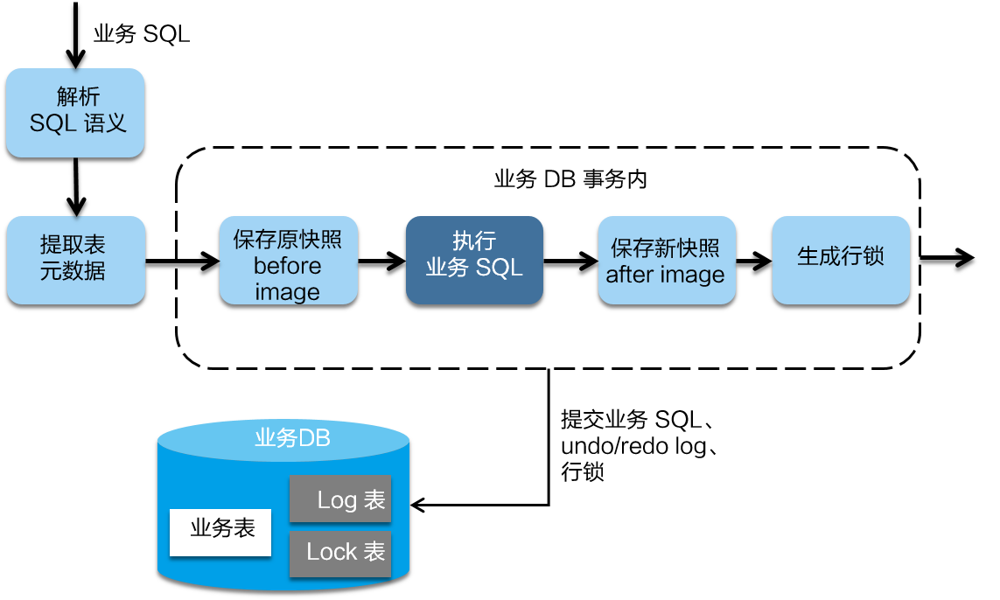
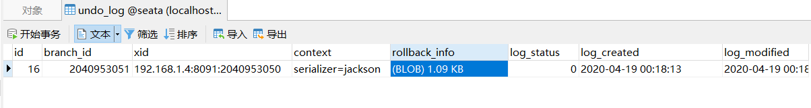
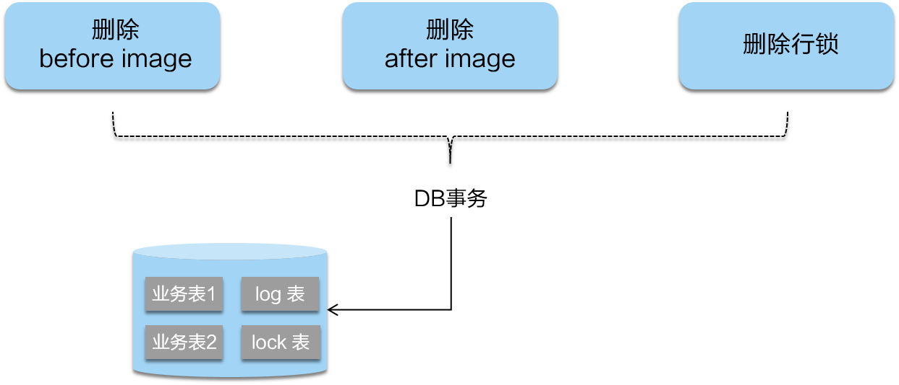
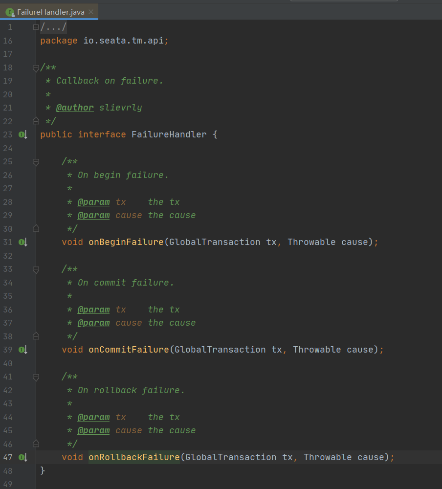
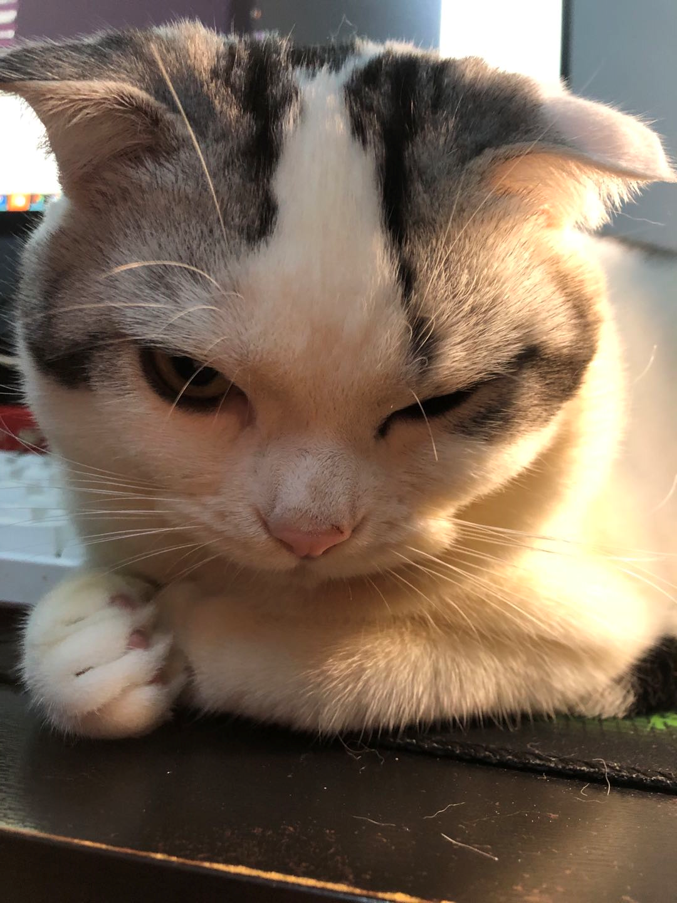

在现在的微服务架构中，分布式事务问题是一个非常常见的问题。常见的分布式事务解决方案有：XA方案、TCC方案、本地消息表方案以及可靠消息最终一致性方案等。其中一些方案需要我们手动实现，一些方案基于消息中间件，中间很多细节需要我们考虑，有时候体验并不好。Seata的出现，就是为了解决分布式事务中复杂的问题，这篇文章也是个人研究seata的开始。

<!-- more -->

### 什么是Seata

这里引用官网的一句话：

> ​	Seata 是一款开源的分布式事务解决方案，致力于在微服务架构下提供高性能和简单易用的分布式事务服务。Seata 将为用户提供了 AT、TCC、SAGA 和 XA 事务模式，为用户打造一站式的分布式解决方案。

可以看出来，seata致力于让分布式事务 解决更加优雅和简单易用。

Seata支持AT模式、TCC模式、SAGA模式以及XA模式。

### Seata的重要组成

#### TC - 事务协调者

维护全局和分支事务的状态，驱动全局事务提交或回滚。（seata server）

#### TM - 事务管理器

定义全局事务的范围：开始全局事务、提交或回滚全局事务。(可以简单认为谁头上有@GlobalTransaction的注解谁就是TM)

#### RM - 资源管理器

管理分支事务处理的资源，与TC交谈以注册分支事务和报告分支事务的状态，并驱动分支事务提交或回滚。(TM下管理的分支)

其中TM和RM是作为Seata的客户端与业务系统集成在一起。TC作为Seata的服务端需要独立部署。

这里可以借助官网的一张图来解释三者的关系。

### 执行流程

在Seata中，分布式事务的执行流程是：

* TM开启分布式事务，TM向TC注册全局事务记录，全局事务创建成功且生成全局性唯一事务ID，XID。
* XID在微服务调用链路的上下文进行传播
* RM向TC注册分支事务，将其纳入XID对应的全局事务的管辖
* TM向TC发起针对XID的全局事务提交/回滚请求（事务一阶段）
* TC调用XID下管辖的全部分支事务完成提交/回滚请求（事务二阶段）

### Seata AT模式

AT模式是一种无侵入的分布式事务解决方案。在AT模式下，我们只需要关注自己的“业务SQL”，用户的“业务SQL”作为一阶段，Seata框架会自动生成事务的二阶段提交和回滚操作。

#### AT模式如何做到对业务无侵入？

* 一阶段

一阶段中，Seata会拦截“业务SQL”，首先解析SQL语义，找到“业务SQL”要更新的业务数据，在业务数据被更新前，将其保存为"**before image**"（各自数据库汇总undo_log表），然后执行“业务SQL”更新业务数据，在业务数据更新之后，再将其保存为"**after image**"（各自数据库汇总undo_log表），最后生成行锁（seata 服务器）。以上操作全部在一个数据库事务中完成，这样保证了一阶段操作的原子性。

* 二阶段提交

二阶段如果是提交的话，因为”业务SQL“在一阶段已经提交至数据库，所以Seata框架只需将一阶段保存的快照数据和行锁删掉，完成数据清理即可。

* 二阶段回滚

二阶段如果是回滚的话，Seata就需要回滚一阶段已经执行的“业务SQL”,还原数据。回滚方式是用“before image”还原业务数据。还原之前首先校验脏写，对比“数据库当前业务数据” 和 “after image”，如果两份数据完全一致，则说明没有脏写，然后执行还原业务数据，如果不一致说明发生脏写，出现脏写则需要人工处理。可以实现**FailureHandler**的 onRollBackFailure方法。

### 结语

以上是Seata的大致原理，其中大部分来自官网 ，毕竟官网是学习的最好指导老师。接下来，试着从源码的角度来分析下Seata的执行流程，打算首先看下before image 和 after image的生成处理逻辑，毕竟Seata的整个过程都是跟这两个快照打交道的。哈哈，以我的红中来结束这篇文章吧。

