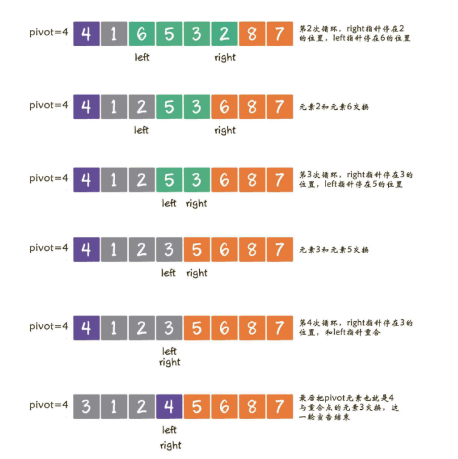
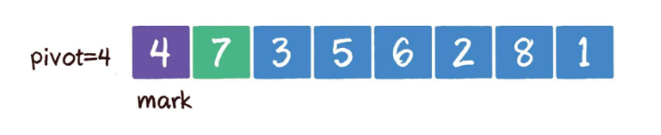
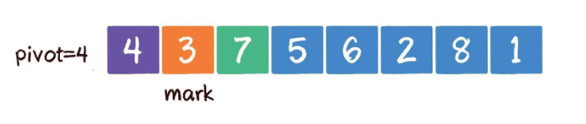
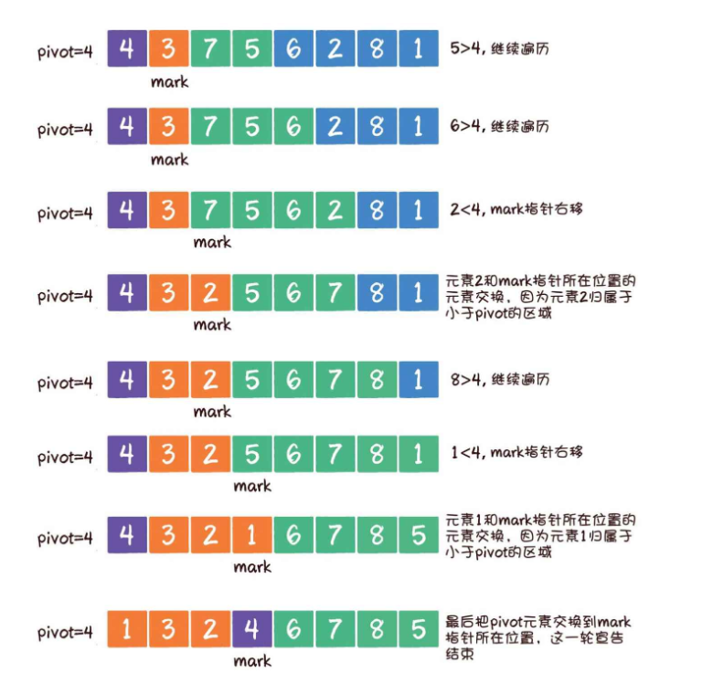
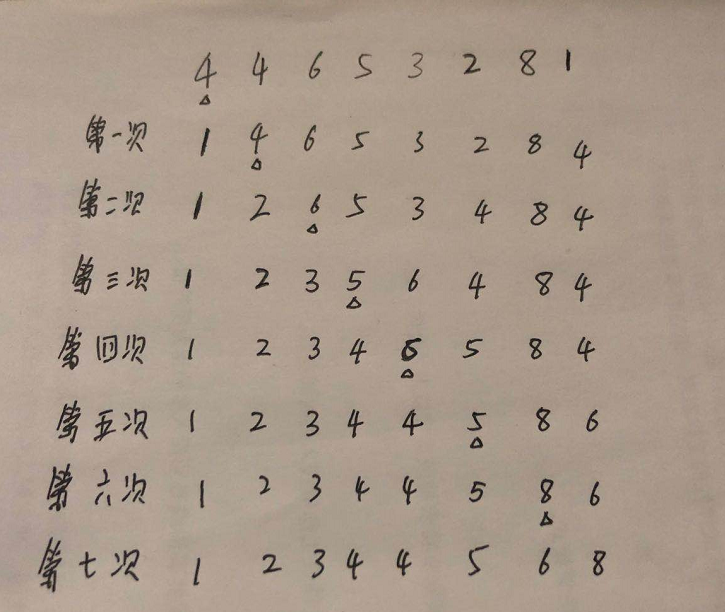
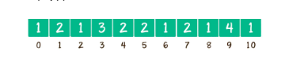

一直来对算法都有很深的恐惧，一直想战胜这个可怕的敌人，可家里的这本《算法》第四版在大学的时候就买了，至今还在吃灰。其实，现在反思自己，算法又有什么难得呢？只是自己从来没有认真系统的去学习过，而且现在面试对于算法的要求也越来越高，不管从哪个角度出发，什么时候重新学习都不晚。从现在就重新拾起来吧，不断总结，不断复习。就从最基础的排序开始。

<!-- more -->

### 冒泡排序

冒泡排序可能是大学入门学的第一个算法，也是最简单的排序算法。

冒泡算法的思想是：**把相邻的元素两两对比，当左边元素大于右边元素时，进行位置交换，每趟可以找出待排序中的最大元素，放到最右边，经过N-1趟排序后，所有元素有序**。

冒泡排序是一种稳定排序，由于该算法每一轮都要遍历所有元素，总共遍历N-1次，平均时间复杂度为O(N²)。

代码实现：

```java
public class Bubble {
    public static void sort(int[] arrys) {
        for (int i = 0; i < arrys.length -1; i++) {
            for (int j = 0; j < arrys.length - 1 - i; j++) {
                if (arrys[j] > arrys[j + 1]) {
                    int temp = arrys[j + 1];
                    arrys[j + 1] = arrys[j];
                    arrys[j] = temp;
                }
            }
        }
    }

    public static void main(String[] args) {
        int[] a = {2,1,4,9,8,7,5,3};
        sort(a);
        System.out.println(Arrays.toString(a));
    }
}
```

#### 冒泡排序的优化1

其实不需要每次完全进行N-1次排序，很有可能到后面几趟排序时，数组完全就是有序的，那么剩下的几趟排序就可以提前结束。

代码如下：

```java
//利用标识位，如果本轮排序中，有交换，说明数组还是无序的，如果元素没有发生交换，
//说明数组已经有序，则跳出循环
public class Bubble {
    public static void sort(int[] arrys) {
        for (int i = 0; i < arrys.length -1; i++) {
            //有序标记，每一轮的初始值都是true
            boolean flag = true;
            for (int j = 0; j < arrys.length - 1 - i; j++) {
                if (arrys[j] > arrys[j + 1]) {
                    int temp = arrys[j + 1];
                    arrys[j + 1] = arrys[j];
                    arrys[j] = temp;
                    //因为有元素进行交换，所以不是有序，标记变为false
                    flag = false;
                }
            }
            if (flag) {
                break;
            }
        }
    }

    public static void main(String[] args) {
        int[] a = {2,1,4,9,8,7,5,3};
        sort(a);
        System.out.println(Arrays.toString(a));
    }
}
```

#### 冒泡排序优化2

每趟排序，右边元素很多已经有序，此时每趟排序无需进行到底。优化点在于，在每轮排序后，记录下来最后一次元素交换的位置，该位置即为无序数组的边界，再往后就是有序区。

代码如下：

​	

```java
public class Bubble {
    public static void sort(int[] arrys) {
        //记录最后一次交换的位置
        int lastExchangeIndex = 0;
        //无序数列的边界，每次比较只需比到这里位置，首次全部比较
        int sortBorder = arrys.length - 1;
        for (int i = 0; i < arrys.length -1; i++) {
            //有序标记，每一轮的初始值都是true
            boolean flag = true;
            for (int j = 0; j < sortBorder; j++) {
                if (arrys[j] > arrys[j + 1]) {
                    int temp = arrys[j + 1];
                    arrys[j + 1] = arrys[j];
                    arrys[j] = temp;
                    //因为有元素进行交换，所以不是有序，标记变为false
                    flag = false;
                    //更新最后一次交换元素的位置
                    lastExchangeIndex = j;
                }
            }
            sortBorder = lastExchangeIndex;
            if (flag) {
                break;
            }
        }
    }

    public static void main(String[] args) {
        int[] a = {2,1,4,9,8,7,5,3};
        sort(a);
        System.out.println(Arrays.toString(a));
    }
}
```

### 快速排序

快速排序与冒泡排序不一样的是，冒泡排序在每一轮中只把一个元素冒泡到数组的一端。而快速排序则是每一轮挑选一个**基准元素**，并让比它小的元素排在左边，比它大的元素排在右边。整个数组一分为二，然后再次对左右进行相同的排序一分为二，直到不可再分为止。这种思路就是常见的分治法。

快速排序每一轮比较交换，需要把数组全部遍历一遍，时间复杂度是O(N)，平均需要进行logN轮，因此总体平均时间复杂度是O(NlogN)。

基准元素最简单的方式是选择数组的第一个元素。但是在最坏的情况下，每个右边的所有元素都比基准元素小，这种极端情况下，需要进行N轮，无法一分为二，时间复杂度退化为O(N²)。这种情况可以随机算则一个元素作为基准元素，并且和数组首元素进行交换，这样就可以有效的将数组一分为二。

#### 元素的交换

具体有两种实现方式

1. 双边循环法
2. 单边循环法

##### 双边循环法：

选定基准元素pivot，并设置两个指针left和right，指向数组最左最右两个元素。每次从right指针出发，与基准元素进行比较，如果大于或等于pivot元素，指针向左移动。如果小于pivot则停止移动。然后轮到left指针移动，如果小于或者等于pivot元素，指针向右移动；如果大于pivot，则left指针停止移动。**当都停止移动后，交换left和right指针所指元素**，然后再次从右边开始，依次类推，当两个指针相遇时，把基准元素与left/right所指元素交换。这样基准元素左边都会比它小，右边都会比它大。左右数组再次进行递归排序。



代码实现：

​	

```java
public class quickSort {
    public static void quicksort(int[] arr, int startIndex, int endIndex) {
        //递归结束条件
        if (startIndex >= endIndex) {
            return;
        }
        //得到基准元素的位置
        int pivotIndex = partiton(arr, startIndex, endIndex);
        quicksort(arr, startIndex, pivotIndex - 1);
        quicksort(arr, pivotIndex + 1, endIndex);

    }

    public static int partiton(int[] arr, int startIndex, int endIndex) {
        //取第一个元素作为基准元素
        int pivot = arr[startIndex];
        int left = startIndex;
        int right = endIndex;
        while (left != right) {
            //首先从右边开始
            while (left<right && arr[right] >= pivot) {
                right--;
            }
            while (left < right && arr[left] <= pivot) {
                left++;
            }
            if (left < right) {
                int temp = arr[left];
                arr[left] = arr[right];
                arr[right] = temp;
            }
        }
        //将基准元素与left/right重合点元素交换
        arr[startIndex] = arr[left];
        arr[left] = pivot;
        return left;
    }

    public static void main(String[] args) {
        int[] arr = {4, 4, 6, 5, 3, 2, 8, 1, 4};
        quicksort(arr, 0, arr.length - 1);
        System.out.println(Arrays.toString(arr));
    }
}
```

#### 单边循环法

单边循环法，只需要从数组一边对元素进行遍历和交换。设置mark指针指向数组起始位置，这个指针的作用是代表小于基准元素的区域边界，就是说这个指针左边的都是小于基准元素的。只有当遇到比基准小的元素，mark指针向前前进一位，然后交换与mark指针所指元素的位置。



首先遍历元素7,7>4，则继续遍历。当遍历到3时，小于基准元素，则mark指针+1指向7，然后交换7与3的位置。



后续均按照这个思路进行



代码实现：

​	

```java
public class quickSort2 {
    public static void quicksort(int[] arr, int startIndex, int endIndex) {
        //递归结束条件
        if (startIndex >= endIndex) {
            return;
        }
        //得到基准元素的位置
        int pivotIndex = partiton(arr, startIndex, endIndex);
        quicksort(arr, startIndex, pivotIndex - 1);
        quicksort(arr, pivotIndex + 1, endIndex);
    }

    public static int partiton(int[] arr, int startIndex, int endIndex) {
        int pivot = arr[startIndex];
        int mark = startIndex;
        for (int i = startIndex + 1; i <= endIndex; i++) {
            if (arr[i] < pivot) {
                mark++;
                int temp = arr[i];
                arr[i] = arr[mark];
                arr[mark] = temp;
            }
        }
        arr[startIndex] = arr[mark];
        arr[mark] = pivot;
        return mark;
    }

    public static void main(String[] args) {
        int[] arr = {4, 4, 6, 5, 3, 2, 8, 1};
        quicksort(arr, 0, arr.length - 1);
        System.out.println(Arrays.toString(arr));
    }
}
```

### 选择排序

选择排序是一种简单直观的算法，基本思想是每一趟从待排序的数据元素中选择最小元素作为首元素，然后从剩下未排序的元素中找到最小元素，放到已排序的数组后面，直到所有元素排完为止。是一种**不稳定**的排序。时间复杂度为O(N²)

​	

```java
public class selectSort {
    public static void selectsort(int[] arr) {
        for (int i = 0; i < arr.length-1; i++) {
            //每一趟循环比较时，minIndex用于存储较小元素的数组下标
            int minIndex = i;
            for (int j = i + 1; j < arr.length; j++) {
                if (arr[j] < arr[minIndex]) {
                    minIndex = j;
                }
            }
            //等一轮排序过后，如果minIndex发生了变化，说明较小的元素出现
            //与未排序数组首位进行交换
            if (minIndex != i) {
                int temp = arr[minIndex];
                arr[minIndex] = arr[i];
                arr[i] = temp;
            }

        }
    }

    public static void main(String[] args) {
        int[] arr = {4, 4, 6, 5, 3, 2, 8, 1};
        selectsort(arr);
        System.out.println(Arrays.toString(arr));
    }
}
```



### 插入排序

插入排序的基本思想是**每一步将一个待排序的记录，插入到前面已经排好序的有序序列中，直到插完所有元素为止**。

​	

```java
public class InsertSort {
    public static void insertsort(int[] arr) {
        for (int i = 1; i < arr.length; i++) {
            int j = i;
            //循环与前面已经排好序的数组比较，插入到合适的位置。
            while (j > 0 && arr[j] < arr[j - 1]) {
                int temp = arr[j];
                arr[j] = arr[j - 1];
                arr[j - 1] = temp;
                j--;
            }
        }
    }

    public static void main(String[] args) {
        int[] arr = {4, 4, 6, 5, 3, 2, 8, 1};
        insertsort(arr);
        System.out.println(Arrays.toString(arr));
    }
}
```

### 堆排序

二叉堆所有节点都存储在数组中，假设父节点下标是parent，那么左孩子下标就是2×parent+1，右孩子下标就是2×parent+2。

二叉堆的特性有：

1. 最大堆的堆顶是整个堆中的最大元素
2. 最小堆的堆顶是整个堆中的最小元素

以最小二叉堆为例，插入节点到二叉堆中，先插入到二叉树的最后一个位置，然后与其父节点比较，如果比父节点小，则‘上浮’，一直比父节点大为止。

同样以最小二叉堆为例，如果删除堆顶，则把最后一个元素放到堆顶位置，然后跟左右孩子比较，与孩子节点最小的一个进行交换，一直到不能再交换位置。

构建二叉堆，就是把一个无序的完全二叉树调整为二叉堆，本质就是让所有**非叶子节点**依次下沉。


因此堆排序思想是：**每次删除旧堆顶，调整后的新堆顶就是大小仅次于就旧堆顶的节点，只要反复删除堆顶，反复调整二叉堆，所得到的集合就是一个有序集合。（当然不是真正删除，而是将旧堆顶跟末尾节点交换位置。）**

堆排序算法的步骤是:

1. 把无序数组构建成二叉堆，需要从小到大排序，则构建为最大堆，需要从大到小排序，则构建成最小堆。
2. 循环删除堆顶元素，替换到二叉堆的末尾，调整堆产生新的堆顶。

代码表示：

​	

```java
public class HeapSort {
    public static void downAdjust(int[] arr, int parentIndex, int length) {
        //temp 保存父节点值，用于最后的赋值
        int temp = arr[parentIndex];
        int childIndex = 2 * parentIndex + 1;
        while (childIndex < length) {
            //如果有右孩子，且右孩子大于左孩子的值，则定位到右孩子。
            if (childIndex + 1 < length && arr[childIndex] < arr[childIndex + 1]) {
                childIndex++;
            }
            //如果父节点大于任何一个孩子，则跳出
            if (temp >= arr[childIndex]) {
                break;
            }
            arr[parentIndex] = arr[childIndex];
            parentIndex = childIndex;
            childIndex = 2 * parentIndex + 1;
        }
        arr[parentIndex] = temp;
    }

    public static void heapSort(int[] arr) {
        //构建最大二叉堆，从最后一个非叶子开始，依次做下沉处理。
        for (int i = (arr.length - 2) / 2; i >= 0; i--) {
            downAdjust(arr, i, arr.length);
        }
        System.out.println(Arrays.toString(arr));
        //循环删除堆顶元素，移到集合尾部，然后调整堆产生的新的堆顶
        for (int i = arr.length - 1; i > 0; i--) {
            //最后1个元素和第一个元素进行交换
            int temp = arr[i];
            arr[i] = arr[0];
            arr[0] = temp;
            //下沉调整最大堆
            downAdjust(arr, 0, i);
        }

    }

    public static void main(String[] args) {
        int[] arr = {1, 3, 2, 6, 5, 7, 8, 9, 10, 0};
        heapSort(arr);
        System.out.println(Arrays.toString(arr));
    }
}
```
堆排序空间复杂度是O(1)，整体时间复杂度是O(nlogn)。

### 计数排序
假设数组中有20个随机整数，取值范围为0~20，要求用最快的速度把这20个整数从小到大排序。这种情况可以使用计数排序。计数排序的大体过程是：考虑到这些整数只有 0 1 2 3 4 6 7 8 9 10这11个数，因此建立一个长度为11的数组，下标由0到10，元素初始值为0。假如有以下20个随机数：9，3，5，4，9，1，2，7，8，1，3，6，5，3，4，0，10，9 ，7，9。遍历这个数组，每一个元素按值对号入座，对应数组下标的元素加一操作。例如第一个整数为9，则数组下标9的元素加1。所有元素遍历完毕，最终结果是：

最后，遍历数组，输出数组的下标值，元素值是多少，就输出几次，输出结果就是有序的。
```java
public class countSort {
    public static int[] sort(int[] arr) {
        int max = 0;
        for (int i = 0; i < arr.length; i++) {
            if (arr[i] > max) {
                max = arr[i];
            }
        }
        int[] temp = new int[max + 1];
        for (int i : arr) {
            temp[i]++;
        }
        int[] sortArray = new int[arr.length];
        int index = 0;
        for (int i = 0; i < temp.length; i++) {
            for (int j = 0; j < temp[i]; j++) {
                sortArray[index++] = i;
            }
        }

        return sortArray;
    }

    public static void main(String[] args) {
        int[] arr = {9, 3, 5, 4, 9, 1, 2, 7, 8, 1, 3, 6, 5, 3, 4, 0, 10, 9, 7, 9};
        int[] sortArray = sort(arr);
        System.out.println(Arrays.toString(sortArray));
    }
}
```
计数排序有两个局限性：
1. 当数组中最大和最小差值过大时，不使用
2. 当数列元素不是整数时，也不适用。