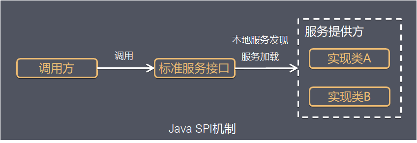
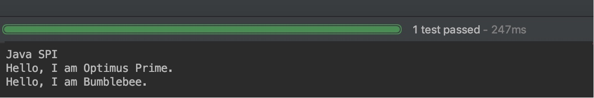

首次见到SPI是在看Dubbo官方文档时，提到Dubbo SPI机制。这篇文章来对Java的SPI机制进行深入的了解。

<!-- more -->

### 什么是SPI

SPI全程Service Provider Interfacce，是JDK内置的一种服务发现机制。SPI的本质是将接口实现类的全限定名配置在文件中，并由服务加载器读取配置文件，加载实现类。这样可以在运行时，动态为接口替换实现类。比如常见应用场景：java.sql.Driver接口，其他不同厂商可以针对同一接口做出不同的实现，mysql和postgresql都有不同的实现提供给用户， 而Java的SPI机制可以为某个接口寻找服务实现。如图所示。


### 用法

当服务的提供者提供了一种的接口的实现之后，需要再classpath下的META-INF/services/目录里创建一个以服务接口命名的文件，这个文件里的内容就是这个接口的具体实现类。当其他程序需要用到这个服务的时候，就可以通过查找这个jar包的META-INF/services/中的配置文件，配置文件中有接口的具体实现类名，可以根据这个类名进行加载实例化，然后就可以使用该服务了。JDK中查找服务实现类的工具类是：java.util.ServiceLoader。

#### Java SPI实例（Dubbo 官网）

首先定义一个接口，名称为Robot。
```java
public interface Robot {
    void sayHello();
}
```

接下来定义两个实现类，分别为 OptimusPrime 和 Bumblebee。
```java
public class OptimusPrime implements Robot {
    
    @Override
    public void sayHello() {
        System.out.println("Hello, I am Optimus Prime.");
    }
}

public class Bumblebee implements Robot {

    @Override
    public void sayHello() {
        System.out.println("Hello, I am Bumblebee.");
    }
}

```

接下来 **META-INF/services 文件夹下创建一个文件，名称为 Robot 的全限定名 org.apache.spi.Robot。文件内容为实现类的全限定的类名**，如下：
```java
org.apache.spi.OptimusPrime
org.apache.spi.Bumblebee
```

做好所需的准备工作，接下来编写代码进行测试。**JDK中查找服务实现类的工具类是：java.util.ServiceLoader**。
```java
public class JavaSPITest {

    @Test
    public void sayHello() throws Exception {
        ServiceLoader<Robot> serviceLoader = ServiceLoader.load(Robot.class);
        System.out.println("Java SPI");
        serviceLoader.forEach(Robot::sayHello);
    }
}
```

最后来看一下测试结果，如下：


从测试结果可以看出，我们的两个实现类被成功加载，并输出了相应的内容。

### Dubbo SPI实现

Dubbo并没有使用Java SPI，而是重新实现了一套功能更强的SPI机制。主要区别如下：
1. Java SPI会一次性实例化扩展点所有实现，如果扩展山西爱你初始化很耗时，并且即使没有使用上，也会加载，从而浪费资源。而Dubbo SPI可以通过getExtension(String key)的方法获取想要的实现。
2. Dubbo SPI增加了对扩展点的IOC 和 AOP支持，一个扩展点可以直接setter注入其他扩展点。