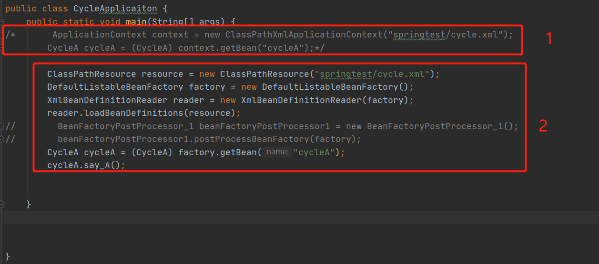
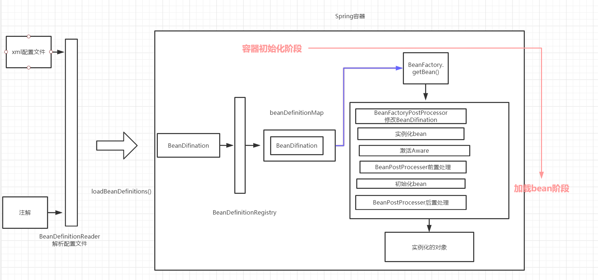

IOC是Spring最为核心的概念，我们开始逐步对IOC进行拆解。争取能将IOC原理以及工作流程理解的更加透彻。

加油ヾ(◍°∇°◍)ﾉﾞ

<!-- more -->

## 什么是IOC

**IOC全称Inversion of Control，意思为控制反转，IOC作用就是由Spring IOC容器来负责对象的生命周期以及对象之间的关系**。

通俗的讲，就是在传统开发模式中，我们需要对象，就直接以new一个对象的方式来创建对象。有了IOC容器之后，对象的控制的交给IOC容器来进行管理，并且我们使用对象也不再是自己管理，而且所依赖的对象直接有IOC容器创建后注入到我们手里，依赖的对象获取由原来的主动变为了被动。这也就是IOC为什么又称控制反转的意思。

IOC可以通过 构造器注入、setter方法注入以及接口注入三种方式。

## IOC源码解析

### IOC实例



我们仍以前面介绍循环依赖的例子开始，第一种方式获取bean我们最后再讲，我们首先从第二种方式开始。

从xml到一个可以使用的Bean对象，这整个过程，我们可以分为两个阶段：

1. **容器初始化**

```java
ClassPathResource resource = new ClassPathResource("springtest/cycle.xml");
DefaultListableBeanFactory factory = new DefaultListableBeanFactory();
XmlBeanDefinitionReader reader = new XmlBeanDefinitionReader(factory);
reader.loadBeanDefinitions(resource);
```

2. **加载bean**

```java
CycleA cycleA = (CycleA) factory.getBean("cycleA");
```

我们分开对这两个阶段展开描述。

### 容器初始化

```java
//根据xml配置文件创建Resource资源对象。
ClassPathResource resource = new ClassPathResource("springtest/cycle.xml");
//创建一个BeanFactory.
DefaultListableBeanFactory factory = new DefaultListableBeanFactory();
//创建BeanDefinitionReader,用于载入BeanDefinition
XmlBeanDefinitionReader reader = new XmlBeanDefinitionReader(factory);
//开启Bean的载入和注册过程，完成后的bean放置在IOC容器里面。
reader.loadBeanDefinitions(resource);
```

加载Bean主要分为三个步骤：

1. 资源定位

**org.springframework.core.io.Resource**类作为Spring框架所有资源的抽象和访问接口，由子类AbstractResource提供统一的默认实现。类图如下：


可以看出我们上面的例子是使用ClassPathResource ： class path类型资源的实现

2. 资源装载

资源装载就是BeanDefinition的载入。BeanDefinitionReader读取、解析Resource资源，也就是将用户定义的Bean表示为IOC容器的内部数据结构：BeanDefinition。在IOC内部维护这一个BeanDidinitionMap的数据结构，在配置文件中每一个<bean> 都对应着一个BeanDedinition对象。

3. 注册

向IOC容器注册在第二步解析好的BeanDefinition，这个过程是通过BeanDefinitionRegister接口来实现的。注册其实就是将BeanDedifinition注入到BeanDidinitionMap这个ConcurrentMap里面，IOC容器就是通过这个HashMap来维护这些BeanDefinition的。

需要注意的是，以上过程并没有完成依赖注入，依赖注入真正是发生在第一个getBean()的时候。我们接下来对每一个步骤进行详细的讲解。

#### Resource定位

Spring为了解决资源定位的问题，提供了Resource、ResourceLoader接口。Resource是资源的抽象接口，ResourceLoader则是资源加载的抽象接口，各自都有不同的子类根据不同功能实现。

上面代码中，第一部就完成了资源的定义，**ClassPathResource resource = new ClassPathResource("springtest/cycle.xml");**。那么ResourceLoader是如何进行定义的呢？

在XmlBeanDefinitionRead的构造方法里面，直接调用父类AbstractBeanDefinitionReader 的构造方法。

```java
	public XmlBeanDefinitionReader(BeanDefinitionRegistry registry) {
		super(registry);
	}

	protected AbstractBeanDefinitionReader(BeanDefinitionRegistry registry) {
		Assert.notNull(registry, "BeanDefinitionRegistry must not be null");
		this.registry = registry;

		// Determine ResourceLoader to use.
		if (this.registry instanceof ResourceLoader) {
			this.resourceLoader = (ResourceLoader) this.registry;
		}
		else {
			this.resourceLoader = new PathMatchingResourcePatternResolver();
		}

		// Inherit Environment if possible
		if (this.registry instanceof EnvironmentCapable) {
			this.environment = ((EnvironmentCapable) this.registry).getEnvironment();
		}
		else {
			this.environment = new StandardEnvironment();
		}
	}
```

#### BeanDefinition的载入和解析

 **reader.loadBeanDefinitions(resource);**开启BeanDefiniiton的解析过程，该方法将Resource包装为EncodedResource实例对象，这样可以对Resource进行编码，保证内容读取的正确性，最后调用**loadBeanDefinitions()**方法。

```java
@Override
public int loadBeanDefinitions(Resource resource) throws BeanDefinitionStoreException {
   return loadBeanDefinitions(new EncodedResource(resource));
}
```

```java
public int loadBeanDefinitions(EncodedResource encodedResource) throws BeanDefinitionStoreException {
	//省略一些验证
   try {
       //将资源文件转为InputStream的IO流
      InputStream inputStream = encodedResource.getResource().getInputStream();
      try {
          //从InputStream得到xml的解析
         InputSource inputSource = new InputSource(inputStream);
         if (encodedResource.getEncoding() != null) {
            inputSource.setEncoding(encodedResource.getEncoding());
         }
          //具体过程
         return doLoadBeanDefinitions(inputSource, encodedResource.getResource());
      }
      finally {
         inputStream.close();
      }
   }
	//。。。。省略代码
}

```

调用***doLoadBeanDefinitions()***方法执行具体的解析动作：这里首先将xml的inputSource获取为对应的Document对象，然后调用***registerBeanDefinitions()***方法进行BeanDefinition的解析注册过程。

```java


protected int doLoadBeanDefinitions(InputSource inputSource, Resource resource)
      throws BeanDefinitionStoreException {
   try {
      Document doc = doLoadDocument(inputSource, resource);
      return registerBeanDefinitions(doc, resource);
   }
	//省略
}

```

首先创建**BeanDefinitionDocumentReader**，然后调用***documentReader.registerBeanDefinitions***开启解析。

```java
public int registerBeanDefinitions(Document doc, Resource resource) throws BeanDefinitionStoreException {
   BeanDefinitionDocumentReader documentReader = createBeanDefinitionDocumentReader();
   int countBefore = getRegistry().getBeanDefinitionCount();
   documentReader.registerBeanDefinitions(doc, createReaderContext(resource));
   return getRegistry().getBeanDefinitionCount() - countBefore;
}
```

我们依然只看主要代码：

```java
@Override
public void registerBeanDefinitions(Document doc, XmlReaderContext readerContext) {
   this.readerContext = readerContext;
   logger.debug("Loading bean definitions");
   Element root = doc.getDocumentElement();
   doRegisterBeanDefinitions(root);
}

	protected void doRegisterBeanDefinitions(Element root) {
		BeanDefinitionParserDelegate parent = this.delegate;
		this.delegate = createDelegate(getReaderContext(), root, parent);

		//省略
		//前置处理
		preProcessXml(root);
        //解析
		parseBeanDefinitions(root, this.delegate);
        //后置处理
		postProcessXml(root);

		this.delegate = parent;
	}


```


```java
protected void parseBeanDefinitions(Element root, BeanDefinitionParserDelegate delegate) {
    // Bean定义的Document对象使用了Spring默认的XML命名空间
   if (delegate.isDefaultNamespace(root)) {
      NodeList nl = root.getChildNodes();
      for (int i = 0; i < nl.getLength(); i++) {
         Node node = nl.item(i);
         //判断Document节点是xml元素节点
         if (node instanceof Element) {
            Element ele = (Element) node;
             //如果bean定义的Document的元素节点使用的是Spring默认的xml命名空间
            if (delegate.isDefaultNamespace(ele)) {
                //那么使用Spring的bean规则解析元素节点
               parseDefaultElement(ele, delegate);
            }
            else {
                //否则使用自定义的解析规则解析元素节点
               delegate.parseCustomElement(ele);
            }
         }
      }
   }
   else {
       //否则使用自定义的解析规则解析元素节点
      delegate.parseCustomElement(root);
   }
}
```

这里迭代root元素的所有子节点，如果子节点为默认命名空间，则调用***parseDefaultElement()***，否则调用***parseCustomElement()***开启自定义标签的解析注册过程。

我们一般都是默认的命名空间，因此以parseDefaultElement()来继续跟进。

```java
private void parseDefaultElement(Element ele, BeanDefinitionParserDelegate delegate) {
   //如果元素节点是<Import>导入元素
    if (delegate.nodeNameEquals(ele, IMPORT_ELEMENT)) {
      importBeanDefinitionResource(ele);
   }
    //如果元素是<Alias>别名元素
   else if (delegate.nodeNameEquals(ele, ALIAS_ELEMENT)) {
      processAliasRegistration(ele);
   }
    //如果元素节点<bean> 
   else if (delegate.nodeNameEquals(ele, BEAN_ELEMENT)) {
      processBeanDefinition(ele, delegate);
   }
    //如果元素节点<beans>
   else if (delegate.nodeNameEquals(ele, NESTED_BEANS_ELEMENT)) {
      // recurse 递归解析
      doRegisterBeanDefinitions(ele);
   }
}
```

我们以bean为例：

```java
protected void processBeanDefinition(Element ele, BeanDefinitionParserDelegate delegate) {
    //对元素进行解析，解析成功，则返回BeanDefinitionHolder，它内部属性为name和BeanDefinition。
   BeanDefinitionHolder bdHolder = delegate.parseBeanDefinitionElement(ele);
   if (bdHolder != null) {
       //进行自定义标签处理
      bdHolder = delegate.decorateBeanDefinitionIfRequired(ele, bdHolder);
      try {
         // Register the final decorated instance.
         BeanDefinitionReaderUtils.registerBeanDefinition(bdHolder, getReaderContext().getRegistry());
      }
      catch (BeanDefinitionStoreException ex) {
         getReaderContext().error("Failed to register bean definition with name '" +
               bdHolder.getBeanName() + "'", ele, ex);
      }
      // Send registration event.
      getReaderContext().fireComponentRegistered(new BeanComponentDefinition(bdHolder));
   }
}

```

***delegate.parseBeanDefinitionElement***方法对Bean进行解析，根据id name  alias，然后调用**parseBeanDefinitionElement()**对属性进行解析并封装为**GenericBeanDefinition **，最后构造成**BeanDefinitionHolder**实例对象并返回，我们就不在往里面进入了。

#### BeanDefinition的注册

上面方法解析完毕后，调用***BeanDefinitionReaderUtils.registerBeanDefinition()***对**BeanDefinitionHolder**进行注册。

注册的核心是将BeanDefinition放入到IOC容器维护的**beanDefinitionMap**里面。

```java
public static void registerBeanDefinition(
      BeanDefinitionHolder definitionHolder, BeanDefinitionRegistry registry)
      throws BeanDefinitionStoreException {

   // Register bean definition under primary name.
   String beanName = definitionHolder.getBeanName();
   registry.registerBeanDefinition(beanName, definitionHolder.getBeanDefinition());

   // Register aliases for bean name, if any.
   String[] aliases = definitionHolder.getAliases();
   if (aliases != null) {
      for (String alias : aliases) {
         registry.registerAlias(beanName, alias);
      }
   }
}

	@Override
	public void registerBeanDefinition(String beanName, BeanDefinition beanDefinition)
			throws BeanDefinitionStoreException {


		BeanDefinition oldBeanDefinition;

		oldBeanDefinition = this.beanDefinitionMap.get(beanName);
		if (oldBeanDefinition != null) {
			//省略代码。。。。
            //重点
			this.beanDefinitionMap.put(beanName, beanDefinition);
		}
		else {
			if (hasBeanCreationStarted()) {
				// Cannot modify startup-time collection elements anymore (for stable iteration)
				synchronized (this.beanDefinitionMap) {
                    //重点
					this.beanDefinitionMap.put(beanName, beanDefinition);
					List<String> updatedDefinitions = new ArrayList<>(this.beanDefinitionNames.size() + 1);
					updatedDefinitions.addAll(this.beanDefinitionNames);
					updatedDefinitions.add(beanName);
					this.beanDefinitionNames = updatedDefinitions;
					if (this.manualSingletonNames.contains(beanName)) {
						Set<String> updatedSingletons = new LinkedHashSet<>(this.manualSingletonNames);
						updatedSingletons.remove(beanName);
						this.manualSingletonNames = updatedSingletons;
					}
				}
			}
			else {
				// Still in startup registration phase
                //重点
				this.beanDefinitionMap.put(beanName, beanDefinition);
				this.beanDefinitionNames.add(beanName);
				this.manualSingletonNames.remove(beanName);
			}
			this.frozenBeanDefinitionNames = null;
		}

		if (oldBeanDefinition != null || containsSingleton(beanName)) {
			resetBeanDefinition(beanName);
		}
	}
```

可以看出来 	***this.beanDefinitionMap.put(beanName, beanDefinition);  整个注册过程，重点就是这一句，IOC容器就是通过这个ConcurrentHashMap来维护BeanDefinition的，key是BeanName，value是BeanDefinition。

```java
/** Map of bean definition objects, keyed by bean name */
private final Map<String, BeanDefinition> beanDefinitionMap = new ConcurrentHashMap<>(256);
```

### 总结

到这里，这个IOC的初始化就完成了。**首先从资源的定位、转换为Document对象，然后进行解析，最后注册到IOC容器中**。此时IOC容器已经有Bean的定义信息，已经为注入打好了基础。

接下来我们进入Bean的加载阶段。




> 参考列表：
>
> 1. http://cmsblogs.com/?cat=206


