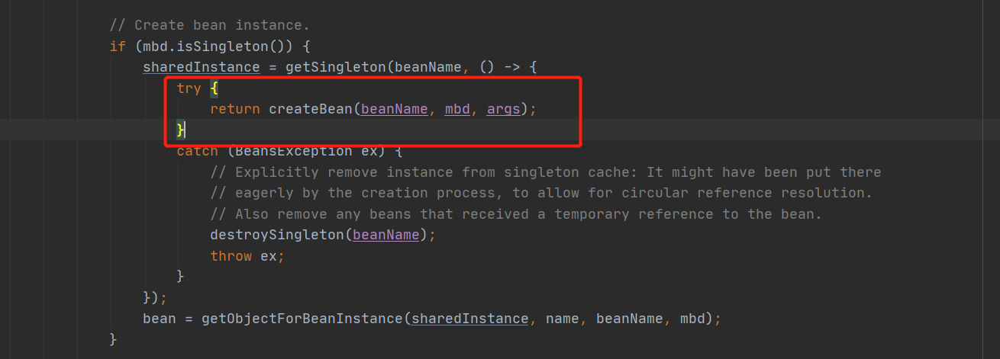
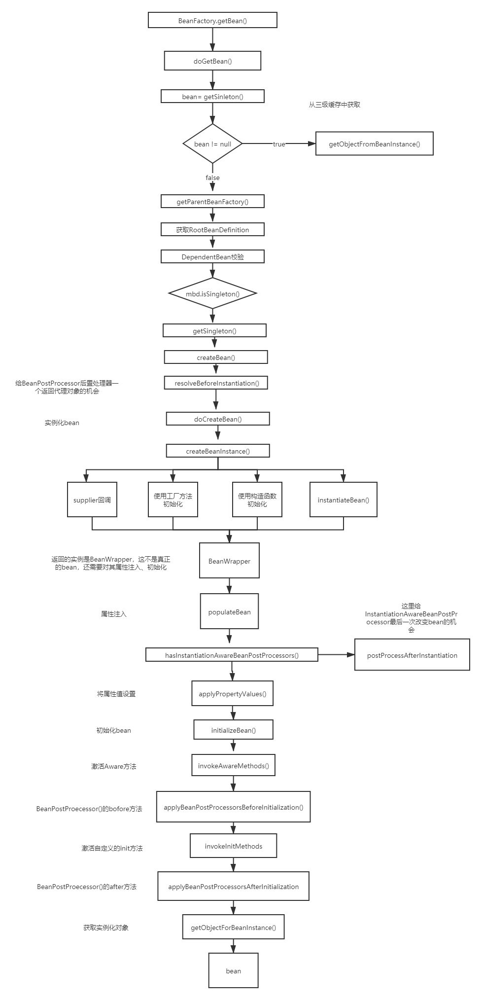

上篇文章介绍了从xml到一个真正可以用的Bean的第一个阶段---容器初始化，这篇文章我们就继续第二个阶段----加载bean。我们上篇文章提过，只有当显示或者隐式的调用getBean()时，则会触发加载bean阶段。

加油ヾ(◍°∇°◍)ﾉﾞ

<!-- more -->

## 加载bean

```java
CycleA cycleA = (CycleA) factory.getBean("cycleA");

```

当我们***getBean()***方法，会调用***doGetBean()***。这个方法可以说是Spring IOC中最重要的一个方法了。在之前分析循环依赖时，涉及过一部分，这里我们进行详细分析。

```
@Override
public Object getBean(String name) throws BeansException {
   return doGetBean(name, null, null, false);
}
```

### doGetBean()

```java
protected <T> T doGetBean(final String name, @Nullable final Class<T> requiredType,
      @Nullable final Object[] args, boolean typeCheckOnly) throws BeansException {
   // 获取beanName
   final String beanName = transformedBeanName(name);
   Object bean;

   // 从缓存中或者实例工厂中获取bean
   Object sharedInstance = getSingleton(beanName);
   if (sharedInstance != null && args == null) {
      if (logger.isDebugEnabled()) {
         if (isSingletonCurrentlyInCreation(beanName)) {
            logger.debug("Returning eagerly cached instance of singleton bean '" + beanName +
                  "' that is not fully initialized yet - a consequence of a circular reference");
         }
         else {
            logger.debug("Returning cached instance of singleton bean '" + beanName + "'");
         }
      }
       //将从缓存中获取的bean转化为真正的bean
      bean = getObjectForBeanInstance(sharedInstance, name, beanName, null);
   }

   else {
      // 原型模式下的循环依赖抛出异常
      if (isPrototypeCurrentlyInCreation(beanName)) {
         throw new BeanCurrentlyInCreationException(beanName);
      }

      // 如果在容器中没有找到，则从父类容器中加载
      BeanFactory parentBeanFactory = getParentBeanFactory();
      if (parentBeanFactory != null && !containsBeanDefinition(beanName)) {
         // Not found -> check parent.
         String nameToLookup = originalBeanName(name);
         if (parentBeanFactory instanceof AbstractBeanFactory) {
            return ((AbstractBeanFactory) parentBeanFactory).doGetBean(
                  nameToLookup, requiredType, args, typeCheckOnly);
         }
         else if (args != null) {
            // Delegation to parent with explicit args.
            return (T) parentBeanFactory.getBean(nameToLookup, args);
         }
         else {
            // No args -> delegate to standard getBean method.
            return parentBeanFactory.getBean(nameToLookup, requiredType);
         }
      }

      if (!typeCheckOnly) {
         markBeanAsCreated(beanName);
      }

      try {
          //从容器中获取bean对应的GenericBeanDefinition，并将其转换为RootBeanDefinition
         final RootBeanDefinition mbd = getMergedLocalBeanDefinition(beanName);
         checkMergedBeanDefinition(mbd, beanName, args);

         // 处理所依赖的bean
         String[] dependsOn = mbd.getDependsOn();
         if (dependsOn != null) {
            for (String dep : dependsOn) {
               if (isDependent(beanName, dep)) {
                  throw new BeanCreationException(mbd.getResourceDescription(), beanName,
                        "Circular depends-on relationship between '" + beanName + "' and '" + dep + "'");
               }
               registerDependentBean(dep, beanName);
               try {
                  getBean(dep);
               }
               catch (NoSuchBeanDefinitionException ex) {
                  throw new BeanCreationException(mbd.getResourceDescription(), beanName,
                        "'" + beanName + "' depends on missing bean '" + dep + "'", ex);
               }
            }
         }

         // bean实例化
         if (mbd.isSingleton()) {
            sharedInstance = getSingleton(beanName, () -> {
               try {
                  return createBean(beanName, mbd, args);
               }
               catch (BeansException ex) {
                  // Explicitly remove instance from singleton cache: It might have been put there
                  // eagerly by the creation process, to allow for circular reference resolution.
                  // Also remove any beans that received a temporary reference to the bean.
                  destroySingleton(beanName);
                  throw ex;
               }
            });
            bean = getObjectForBeanInstance(sharedInstance, name, beanName, mbd);
         }
		//原型模式
         else if (mbd.isPrototype()) {
            // It's a prototype -> create a new instance.
            Object prototypeInstance = null;
            try {
               beforePrototypeCreation(beanName);
               prototypeInstance = createBean(beanName, mbd, args);
            }
            finally {
               afterPrototypeCreation(beanName);
            }
            bean = getObjectForBeanInstance(prototypeInstance, name, beanName, mbd);
         }

         else {
            String scopeName = mbd.getScope();
            final Scope scope = this.scopes.get(scopeName);
            if (scope == null) {
               throw new IllegalStateException("No Scope registered for scope name '" + scopeName + "'");
            }
            try {
               Object scopedInstance = scope.get(beanName, () -> {
                  beforePrototypeCreation(beanName);
                  try {
                     return createBean(beanName, mbd, args);
                  }
                  finally {
                     afterPrototypeCreation(beanName);
                  }
               });
               bean = getObjectForBeanInstance(scopedInstance, name, beanName, mbd);
            }
            catch (IllegalStateException ex) {
               throw new BeanCreationException(beanName,
                     "Scope '" + scopeName + "' is not active for the current thread; consider " +
                     "defining a scoped proxy for this bean if you intend to refer to it from a singleton",
                     ex);
            }
         }
      }
      catch (BeansException ex) {
         cleanupAfterBeanCreationFailure(beanName);
         throw ex;
      }
   }

   // Check if required type matches the type of the actual bean instance.
   if (requiredType != null && !requiredType.isInstance(bean)) {
      try {
         T convertedBean = getTypeConverter().convertIfNecessary(bean, requiredType);
         if (convertedBean == null) {
            throw new BeanNotOfRequiredTypeException(name, requiredType, bean.getClass());
         }
         return convertedBean;
      }
      catch (TypeMismatchException ex) {
         if (logger.isDebugEnabled()) {
            logger.debug("Failed to convert bean '" + name + "' to required type '" +
                  ClassUtils.getQualifiedName(requiredType) + "'", ex);
         }
         throw new BeanNotOfRequiredTypeException(name, requiredType, bean.getClass());
      }
   }
   return (T) bean;
}
```

这个方法很长，我们一部分一部分来看。

#### 获取beanName

这里传递的nama，不一定是beanName，有可能是别名，或者是FactoryBean，所以要进行转换。

```java

final String beanName = transformedBeanName(name);

//org.springframework.beans.factory.support.AbstractBeanFactory#transformedBeanName
protected String transformedBeanName(String name) {
return canonicalName(BeanFactoryUtils.transformedBeanName(name));
}

//去除FactoryBean的"&"
public static String transformedBeanName(String name) {
    Assert.notNull(name, "'name' must not be null");
    String beanName = name;
    while (beanName.startsWith(BeanFactory.FACTORY_BEAN_PREFIX)) {
        beanName = beanName.substring(BeanFactory.FACTORY_BEAN_PREFIX.length());
    }
    return beanName;
}

//转换aliasName,通过循环获取beanName。
//org.springframework.core.SimpleAliasRegistry#canonicalName
public String canonicalName(String name) {
    String canonicalName = name;
    // Handle aliasing...
    String resolvedName;
    do {
    resolvedName = this.aliasMap.get(canonicalName);
    if (resolvedName != null) {
    canonicalName = resolvedName;
    }
    }
    while (resolvedName != null);
    return canonicalName;
}
```

#### 从单例bean缓存中获取

**Spring对单例模式的bean只会创建一次，后续如果还需要该bean，则从单例缓存中获取。**这个我们在Spring如何解决循环依赖已经讲过。

```java
Object sharedInstance = getSingleton(beanName);
if (sharedInstance != null && args == null) {
   if (logger.isDebugEnabled()) {
      if (isSingletonCurrentlyInCreation(beanName)) {
         logger.debug("Returning eagerly cached instance of singleton bean '" + beanName +
               "' that is not fully initialized yet - a consequence of a circular reference");
      }
      else {
         logger.debug("Returning cached instance of singleton bean '" + beanName + "'");
      }
   }
   bean = getObjectForBeanInstance(sharedInstance, name, beanName, null);
}


public Object getSingleton(String beanName) {
    return getSingleton(beanName, true);
}


	@Nullable
protected Object getSingleton(String beanName, boolean allowEarlyReference) {
    //先从一级缓存中获取bean
    Object singletonObject = this.singletonObjects.get(beanName);
    //如果一级缓存中的bean为空，并且当前bean正在创建
    if (singletonObject == null && isSingletonCurrentlyInCreation(beanName)) {
        //加锁
        synchronized (this.singletonObjects) {
            //在二级缓存earlySingletonObject中获取
            singletonObject = this.earlySingletonObjects.get(beanName);
            //如果获取不到，并且允许提前创建
            if (singletonObject == null && allowEarlyReference) {
                //则重singletonFactories中获取对应的ObjectFactory
                ObjectFactory<?> singletonFactory = this.singletonFactories.get(beanName);
                //如果objectFactory不为空
                if (singletonFactory != null) {
             		//则调用其getObject方法，获取bean
                    singletonObject = singletonFactory.getObject();
                    //加入到二级缓存中
                    this.earlySingletonObjects.put(beanName, singletonObject);
                    //从三级缓存中去除
                    this.singletonFactories.remove(beanName);
                }
            }
        }
    }
    return singletonObject;
}
```

当从缓存中取到值之后，调用***bean = getObjectForBeanInstance(sharedInstance, name, beanName, null);***，这是因为我们从缓存中区的bean并不一定就是我们需要的bean，因此调用**getObjectForBeanInstance**，该方法是为了获取给定bean实例的对象，该对象要么是bean实例，要么就是FactoryBean创建的对象。

```java
protected Object getObjectForBeanInstance(
      Object beanInstance, String name, String beanName, @Nullable RootBeanDefinition mbd) {

   // 如果是name 以 & 开头，说明是factoryBean类
   if (BeanFactoryUtils.isFactoryDereference(name)) {
       //如果是NullBean,则直接返回
      if (beanInstance instanceof NullBean) {
         return beanInstance;
      }
       //如果beanInstance不是FactoryBean,那么就抛出异常
      if (!(beanInstance instanceof FactoryBean)) {
         throw new BeanIsNotAFactoryException(transformedBeanName(name), beanInstance.getClass());
      }
   }

   // 走到这里，说明当前bean实例有可能是正常的bean,也有可能是factoryBean
   if (!(beanInstance instanceof FactoryBean) || BeanFactoryUtils.isFactoryDereference(name)) {
      return beanInstance;
   }
//加载FactoryBean
   Object object = null;
    //如果beanDefiniton为空，则从缓存中取
   if (mbd == null) {
      object = getCachedObjectForFactoryBean(beanName);
   }
    //如果仍然取不到，则意味着当前实例是FactoryBean
   if (object == null) {
      // Return bean instance from factory.
      FactoryBean<?> factory = (FactoryBean<?>) beanInstance;
      // Caches object obtained from FactoryBean if it is a singleton.
      if (mbd == null && containsBeanDefinition(beanName)) {
         mbd = getMergedLocalBeanDefinition(beanName);
      }
      boolean synthetic = (mbd != null && mbd.isSynthetic());
       //核心处理类
      object = getObjectFromFactoryBean(factory, beanName, !synthetic);
   }
   return object;
}
```

可以看出，这个方法就是返回bean实例的，如果对象是正常的bean，那么就直接返回。如果实例对象是factoryBean，那么就调用***getObjectFromFactoryBean()***从FactoryBean获取实例对象。

```java
protected Object getObjectFromFactoryBean(FactoryBean<?> factory, String beanName, boolean shouldPostProcess) {
    //如果是单例模式并且缓存中存在
   if (factory.isSingleton() && containsSingleton(beanName)) {
      synchronized (getSingletonMutex()) {
          //从缓存中获取factoryBean
         Object object = this.factoryBeanObjectCache.get(beanName);
         if (object == null) {
             //如果为空，则从FactoryBean中获取对象
            object = doGetObjectFromFactoryBean(factory, beanName);
            // 再次从缓存中获取
            Object alreadyThere = this.factoryBeanObjectCache.get(beanName);
            if (alreadyThere != null) {
               object = alreadyThere;
            }
            else {
                //如果缓存中获取到factoryBean
                //如果需要后续处理
               if (shouldPostProcess) {
                   //如果bean正在创建，则返回非处理对象
                  if (isSingletonCurrentlyInCreation(beanName)) {
                     // Temporarily return non-post-processed object, not storing it yet..
                     return object;
                  }
                   //前置处理
                  beforeSingletonCreation(beanName);
                  try {
                      //从FactoryBean获取的对象进行后处理
                     object = postProcessObjectFromFactoryBean(object, beanName);
                  }
                  catch (Throwable ex) {
                     throw new BeanCreationException(beanName,
                           "Post-processing of FactoryBean's singleton object failed", ex);
                  }
                  finally {
                      //后置处理
                     afterSingletonCreation(beanName);
                  }
               }
                //缓存
               if (containsSingleton(beanName)) {
                  this.factoryBeanObjectCache.put(beanName, object);
               }
            }
         }
         return object;
      }
   }
   else {
      Object object = doGetObjectFromFactoryBean(factory, beanName);
      if (shouldPostProcess) {
         try {
            object = postProcessObjectFromFactoryBean(object, beanName);
         }
         catch (Throwable ex) {
            throw new BeanCreationException(beanName, "Post-processing of FactoryBean's object failed", ex);
         }
      }
      return object;
   }
}
```

1. 从factoryBeanObjectCache 缓存中获取实例对象 object，若 object 为空，则调用 ***doGetObjectFromFactoryBean()*** 方法从 FactoryBean 获取对象，我们进入，发现其实就是调用的**FactoryBean.getObject()**。（需要提前前提，能进到这个方法，说明当前实例是factoryBean，因为如果是正常的bean，上面一步已经返回了。）

```java
private Object doGetObjectFromFactoryBean(final FactoryBean<?> factory, final String beanName)
      throws BeanCreationException {

   Object object;
   try {
      if (System.getSecurityManager() != null) {
         AccessControlContext acc = getAccessControlContext();
         try {
            object = AccessController.doPrivileged((PrivilegedExceptionAction<Object>) factory::getObject, acc);
         }
         catch (PrivilegedActionException pae) {
            throw pae.getException();
         }
      }
      else {
         object = factory.getObject();
      }
   }
   catch (FactoryBeanNotInitializedException ex) {
      throw new BeanCurrentlyInCreationException(beanName, ex.toString());
   }
   catch (Throwable ex) {
      throw new BeanCreationException(beanName, "FactoryBean threw exception on object creation", ex);
   }

   // Do not accept a null value for a FactoryBean that's not fully
   // initialized yet: Many FactoryBeans just return null then.
   if (object == null) {
      if (isSingletonCurrentlyInCreation(beanName)) {
         throw new BeanCurrentlyInCreationException(
               beanName, "FactoryBean which is currently in creation returned null from getObject");
      }
      object = new NullBean();
   }
   return object;
}
```

这里我们要理清一个概念，**FactoryBean是什么？**

**首先，FactoryBean就是一个普通的Java Bean，如果一个对象实现了FactoryBean<T>，那么通过BeanFactory.getBean获取的对象实际上是FactoryBean.getObject()得到的对象，对应逻辑就是我们上面的那一段。如果想要获取FactoryBean本身，那么需要通过 “& + beanName”的方式。**

**这样做有什么好处呢？**

FactoryBean着重于**自定义创建对象**的过程，通俗的讲，可以通过FactoryBean来控制对象如何生成。

好，我们回到上面的代码。

2. 从factoryBeanObjectCache 缓存中获取实例对象 object，如果Object不为空，则执行 beforeSingletonCreation()  postProcessObjectFromFactoryBean()  afterSingletonCreation()。

其中 postProcessObjectFromFactoryBean() 是对从FactoryBean获取的bean实例对象进行后置处理，其默认是直接返回Object对象。可以自定义实现，从而调用子类的beanProcessor.postProcessAfterInitialization()方法。

```java
protected Object postProcessObjectFromFactoryBean(Object object, String beanName) throws BeansException {
   return object;
}
```

以上是从缓存中取Bean的整个过程，我们沿着主干走了一遍，那么如果没有从缓存中获取到Bean呢？

#### 缓存中获取不到Bean

如果从单例缓存中没有获取到bean，则说明要么这个bean的scope不是singleton，要么是singleton，但是还没有初始化完成。那应该怎么处理呢？就从doGetBean()后半部分开始讲起。

##### parentBeanFactory 与依赖处理

```java
protected <T> T doGetBean(final String name, @Nullable final Class<T> requiredType,
      @Nullable final Object[] args, boolean typeCheckOnly) throws BeansException {
	//省略。。。。。。

   else {
      // 检测，如果当前原型模式的bean正在创建，那么就抛出异常
      if (isPrototypeCurrentlyInCreation(beanName)) {
         throw new BeanCurrentlyInCreationException(beanName);
      }

      // Check if bean definition exists in this factory.
      BeanFactory parentBeanFactory = getParentBeanFactory();
      if (parentBeanFactory != null && !containsBeanDefinition(beanName)) {
         // Not found -> check parent.
         String nameToLookup = originalBeanName(name);
         if (parentBeanFactory instanceof AbstractBeanFactory) {
            return ((AbstractBeanFactory) parentBeanFactory).doGetBean(
                  nameToLookup, requiredType, args, typeCheckOnly);
         }
         else if (args != null) {
            // Delegation to parent with explicit args.
            return (T) parentBeanFactory.getBean(nameToLookup, args);
         }
         else {
            // No args -> delegate to standard getBean method.
            return parentBeanFactory.getBean(nameToLookup, requiredType);
         }
      }

      if (!typeCheckOnly) {
         markBeanAsCreated(beanName);
      }

      try {
         final RootBeanDefinition mbd = getMergedLocalBeanDefinition(beanName);
         checkMergedBeanDefinition(mbd, beanName, args);

         // Guarantee initialization of beans that the current bean depends on.
         String[] dependsOn = mbd.getDependsOn();
         if (dependsOn != null) {
            for (String dep : dependsOn) {
               if (isDependent(beanName, dep)) {
                  throw new BeanCreationException(mbd.getResourceDescription(), beanName,
                        "Circular depends-on relationship between '" + beanName + "' and '" + dep + "'");
               }
               registerDependentBean(dep, beanName);
               try {
                  getBean(dep);
               }
               catch (NoSuchBeanDefinitionException ex) {
                  throw new BeanCreationException(mbd.getResourceDescription(), beanName,
                        "'" + beanName + "' depends on missing bean '" + dep + "'", ex);
               }
            }
         }

         //省略。。。。。。。。。
   }
   return (T) bean;
}
```

1. 检测，原型模式的循环依赖，直接抛出异常**throw new BeanCurrentlyInCreationException(beanName);** 原型模式是通过**ThreadLocal**来存放正在创建的bean。

```java
protected boolean isPrototypeCurrentlyInCreation(String beanName) {
   Object curVal = this.prototypesCurrentlyInCreation.get();
   return (curVal != null &&
         (curVal.equals(beanName) || (curVal instanceof Set && ((Set<?>) curVal).contains(beanName))));
}
```

2. 检查父类BeanFactory，如果若 containsBeanDefinition 中不存在 beanName 相对应的 BeanDefinition，则从 parentBeanFactory 的 getBean中获取。

```java
  BeanFactory parentBeanFactory = getParentBeanFactory();
//如果parentBeanFactory不为空，并且beanDefinitionMap 不存在该name的BeanDefinition
//统一交给parentBeanFactory 的 getBean() 进行处理
  if (parentBeanFactory != null && !containsBeanDefinition(beanName)) {
     // Not found -> check parent.
     String nameToLookup = originalBeanName(name);
     if (parentBeanFactory instanceof AbstractBeanFactory) {
        return ((AbstractBeanFactory) parentBeanFactory).doGetBean(
              nameToLookup, requiredType, args, typeCheckOnly);
     }
     else if (args != null) {
        // Delegation to parent with explicit args.
        return (T) parentBeanFactory.getBean(nameToLookup, args);
     }
     else {
        // No args -> delegate to standard getBean method.
        return parentBeanFactory.getBean(nameToLookup, requiredType);
     }
  }
```
3.  获取RootBeanDefinition

```java
final RootBeanDefinition mbd = getMergedLocalBeanDefinition(beanName);
```

4. 处理依赖，这也就是我们之前循环依赖讲的，如果发现依赖的bean没有初始化，则先初始化依赖bean。

```java
//获取依赖
String[] dependsOn = mbd.getDependsOn();
if (dependsOn != null) {
   for (String dep : dependsOn) {
      if (isDependent(beanName, dep)) {
         throw new BeanCreationException(mbd.getResourceDescription(), beanName,
               "Circular depends-on relationship between '" + beanName + "' and '" + dep + "'");
      }
       //注册到依赖的bean中
      registerDependentBean(dep, beanName);
      try {
          //调用getBean初始化依赖bean
         getBean(dep);
      }
      catch (NoSuchBeanDefinitionException ex) {
         throw new BeanCreationException(mbd.getResourceDescription(), beanName,
               "'" + beanName + "' depends on missing bean '" + dep + "'", ex);
      }
   }
}
```

##### 单例bean创建

上面处理完依赖之后，就进入了不同scope的bean创建过程。

```java
if (mbd.isSingleton()) {
   sharedInstance = getSingleton(beanName, () -> {
      try {
         return createBean(beanName, mbd, args);
      }
      catch (BeansException ex) {
         // Explicitly remove instance from singleton cache: It might have been put there
         // eagerly by the creation process, to allow for circular reference resolution.
         // Also remove any beans that received a temporary reference to the bean.
         destroySingleton(beanName);
         throw ex;
      }
   });
   bean = getObjectForBeanInstance(sharedInstance, name, beanName, mbd);
}
```

对于单例的bean，如果缓存中获取不到，那么就只能从头加载bean，即调用**getSingleton()**。

```java
public Object getSingleton(String beanName, ObjectFactory<?> singletonFactory) {
   Assert.notNull(beanName, "Bean name must not be null");
    //加锁
   synchronized (this.singletonObjects) {
       //从一级缓存中获取
      Object singletonObject = this.singletonObjects.get(beanName);
       //如果一级缓存中获取不到
      if (singletonObject == null) {
         if (this.singletonsCurrentlyInDestruction) {
            throw new BeanCreationNotAllowedException(beanName,
                  "Singleton bean creation not allowed while singletons of this factory are in destruction " +
                  "(Do not request a bean from a BeanFactory in a destroy method implementation!)");
         }
         if (logger.isDebugEnabled()) {
            logger.debug("Creating shared instance of singleton bean '" + beanName + "'");
         }
          //加载前置处理
         beforeSingletonCreation(beanName);
         boolean newSingleton = false;
         boolean recordSuppressedExceptions = (this.suppressedExceptions == null);
         if (recordSuppressedExceptions) {
            this.suppressedExceptions = new LinkedHashSet<>();
         }
         try {
             //初始化bean,就是调用上面createBean()方法。
            singletonObject = singletonFactory.getObject();
            newSingleton = true;
         }
         catch (IllegalStateException ex) {
            // Has the singleton object implicitly appeared in the meantime ->
            // if yes, proceed with it since the exception indicates that state.
            singletonObject = this.singletonObjects.get(beanName);
            if (singletonObject == null) {
               throw ex;
            }
         }
         catch (BeanCreationException ex) {
            if (recordSuppressedExceptions) {
               for (Exception suppressedException : this.suppressedExceptions) {
                  ex.addRelatedCause(suppressedException);
               }
            }
            throw ex;
         }
         finally {
            if (recordSuppressedExceptions) {
               this.suppressedExceptions = null;
            }
             //后置处理
            afterSingletonCreation(beanName);
         }
          //加入到缓存中
         if (newSingleton) {
            addSingleton(beanName, singletonObject);
         }
      }
      return singletonObject;
   }
}
```

这个方法主要是：

1. 检查一级缓存中有没有，有的话直接返回，没有的话则开始加载
2. 调用***beforeSingletonCreation()***前置处理
3. 调用参数传递的ObjectFactory<?> singletonFactory 的 getObject方法，这个方法才是真正的实例化bean。
4. 调用 **afterSingletonCreation()** 后置处理
5. 调用addSingleton()，加入到缓存中，同时删除加载bean过程中记录的状态，这个方法我们在前面解决循环依赖的时候提到过。

我们主要分析这个回调方法。




```java
@Override
protected Object createBean(String beanName, RootBeanDefinition mbd, @Nullable Object[] args)
      throws BeanCreationException {

   if (logger.isDebugEnabled()) {
      logger.debug("Creating instance of bean '" + beanName + "'");
   }
   RootBeanDefinition mbdToUse = mbd;

	// 确保此时的 bean 已经被解析了
    // 如果获取的class 属性不为null，则克隆该 BeanDefinition
    // 主要是因为该动态解析的 class 无法保存到到共享的 BeanDefinition
   Class<?> resolvedClass = resolveBeanClass(mbd, beanName);
   if (resolvedClass != null && !mbd.hasBeanClass() && mbd.getBeanClassName() != null) {
      mbdToUse = new RootBeanDefinition(mbd);
      mbdToUse.setBeanClass(resolvedClass);
   }

   // Prepare method overrides.
   try {
       //验证和准备覆盖方法
      mbdToUse.prepareMethodOverrides();
   }
   catch (BeanDefinitionValidationException ex) {
      throw new BeanDefinitionStoreException(mbdToUse.getResourceDescription(),
            beanName, "Validation of method overrides failed", ex);
   }

   try {
      // 给BeanPostProcessors一个机会来返回一个代理类而不是真正的类实例
      Object bean = resolveBeforeInstantiation(beanName, mbdToUse);
      if (bean != null) {
         return bean;
      }
   }
   catch (Throwable ex) {
      throw new BeanCreationException(mbdToUse.getResourceDescription(), beanName,
            "BeanPostProcessor before instantiation of bean failed", ex);
   }

   try {
       //执行真正创建bean的过程
      Object beanInstance = doCreateBean(beanName, mbdToUse, args);
      if (logger.isDebugEnabled()) {
         logger.debug("Finished creating instance of bean '" + beanName + "'");
      }
      return beanInstance;
   }
   catch (BeanCreationException | ImplicitlyAppearedSingletonException ex) {
      // A previously detected exception with proper bean creation context already,
      // or illegal singleton state to be communicated up to DefaultSingletonBeanRegistry.
      throw ex;
   }
   catch (Throwable ex) {
      throw new BeanCreationException(
            mbdToUse.getResourceDescription(), beanName, "Unexpected exception during bean creation", ex);
   }
}
```

我们直接看 ***Object bean = resolveBeforeInstantiation(beanName, mbdToUse);***

```java
@Nullable
protected Object resolveBeforeInstantiation(String beanName, RootBeanDefinition mbd) {
   Object bean = null;
   if (!Boolean.FALSE.equals(mbd.beforeInstantiationResolved)) {
      // Make sure bean class is actually resolved at this point.
      if (!mbd.isSynthetic() && hasInstantiationAwareBeanPostProcessors()) {
         Class<?> targetType = determineTargetType(beanName, mbd);
         if (targetType != null) {
            bean = applyBeanPostProcessorsBeforeInstantiation(targetType, beanName);
            if (bean != null) {
               bean = applyBeanPostProcessorsAfterInitialization(bean, beanName);
            }
         }
      }
      mbd.beforeInstantiationResolved = (bean != null);
   }
   return bean;
}
```

这里核心在于 ***applyBeanPostProcessorsBeforeInstantiation()*** 和 ***applyBeanPostProcessorsAfterInitialization()***两个方法，这里可以允许我们类进行自定义处理，我们后续再慢慢分析，埋坑。

如果发现没有代理对象，那么就继续往下，这里是真正创建Bean的地方。

   `//执行真正创建bean的过程`
      `Object beanInstance = doCreateBean(beanName, mbdToUse, args);`

又是个长方法，

```java
protected Object doCreateBean(final String beanName, final RootBeanDefinition mbd, final @Nullable Object[] args)
      throws BeanCreationException {

   // BeanWrapper是对Bean的包装，
   BeanWrapper instanceWrapper = null;
   if (mbd.isSingleton()) {
       //单例模型，则从未完成的FactoryBean缓存中删除。
      instanceWrapper = this.factoryBeanInstanceCache.remove(beanName);
   }
    //使用合适的实例化策略来创建新的实例：工厂方法、构造函数自动注入、简单初始化
   if (instanceWrapper == null) {
      instanceWrapper = createBeanInstance(beanName, mbd, args);
   }
    //包装的实例对象的类型
   final Object bean = instanceWrapper.getWrappedInstance();
   Class<?> beanType = instanceWrapper.getWrappedClass();
   if (beanType != NullBean.class) {
      mbd.resolvedTargetType = beanType;
   }

   // 检测是否有后置处理
   //如果有后置处理，则允许后置处理修改BeanDefinition
   synchronized (mbd.postProcessingLock) {
      if (!mbd.postProcessed) {
         try {
             //后置处理修改BeanDefinition
            applyMergedBeanDefinitionPostProcessors(mbd, beanType, beanName);
         }
         catch (Throwable ex) {
            throw new BeanCreationException(mbd.getResourceDescription(), beanName,
                  "Post-processing of merged bean definition failed", ex);
         }
         mbd.postProcessed = true;
      }
   }

   // 解决单例循环的循环依赖
    //如果是单例、允许循环依赖、当前bean正在被创建
   boolean earlySingletonExposure = (mbd.isSingleton() && this.allowCircularReferences &&
         isSingletonCurrentlyInCreation(beanName));
   if (earlySingletonExposure) {
      if (logger.isDebugEnabled()) {
         logger.debug("Eagerly caching bean '" + beanName +
               "' to allow for resolving potential circular references");
      }
       //提前将bean实例加入到singletonFactories，避免后面循环依赖
      addSingletonFactory(beanName, () -> getEarlyBeanReference(beanName, mbd, bean));
   }

   // 开始初始化bean
   Object exposedObject = bean;
   try {
       //对bean进行属性填充，将各个属性值注入
      populateBean(beanName, mbd, instanceWrapper);
       //调用初始化方法
      exposedObject = initializeBean(beanName, exposedObject, mbd);
   }
   catch (Throwable ex) {
      if (ex instanceof BeanCreationException && beanName.equals(((BeanCreationException) ex).getBeanName())) {
         throw (BeanCreationException) ex;
      }
      else {
         throw new BeanCreationException(
               mbd.getResourceDescription(), beanName, "Initialization of bean failed", ex);
      }
   }
//循环依赖处理
   if (earlySingletonExposure) {
      Object earlySingletonReference = getSingleton(beanName, false);
      if (earlySingletonReference != null) {
         if (exposedObject == bean) {
            exposedObject = earlySingletonReference;
         }
         else if (!this.allowRawInjectionDespiteWrapping && hasDependentBean(beanName)) {
            String[] dependentBeans = getDependentBeans(beanName);
            Set<String> actualDependentBeans = new LinkedHashSet<>(dependentBeans.length);
            for (String dependentBean : dependentBeans) {
               if (!removeSingletonIfCreatedForTypeCheckOnly(dependentBean)) {
                  actualDependentBeans.add(dependentBean);
               }
            }
            if (!actualDependentBeans.isEmpty()) {
               throw new BeanCurrentlyInCreationException(beanName,
                     "Bean with name '" + beanName + "' has been injected into other beans [" +
                     StringUtils.collectionToCommaDelimitedString(actualDependentBeans) +
                     "] in its raw version as part of a circular reference, but has eventually been " +
                     "wrapped. This means that said other beans do not use the final version of the " +
                     "bean. This is often the result of over-eager type matching - consider using " +
                     "'getBeanNamesOfType' with the 'allowEagerInit' flag turned off, for example.");
            }
         }
      }
   }

   // Register bean as disposable.
   try {
      registerDisposableBeanIfNecessary(beanName, bean, mbd);
   }
   catch (BeanDefinitionValidationException ex) {
      throw new BeanCreationException(
            mbd.getResourceDescription(), beanName, "Invalid destruction signature", ex);
   }

   return exposedObject;
}
```

这个方法主要完成四个工作：

1. createBeanInstance实例化bean

主要通过Supplier回调方式、工厂方法初始化、构造函数自动注入、默认构造函数注入，这里太复杂，大概意思通过反射来进行生成创建好的对象。我们后续再慢慢分析，埋坑。

2. populateBean属性填充

主要是将BeanDefinition中的属性赋值给BeanWrapper实例对象。

3. 循环依赖的处理

4. initializeBean初始化bean。

初始化bean主要完成的工作是：

1. 激活Aware方法：***invokeAwareMethods(beanName, bean);***
2. 后置处理器的before ***wrappedBean = applyBeanPostProcessorsBeforeInitialization(wrappedBean, beanName);***
3. 激活自定义的init方法。**invokeInitMethods(beanName, wrappedBean, mbd);**
4. 后置处理器的after : ***wrappedBean = applyBeanPostProcessorsAfterInitialization(wrappedBean, beanName);***

这里细节我们行文先暂停，因为涉及到的细节太多，我们慢慢分析。

## 总结

Spring Bean的获取第二部分整 个流程图（以单例为例）如下图所示，其中还有很多方法我们还没有分析到，先埋坑吧~~~~



>参考列表：
>
>1. http://cmsblogs.com/?p=4047
>
>