越来越发现把自己学习过程落笔成文，是一件很爽的事情。

今天尝试记录一下Spring是如何解决循环依赖的。其实循环依赖只是Spring加载Bean过程之中一个问题，今天我们先从这个高频问题开始Spring IOC。先看看Spring 循环依赖常见的问题。

<!-- more -->

### 常见问题

- ####  什么是循环依赖？

最简单的循环依赖如下图，两个或两个以上的Bean互相依赖，A依赖B，B依赖A，形成了闭环。初始化A时，发现依赖B，于是去初始化B，但是又发现B依赖于A，但是A还没有初始化完毕，于是去初始化B，于是子子孙孙无穷尽也，最终导致内存溢出。


- ####  Spring循环依赖的场景有哪些？

1. 构造器循环依赖

对于构造器循环依赖，Spring是无法解决的。

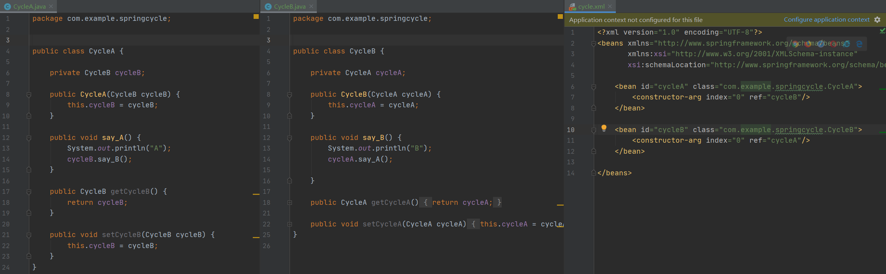

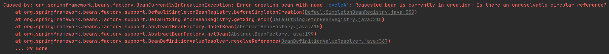

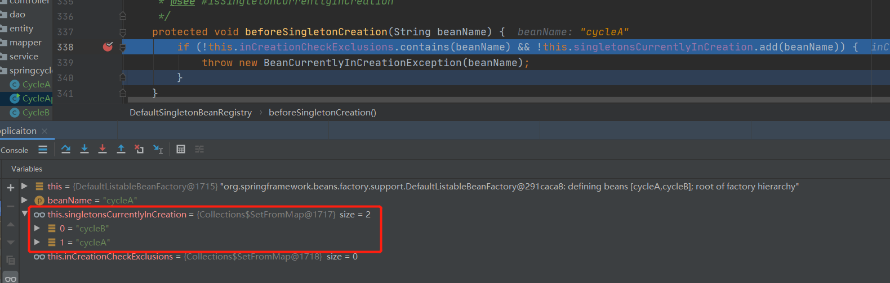

如我们在介绍什么是循环依赖时提到，当初始化A时，发现依赖于B，于是初始化B，又发现依赖于A，于是初始化A，当执行到*beforeSingletonCreation*时，会检查inCreationCheckExclusions里面是否已经初始化过，发现已经有了cycleA，知道是发生了循环依赖，于是抛出异常。

2.  setter循环依赖

当程序改为setter注入时，发现Spring会帮我们自动解决，并没有报错。

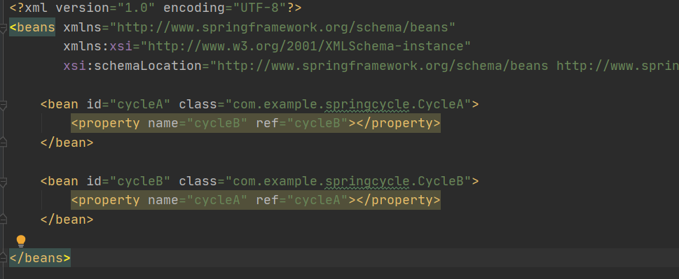

- #### Spring 能解决什么类型的循环依赖？其他类型会怎么样？

Spring只能解决单例**singleton** 的循环依赖。对于scope 为 prototype 的bean，Spring是无法解决的。源码如下：当发现 *prototypesCurrentlyInCreation* 已经存在cycleA后，直切抛出*BeanCurrentlyInCreationException*异常。

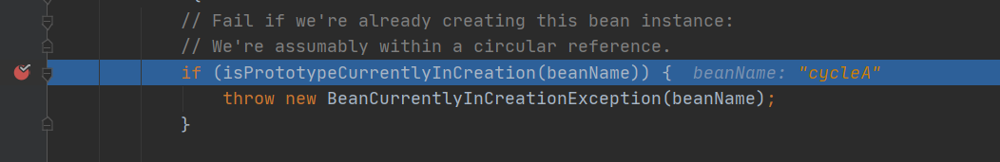

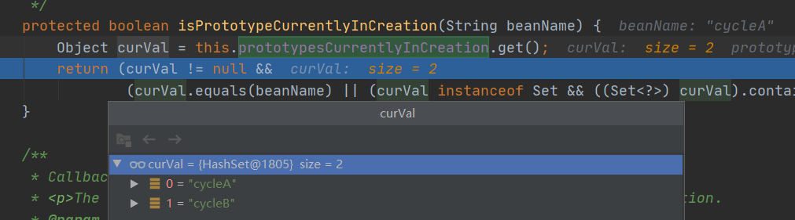

- ####  Spring 如果能解决，是怎么解决的？深入到源码。

Spring 是通过三级缓存来解决 scope 为 **singleton** 的循环依赖的。具体哪三级缓存？

```java
// 一级缓存 ：单例对象缓存
/** Cache of singleton objects: bean name --> bean instance */
private final Map<String, Object> singletonObjects = new ConcurrentHashMap<>(256);

// 二级缓存 ：提前曝光的单例对象缓存
/** Cache of early singleton objects: bean name --> bean instance */
private final Map<String, Object> earlySingletonObjects = new HashMap<>(16);

// 三级缓存 ：单例对象工厂的缓存。
/** Cache of singleton factories: bean name --> ObjectFactory */
private final Map<String, ObjectFactory<?>> singletonFactories = new HashMap<>(16);
```

### Spring 如何解决循环依赖？

当我们执行 *applicationContext.getBean("cycleA")* 时，会触发加载bean阶段。代码会走到 doGetBean()，这个方法时加载Bean的核心方法，以后文章还要慢慢分析这个方法。红线框的地方为：doGetBean方法会首先从缓存中获取Bean实例对象。

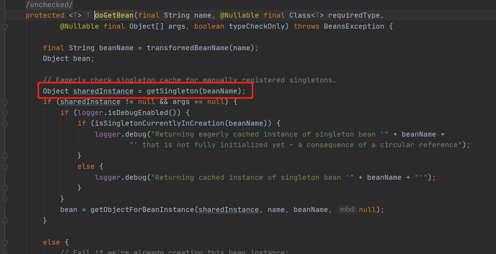

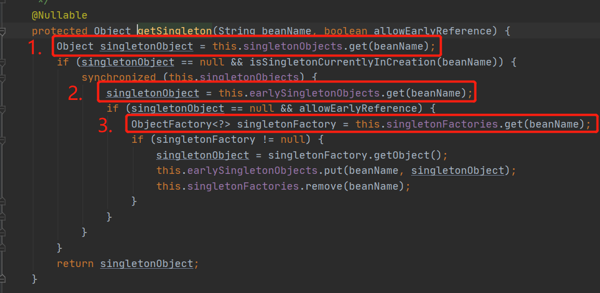

在该方法中，首先会从一级缓存 singletonObjects 中获取，如果获取不到并且当前bean 正在创建，则从二级缓存中 earlySingletonObjects中获取。如果还没有获取 并且允许提前创建，则从singletonFactories中获取相应的 ObjectFactory。如果ObjectFactory不为空，则调用 getObject()创建Bean，创建成功后，将其加入二级缓存，并把三级缓存singletonFactories删除。

初次进来，肯定各级缓存都没有，因此等着断点一直debug下去

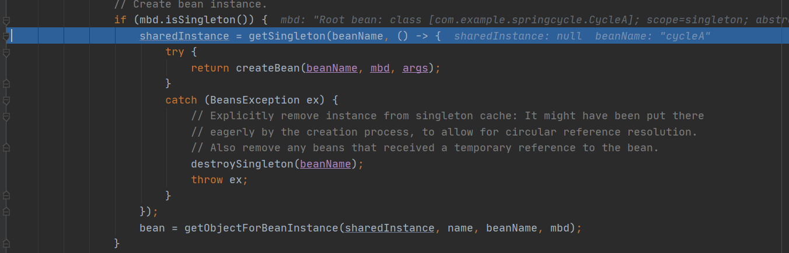

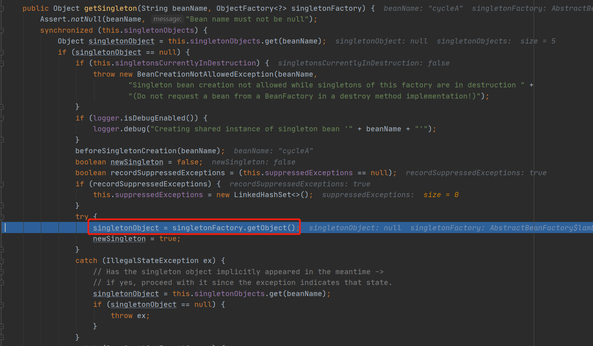

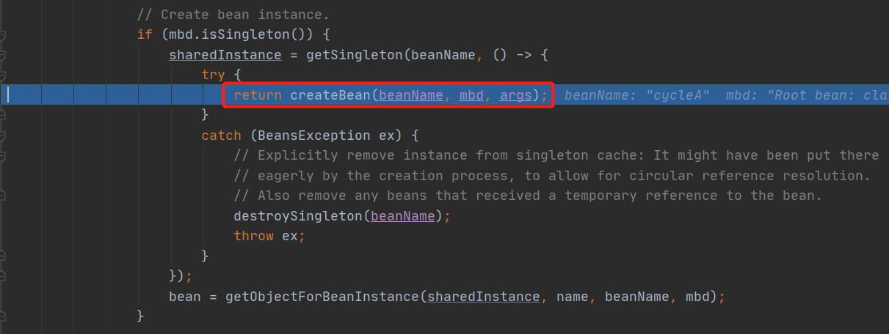

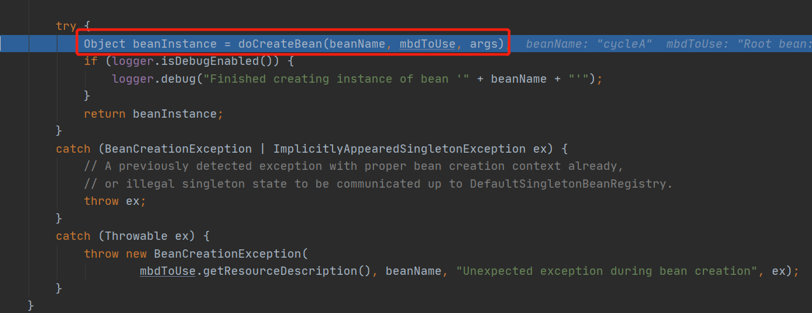

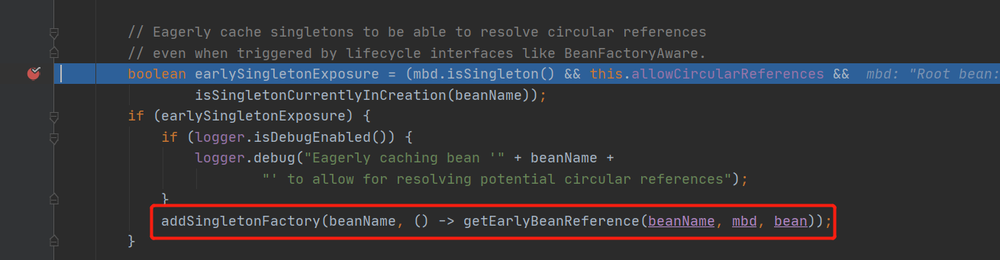

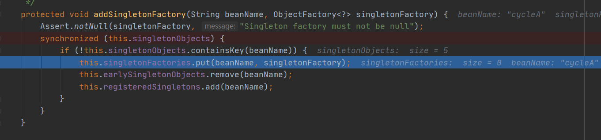

经过一路追踪，终于发现 `doCreateBean()`( AbstractAutowireCapableBeanFactory ) 中，当这个bean是**单例**，**允许提前暴露bean**,**当前bean正在创建**时会调用 addSingletonFactory()，将他们加入singletonFactories里面。

由此我们可以得出，这个三级缓存 singletonFactories 是解决单例bean 循环依赖的关键所在。如下图所示，此时这个bean经过createBeanInstance()，已经创建出来，但是还未进行属性填充和初始化，属于半成品bean。但是对于解决循环依赖已经足够用了。

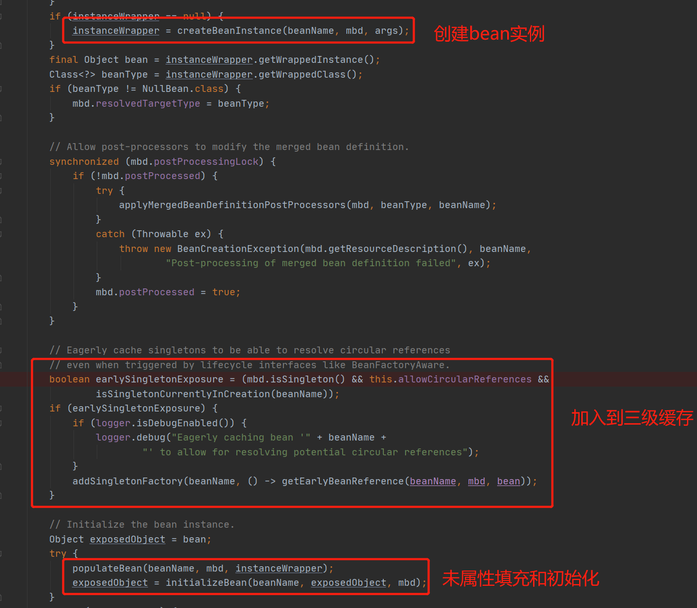

在第一部 doGetBean中 ***Object sharedInstance = getSingleton(beanName);***已经可以从三级缓存中取出，放到二级缓存中，此时进入if判断里面。此时取出的是FactoryBean创建的对象，因此通过getObjectForBeanInstance()最终调用 FactoryBean.getObject()来获取bean实例。

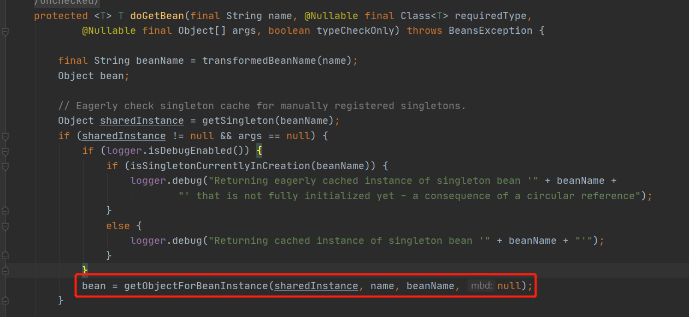

二级、三级缓存的来源都已经知道了，那么一级缓存何时加入呢？


回到这张图中，这里调用getSingleton时，最终会把bean对象加入到一级缓存中。

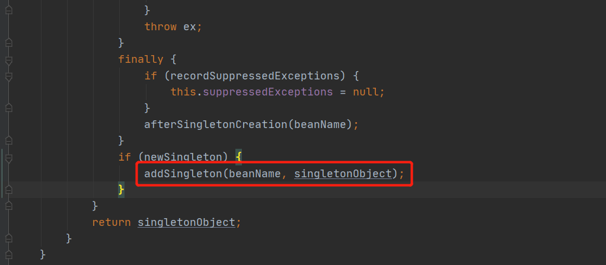

此时，一二三级缓存出处都有了说法。我们来进行总结一波。

### 总结

Spring 循环依赖 是通过三级缓存来实现的。Spring 创建Bean时，并不是等到完全初始化之后才能使用，而是在创建过程中的bean的ObjectFactory提前加入到三级缓存 singletonFactories 中，这样当A初始化一半发现依赖于B，于是去初始化B，此时依赖A，直接在getSingleton() 三级缓存 getObject()获取，然后B顺利初始化完成加入一级缓存 singletonObjects，会到A，A也可以拿到B对象，最终完成初始化。

其实 spring解决循环依赖跟Spring bean加载息息相关，这里先关注spring如何解决循环依赖。最后，花张图来加深印象吧。

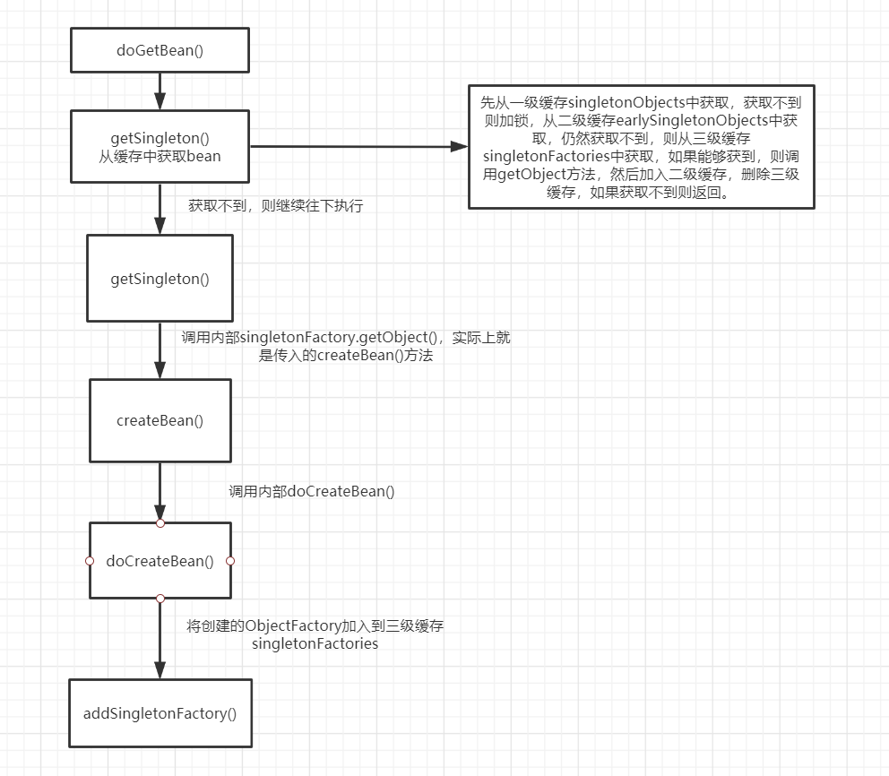

>参考列表：
>
>1. http://cmsblogs.com/?p=4047
>2. 《Spring 技术内幕》

