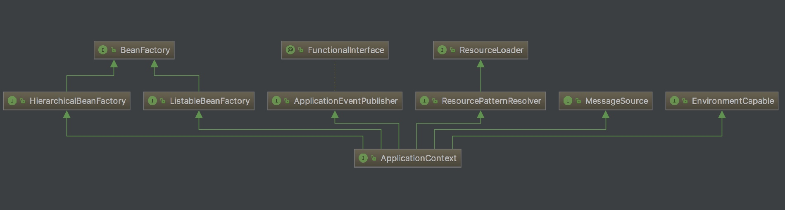
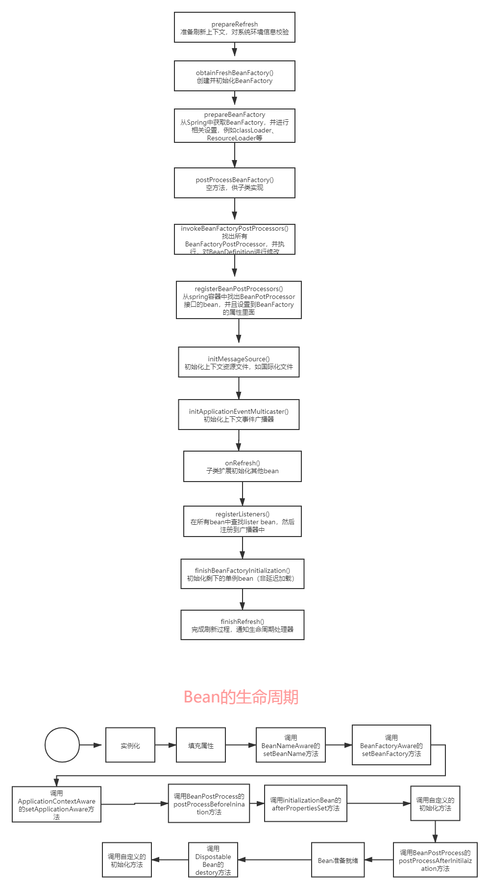

上篇文章我们通过手动加载bean，来大概的走了一遍bean的加载整个流程。这篇文章我们从ApplicationContext的角度来分析一下这个过程。

<!-- more -->

## ApplicationContext


由ApplicationContext的类图我们可以看出来，ApplicationContext继承：

1. BeanFactory ：Spring 管理Bean的顶层接口。ApplicationContext继承BeanFactory的两个子类：HierarchicalBeanFctory 和 ListableBeanFactory。HierarchicalBeanFactory是一个具有层级关系的BeanFactory，拥有属性parentBeanFactory。ListableBeanFactory实现了枚举方法可以列举出当前的BeanFactory中所有bean对象而不必根据name一个一个的获取。
2. ApplicationEventPublisher :用于封装事件发布功能的接口，向事件监听器发送事件消息。
3. ResourceLoader ： Spring加载资源的顶层接口，用于从一个源加载资源文件。Application继承ResourceLoader的子类ResourcePatternResolver，该接口是将location解析为Resource对象的策略接口。
4. MessageSource : 解析message的策略接口，用来支撑国际化等功能。
5. EnvironmentCaple ： 用于获取Environment的接口。

## ApplicationContext.refresh()

refresh()方法恐怕是ApplicationContext最重要的方法。当new ApplicationContext()会执行refresh方法。作用是：刷新Spring应用的上下文。

```java
    public ClassPathXmlApplicationContext(
            String[] configLocations, boolean refresh, @Nullable ApplicationContext parent)
            throws BeansException {

        super(parent);
        setConfigLocations(configLocations);
        if (refresh) {
            refresh();
        }
    }
```

```java
    @Override
    public void refresh() throws BeansException, IllegalStateException {
        synchronized (this.startupShutdownMonitor) {
            // 1. 准备刷新上下文环境
            prepareRefresh();

            // 2. 创建并初始化BeanFactory
            ConfigurableListableBeanFactory beanFactory = obtainFreshBeanFactory();

            // 3.填充BeanFactory功能。
            prepareBeanFactory(beanFactory);

            try {
                // 4. 提供子类覆盖的额外处理，即子类处理自定义的BeanFactoryPostProcess
                postProcessBeanFactory(beanFactory);

                // 5.激活各种BeanFactory处理器
                invokeBeanFactoryPostProcessors(beanFactory);

                // 6.注册拦截Bean创建的Bean处理器，即注册BeanPostProcessor
                registerBeanPostProcessors(beanFactory);

                // 7. 初始化上下文的资源文件，如国际化文件的处理
                initMessageSource();

                // 8. 初始化上下文事件广播器
                initApplicationEventMulticaster();

                // 9. 给子类扩展初始化其他Bean
                onRefresh();

                // 10.在所有Bean中查找listener bean，然后注册到广播器中
                registerListeners();

                // 11.初始化剩下的单例Bean(非延时加载的)
                finishBeanFactoryInitialization(beanFactory);

                // 12.完成刷新过程，通知声明周期处理器lifcycleProcessor刷新过程，同时发出contextRefreshEcent通知别人
                finishRefresh();
            }

            catch (BeansException ex) {
                if (logger.isWarnEnabled()) {
                    logger.warn("Exception encountered during context initialization - " +
                            "cancelling refresh attempt: " + ex);
                }

                // 如果发生异常，销毁已经创建的bean
                destroyBeans();

                // 重置容器激活标签
                cancelRefresh(ex);

                // Propagate exception to caller.
                throw ex;
            }

            finally {
                // Reset common introspection caches in Spring's core, since we
                // might not ever need metadata for singleton beans anymore...
                resetCommonCaches();
            }
        }
    }
```
一共12个方法，可不可怕？ 我们来一个一个大致过一遍。

### prepareRefresh()

这个方法是准备刷新上下文环境。主要对系统的环境变量或者系统属性进行准备和校验。比如重写initPropertySources方法，要求环境变量中必须设置某个值才能进行刷新上下文，否则不能运行，

```java
    protected void prepareRefresh() {
        // 设置启动日期
        this.startupDate = System.currentTimeMillis();
        //设置context当前状态
        this.closed.set(false);
        this.active.set(true);

        if (logger.isDebugEnabled()) {
            if (logger.isTraceEnabled()) {
                logger.trace("Refreshing " + this);
            }
            else {
                logger.debug("Refreshing " + getDisplayName());
            }
        }
        //自定义实现，可以用实际实例替换根属性来源
        initPropertySources();
        // 对属性进行必要的验证
        getEnvironment().validateRequiredProperties();
        if (this.earlyApplicationListeners == null) {
            this.earlyApplicationListeners = new LinkedHashSet<>(this.applicationListeners);
        }
        else {
            this.applicationListeners.clear();
            this.applicationListeners.addAll(this.earlyApplicationListeners);
        }
        this.earlyApplicationEvents = new LinkedHashSet<>();
    }
```

所以该方法主要是做一些准备工作：设置context启动时间，设置context状态、初始化context environmetn中的占位符、对属性进行必要的校验等。

### obtainFreshBeanFactory()

该方法主要是 创建和初始化 BeanFactory。

```java
protected ConfigurableListableBeanFactory obtainFreshBeanFactory() {
    //刷新BeanFactory
   refreshBeanFactory();
    //获取BeanFactory
   ConfigurableListableBeanFactory beanFactory = getBeanFactory();
   if (logger.isDebugEnabled()) {
      logger.debug("Bean factory for " + getDisplayName() + ": " + beanFactory);
   }
   return beanFactory;
}

@Override
protected final void refreshBeanFactory() throws BeansException {
    if (hasBeanFactory()) {
        destroyBeans();
        closeBeanFactory();
    }
    try {
        DefaultListableBeanFactory beanFactory = createBeanFactory();
        beanFactory.setSerializationId(getId());
        customizeBeanFactory(beanFactory);
        loadBeanDefinitions(beanFactory);
        synchronized (this.beanFactoryMonitor) {
            this.beanFactory = beanFactory;
        }
    }
    catch (IOException ex) {
        throw new ApplicationContextException("I/O error parsing bean definition source for " + getDisplayName(), ex);
    }
}
```

这个方法的作用是：

1. 判断当前容器是否存在一个BeanFactory，如果存在那么则对其进行销毁和关闭
2. 调用createBeanFactory()创建一个BeanFactory实例，其实就是创建一个DefaultListableBeanFactory。
3. 自定义BeanFactory
4. 加载BeanDefinition
5. 将创建好的Bean工厂的引用交给context来管理。

### prepareBeanFactory(beanFactory);

上面创建了BeanFactory，那么这里就对BeanFactory的功能进行填充

```java
protected void prepareBeanFactory(ConfigurableListableBeanFactory beanFactory) {
   // 设置BeanFactory的classLoader
   beanFactory.setBeanClassLoader(getClassLoader());
    // 设置beanFactory的表达式语言处理器,Spring3开始增加了对语言表达式的支持,默认可以使用#{bean.xxx}的形式来调用相关属性值
   beanFactory.setBeanExpressionResolver(new StandardBeanExpressionResolver(beanFactory.getBeanClassLoader()));
    // 为beanFactory增加一个默认的propertyEditor
   beanFactory.addPropertyEditorRegistrar(new ResourceEditorRegistrar(this, getEnvironment()));

   // 添加ApplicationContextAwareProcessor
   beanFactory.addBeanPostProcessor(new ApplicationContextAwareProcessor(this));
    // 设置忽略自动装配的接口
   beanFactory.ignoreDependencyInterface(EnvironmentAware.class);
   beanFactory.ignoreDependencyInterface(EmbeddedValueResolverAware.class);
   beanFactory.ignoreDependencyInterface(ResourceLoaderAware.class);
   beanFactory.ignoreDependencyInterface(ApplicationEventPublisherAware.class);
   beanFactory.ignoreDependencyInterface(MessageSourceAware.class);
   beanFactory.ignoreDependencyInterface(ApplicationContextAware.class);

   // // 设置几个自动装配的特殊规则
   beanFactory.registerResolvableDependency(BeanFactory.class, beanFactory);
   beanFactory.registerResolvableDependency(ResourceLoader.class, this);
   beanFactory.registerResolvableDependency(ApplicationEventPublisher.class, this);
   beanFactory.registerResolvableDependency(ApplicationContext.class, this);

   // Register early post-processor for detecting inner beans as ApplicationListeners.
   beanFactory.addBeanPostProcessor(new ApplicationListenerDetector(this));

   // 增加对AspectJ的支持
   if (beanFactory.containsBean(LOAD_TIME_WEAVER_BEAN_NAME)) {
      beanFactory.addBeanPostProcessor(new LoadTimeWeaverAwareProcessor(beanFactory));
      // Set a temporary ClassLoader for type matching.
      beanFactory.setTempClassLoader(new ContextTypeMatchClassLoader(beanFactory.getBeanClassLoader()));
   }

     // 注册默认的系统环境bean
   if (!beanFactory.containsLocalBean(ENVIRONMENT_BEAN_NAME)) {
      beanFactory.registerSingleton(ENVIRONMENT_BEAN_NAME, getEnvironment());
   }
   if (!beanFactory.containsLocalBean(SYSTEM_PROPERTIES_BEAN_NAME)) {
      beanFactory.registerSingleton(SYSTEM_PROPERTIES_BEAN_NAME, getEnvironment().getSystemProperties());
   }
   if (!beanFactory.containsLocalBean(SYSTEM_ENVIRONMENT_BEAN_NAME)) {
      beanFactory.registerSingleton(SYSTEM_ENVIRONMENT_BEAN_NAME, getEnvironment().getSystemEnvironment());
   }
}
```

### postProcessBeanFactory(beanFactory)

空方法，子类通过重写这个方法来在BeanFactory创建并预准备完成以后做进一步设置。

```java
	protected void postProcessBeanFactory(ConfigurableListableBeanFactory beanFactory) {
	}
```

### invokeBeanFactoryPostProcessors(beanFactory)

激活这种BeanFactory处理器。

```java
protected void invokeBeanFactoryPostProcessors(ConfigurableListableBeanFactory beanFactory) {
   PostProcessorRegistrationDelegate.invokeBeanFactoryPostProcessors(beanFactory, getBeanFactoryPostProcessors());

   // Detect a LoadTimeWeaver and prepare for weaving, if found in the meantime
   // (e.g. through an @Bean method registered by ConfigurationClassPostProcessor)
   if (beanFactory.getTempClassLoader() == null && beanFactory.containsBean(LOAD_TIME_WEAVER_BEAN_NAME)) {
      beanFactory.addBeanPostProcessor(new LoadTimeWeaverAwareProcessor(beanFactory));
      beanFactory.setTempClassLoader(new ContextTypeMatchClassLoader(beanFactory.getBeanClassLoader()));
   }
}

public static void invokeBeanFactoryPostProcessors(
			ConfigurableListableBeanFactory beanFactory, List<BeanFactoryPostProcessor> beanFactoryPostProcessors) {

		// Invoke BeanDefinitionRegistryPostProcessors first, if any.
		Set<String> processedBeans = new HashSet<>();

		if (beanFactory instanceof BeanDefinitionRegistry) {
			BeanDefinitionRegistry registry = (BeanDefinitionRegistry) beanFactory;
			List<BeanFactoryPostProcessor> regularPostProcessors = new LinkedList<>();
			List<BeanDefinitionRegistryPostProcessor> registryProcessors = new LinkedList<>();

			for (BeanFactoryPostProcessor postProcessor : beanFactoryPostProcessors) {
				if (postProcessor instanceof BeanDefinitionRegistryPostProcessor) {
					BeanDefinitionRegistryPostProcessor registryProcessor =
							(BeanDefinitionRegistryPostProcessor) postProcessor;
					registryProcessor.postProcessBeanDefinitionRegistry(registry);
					registryProcessors.add(registryProcessor);
				}
				else {
					regularPostProcessors.add(postProcessor);
				}
			}

			// Do not initialize FactoryBeans here: We need to leave all regular beans
			// uninitialized to let the bean factory post-processors apply to them!
			// Separate between BeanDefinitionRegistryPostProcessors that implement
			// PriorityOrdered, Ordered, and the rest.
			List<BeanDefinitionRegistryPostProcessor> currentRegistryProcessors = new ArrayList<>();

			// First, invoke the BeanDefinitionRegistryPostProcessors that implement PriorityOrdered.
			String[] postProcessorNames =
					beanFactory.getBeanNamesForType(BeanDefinitionRegistryPostProcessor.class, true, false);
			for (String ppName : postProcessorNames) {
				if (beanFactory.isTypeMatch(ppName, PriorityOrdered.class)) {
					currentRegistryProcessors.add(beanFactory.getBean(ppName, BeanDefinitionRegistryPostProcessor.class));
					processedBeans.add(ppName);
				}
			}
			sortPostProcessors(currentRegistryProcessors, beanFactory);
			registryProcessors.addAll(currentRegistryProcessors);
			invokeBeanDefinitionRegistryPostProcessors(currentRegistryProcessors, registry);
			currentRegistryProcessors.clear();

			// Next, invoke the BeanDefinitionRegistryPostProcessors that implement Ordered.
			postProcessorNames = beanFactory.getBeanNamesForType(BeanDefinitionRegistryPostProcessor.class, true, false);
			for (String ppName : postProcessorNames) {
				if (!processedBeans.contains(ppName) && beanFactory.isTypeMatch(ppName, Ordered.class)) {
					currentRegistryProcessors.add(beanFactory.getBean(ppName, BeanDefinitionRegistryPostProcessor.class));
					processedBeans.add(ppName);
				}
			}
			sortPostProcessors(currentRegistryProcessors, beanFactory);
			registryProcessors.addAll(currentRegistryProcessors);
			invokeBeanDefinitionRegistryPostProcessors(currentRegistryProcessors, registry);
			currentRegistryProcessors.clear();

			// Finally, invoke all other BeanDefinitionRegistryPostProcessors until no further ones appear.
			boolean reiterate = true;
			while (reiterate) {
				reiterate = false;
				postProcessorNames = beanFactory.getBeanNamesForType(BeanDefinitionRegistryPostProcessor.class, true, false);
				for (String ppName : postProcessorNames) {
					if (!processedBeans.contains(ppName)) {
						currentRegistryProcessors.add(beanFactory.getBean(ppName, BeanDefinitionRegistryPostProcessor.class));
						processedBeans.add(ppName);
						reiterate = true;
					}
				}
				sortPostProcessors(currentRegistryProcessors, beanFactory);
				registryProcessors.addAll(currentRegistryProcessors);
				invokeBeanDefinitionRegistryPostProcessors(currentRegistryProcessors, registry);
				currentRegistryProcessors.clear();
			}

			// Now, invoke the postProcessBeanFactory callback of all processors handled so far.
			invokeBeanFactoryPostProcessors(registryProcessors, beanFactory);
			invokeBeanFactoryPostProcessors(regularPostProcessors, beanFactory);
		}

		else {
			// Invoke factory processors registered with the context instance.
			invokeBeanFactoryPostProcessors(beanFactoryPostProcessors, beanFactory);
		}

		// Do not initialize FactoryBeans here: We need to leave all regular beans
		// uninitialized to let the bean factory post-processors apply to them!
		String[] postProcessorNames =
				beanFactory.getBeanNamesForType(BeanFactoryPostProcessor.class, true, false);

		// Separate between BeanFactoryPostProcessors that implement PriorityOrdered,
		// Ordered, and the rest.
		List<BeanFactoryPostProcessor> priorityOrderedPostProcessors = new ArrayList<>();
		List<String> orderedPostProcessorNames = new ArrayList<>();
		List<String> nonOrderedPostProcessorNames = new ArrayList<>();
		for (String ppName : postProcessorNames) {
			if (processedBeans.contains(ppName)) {
				// skip - already processed in first phase above
			}
			else if (beanFactory.isTypeMatch(ppName, PriorityOrdered.class)) {
				priorityOrderedPostProcessors.add(beanFactory.getBean(ppName, BeanFactoryPostProcessor.class));
			}
			else if (beanFactory.isTypeMatch(ppName, Ordered.class)) {
				orderedPostProcessorNames.add(ppName);
			}
			else {
				nonOrderedPostProcessorNames.add(ppName);
			}
		}

		// First, invoke the BeanFactoryPostProcessors that implement PriorityOrdered.
		sortPostProcessors(priorityOrderedPostProcessors, beanFactory);
		invokeBeanFactoryPostProcessors(priorityOrderedPostProcessors, beanFactory);

		// Next, invoke the BeanFactoryPostProcessors that implement Ordered.
		List<BeanFactoryPostProcessor> orderedPostProcessors = new ArrayList<>();
		for (String postProcessorName : orderedPostProcessorNames) {
			orderedPostProcessors.add(beanFactory.getBean(postProcessorName, BeanFactoryPostProcessor.class));
		}
		sortPostProcessors(orderedPostProcessors, beanFactory);
		invokeBeanFactoryPostProcessors(orderedPostProcessors, beanFactory);

		// Finally, invoke all other BeanFactoryPostProcessors.
		List<BeanFactoryPostProcessor> nonOrderedPostProcessors = new ArrayList<>();
		for (String postProcessorName : nonOrderedPostProcessorNames) {
			nonOrderedPostProcessors.add(beanFactory.getBean(postProcessorName, BeanFactoryPostProcessor.class));
		}
		invokeBeanFactoryPostProcessors(nonOrderedPostProcessors, beanFactory);

		// Clear cached merged bean definitions since the post-processors might have
		// modified the original metadata, e.g. replacing placeholders in values...
		beanFactory.clearMetadataCache();
	}
```

这个方法比较长，**一句话解释就是在Spring容器中找出实现了BeanFactoryPostProcessor接口的processor并执行**。Srping容器会委托给**PostProcessorRegistrationDelegate**的**invokeBeanFactoryPostProcessors**方法执行，

详细点解释就是对所有的**BeanDefinitionRegistryPostProcessors** ，手动注册的 **BeanFactoryPostProcessor** ，通过配置文件方式的 **BeanFactoryPostProcessor** 按照 PriorityOrdered 、 Ordered、no ordered 三种方式分开处理、调用。

这里介绍下这两种接口：

1. **BeanFactoryPostProcessor**：用来修改Spring容器中已经存在的bean的定义，ConfigurableListableBeanFactory对Bean进行处理。
2. **BeanDefinitionRegistryPostProcessor**: 继承BeanFactoryPostProcessor，作用跟BeanFactoryPostProcessor一样，只不过是使用BeanDefinitionRegistry对bean进行处理。

### registerBeanPostProcessors(beanFactory)

从Spring容器中找出BeanPostcessor接口的bean，并设置到BeanFactory属性中，之后bean被实例化的时候会调用这个BeanPostProcessor。跟BeanFactoryPostProcessor 一样，也是委托给PostProcessorRegistrationDelegate 来实现。**BeanPostProcessor会在这里被实例化。**

```java
protected void registerBeanPostProcessors(ConfigurableListableBeanFactory beanFactory) {
   PostProcessorRegistrationDelegate.registerBeanPostProcessors(beanFactory, this);
}
```

### initMessageSource()

在Spring容器中初始化一些国际化相关的属性。

```java
protected void initMessageSource() {
   ConfigurableListableBeanFactory beanFactory = getBeanFactory();
   if (beanFactory.containsLocalBean(MESSAGE_SOURCE_BEAN_NAME)) {
      this.messageSource = beanFactory.getBean(MESSAGE_SOURCE_BEAN_NAME, MessageSource.class);
      // Make MessageSource aware of parent MessageSource.
      if (this.parent != null && this.messageSource instanceof HierarchicalMessageSource) {
         HierarchicalMessageSource hms = (HierarchicalMessageSource) this.messageSource;
         if (hms.getParentMessageSource() == null) {
            // Only set parent context as parent MessageSource if no parent MessageSource
            // registered already.
            hms.setParentMessageSource(getInternalParentMessageSource());
         }
      }
      if (logger.isDebugEnabled()) {
         logger.debug("Using MessageSource [" + this.messageSource + "]");
      }
   }
   else {
      // Use empty MessageSource to be able to accept getMessage calls.
      DelegatingMessageSource dms = new DelegatingMessageSource();
      dms.setParentMessageSource(getInternalParentMessageSource());
      this.messageSource = dms;
      beanFactory.registerSingleton(MESSAGE_SOURCE_BEAN_NAME, this.messageSource);
      if (logger.isDebugEnabled()) {
         logger.debug("Unable to locate MessageSource with name '" + MESSAGE_SOURCE_BEAN_NAME +
               "': using default [" + this.messageSource + "]");
      }
   }
}
```

### initApplicationEventMulticaster()

初始化上下文事件广播器，事件广播器用于事件的发布。

```java
protected void initApplicationEventMulticaster() {
   ConfigurableListableBeanFactory beanFactory = getBeanFactory();
   if (beanFactory.containsLocalBean(APPLICATION_EVENT_MULTICASTER_BEAN_NAME)) {
      this.applicationEventMulticaster =
            beanFactory.getBean(APPLICATION_EVENT_MULTICASTER_BEAN_NAME, ApplicationEventMulticaster.class);
      if (logger.isDebugEnabled()) {
         logger.debug("Using ApplicationEventMulticaster [" + this.applicationEventMulticaster + "]");
      }
   }
   else {
      this.applicationEventMulticaster = new SimpleApplicationEventMulticaster(beanFactory);
      beanFactory.registerSingleton(APPLICATION_EVENT_MULTICASTER_BEAN_NAME, this.applicationEventMulticaster);
      if (logger.isDebugEnabled()) {
         logger.debug("Unable to locate ApplicationEventMulticaster with name '" +
               APPLICATION_EVENT_MULTICASTER_BEAN_NAME +
               "': using default [" + this.applicationEventMulticaster + "]");
      }
   }
}
```

### onRefresh()

给子类扩展初始化其他bean。不同的Spring容器做不同的事情。

比如web程序的容器AnnotationConfigEmbeddedWebApplicationContext会调用 createEmbeddedServletContainer方法会去创建内置的Servlet容器。

```java
protected void onRefresh() throws BeansException {
   // For subclasses: do nothing by default.
}
```

### registerListeners()

找出所有Bean的lister bean，然后注册到广播器中。

```java
protected void registerListeners() {
   // Register statically specified listeners first.
   for (ApplicationListener<?> listener : getApplicationListeners()) {
      getApplicationEventMulticaster().addApplicationListener(listener);
   }

   // Do not initialize FactoryBeans here: We need to leave all regular beans
   // uninitialized to let post-processors apply to them!
   String[] listenerBeanNames = getBeanNamesForType(ApplicationListener.class, true, false);
   for (String listenerBeanName : listenerBeanNames) {
      getApplicationEventMulticaster().addApplicationListenerBean(listenerBeanName);
   }

   // Publish early application events now that we finally have a multicaster...
   Set<ApplicationEvent> earlyEventsToProcess = this.earlyApplicationEvents;
   this.earlyApplicationEvents = null;
   if (earlyEventsToProcess != null) {
      for (ApplicationEvent earlyEvent : earlyEventsToProcess) {
         getApplicationEventMulticaster().multicastEvent(earlyEvent);
      }
   }
}
```

### finishBeanFactoryInitialization(beanFactory)

实例化BeanFactory中已经被注册但是未实例化的所有实例，懒加载的不需要实例化。

比如invokeBeanFactoryPostProcessors方法中根据各种注解解析出来的类，在这个时候都会被初始化。

### finishRefresh()

完成刷新过程，通知生命周期处理器lifecycleProcessor刷新过程，同时发出ContextRefreshEvent通知别人。

```java
protected void finishRefresh() {
   // Clear context-level resource caches (such as ASM metadata from scanning).
   clearResourceCaches();

   // Initialize lifecycle processor for this context.
   initLifecycleProcessor();

   // Propagate refresh to lifecycle processor first.
   getLifecycleProcessor().onRefresh();

   // Publish the final event.
   publishEvent(new ContextRefreshedEvent(this));

   // Participate in LiveBeansView MBean, if active.
   LiveBeansView.registerApplicationContext(this);
}
```

## 总结

所以我们总结，整个refresh方法做的事情是：


