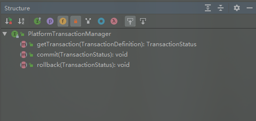
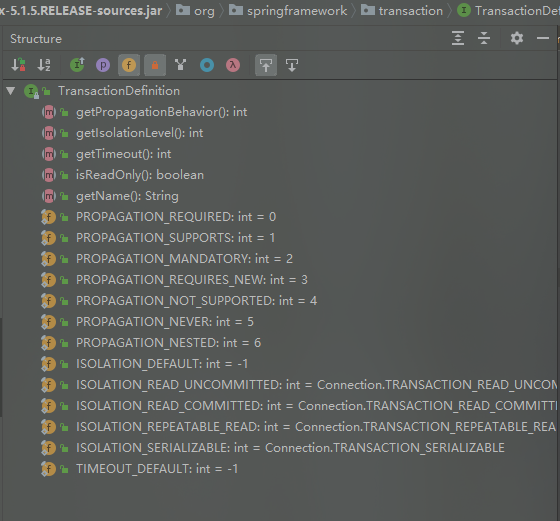
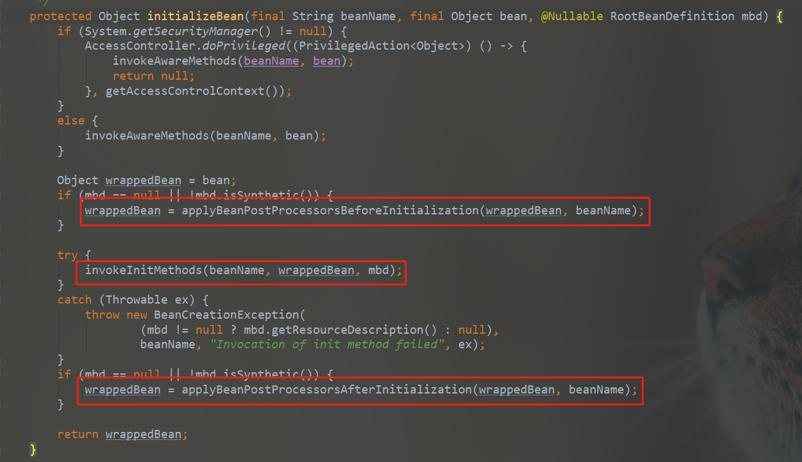
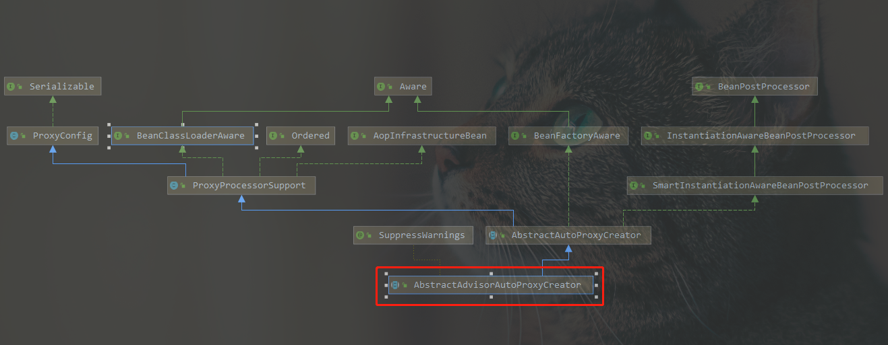
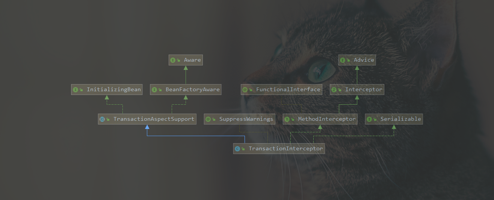

前面几篇文件讲述了spring Ioc、Aop等相关原理，虽然不是到具体每行代码，但是起码熟悉了整个流程，今天这篇文章再来熟悉一下相关的事务原理，起码以后被问到了，不会说只能回答个事务的传播机制。

<!-- more -->

## Spring事务属性

首先我们需要明确的是，Spring对事务的支持是需要数据库进行支持的，如果MySQL的存储引擎是MyISAM，那么即便是Spring对事务进行了设置，但是事务也是无效，因此，从根本上MyISAM就不支持事务，所以Spring的事务也就无从谈起了。

在Mysql篇章中，我们提到，Mysql的undo log就是用来进行事务回滚的，回滚日志记录的是逻辑日志，是数据修改前的记录，当需要进行回滚时，直接利用undo log将数据恢复成修改前的样子即可。

### Spring两种方式支持事务管理

1. 编程式事务管理

通俗的说就是通过**TransactionTemplate**手动管理事务，一般应用场景不多。 

2. 声明式事务管理

通过**@Transactional**注解实现事务，这种实现原理是通过AOP实现的。

### Spring事务抽象

Spring使用统一的事务抽象，来使得不同应用程序都可以使用统一的编程模型。Spring事务管理相关的主要有三个核心接口：

1. **PlatformTransactionManager**：定义了事务操作的行为，Spring事务的核心。


***getTransaction***方法：事务获取操作，根据事务属性定义，获取当前事务或者创建新事务。

***commit***方法：事务提交操作，但是这列并不是直接提交事务，而是根据当前事务状态提交或者回滚。

***rollback***方法：事务回滚操作，但是这里并不一定直接回滚，有可能只是标记事务为只读，等待其他调用方执行回滚。

2. **TransactionDefinition**：定义事务相关信息，如隔离级别，传播行为等。


***getPropagationBehavior***方法：返回事务的传播属性，默认值是PROPAGATION_REQUIRED。

***getIsolationLevel***方法：返回事务隔离级别，事务隔离级别只有在创建新事物时才有效，也就是说只对应传播属性：PROPAGATION_REQUIRED和PROPAGATION_REQUIRES_NEW。

***getTimeout***方法：返回事务超时时间，以秒为单位，同样只在创建新事务时才有效。

***isReadOnly***方法：是否优化为只读。

3. **TransactionStatus**：事务的运行状态。

***isNewTransaction***方法：当前方法是否创建了新事务

***hasSavepoint***方法：在嵌套事务场景中，判断当前事务是否包含保存点

***setRollbackOnly***和***isRollbackOnly***方法：只读属性设置

***flush***方法：刷新底层会话中的修改到数据库

***isCompleted***方法：判断当前事务是否已完成

### 事务传播机制

1. **PROPAGATION_REQUIRED**：@Transactional注解默认的事务传播机制。如果当前存在事务，那么则加入事务；如果当前没有事务，则创建一个新的事务。
2. **PROPAGATION_REQUIRES_NEW**：创建一个新的事务，如果当前存在事务，则把当前事务挂起。也就是说不管外部方法有没有事务，当前方法都会开启新的事务，并且开启的事务不会会受到外部事物的影响。
3. **PROPAGATION_NESTED**：如果当前存在事务，那么创建一个事务作为当前事务的嵌套事务来运行。如果当前没有事务，则创建一个新的事务。也就是说，如果外部方法没有事务，当前方法会开启自己的事务。如果外部方法开启了事务，那么当前方法属于外部事务的子事务，如果外部事务回滚，那么子事务也回滚，而子事务回滚不影响外部主事务。
4. **PROPAGATION_MANDATORY**：如果当前存在事务，则加入；否则则抛出异常。
5. **PROPAGATION_SUPPORTS**：当前存在事务，则加入；如果当前没有事务，则以非事务方式运行
6. **PROPAGATION_SUPPORTS**：以非事务运行，如果当前存在事务，则挂起当前事务。
7. PROPAGATION_NEVER：以非事务运行，如果当前存在事务，则抛出异常

### 事务的隔离级别

Spring的事务隔离级别跟MySQL数据库一致。

1. **ISOLATION_DEFAULT**：使用后端数据库默认的隔离级别。MySQL默认采用RR。
2. **ISOLATION_READ_UNCOMMITTED**：读未提交，会有脏读、幻读、不可重复读的问题。
3. **ISOLATION_READ_COMMITTED**：读已提交，可以阻止脏读，但是幻读、不可重复读还会发生。
4. **ISOLATION_REPEATABLE_READ**：可重复读，可以阻止脏读、不可重复读，但是幻读还有可能发生。
5. **ISOLATION_SERIALIZABLE**：串行化，所有操作串行执行。

在MySQL中，我们提到过，在InnoDB存储引擎下，mysql通过next-key lock锁可以避免幻读的产生。

### @Transactional事务的源码实现

在分析Spring IOC时，我们提到，在bean初始化时，**createBean()--->doCreateBean()---->initializeBean()**：


可以看出**BeanPostProcessor**中的两个方法 **postProcessBeforeInitilization**和**postProcessAfterInitilization**分别是在bean的init方法前后执行。其中代理对象就是在**postProcessAfterInitialization**中完成的，用代理的bean来替换原来的bean。

默认情况下，**BeanPostProcessor**是通过默认实现类 **DefaultAdvisorAutoProxyCreator**实现，而该类则继承于**AbstractAdvisorAutoProxyCreator**类，**AbstractAdvisorAutoProxyCreator**类又继承于**AbstractAutoProxyCreator**类。类图如下：


而真正实现**postProcessAfterInnitialization**方法是在父类**AbstractAutoProxyCreator**类。
```java
   //org.springframework.aop.framework.autoproxy.AbstractAutoProxyCreator#postProcessAfterInitialization
    @Override
    public Object postProcessAfterInitialization(@Nullable Object bean, String beanName) {
        if (bean != null) {
            Object cacheKey = getCacheKey(bean.getClass(), beanName);
            if (this.earlyProxyReferences.remove(cacheKey) != bean) {
                //创建代理对象
                return wrapIfNecessary(bean, beanName, cacheKey);
            }
        }
        return bean;
    }

   //org.springframework.aop.framework.autoproxy.AbstractAutoProxyCreator#wrapIfNecessary
    protected Object wrapIfNecessary(Object bean, String beanName, Object cacheKey) {
        if (StringUtils.hasLength(beanName) && this.targetSourcedBeans.contains(beanName)) {
            return bean;
        }
        if (Boolean.FALSE.equals(this.advisedBeans.get(cacheKey))) {
            return bean;
        }
        if (isInfrastructureClass(bean.getClass()) || shouldSkip(bean.getClass(), beanName)) {
            this.advisedBeans.put(cacheKey, Boolean.FALSE);
            return bean;
        }

        // Create proxy if we have advice.
        // 查找advice从而创建代理类
        Object[] specificInterceptors = getAdvicesAndAdvisorsForBean(bean.getClass(), beanName, null);
        if (specificInterceptors != DO_NOT_PROXY) {
            this.advisedBeans.put(cacheKey, Boolean.TRUE);
            Object proxy = createProxy(
                    bean.getClass(), beanName, specificInterceptors, new SingletonTargetSource(bean));
            this.proxyTypes.put(cacheKey, proxy.getClass());
            return proxy;
        }

        this.advisedBeans.put(cacheKey, Boolean.FALSE);
        return bean;
    }


//org.springframework.aop.framework.autoproxy.AbstractAutoProxyCreator#createProxy
    protected Object createProxy(Class<?> beanClass, @Nullable String beanName,
            @Nullable Object[] specificInterceptors, TargetSource targetSource) {

        if (this.beanFactory instanceof ConfigurableListableBeanFactory) {
            AutoProxyUtils.exposeTargetClass((ConfigurableListableBeanFactory) this.beanFactory, beanName, beanClass);
        }
        //实例化代理工厂类
        ProxyFactory proxyFactory = new ProxyFactory();
        proxyFactory.copyFrom(this);

        if (!proxyFactory.isProxyTargetClass()) {
            if (shouldProxyTargetClass(beanClass, beanName)) {
                proxyFactory.setProxyTargetClass(true);
            }
            else {
                evaluateProxyInterfaces(beanClass, proxyFactory);
            }
        }

        Advisor[] advisors = buildAdvisors(beanName, specificInterceptors);
        proxyFactory.addAdvisors(advisors);
        proxyFactory.setTargetSource(targetSource);
        customizeProxyFactory(proxyFactory);

        proxyFactory.setFrozen(this.freezeProxy);
        if (advisorsPreFiltered()) {
            proxyFactory.setPreFiltered(true);
        }
        //创建代理对象
        return proxyFactory.getProxy(getProxyClassLoader());
    }        
```

最后通过调用*ProxyFactory#getProxy(java.lang.ClassLoader)*方法来创建代理对象：
```java
    public Object getProxy(@Nullable ClassLoader classLoader) {
        return createAopProxy().getProxy(classLoader);
    }

    protected final synchronized AopProxy createAopProxy() {
        if (!this.active) {
            activate();
        }
        return getAopProxyFactory().createAopProxy(this);
    }

    public AopProxyFactory getAopProxyFactory() {
        return this.aopProxyFactory;
    }

    public ProxyCreatorSupport() {
        this.aopProxyFactory = new DefaultAopProxyFactory();
    }

            
```

可以看出，这里和AOP一样，最终是通过*AopProxy.getProxy()*去获取代理对象。而这个AopProxy则是**DefaultAopProxyFactory**，因此这里就跟AOP一样了，根据目标类是否接口或者强制要求cglib等来决定是使用JDK动态代理还是CGLIB。

```java
public class DefaultAopProxyFactory implements AopProxyFactory, Serializable {

    @Override
    public AopProxy createAopProxy(AdvisedSupport config) throws AopConfigException {
        if (config.isOptimize() || config.isProxyTargetClass() || hasNoUserSuppliedProxyInterfaces(config)) {
            Class<?> targetClass = config.getTargetClass();
            if (targetClass == null) {
                throw new AopConfigException("TargetSource cannot determine target class: " +
                        "Either an interface or a target is required for proxy creation.");
            }
            if (targetClass.isInterface() || Proxy.isProxyClass(targetClass)) {
                return new JdkDynamicAopProxy(config);
            }
            return new ObjenesisCglibAopProxy(config);
        }
        else {
            return new JdkDynamicAopProxy(config);
        }
    }
```

以上，我们已经拥有了对象的代理类，当调用代理对象的方法时，会触发对应的AOP增强拦截器。事务增强对应的是**TransactionInterceptor**类，该类继承**MethodInterceptor**。


当调用目标类的方法时，最终会转发到**TransactionInterceptor**类的invoke方法，会调用**TransactionAspectSupport**的**invokeWithinTransaction**方法会进行事务处理。

```java
    @Override
    @Nullable
    public Object invoke(MethodInvocation invocation) throws Throwable {
        // Work out the target class: may be {@code null}.
        // The TransactionAttributeSource should be passed the target class
        // as well as the method, which may be from an interface.
        Class<?> targetClass = (invocation.getThis() != null ? AopUtils.getTargetClass(invocation.getThis()) : null);

        // Adapt to TransactionAspectSupport's invokeWithinTransaction...
        return invokeWithinTransaction(invocation.getMethod(), targetClass, invocation::proceed);
    }


    @Nullable
    protected Object invokeWithinTransaction(Method method, @Nullable Class<?> targetClass,
            final InvocationCallback invocation) throws Throwable {

        // If the transaction attribute is null, the method is non-transactional.
        TransactionAttributeSource tas = getTransactionAttributeSource();
        final TransactionAttribute txAttr = (tas != null ? tas.getTransactionAttribute(method, targetClass) : null);
        final PlatformTransactionManager tm = determineTransactionManager(txAttr);
        final String joinpointIdentification = methodIdentification(method, targetClass, txAttr);

       // txAttr（事务属性）为空或者tm（事务管理器）为空时，是声明式事务
        if (txAttr == null || !(tm instanceof CallbackPreferringPlatformTransactionManager)) {
            // 事务获取
            TransactionInfo txInfo = createTransactionIfNecessary(tm, txAttr, joinpointIdentification);
            Object retVal = null;
            try {
                // 通过回调执行目标方法。
                retVal = invocation.proceedWithInvocation();
            }
            catch (Throwable ex) {
                // 目标方法执行跑出异常，根据异常类型执行事务提交或者回滚操作
                completeTransactionAfterThrowing(txInfo, ex);
                throw ex;
            }
            finally {
                //清理当前线程事务信息
                cleanupTransactionInfo(txInfo);
            }
            //目标方法执行成功，提交事务。
            commitTransactionAfterReturning(txInfo);
            return retVal;
        }

        else {
          //............
          //带回调的事务执行处理，一般用于编程式事务。先不关注。
        }
    }
```

就不详细跟进去了。这里我们关注一下另外一个问题，我们在ThreadLocal里面提到，ThreadLocal的应用场景之一就是Spring事务，那么我们看下是怎么实现的？

### Spring 事务同步

当获取事务会调用***createTransactionIfNecessary***方法，
```java
    protected TransactionInfo createTransactionIfNecessary(@Nullable PlatformTransactionManager tm,
            @Nullable TransactionAttribute txAttr, final String joinpointIdentification) {
        // .............
        TransactionStatus status = null;
        if (txAttr != null) {
            if (tm != null) {
                //获取事务
                status = tm.getTransaction(txAttr);
            }
            else {
                //........
            }
        }
        return prepareTransactionInfo(tm, txAttr, joinpointIdentification, status);
    }

    @Override
    public final TransactionStatus getTransaction(@Nullable TransactionDefinition definition) throws TransactionException {
        Object transaction = doGetTransaction();
       //  省略。。。。。。
    }


```

我们看下使用最多的***DataSourceTransactionManager***的实现：
```java

    @Override
    protected Object doGetTransaction() {
        DataSourceTransactionObject txObject = new DataSourceTransactionObject();
        txObject.setSavepointAllowed(isNestedTransactionAllowed());
        ConnectionHolder conHolder =
                (ConnectionHolder) TransactionSynchronizationManager.getResource(obtainDataSource());
        txObject.setConnectionHolder(conHolder, false);
        return txObject;
    }

    @Nullable
    public static Object getResource(Object key) {
        Object actualKey = TransactionSynchronizationUtils.unwrapResourceIfNecessary(key);
        Object value = doGetResource(actualKey);
        if (value != null && logger.isTraceEnabled()) {
            logger.trace("Retrieved value [" + value + "] for key [" + actualKey + "] bound to thread [" +
                    Thread.currentThread().getName() + "]");
        }
        return value;
    }

    @Nullable
    private static Object doGetResource(Object actualKey) {
        Map<Object, Object> map = resources.get();
        if (map == null) {
            return null;
        }
        Object value = map.get(actualKey);
        // Transparently remove ResourceHolder that was marked as void...
        if (value instanceof ResourceHolder && ((ResourceHolder) value).isVoid()) {
            map.remove(actualKey);
            // Remove entire ThreadLocal if empty...
            if (map.isEmpty()) {
                resources.remove();
            }
            value = null;
        }
        return value;
    }

    private static final ThreadLocal<Map<Object, Object>> resources =
            new NamedThreadLocal<>("Transactional resources");    
```

可以看出 **TransactionSynchronizationManager**通过**ThreadLocal**对象在当前线程记录了resources和synchronizations属性。reources是一个HashMap，用于记录当前参与事务的事务资源，方便进行事务同步。在DataSourceTransactionManager中就是以dataSoure作为key，保存数据库连接，这样在同一个线程中，不同方法调用就可以通过dateSource获取相同的数据库连接，从而保证所有操作在同一个事务中进行。

### 总结

在Bean初始化过程中，执行createBean()---->doCreateBean()---->initializeBean()时，先执行beanPostProcessor的before方法，然后执行init方法，随后执行beanPostProcessor的after方法，此时会用子类AbstractAutoProxyCreator，子类实现BeanPostProcessor的after方法，在该方法中创建代理对象；然后调用DefaultAopProxyFactory的getProxy方法，根据目标类是否接口或者强制要求cglib等要求来决定使用JDK动态代理还是CGLIB来生成代理对象，这里跟AOP的原理一样，所以也可以看出来Spring的实现原理其实就是通过动态代理生成代理对象来实现的。

当生成代理对象后，如果调用目标类的方法时，会转发到TransactionInterceptor的invoke方法，然后调用TransactionAspectSupport的invokeWithinTransaction方法来实现事务。随后就是getTransaction，通过threadLocal来保证所有操作都在同一个事务中，回调目标方法，然后提交事务等。


> 参考列表：
>
> 1. https://www.cnblogs.com/youzhibing/p/6690341.html#autoid-2-2-0
> 2. http://www.linkedkeeper.com/1045.html
> 3. https://jacobchang.cn/transactional-of-spring.html
> 4. https://zhuanlan.zhihu.com/p/54067384