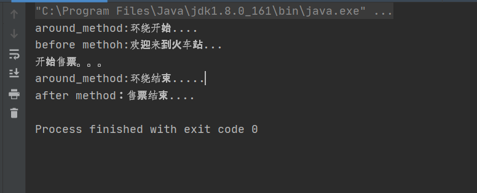
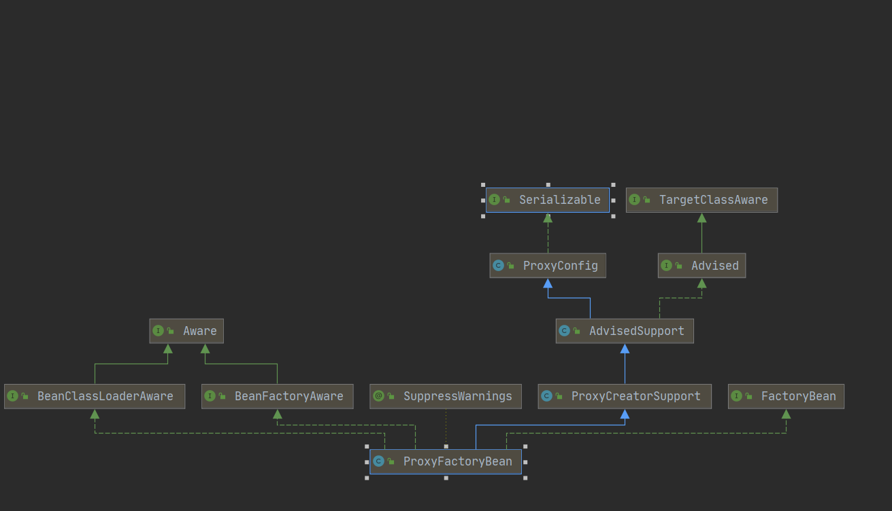
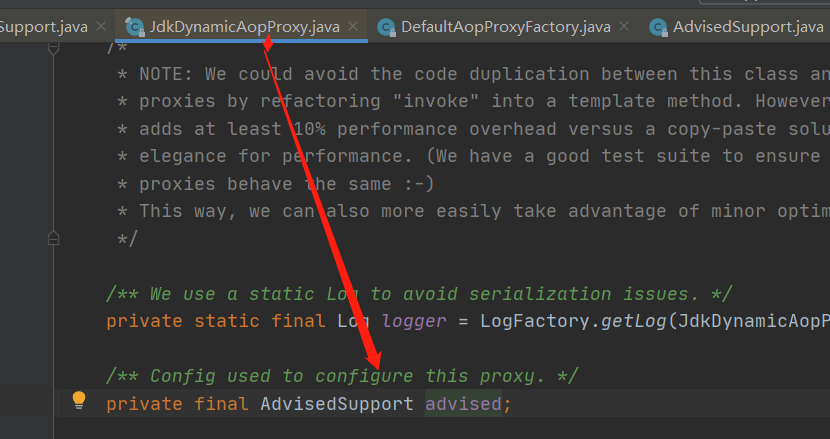
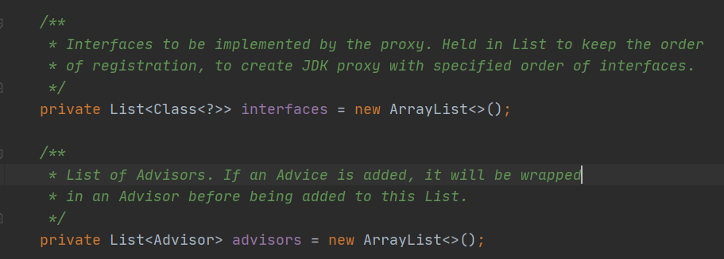
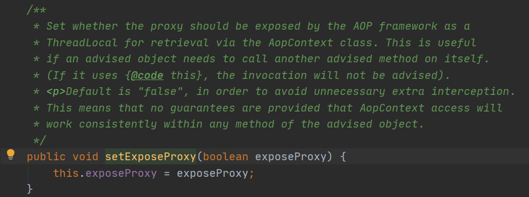
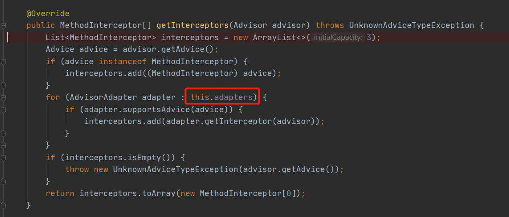
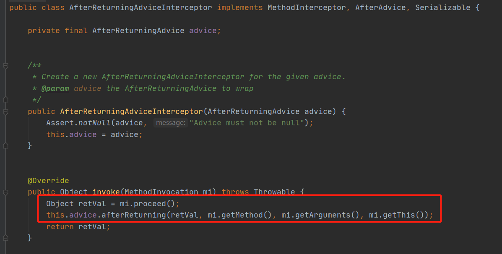
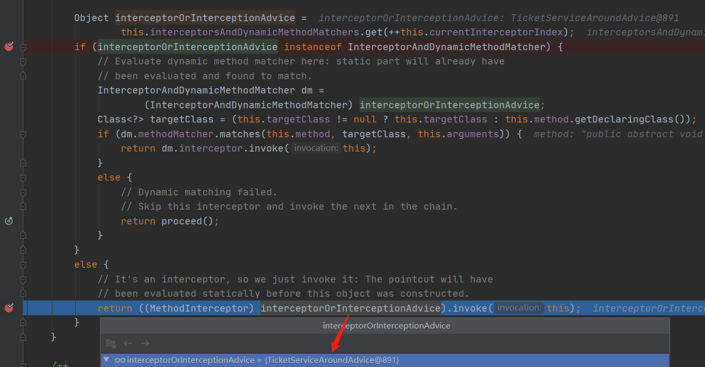

这篇文章主要从源码角度分析一下Spring AOP的原理。好记性不如烂笔头。一些基础的概念就不展开了，比如说什么是AOP，如何使用AOP、AOP使用场景等。我们以直接通过ProxyFactoryBean手动创建Proxy为例，进行分析。
<!-- more -->

### 手动创建代理对象

假设现在有这样一个接口TicketService，以及它的实现类 RailWayStation。现在手动通过ProxyFactoryBean来创建代理类，实现相应业务节点的切面插入。

```java
public interface TicketService {
    //售票
    void sellTicket();
    //咨询
    void query();
    //退票
    void refund();
}
```

```java
public class RailwayStation implements TicketService {

    @Override
    public void sellTicket() {
        System.out.println("开始售票。。。");
    }

    @Override
    public void query() {
        System.out.println("咨询业务。。。");
    }

    @Override
    public void refund() {
        System.out.println("开始退票。。。");
    }
}
```

```java
//前置通知
public class TicketServiceBeforeAdvice implements MethodBeforeAdvice {

    @Override
    public void before(Method method, Object[] objects, Object o) throws Throwable {
        System.out.println("before methoh:欢迎来到火车站...");
    }
}
```

```java
//返回通知
public class TicketServiceAfterReturningAdvice implements AfterReturningAdvice {

    @Override
    public void afterReturning(Object o, Method method, Object[] objects, Object o1) throws Throwable {
        System.out.println("after method：售票结束....");
    }
}
```

```java
//环绕通知
public class TicketServiceAroundAdvice implements MethodInterceptor {
    @Override
    public Object invoke(MethodInvocation invocation) throws Throwable {
        System.out.println("around_method:环绕开始....");
        Object returnValue = invocation.proceed();
        System.out.println("around_method:环绕结束.....");
        return returnValue;
     }
}
```

```java
//异常通知
public class TicketServiceThrowsAdvice implements ThrowsAdvice {
    public void afterThrowing(Exception ex){
        System.out.println("AFTER_THROWING....");
    }
    public void afterThrowing(Method method, Object[] args, Object target, Exception ex){
       System.out.println("调用过程出错啦！！！！！");
    }
}
```

```java
//测试类
public class Application {
    public static void main(String[] args) {
        //1.不同的时期类型，提供不同的Advice
        //前置
        Advice beforeAdvice = new TicketServiceBeforeAdvice();
        //返回
        Advice afterReturningAdvice = new TicketServiceAfterReturningAdvice();
        //环绕
        Advice aroundAdvice = new TicketServiceAroundAdvice();
        //异常
        Advice throwsAdvice = new TicketServiceThrowsAdvice();

        RailwayStation railwayStation = new RailwayStation();

        //2.创建ProxyFactoryBean,用以创建指定对象的Proxy对象
        ProxyFactoryBean proxyFactoryBean = new ProxyFactoryBean();
        //3.设置Proxy的接口
        proxyFactoryBean.setInterfaces(TicketService.class);
        //4. 设置RealSubject
        proxyFactoryBean.setTarget(railwayStation);
        //5.设置为true,如果是目标类是接口，则使用JDK动态代理，如果是其他类，则使用CGLIB生成代理对象
        proxyFactoryBean.setProxyTargetClass(true);

        //6. 添加不同的Advice

        proxyFactoryBean.addAdvice(afterReturningAdvice);
        proxyFactoryBean.addAdvice(aroundAdvice);
        proxyFactoryBean.addAdvice(throwsAdvice);
        proxyFactoryBean.addAdvice(beforeAdvice);
        proxyFactoryBean.setProxyTargetClass(false);
        //7.通过ProxyFactoryBean生成Proxy对象
        TicketService ticketService = (TicketService) proxyFactoryBean.getObject();
        ticketService.sellTicket();
    }
}

```



执行结果如上，通过ProxyFactoryBean和真实对象创建出代理对象，并将各个advice加入到代理对象中。在执行***\*sellticket()\****前执行前置通知 BeforeAdvice，执行成功之后，调用返回通知AfterReturning。并且在方法执行前后执行了环绕通知AroundAdvice。我们接下来分析ProxyFactoryBean是什么。

### ProxyFactoryBean

上面demo可以看出来，核心是**ProxyFactoryBean**，通过将真实对象加入到ProxyFactoryBean中，并且将各个通知advice也add进去，然后getObject获取真实对象的代理对象，在代理对象执行sellTicket()方法前后执行advice。



我们源码分析，ProxyFactoryBean是如何生成代理对象的

```java
//7.通过ProxyFactoryBean生成Proxy对象
TicketService ticketService = (TicketService) proxyFactoryBean.getObject();
```

在 ProxyFactoryBean 的 getObject()方法中。

```java
public Object getObject() throws BeansException {
    //重点1 初始化Advisor链，从interceptorNames中获取方法的通知器，然后构造成链。
   initializeAdvisorChain();
    //重点2 生成代理对象时，由于Spring中有singleton类型和prototype类型，因此要区别对象
   if (isSingleton()) {
       //生成singleton的代理对象，代理对象封装目标对象的调用
      return getSingletonInstance();
   }
   else {
      if (this.targetName == null) {
         logger.info("Using non-singleton proxies with singleton targets is often undesirable. " +
               "Enable prototype proxies by setting the 'targetName' property.");
      }
      //
      return newPrototypeInstance();
   }
}
```

重点1是 初始化Advisor链，从interceptorNames中获取方法的通知器，然后构造成链。由于我们代码手动add，因此interceptorNames为空。

重点2，随后进入getSingletonInstance构造代理对象。

```java
private synchronized Object getSingletonInstance() {
   if (this.singletonInstance == null) {
      this.targetSource = freshTargetSource();
      if (this.autodetectInterfaces && getProxiedInterfaces().length == 0 && !isProxyTargetClass()) {
         // Rely on AOP infrastructure to tell us what interfaces to proxy.
         Class<?> targetClass = getTargetClass();
         if (targetClass == null) {
            throw new FactoryBeanNotInitializedException("Cannot determine target class for proxy");
         }
         setInterfaces(ClassUtils.getAllInterfacesForClass(targetClass, this.proxyClassLoader));
      }
      // Initialize the shared singleton instance.
       
      super.setFrozen(this.freezeProxy);
       //初始化单例实例，见下图
      this.singletonInstance = getProxy(createAopProxy());
   }
   return this.singletonInstance;
}
```


> this.singletonInstance = getProxy(createAopProxy());

该方法可能会返回ObjenesisCglibAopProxy对象，也可能会返回JdkDynamicAopProxy对象。

根据条件：

1. config.isOptimize()是否进行优化，默认是false。
2. config.isProxyTargetClass()即ProxyConfig的proxyTargetClass属性，是否强制使用cglib代理。
3. hasNoUserSuppliedProxyInterfaces(config)目标类没有实现接口，或者有实现接口但是接口类型是SpringProxy‘

只要三个条件有一个为true，并且目标类不是接口，就会采用cglib方式来创建对象。其他情况采用JDK动态代理的方式来创建。

由于我们上面demo是 目标类 实现了接口，因此 *hasNoUserSuppliedProxyInterfaces(config)* 条件为false，代码进入 *JdkDynamicAopProxy*。

### 基于JDK面向接口的动态代理 JdkDynamicAopProxy生成代理对象

JdkDynamicAopProxy实现了AopProxy，能够返回Proxy，并且自身也实现了InvocationHandler角色。这样当我们调用代理对象的方法时，最终都会走到JdkDynamicAopProxy这个类的invoke()方法中。

>org.springframework.aop.framework.JdkDynamicAopProxy#getProxy(java.lang.ClassLoader)

```java

@Override
public Object getProxy(@Nullable ClassLoader classLoader) {
	if (logger.isTraceEnabled()) {
		logger.trace("Creating JDK dynamic proxy: " + this.advised.getTargetSource());
	}
	Class<?>[] proxiedInterfaces = AopProxyUtils.completeProxiedInterfaces(this.advised, true);
	findDefinedEqualsAndHashCodeMethods(proxiedInterfaces);
    //生成代理对象
	return Proxy.newProxyInstance(classLoader, proxiedInterfaces, this);
}
```
在 JdkDynamicAopProxy中，有一个重要的属性是AdvisedSupport ，这里面包含了 Advisor列表，用以返回AdviceChain，以及要代理的接口和实现类。





接着来看 JdkDynamicAopProxy 的invoke方法，调用代理对象的方法，最终会转发到代理对象的invoke方法。

>org.springframework.aop.framework.JdkDynamicAopProxy#invoke

```java
@Override
@Nullable
public Object invoke(Object proxy, Method method, Object[] args) throws Throwable {
   Object oldProxy = null;
   boolean setProxyContext = false;

   TargetSource targetSource = this.advised.targetSource;
   Object target = null;

   try {
      if (!this.equalsDefined && AopUtils.isEqualsMethod(method)) {
         // The target does not implement the equals(Object) method itself.
         return equals(args[0]);
      }
      else if (!this.hashCodeDefined && AopUtils.isHashCodeMethod(method)) {
         // The target does not implement the hashCode() method itself.
         return hashCode();
      }
      else if (method.getDeclaringClass() == DecoratingProxy.class) {
         // There is only getDecoratedClass() declared -> dispatch to proxy config.
         return AopProxyUtils.ultimateTargetClass(this.advised);
      }
      else if (!this.advised.opaque && method.getDeclaringClass().isInterface() &&
            method.getDeclaringClass().isAssignableFrom(Advised.class)) {
         // Service invocations on ProxyConfig with the proxy config...
         return AopUtils.invokeJoinpointUsingReflection(this.advised, method, args);
      }

      Object retVal;
//关注点1
      if (this.advised.exposeProxy) {
         // Make invocation available if necessary.
         oldProxy = AopContext.setCurrentProxy(proxy);
         setProxyContext = true;
      }

      // Get as late as possible to minimize the time we "own" the target,
      // in case it comes from a pool.
      target = targetSource.getTarget();
      Class<?> targetClass = (target != null ? target.getClass() : null);
//关注点2
      // Get the interception chain for this method.
      List<Object> chain = this.advised.getInterceptorsAndDynamicInterceptionAdvice(method, targetClass);

      // Check whether we have any advice. If we don't, we can fallback on direct
      // reflective invocation of the target, and avoid creating a MethodInvocation.
      if (chain.isEmpty()) {
         // We can skip creating a MethodInvocation: just invoke the target directly
         // Note that the final invoker must be an InvokerInterceptor so we know it does
         // nothing but a reflective operation on the target, and no hot swapping or fancy proxying.
      
//关注点 3          
         Object[] argsToUse = AopProxyUtils.adaptArgumentsIfNecessary(method, args);
         retVal = AopUtils.invokeJoinpointUsingReflection(target, method, argsToUse);
      }
      else {
//关注点 4
         // We need to create a method invocation...
         MethodInvocation invocation =
               new ReflectiveMethodInvocation(proxy, target, method, args, targetClass, chain);
         // Proceed to the joinpoint through the interceptor chain.
         retVal = invocation.proceed();
      }

      // Massage return value if necessary.
      Class<?> returnType = method.getReturnType();
      if (retVal != null && retVal == target &&
            returnType != Object.class && returnType.isInstance(proxy) &&
            !RawTargetAccess.class.isAssignableFrom(method.getDeclaringClass())) {
         // Special case: it returned "this" and the return type of the method
         // is type-compatible. Note that we can't help if the target sets
         // a reference to itself in another returned object.
         retVal = proxy;
      }
      else if (retVal == null && returnType != Void.TYPE && returnType.isPrimitive()) {
         throw new AopInvocationException(
               "Null return value from advice does not match primitive return type for: " + method);
      }
      return retVal;
   }
   finally {
      if (target != null && !targetSource.isStatic()) {
         // Must have come from TargetSource.
         targetSource.releaseTarget(target);
      }
      if (setProxyContext) {
         // Restore old proxy.
         AopContext.setCurrentProxy(oldProxy);
      }
   }
}
```

这个方法太长了，本来想截图的，发现显示器不够长（手动狗头），不说废话，我们看上面4个重要关注点。

* #### 重点1 暴露proxy代理对

```java
	if (this.advised.exposeProxy) {
         // Make invocation available if necessary.
         oldProxy = AopContext.setCurrentProxy(proxy);
         setProxyContext = true;
      }
```



这里设置是否暴露proxy代理对象。看注释，默认为false，如果设置为true，则意味着在该线程会暴露proxy代理对象，实现共享，即在该线程内任何地方都可以获取到proxy代理对象。它的实现是使用AopContext内部的ThreadLocal<Object> currentProxy，我们知道ThreadLocal实现的是线程内部的共享，通过Thread类内部的ThreadLocal.ThreadLocalMap threadLocals = null;  从而实现 线程内部共享数据。

* #### 重点 2  获取当前调用方法的拦截链

  > ​	 List<Object> chain = this.advised.getInterceptorsAndDynamicInterceptionAdvice(method, targetClass);

```java
public List<Object> getInterceptorsAndDynamicInterceptionAdvice(Method method, @Nullable Class<?> targetClass) {
   MethodCacheKey cacheKey = new MethodCacheKey(method);
   List<Object> cached = this.methodCache.get(cacheKey);
   if (cached == null) {
      cached = this.advisorChainFactory.getInterceptorsAndDynamicInterceptionAdvice(
            this, method, targetClass);
      this.methodCache.put(cacheKey, cached);
   }
   return cached;
}
```

它是通过advisorChainFactory的getInterceptorsAndDynamicInterceptionAdvice方法进行实现的。该factory默认是 DefaultAdvisorChainFactory。

```java
public List<Object> getInterceptorsAndDynamicInterceptionAdvice(
      Advised config, Method method, @Nullable Class<?> targetClass) {

   // This is somewhat tricky... We have to process introductions first,
   // but we need to preserve order in the ultimate list.
   AdvisorAdapterRegistry registry = GlobalAdvisorAdapterRegistry.getInstance();
   Advisor[] advisors = config.getAdvisors();
   List<Object> interceptorList = new ArrayList<>(advisors.length);
   Class<?> actualClass = (targetClass != null ? targetClass : method.getDeclaringClass());
   Boolean hasIntroductions = null;

   for (Advisor advisor : advisors) {
      if (advisor instanceof PointcutAdvisor) {
         // Add it conditionally.
         PointcutAdvisor pointcutAdvisor = (PointcutAdvisor) advisor;
         if (config.isPreFiltered() || pointcutAdvisor.getPointcut().getClassFilter().matches(actualClass)) {
            MethodMatcher mm = pointcutAdvisor.getPointcut().getMethodMatcher();
            boolean match;
            if (mm instanceof IntroductionAwareMethodMatcher) {
               if (hasIntroductions == null) {
                  hasIntroductions = hasMatchingIntroductions(advisors, actualClass);
               }
               match = ((IntroductionAwareMethodMatcher) mm).matches(method, actualClass, hasIntroductions);
            }
            else {
               match = mm.matches(method, actualClass);
            }
            if (match) {
               MethodInterceptor[] interceptors = registry.getInterceptors(advisor);
               if (mm.isRuntime()) {
                  // Creating a new object instance in the getInterceptors() method
                  // isn't a problem as we normally cache created chains.
                  for (MethodInterceptor interceptor : interceptors) {
                     interceptorList.add(new InterceptorAndDynamicMethodMatcher(interceptor, mm));
                  }
               }
               else {
                  interceptorList.addAll(Arrays.asList(interceptors));
               }
            }
         }
      }
      else if (advisor instanceof IntroductionAdvisor) {
         IntroductionAdvisor ia = (IntroductionAdvisor) advisor;
         if (config.isPreFiltered() || ia.getClassFilter().matches(actualClass)) {
            Interceptor[] interceptors = registry.getInterceptors(advisor);
            interceptorList.addAll(Arrays.asList(interceptors));
         }
      }
      else {
         Interceptor[] interceptors = registry.getInterceptors(advisor);
         interceptorList.addAll(Arrays.asList(interceptors));
      }
   }

   return interceptorList;
}
```

依上述代码，可以看到分三种情况来获取对应的Interceptor拦截器。

* 当advisor为PointcutAdvisor类型时：


这也是我们demo中例子所设的advisor均为PointcutAdvisor。、

* 当advisor为 IntroductionAdvisor类型的时候
* 其他情况

每个advisor都调用***registry.getInterceptors(advisor)*** 包装为 ***MethodInterceptor***。



这里利用了**适配器模式**，将不同的advice使用***getInterceptor(advisor)***封装成对应的***MethodInterceptor***。


至此，获取当前调用方法的拦截链总算分析完毕。

- #### 重点 3  没有拦截链

```java
if (chain.isEmpty()) {
   // We can skip creating a MethodInvocation: just invoke the target directly
   // Note that the final invoker must be an InvokerInterceptor so we know it does
   // nothing but a reflective operation on the target, and no hot swapping or fancy proxying.
   Object[] argsToUse = AopProxyUtils.adaptArgumentsIfNecessary(method, args);
   retVal = AopUtils.invokeJoinpointUsingReflection(target, method, argsToUse);
}
```

如果没有拦截链，则直接调用Joinpoint连接点的方法，本质就是利用**反射**调用目标类的方法。

```
try {
   ReflectionUtils.makeAccessible(method);
   return method.invoke(target, args);
}
```

* #### 重点 4  将多个MethodInterceptor 构造 ReflectiveMethodInvocation

> ```java
> MethodInvocation invocation =
>       new ReflectiveMethodInvocation(proxy, target, method, args, targetClass, chain);
> // 最后调用 ReflectiveMethodInvocation的proceed执行拦截链方法。
> retVal = invocation.proceed();
> ```


当  InterceptorAndDynamicMethodMatcher 不是 InterceptorAndDynamicMethodMatcher时，则执行invoke方法，直接调用拦截器。

用我们demo中的 四个实例来分析：

 

首先调用 第1个拦截器 ***AfterReturningAdvice***，invoke方法如下图，



也就是说，先完成MethodInvocation的proceed()方法后再执行相应的advice，而调用mi.proceed，导致当前调用链后移。也就是说，AfterReturnAdvice只能等到其他所有拦截器链上执行完毕后才生效。所以并不会因为先addAdvice(afterReturningAdvice)就会先执行。

然后 再次进入 proceed方法，++this.currentInterceptorIndex，则取第2个advice执行



执行到第二个拦截器 ***AroundAdvice***，先输出“around_method:环绕开始....”，接着调用invocation.proceed()，等其他拦截器执行完毕后，再输出第二个打印“around_method:环绕结束.....”


接着第三个拦截器，***BeforeAdvice***：


上述逻辑是，先执行mi.proceed()，如果这个过程抛出异常，则调用 ThrowsAdvice

第四个拦截器：***BeforeAdvice***


先执行before方法，因此输出 “before methoh:欢迎来到火车站...”，再执行mi.proceed。

上述例子中均是，

> org.springframework.aop.framework.ReflectiveMethodInvocation#proceed中的if (interceptorOrInterceptionAdvice instanceof InterceptorAndDynamicMethodMatcher)为false

那么什么时候会为true呢？

答案是：当获取调用当前方法的连接链时

当我们修改原来的beforeAdvice，对beforeAdvice添加pointcut限制，到底层会将PointcutAdvisor转换为InterceptorAndDynamicMethodMatcher 参与ReflectiveMethodInvocation关于拦截器链的执行逻辑。


再回到ReflectiveMethodInvocation 整个拦截器执行链核心代码：

> org.springframework.aop.framework.ReflectiveMethodInvocation#proceed

```java
public Object proceed() throws Throwable {
   // We start with an index of -1 and increment early.
   if (this.currentInterceptorIndex == this.interceptorsAndDynamicMethodMatchers.size() - 1) {
      return invokeJoinpoint();
   }

   Object interceptorOrInterceptionAdvice =
         this.interceptorsAndDynamicMethodMatchers.get(++this.currentInterceptorIndex);
   if (interceptorOrInterceptionAdvice instanceof InterceptorAndDynamicMethodMatcher) {
      InterceptorAndDynamicMethodMatcher dm =
            (InterceptorAndDynamicMethodMatcher) interceptorOrInterceptionAdvice;
      Class<?> targetClass = (this.targetClass != null ? this.targetClass : this.method.getDeclaringClass());
       //当InterceptorAndDynamicMethodMatcher满足匹配规则，则拦截器Advice生效
      if (dm.methodMatcher.matches(this.method, targetClass, this.arguments)) {
         return dm.interceptor.invoke(this);
      }
      else {
        //拦截器尚未生效，直接skip，进行下一个链路的执行
         return proceed();
      }
   }
   else {
      // It's an interceptor, so we just invoke it: The pointcut will have
      // been evaluated statically before this object was constructed.
      return ((MethodInterceptor) interceptorOrInterceptionAdvice).invoke(this);
   }
}
```

### 基于Cglib子类继承方式的动态代理CglibAopProxy生成代理对象

基于cglib子类继承方式生成代理对象，除了生成代理对象那部分 与JDK动态代理不同，执行调用链方法基本相同：DynamicAdvisedInterceptor .intercept方法。以后再分析。

### 总结

AOP的整个工作机制如上。可能看下来有点迷惑。我们来从ProxyFactoryBean进行总结。

当调用proxyFactoryBean.getObject()时，因为proxyFactoryBean继承于ProxyCreatorSupport，因此调用ProxyCreatorSupport.createAopProxy()来生成AopProxy：AopProxy有两个实现类，1.CglibAopProxy 2.JdkDynamicAopProxy。根据目标对象是否接口或者是否强制使用cglib来确定返回CglibAopProxy还是JdkDynamicAopProxy。此时已经有了AopProxy，通过AopProxy.getProxy来获取代理对象。

当有了代理对象后，调用代理对象的方法时，最终都会转发到CglibAopProxy.intercept或者JdkDynamicAopProxy.invoke()。以JdkDynamicAopProxy.invoke()为例：1.首先，根据JdkDynamicAopProxy里面的AdvisedSupport继承于ProxyConfig，来判断是否需要在线程内部暴露（使用ThreadLocal模式实现线程内部共享）；2.其次，获取该方法的拦截链条，根据不同Advisor，使用适配器模式将其包装成不同的MethodInterceptor，如果有方法限制，则将MethodInterceptor和MethodMatcher包装成InterceptorAndDynamicMethodMatcher。拦截链条组装完毕后返回。；3.如果连接链为空，则利用反射直接调用目标对象的方法。如果拦截链不为空，则将其组装为ReflectiveMethodInvocation，然后执行其proceed()方法。4.从拦截链从依次取出MethodInterceptor调用其invoke方法，例如afterReturning则先执行MethodInvocation.proceed(),然后再调用afterReturning()方法。将该拦击器后移，直到拦截链调用完成。

主要有三点：
1. 代理对象怎么生成？
    JDK 或者 Cglib。
2. 拦截器链的构造过程及如何执行？
    如上
3. 如何在Advice上添加PointCut，并且是如何起作用的。
    在获取方法拦截链时，如果有pointcut，则封装为InterceptorAndDynamicMethodMatcher，拦截链调用时，判断是否匹配，如果不匹配则跳过当前拦截器，如果匹配则执行invoke方法。


> 参考列表：
>
> 1. https://blog.csdn.net/luanlouis/article/details/51155821
> 2. https://www.iteye.com/blog/lgbolgger-2116164

