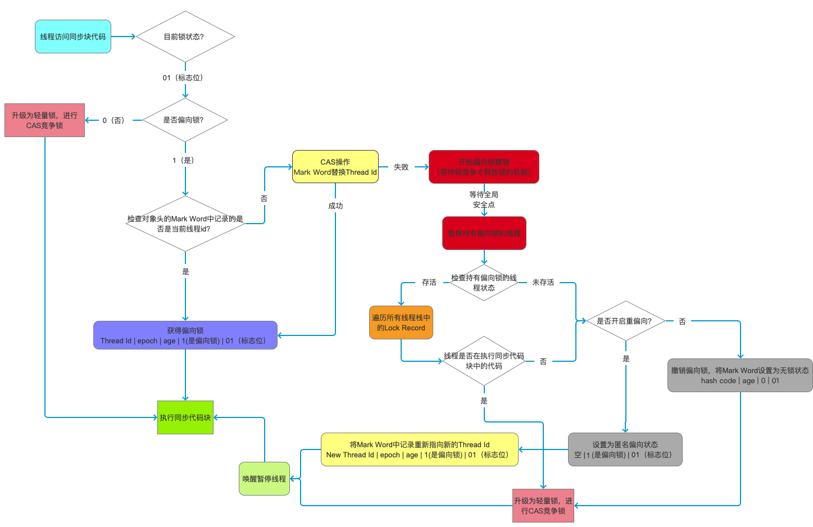
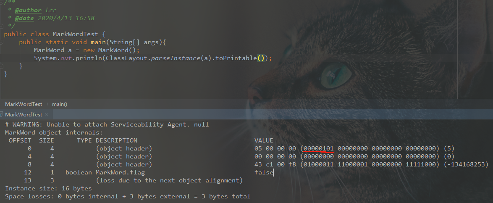

不管在实际开发中，还是在面试中，synchronized一直扮演着重要的角色。因为这个关键字很能体现工程师的技术功底，到底是简单的会用，还是能够深入了解底层实现。通过简单的一个synchronized关键字，由浅入深，步步深入，令人猝不及防。因此，借此文章，来梳理一下相关技术体系。

<!-- more -->

### synchronized基本原理及用法

synchronized首先是一种悲观锁，Java中每一个对象都是一把锁。具体用法两种：

* 锁方法，锁普通同步
* 方式是锁的当前实例对象，锁静态同步方法，锁的是当前类的class文件
* 锁代码块，锁的是括号里面的对象。

从字节码角度来看，锁方法和锁代码块生成的jvm字节码是不同的。

```
{
  public void syncBlock();
    descriptor: ()V
    flags: ACC_PUBLIC
    Code:
      stack=2, locals=3, args_size=1
         0: aload_0
         1: dup
         2: astore_1
         3: monitorenter				 	  // monitorenter指令进入同步块
         4: getstatic     #2                  // Field java/lang/System.out:Ljava/io/PrintStream;
         7: ldc           #3                  // String hello block
         9: invokevirtual #4                  // Method java/io/PrintStream.println:(Ljava/lang/String;)V
        12: aload_1
        13: monitorexit						  // monitorexit指令退出同步块
        14: goto          22
        17: astore_2
        18: aload_1
        19: monitorexit						  // monitorexit指令退出同步块
        20: aload_2
        21: athrow
        22: return
      Exception table:
         from    to  target type
             4    14    17   any
            17    20    17   any
 

  public synchronized void syncMethod();
    descriptor: ()V
    flags: ACC_PUBLIC, ACC_SYNCHRONIZED      //添加了ACC_SYNCHRONIZED标记
    Code:
      stack=2, locals=1, args_size=1
         0: getstatic     #2                  // Field java/lang/System.out:Ljava/io/PrintStream;
         3: ldc           #5                  // String hello method
         5: invokevirtual #4                  // Method java/io/PrintStream.println:(Ljava/lang/String;)V
         8: return
 
}
```

从上面字节码可以看出来，对于**锁代码块**来说，javac编译时，会生成monitorenter 和 monitorexit两种 指令，其中两个monitorexit指令是保证异常情况下也能释放锁。对于**锁方法**来说，在方法描述会有ACC_SYNCHRONIZED标识，标识该方法使用该方法的实例对象或者是所属Class在JVM中对应的Klass作为锁对象（类加载过程的第一个阶段 ：加载 完成的事情中 其中之一就是在内存中生成一个代表这个类的java.lang.Class对象，作为方法区这个类的各种数据的访问入口）。

### Java对象头和Monitor

synchronized在操作同步资源之前，会先给同步资源加锁，这个锁是什么？以及存放在什么地方？这就引出了接下来的Java对象头和Monitor。

#### Java对象头

在Hotspot虚拟机中，对象在堆中的内存布局可以划分为三部分：对象头，实例数据和对齐填充。

对象头包括两部分，一部分是Mark Word，默认存储对象的HashCode，分代年龄和锁的标志位信息。

另外一部分是类型指针，即对象指向该对象所属类的指针，即通过这个指针来确定该对象是哪个类的实例。Mark Word默认存储结构如下：

在运行期间，MarkWord里存储的数据会随着锁标志位变化为变化。当对象状态为偏向锁时，存储的是偏向的线程ID；当为轻量级锁时，存储的是指向线程栈中的Lock Record；当为重量级锁时，为指向堆中monitor的指针。

由上图也可以知道，锁的状态变化是 无锁状态-->偏向锁-->轻量级锁-->重量级锁。

#### Monitor

当锁为重量级锁时，MarkWord中存储的是指向重量级锁的指针。这个monitor是什么？
monitor对象主要包括owner，cxq，EntryList，WaitSet。

* owner： 主要存储拥有锁的线程
* cxq： 当一个线程尝试获得锁，如果当前锁被占用，会把该线程插入到cxq队列的对首
* EntryList: 当持有锁的线程释放锁之前，会把cxq中的所有元素移动到EntryList中，并唤醒entryList中的某个线程，重新竞争锁。
* WaitSet: 当owner线程被wait方法阻塞，就会转义到waitset队列中。当某个时刻被notify/notifyAll后，会从waitset中转移大entryList中。

### 锁优化以及锁升级

synchronized通过monitor来实现线程同步，Monitor依赖底层操作系统的mutex lock(互斥锁)来实现代码的线程同步。而线程的切换需要操作系统的cpu切换，这个过程需要耗费cpu的时间，如果同步代码块的内容相对简单，就会出现cpu的切换比代码执行时间还要慢，这也就是synchronized在JDK1.6之前效率低的原因。在JDK1.6之后，java对synchronized进行了优化，从而引入了“偏向锁” 和 “轻量级锁”。所以，目前锁的状态主要有四种：级别从低到高依次是：无锁、偏向锁、轻量级锁和重量级锁。锁状态只能升级不能降级。

#### 无锁

无锁的特点是在循环内执行，CAS原理及应用就是无锁的实现。后续会进行分析。

#### 偏向锁

偏向锁对象头内容：


偏向锁主要解决无竞争下的锁问题。大多数情况下，锁总是由同一线程多次获得，不存在多线程竞争，那么该线程会自动获取锁，从而降低获取锁的代价。当一个线程访问同步代码并获取锁时，会在markword中用CAS将线程ID替换为当前线程ID，偏向锁只需要在第一次获取锁的时候，进行CAS操作，下次再次进入或者退出同步块，就不需要再次通过CAS操作进行加锁和解锁，只需要比较线程ID即可，从而减少了的性能的开销。

偏向锁只有遇到其他线程尝试竞争偏向锁时，持有偏向锁的线程才会释放锁，线程不会主动释放锁。偏向锁的撤销，需要等到全局安全点，此时暂停拥有偏向锁的进程，判断锁对象是否被锁定状态。撤销偏向锁后恢复到**无锁状态**（持有偏向锁的线程未存活）或者**升级为轻量级锁**（持有偏向锁的线程仍再存活）。

这里有张图，我觉得能够很好的说明轻量级锁的获取过程和如何升级为轻量级锁。但是，我有个疑问还没有解决，根据上面的描述，***偏向锁只要出现其他线程获取偏向锁就会撤销偏向锁，所以偏向锁是如何重偏向的?***。根据下图中的说明是根据是否开启重偏向来判断的？这是有参数配置的吗？有待解决。



下图出自《深入理解Java虚拟机》中。


#### 轻量级锁

轻量级锁是指当锁时偏向锁时，被另外的线程访问，偏向锁就会升级为轻量级锁，其他线程会通过自旋的形式来尝试获取锁，不会阻塞，从而提高性能。

##### 轻量级锁的加锁过程

在代码进入同步块的时候，如果同步对象锁状态为无锁状态（锁标志位为“01”状态，是否为偏向锁为“0”），虚拟机首先将在当前线程的栈帧中建立一个名为锁记录（Lock Record）的空间，用于存储锁对象目前的Mark Word的拷贝，然后拷贝对象头中的Mark Word复制到锁记录中。

拷贝成功后，虚拟机将使用CAS操作尝试将对象的Mark Word更新为指向Lock Record的指针，并将Lock Record里的owner指针指向对象的Mark Word。

如果这个更新动作成功了，那么这个线程就拥有了该对象的锁，并且对象Mark Word的锁标志位设置为“00”，表示此对象处于轻量级锁定状态。

如果轻量级锁更新失败，首先会检查对象的Mark Word是否指向当前线程的栈帧，如果是说明是锁重入，则在线程的栈帧添加一条Lock Record，这条锁记录mark word为空，指针指向所对象，用来记录锁重入次数。如果不是，则说明存在锁竞争，则尝试使用自旋的方式来获取锁，一定次数后升级为重量级锁，Mark Word前面部分存储指向重量级锁的指针，最后两位修改为’10‘。

当我看到轻量级锁获取过程中判断 ***锁标志位为“01”状态，是否为偏向锁为“0”***时产生了疑问：*当发现锁状态是无锁状态时，不应该是获取偏向锁嘛？怎么会进行轻量级锁的操作？*

这是因为：进入轻量级锁时判断 **锁标志位为“01”状态，是否为偏向锁为“0”**，意味着已经有线程获取过偏向锁了，出现了多线程竞争的情况，此时偏向锁已经撤销，已经将锁状态置为无锁，因此此时获取锁要按照轻量级锁的流程来处理（这是上面偏向锁撤销后变成的状态之一 1.无锁状态 2.升级为轻量级锁）。

那么肯定有人就会问了，为什么不能一开始就是无锁的，这样上来就走轻量级锁的逻辑，那偏向锁呢，答案是下面的这个知识：

> JDK1.6之后默认开始偏向锁，-XX：+UseBiased Locking，如果再设置-XX:BiasedLockingStartupDelay=0（JVM默认延时加载偏向锁，设置为0则取消延时加载偏向锁），当创建一个新对象时，JVM会默认将对象的markword的倒数第三位设置为1，线程ID为0，此时意味着可偏向但未偏向任何线程的状态，专业术语就是匿名偏向状态(anonymously biased)，可以理解为特殊状态的无锁，之后才进入偏向锁的获取过程，将倒数第三位改为1。所以说，当锁对象处于无锁状态时，必定是偏向锁发生了竞争。

##### 轻量级锁的释放

释放同样用CAS操作进行：

1. 遍历当前线程栈，找到所有指向当前锁对象的Lock Record
2. 如果Lock Record的Mark Word为null，说明这次是锁的重入，将obj设为null即可。
3. 如果Lock Record的Mark Word  不为null，则利用CAS将对象头的Mark Word 替换成当前线程栈帧中Lock Record中的Mark Word。替换成功则证明成功解锁；如果失败，则说明当前Mark Word已被修改，则会膨胀为重量级锁。

这里我的疑问是：**轻量级锁释放说明自己持有锁，那为什么会出现对象头被改变的情况？**

答案是：如果有另外一个线程B在线程A持有轻量级锁的时候来竞争锁，CAS替换锁对象的对象头里Mark Word中的锁记录指针指向线程B的Lock  Record时，必然发生失败。当自旋超过一定次数后，线程B会转变为重量级锁，此刻会将锁对象的Mark Word替换为指向重量级锁的指针，然后mutex挂起线程B。而线程A之前持有轻量级锁在执行同步代码，当执行完毕进行解锁时，发现锁对象对象头被改变，因此会唤起被挂起的线程，开始新一轮的竞争。这也是轻量级锁如何升级为重量级锁的过程。

#### 重量级锁

前面轻量级锁提到，当线程自旋后仍竞争不到锁，那么轻量级锁就会膨胀为重量级锁，然后修改锁对象的对象头，把对象头Mark Word 中的锁标志位改为10，并将前面的指针改为指向重量级锁（monitor）的指针，然后自己挂起，等待轻量级锁释放后将自己唤醒。

当线程发现竞争重量级锁时，会尝试去获取当前对象对应的monitor的所有权。若monitor的进入数为0，则线程可以进入monitor，将monitor中的计数+1，让后将owner设置为指向当前对象的指针。

如果此时其他线程也来竞争重量级锁，该线程会插入到cxq队列的队首，等待持有锁的线程释放前，将自己移动到entryList中，然后唤醒entrylist中的队首线程。

monitor主要 依赖操作系统底层的mutex lock来实现。


### 总结

其实这里有张图能够很好的说明整个过程，但是这个图里里面有一点我感觉是错误的，就是当锁状态为01时，不是偏向锁 0，此刻直接走轻量级锁的逻辑，不会去CAS操作替换Thread Id，这个可能是上面留的疑问：重偏向时的操作，这个先留个作业吧。


> 参考内容：
>
> 1. https://www.loongzee.com/2019/05/15/JavaSynchronized_3/
> 2. https://www.cnblogs.com/LemonFive/p/11246086.html
> 3. https://github.com/farmerjohngit/myblog/issues/15
> 4. https://tech.meituan.com/2018/11/15/java-lock.html
> 5. https://blog.csdn.net/boling_cavalry/article/details/77793224
> 6. https://juejin.im/post/5d96db806fb9a04e0f30f0eb

