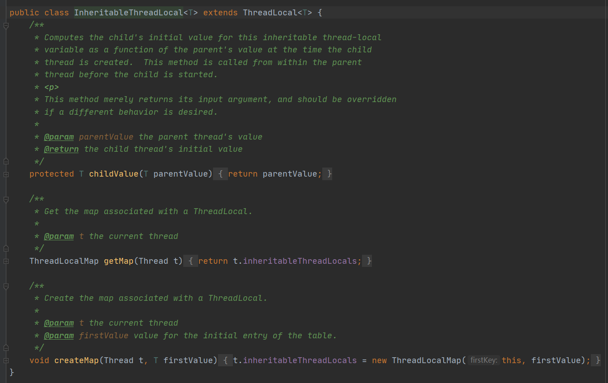
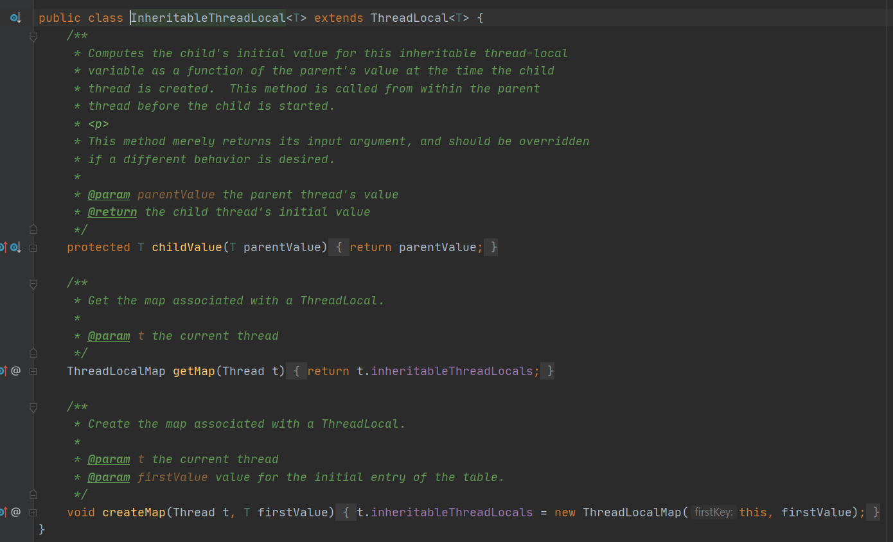
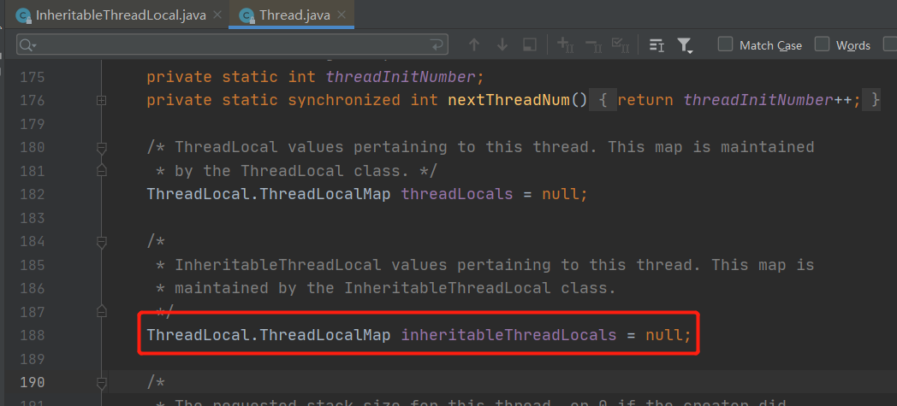
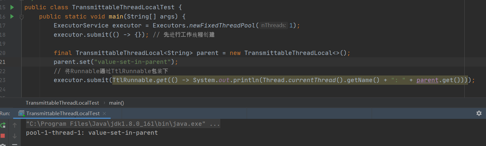

最近源码，不少地方都用到了ThreadLocal，正好趁机来总结一波ThreadLocal相关的知识点。

趁热打铁，岂不美滋滋？

<!-- more -->

## 什么是ThreadLocal

```java
* This class provides thread-local variables.  These variables differ from
* their normal counterparts in that each thread that accesses one (via its
* {@code get} or {@code set} method) has its own, independently initialized
* copy of the variable.  {@code ThreadLocal} instances are typically private
* static fields in classes that wish to associate state with a thread (e.g.,
* a user ID or Transaction ID).
    
 * <p>Each thread holds an implicit reference to its copy of a thread-local
 * variable as long as the thread is alive and the {@code ThreadLocal}
 * instance is accessible; after a thread goes away, all of its copies of
 * thread-local instances are subject to garbage collection (unless other
 * references to these copies exist).
```

我们从ThreadlLocal类的注释第一段可以看出，ThreadLocal提供了线程本地变量。这些变量跟其他普通变量不同，因为这是线程内部的变量。只要线程存活，线程就会持有完全独立的实例副本，当线程退出后，所拥有的ThreadLocal实例副本也会被辣鸡回收。

因此，我们可以总结得出，ThreadLocal适用于每个线程需要自己独立的实例，且线程线程之间互不影响。同时该线程本地变量可以在线程运行期间获取。

## ThreadLocal原理

### ThreadLocalMap源码

ThreadLocal内部有个内部静态类ThreadLocalMap，这是维护ThreadLocal与Thread实例的关键。

可以看出ThreadLocalMap的初始容量是16，底层是数据结构是数组。内部元素是Entry。

```java
static class Entry extends WeakReference<ThreadLocal<?>> {
    /** The value associated with this ThreadLocal. */
    Object value;

    Entry(ThreadLocal<?> k, Object v) {
        super(k);
        value = v;
    }
}
```

可以看出Entry的key是ThreadLocal，并且继承WeakReference弱引用。但是与hashmap元素Node不同的是，Entry没有next属性。HashMap采用**链地址法**处理hash冲突，而ThreadLocalMap采用的的是**开放定址法**。


#### ThreadLocalMap.set()

```java
private void set(ThreadLocal<?> key, Object value) {

    Entry[] tab = table;
    int len = tab.length;
    //根据key的hash值与leng-1取与求出在数组中的位置
    int i = key.threadLocalHashCode & (len-1);

    //从数组table[i]开始寻找               //如果for循环体找不到元素，那么寻找下一个元素
    for (Entry e = tab[i];e != null;e = tab[i = nextIndex(i, len)]) {
        //获取table[i]这个位置的threadLocal
        ThreadLocal<?> k = e.get();
		//如果这个位置的threadLocal与要插入的元素相同，则替换旧值
        if (k == key) {
            e.value = value;
            return;
        }
		//如果这个位置没有，但是因为e != null肯定存在entry
        //说明之前的ThreadLocal已经被回收了
        if (k == null) {
            //那么则替换旧值
            replaceStaleEntry(key, value, i);
            return;
        }
    }
	//如果前面全部找不到，那么就创建新Entry，放在这个位置
    tab[i] = new Entry(key, value);
    //元素个数+1
    int sz = ++size;
    //如果没有要清除的元素，元素个数依然大于阈值那么则扩容
    if (!cleanSomeSlots(i, sz) && sz >= threshold)
        rehash();
}
```

每个ThreadLocal对象都有一个hash值threadLocalHashCode，每初始化一个ThreadLocal对象，hash值就增加固定的大小**0x61c88647**。

```java
private final int threadLocalHashCode = nextHashCode();

private static int nextHashCode() {
return nextHashCode.getAndAdd(HASH_INCREMENT);
}

private static final int HASH_INCREMENT = 0x61c88647;
```

插入过程中，首先根据对象的hash 与 数组长度 -1 求余确定在数组的位置，这个跟Hashmap一样。

1. 如果这个位置是空的，那么就创建一个Entry对象放在此位置上，调用cleanSomeSlots方法清除key为null的旧值，若没有清除的旧址那么则判断是否需要扩容
2. 如果此位置已经有对象了，判断对象的key是否跟自己一样或者key为null，那么就替换旧value。
3. 如果此位置Entry对象的key不符合条件，那么则寻找哈希表的下一个位置，如果达到哈希表尾则从头开始。

```java
private static int nextIndex(int i, int len) {
    return ((i + 1 < len) ? i + 1 : 0);
}
```

可以看出来，ThreadLocalMap采用**开放定址法**来解决哈希冲突，一旦发生冲突，就去寻找下一个空的散列地址。ThreadLocalMap扩容是先清除无效的元素，然后判断size 是否大于 0.75*阈值，是则扩容两倍。

#### ThreadLocalMap.getEntry()

getEntry()方法很容易理解，先定位，然后判断是不是，不是则往下寻找

```java
private Entry getEntry(ThreadLocal<?> key) {
    //先计算在数组中的位置
    int i = key.threadLocalHashCode & (table.length - 1);
    Entry e = table[i];
    //判断是否是要找的元素，是则返回
    if (e != null && e.get() == key)
        return e;
    else
        //不是则继续找
        return getEntryAfterMiss(key, i, e);
}
```

往下寻找一个一个寻找

```java
private Entry getEntryAfterMiss(ThreadLocal<?> key, int i, Entry e) {
    Entry[] tab = table;
    int len = tab.length;

    while (e != null) {
        ThreadLocal<?> k = e.get();
        if (k == key)
            return e;
        if (k == null)
            expungeStaleEntry(i);
        else
            i = nextIndex(i, len);
        e = tab[i];
    }
    return null;
}
```

#### ThreadLocalMap.remove()

删除元素，方法一样，先定位数组中的位置，然后判断key是否相同，相同则clear将key置为null，调用expungeStaleEntry()方法。

```java
private void remove(ThreadLocal<?> key) {
    Entry[] tab = table;
    int len = tab.length;
    //定位数组中位置，没有找到则往下
    int i = key.threadLocalHashCode & (len-1);
    for (Entry e = tab[i];e != null;e = tab[i = nextIndex(i, len)]) {
        //如果key相同，则删除
        if (e.get() == key) {
            e.clear();
            expungeStaleEntry(i);
            return;
        }
    }
}
```

清理掉当前key之后，继续向后清除，若再次遇到脏enrty继续清理，直到哈希桶（table[i]）为null时退出。

```java
private int expungeStaleEntry(int staleSlot) {
    Entry[] tab = table;
    int len = tab.length;

    // expunge entry at staleSlot
    //将此位置的entry对象、value 置空
    tab[staleSlot].value = null;
    tab[staleSlot] = null;
    size--;

    // Rehash until we encounter null
    Entry e;
    int i;
    //往后环形继续查找，直到遇到table[i] == null时结束
    for (i = nextIndex(staleSlot, len);
         (e = tab[i]) != null;
         i = nextIndex(i, len)) {
        ThreadLocal<?> k = e.get();
        //如果在向后搜索过程中遇到脏entry，将其清理掉。
        if (k == null) {
            e.value = null;
            tab[i] = null;
            size--;
        } else {
            //处理rehash情况
            int h = k.threadLocalHashCode & (len - 1);
            //如果当前位置元素所放位置不应该放这里，那么将重新放置好
            if (h != i) {
                tab[i] = null;

                // Unlike Knuth 6.4 Algorithm R, we must scan until
                // null because multiple entries could have been stale.
                while (tab[h] != null)
                    h = nextIndex(h, len);
                tab[h] = e;
            }
        }
    }
    return i;
}
```


### ThreadLocal源码

看完了ThreadLocal重要的内部类ThreadLocalMap之后，我们终于能来研究ThreadLocal的源码。先看get方法。

#### ThreadLocal.get()

```java
public T get() {
    //获取当前线程
    Thread t = Thread.currentThread();
    //获取ThreadLocalMap
    ThreadLocalMap map = getMap(t);
    if (map != null) {
        //取出Enrty
        ThreadLocalMap.Entry e = map.getEntry(this);
        if (e != null) {
            @SuppressWarnings("unchecked")
            T result = (T)e.value;
            //返回value
            return result;
        }
    }
    return setInitialValue();
}
```

通过当前线程getMap()获取自身的ThreadLocalMap。由此下面可见，**该ThreadLocalMap的实例是Thread类的一个字段，是由Thread类维护ThreadLocal与实例对象的引用**。这样就避免了由ThreadLocal类维护各个线程与自己ThreadLocal的关系，如果是这样只要有多线程并发就涉及到锁，那么势必性能会下降，而这样处理ThreadLocal只是相当于中间人一样。

```java
ThreadLocalMap getMap(Thread t) {
    return t.threadLocals;
}
//java.lang.Thread#threadLocals
 ThreadLocal.ThreadLocalMap threadLocals = null;
```

如果获取不到，那么就通过***setInitialValue()***方法设置ThreadLocal变量在线程里面具体事例的初始值。

```java
private T setInitialValue() {
    T value = initialValue();
    Thread t = Thread.currentThread();
    ThreadLocalMap map = getMap(t);
    if (map != null)
        map.set(this, value);
    else
        createMap(t, value);
    return value;
}

void createMap(Thread t, T firstValue) {
    //将新创建的对象复制给线程Thread的threadLocals属性。
    t.threadLocals = new ThreadLocalMap(this, firstValue);
}
```


#### ThreadLocal.set()

set()方法就比较简单，先找出当前线程的ThreadLocalMap对象，如果map不为null，则将ThreadLocal 和value添加到map中。如果map不存在，则先创建ThreadLocalMap。

```java
public void set(T value) {
    Thread t = Thread.currentThread();
    ThreadLocalMap map = getMap(t);
    if (map != null)
        map.set(this, value);
    else
        createMap(t, value);
}
```


#### ThreadLocal的内存泄漏问题

##### 为什么会出现内存泄漏？


如图所示，上图是ThreadLocal的整个内存引用示意图。实线代表强应用，虚线代表弱引用。

即强引用static ThreadLocal<StringBuilder> counter = new ThreadLocal<StringBuilder>()，但是对于Entry来讲，key是弱引用。当threadLocal外部强引用被置为null时，threadLocal实例就没有一条引用可达。换句话说，就是在我当前线程内，我是获取不到自己的ThreadLocal的，因此当前线程的threadLocal实例就会被回收，因此在ThreadLocalMap中Entry就会存在key为null，但是value不为null，并且无法通过key去访问到该Entry的value。所以有这样的一条引用链：threadRef（栈内变量名） --> currentThread(当前线程) --->threadLocalMap（当前线程内部map）--->Entry（map中的元素）---->value(元素的value)，导致这个value一直不会被垃圾回收，但是该value永远不会被访问到（因为访问value的key没有了），所以导致了内存泄漏。

##### 怎么解决？

JDK作者已经在set和get方法中做出了改进。我们重新看ThreadLocalMap的set方法：

**set方法**：

```java
private void set(ThreadLocal<?> key, Object value) {

    Entry[] tab = table;
    int len = tab.length;
    int i = key.threadLocalHashCode & (len-1);

    for (Entry e = tab[i];
         e != null;
         e = tab[i = nextIndex(i, len)]) {
        ThreadLocal<?> k = e.get();

        if (k == key) {
            e.value = value;
            return;
        }

        if (k == null) {
            // 重点1
            replaceStaleEntry(key, value, i);
            return;
        }
    }

    tab[i] = new Entry(key, value);
    int sz = ++size;
    //重点2
    if (!cleanSomeSlots(i, sz) && sz >= threshold)
        rehash();
}
```

set方法中，当计算出数组下标后，

1. 如果 table[i] !=null，说明发生了hash冲突，那么会进入到for循环中，向后环形查找，若在查找过程中遇到了key不存在的节点，那么调用***replaceStaleEntry***方法进行处理，也就是重点1。
2. table[i] == null，说明新的entry可以插入，插入后调用***cleanSomeSlots***方法清除脏entry。

**get方法**同理：

```java
private Entry getEntry(ThreadLocal<?> key) {
    int i = key.threadLocalHashCode & (table.length - 1);
    Entry e = table[i];
    if (e != null && e.get() == key)
        return e;
    else
        return getEntryAfterMiss(key, i, e);
}

        private Entry getEntryAfterMiss(ThreadLocal<?> key, int i, Entry e) {
            Entry[] tab = table;
            int len = tab.length;

            while (e != null) {
                ThreadLocal<?> k = e.get();
                if (k == key)
                    return e;
                if (k == null)
                    //重点1
                    expungeStaleEntry(i);
                else
                    i = nextIndex(i, len);
                e = tab[i];
            }
            return null;
        }
```

get方法中，计算下标后，如果table[i]处不是要找 的元素，那么会调用getEntryAfterMiss方法继续查找，当发现key ==null时，也会调用***expungeStleEntry***对脏entry进行处理。

**remove方法**：

```java
private void remove(ThreadLocal<?> key) {
    Entry[] tab = table;
    int len = tab.length;
    int i = key.threadLocalHashCode & (len-1);
    for (Entry e = tab[i];
         e != null;
         e = tab[i = nextIndex(i, len)]) {
        if (e.get() == key) {
            e.clear();
            //重点1
            expungeStaleEntry(i);
            return;
        }
    }
}
```

同样可以看出，当清除掉待取出的元素后，也会调用***expungeStaleEntry***去清理脏entry。

我们先分析 **cleanSomeSlot** 方法：

当调到这个方法时，说明定位到i位置的元素为空，可以直接插入。

```java
        private boolean cleanSomeSlots(int i, int n) {
            boolean removed = false;
            Entry[] tab = table;
            int len = tab.length;
            do {
                i = nextIndex(i, len);
                Entry e = tab[i];
                if (e != null && e.get() == null) {
                    n = len;
                    removed = true;
                    i = expungeStaleEntry(i);
                }
            } while ( (n >>>= 1) != 0);
            return removed;
        }
```

首先，要明确的是，

1. 参数i位置的元素肯定不是脏entry，因为刚刚已经插入了。
2. 参数n首次传入的是已经插入entry的个数，这里时用来 **scan control**扫描控制，因为每次循环都要执行 **n >>>= 1**，因此会执行log2(n)次，当遇到脏entry后，n会重置为数组的长度。

所以该方法的逻辑是：

从i位置的下个元素开始查找，直到遇到空元素位置结束。当遇到脏entry之后，先将n重置为数组长度，然后调用 **expungeStaleEntry**方法清除元素。这样就能扩大扫描范围。

接着分析 **expungeStaleEntry**方法是怎么清理脏entry的。这个方法在上面已经分析过了，这里再将贴一下代码。

staleSlot是上面方法传入的脏元素的下标。

```java
        private int expungeStaleEntry(int staleSlot) {
            Entry[] tab = table;
            int len = tab.length;

            // 首先清楚staleSlot位置的元素
            tab[staleSlot].value = null;
            tab[staleSlot] = null;
            size--;

            // Rehash until we encounter null
            Entry e;
            int i;
            //继续往后环形继续查找，直到遇到table[i] == null 时结束
            for (i = nextIndex(staleSlot, len);
                 (e = tab[i]) != null;
                 i = nextIndex(i, len)) {
                ThreadLocal<?> k = e.get();
                // 如果在向后搜索的过程中，再次发现脏entry，那么再次将其清楚
                if (k == null) {
                    e.value = null;
                    tab[i] = null;
                    size--;
                } else {
                    //处理rehash情况
                    int h = k.threadLocalHashCode & (len - 1);
                    if (h != i) {
                        tab[i] = null;

                        // Unlike Knuth 6.4 Algorithm R, we must scan until
                        // null because multiple entries could have been stale.
                        while (tab[h] != null)
                            h = nextIndex(h, len);
                        tab[h] = e;
                    }
                }
            }
            return i;
        }
```

所以cleanSomeSlot 和 expungeStaleEntry组合起来看，就是：

从插入位置开始为起点，开始查找脏entry，刚开始查找次数是 log2(size)，如果整个过程没有脏entry，那么就退出循环。
如果找到脏entry，那么就调用expungeStaleEntry清除脏entry，并且返回下一个元素null的位置i，作为搜索起点，将n重置为数组长度，再次扩大搜索范围继续查找脏entry。

我们以下图为例，来说明这个过程


1. 如果所示，当前插入元素在index 为 1 的位置，size 等于已插入元素10，第一趟搜索过程中 i = nextIndex(i, len);所以i为2，此时table[2]为null，所以第一趟没有发现脏entry，跳出expungeStaleEntry方法，返回i 等于2。
2. 第二趟i 指向3的位置，发现table[3] != null，但是entry的key为null，所以是脏entry，因此，将n重置为数组长度，然后调用 expungeStaleEntry方法清除该元素。expungeStaleEntry方法会先将i为3的元素请出，然后从i等于3的位置开始继续向后环形搜索，i 等于 4，5都为脏entry，清除后继续，到i = 6，不是脏元素向后，当i =7后，此处元素为null，因此返回7。
3. cleanSomeSlots方法则从7处开始继续扩大搜索范围（n变成数组长度）继续向后环形搜索。直到所有元素都不为脏entry，然后结束退出。


我们最后看 **replaceStaleEntry** 方法：

这个方法是查找到脏entry后，将脏entry替换。


```java
        private void replaceStaleEntry(ThreadLocal<?> key, Object value,
                                       int staleSlot) {
            Entry[] tab = table;
            int len = tab.length;
            Entry e;

            // 向前找到第一个脏entry。
            int slotToExpunge = staleSlot;
            for (int i = prevIndex(staleSlot, len);
                 (e = tab[i]) != null;
                 i = prevIndex(i, len))
                if (e.get() == null)
                    slotToExpunge = i;

            // 再往后环形查找
            for (int i = nextIndex(staleSlot, len);
                 (e = tab[i]) != null;
                 i = nextIndex(i, len)) {
                ThreadLocal<?> k = e.get();

                   // 如果找到key相同的entry,那么就用待插入entry替换，
                   //并且和脏的entry进行交换
                    e.value = value;

                    tab[i] = tab[staleSlot];
                    tab[staleSlot] = e;

                    // 如果在查找过程中没有发现脏entry，
                    //那么就用当前位置作为cleanSomeSlots的起点
                    if (slotToExpunge == staleSlot)
                        slotToExpunge = i;
                    //搜索脏entry进行清理 
                    cleanSomeSlots(expungeStaleEntry(slotToExpunge), len);
                    return;
                }

                // 如果在查找过程中没有找到可以覆盖的entry，那么就把新的entry插入到脏entry的位置
                if (k == null && slotToExpunge == staleSlot)
                    slotToExpunge = i;
            }

            // If key not found, put new entry in stale slot
            tab[staleSlot].value = null;
            tab[staleSlot] = new Entry(key, value);

            // If there are any other stale entries in run, expunge them
            if (slotToExpunge != staleSlot)
                cleanSomeSlots(expungeStaleEntry(slotToExpunge), len);
        }
```


首先明确进入这个方法，说明计算出数组下标位置出现了脏entry。

我们可以分这几种情况进行讨论：

1. 前面有脏key。
   1. 向后环形找到相同key的entry。如下图所示，向前找到脏entry直到table[i]为null为止，将数组下标记录给slotToExpunge。然后向后环形查找，找到可以覆盖的entry，替换value，然后将该元素和staleSlot位置上的脏entry，交换之后脏entry就更换到了后面的位置。最后使用cleanSomeSlots方法从slotToExpunge位置开始清理脏entry。


   2.向后没有找到相同key的entry。如下图所示，那只能在staleSlot位置插入新entry,然后使用cleanSomeSlots方法从slotToExpunge位置开始清理脏entry。


2. 前面没有脏entry
   1. 向后环形查找到可以覆盖的entry。如下图，因为向前没有找到脏entry，因此slotToExpunge位置依然等于staleSlot。然后向后for循环环形查找，找到了相同key的entry，那么替换value，将元素与staleSlot位置的脏entry替换，通过slotToExpunge = i;最后使用cleanSomeSlots方法从slotToExpunge位置开始清理脏entry。

   2. 向后环形没有查找到可以覆盖的entry。那么将向后查找第一个脏entry的元素位置赋值给slotToExpunge，最后使用cleanSomeSlots方法从slotToExpunge位置开始清理脏entry。
>                if (k == null && slotToExpunge == staleSlot)
                    slotToExpunge = i;


因此可以总结，在threadLocal的生命周期里，get set remove都会通过expungeStaleEntry，cleanSomeSlots,replaceStaleEntry这三个方法清理掉key为null的脏entry。

在我们日常使用中，我们也要在每次使用完thredlocal后，调用其remove方法，清除数据。

## ThreadLocal总结

ThreadLocal不是用来解决共享对象多线程访问的问题，而是主要用来解决线程内部共享对象共享的问题，也就是说每个线程都有自己单独的实例，这个实例只会在线程内部共享，而不会在线程间共享。

实现原理是每个线程实例都存储自己的threadLocalMap，而threadLocalMap底层数据结构是数组，元素为Entry，Entry继承WeakReference，key记录threadlocal实例，而value则存储实例对象。

threadLocal会有内存泄漏的问题，虽然threadlocal类的get set remove方法都会去主动清理脏entry，但是我们实际应用中使用的线程池，线程是不会主动结束，所以也会出现内存泄漏问题。

## ThreadLocal的线程透传

### 什么是线程透传？

从上面ThreadLocal的介绍我们可以知道，ThreadLocal是跟线程绑定的，因此我们在一个线程设置的值，在另外一个线程是获取不到的。如果在一个线程中创建子线程，如果指子线程想要获取主线程的值，是无法获取的。这就是线程透传问题。

### InheritableThreadLocal

InheritableThreadLocal是ThreadLocal的子类，这个类是JDK自带的类，就是用来解决线程透传的问题。



我们从一个demo学起：


神奇不神奇，通过threadLocal.get()输出的是null，通过inheritableThreadLocal.get()输出的是“InheritableThreadLocal  string”。

我们知道子线程通过threadLocal.get()输出的是自己ThreadLocalMap中的值，因为子线程没有set，所以输出的是初始值null。

但是InheritableThreadLocal是怎么输出主线程输出的值呢？让我们走进源码分析。

### InheritableThreadLocal源码分析



因为InheritableThreadLocal继承ThreadLocal，所以InheritableThreadLocal必然也存在内部类ThreadLocalMap，那么它的原理就跟ThreadLocal一样，由线程自己维护ThreadLocalMap。我们看Thread类中，确实有变量***inheritableThreadLocals***。



那是如何实现子线程获取父线程设置的值呢？答案是Thread类初始化的时候。

```java
public Thread() {
    init(null, null, "Thread-" + nextThreadNum(), 0);
}

private void init(ThreadGroup g, Runnable target, String name,
                  long stackSize) {
    init(g, target, name, stackSize, null, true);
}
    
private void init(ThreadGroup g, Runnable target, String name,
                  long stackSize, AccessControlContext acc,
                  boolean inheritThreadLocals) {
	// 。。。。。。省略
    if (inheritThreadLocals && parent.inheritableThreadLocals != null)
        this.inheritableThreadLocals =
        ThreadLocal.createInheritedMap(parent.inheritableThreadLocals);
	// 。。。。。。省略
}
```

线程Thread初始化时，默认设置***boolean inheritThreadLocal***属性为***true***。当执行init方法时，判断如果父线程的***inheritableThreadLocals***不为空，那么将父线程的***inheritableThreadLocals***设置到自己的**inheritableThreadLocals**中。

我们继续进入***createInheritedMap***看具体是如何复制的？

```java
        static ThreadLocalMap createInheritedMap(ThreadLocalMap parentMap) {
            return new ThreadLocalMap(parentMap);
        }

        private ThreadLocalMap(ThreadLocalMap parentMap) {
            Entry[] parentTable = parentMap.table;
            int len = parentTable.length;
            setThreshold(len);
            table = new Entry[len];

            for (int j = 0; j < len; j++) {
                Entry e = parentTable[j];
                if (e != null) {
                    @SuppressWarnings("unchecked")
                    ThreadLocal<Object> key = (ThreadLocal<Object>) e.get();
                    if (key != null) {
                        Object value = key.childValue(e.value);
                        Entry c = new Entry(key, value);
                        int h = key.threadLocalHashCode & (len - 1);
                        while (table[h] != null)
                            h = nextIndex(h, len);
                        table[h] = c;
                        size++;
                    }
                }
            }
        }

```

从代码中，可以知道，子线程是将父线程的parentMap逐一添加到自己的map中。秒啊。


### TransmittableThreadLocal

> 上面JDK自带的InheritableThreadLocal虽然可以完成父线程到子线程的值传递，但是对于线程池等会池化复用线程的执行组件的情况，线程由线程池创建好，并且线程池化起来反复使用，这时父子线程关系的threadlocal值传递已经没有意义，应用需要的实际上是把**任务提交给线程池时**的ThreadLocal值传递到**任务执行时**。

因此，alibaba开源的**[transmittable-thread-local](https://github.com/alibaba/transmittable-thread-local)**库提供的 [`TransmittableThreadLocal`](https://github.com/alibaba/transmittable-thread-local/blob/master/src/main/java/com/alibaba/ttl/TransmittableThreadLocal.java)就派上了用场。**TransmittableThreadLocal**类继承并加强**InheritableThreadLocal**，能够解决上述问题。

可以看下面的demo:



线程池已经将线程创建出来之后，此时往TransmittableThreadLocal里面set值，

1. 通过将使用**TtlRunnable**和**TtlCallable**来修饰传入线程池的**Runnable**和**Callable**。

2. 或者修饰线程池：省去每次**Runnable**和**Callable**传入线程池时的修饰，这个逻辑可以在线程池中完成。

   通过工具类[`com.alibaba.ttl.threadpool.TtlExecutors`](https://github.com/alibaba/transmittable-thread-local/blob/master/src/main/java/com/alibaba/ttl/threadpool/TtlExecutors.java)完成，有下面的方法：

- `getTtlExecutor`：修饰接口`Executor`
- `getTtlExecutorService`：修饰接口`ExecutorService`
- `getTtlScheduledExecutorService`：修饰接口`ScheduledExecutorService`


> 参考列表
>
> 参考列表
>
> 1. https://www.jianshu.com/p/dde92ec37bd1
> 2. http://www.jasongj.com/java/threadlocal/
> 3. https://www.cnblogs.com/noteless/p/10373044.html
> 4. https://zhuanlan.zhihu.com/p/113388946
> 5. https://www.jianshu.com/p/807686414c11

