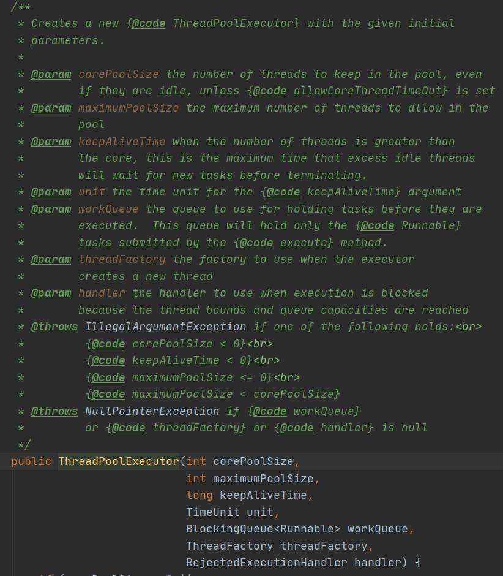
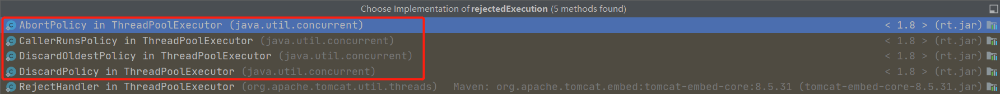
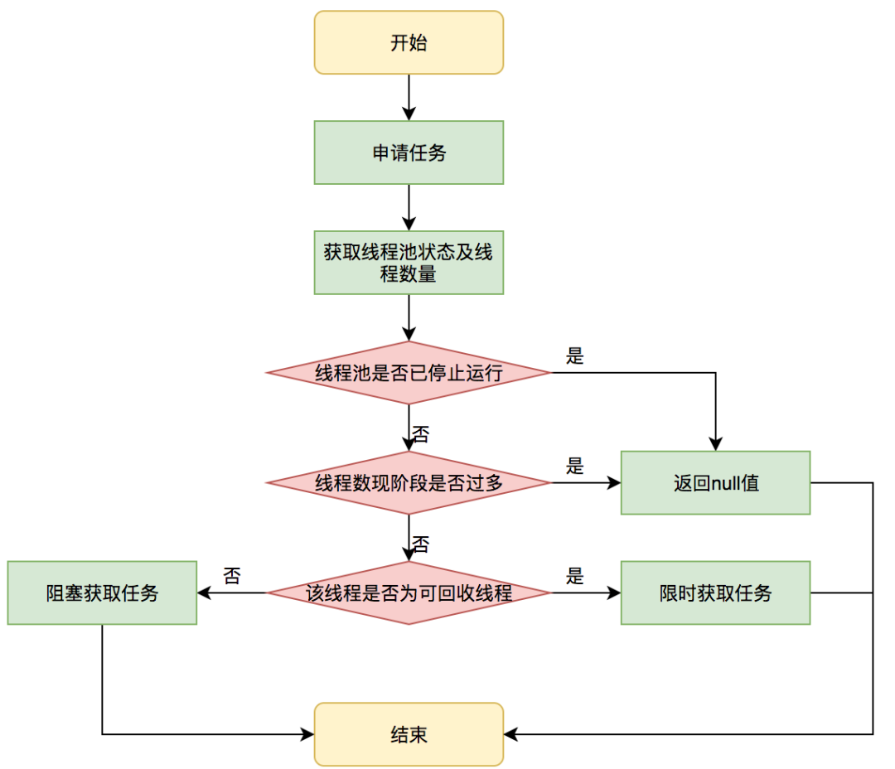
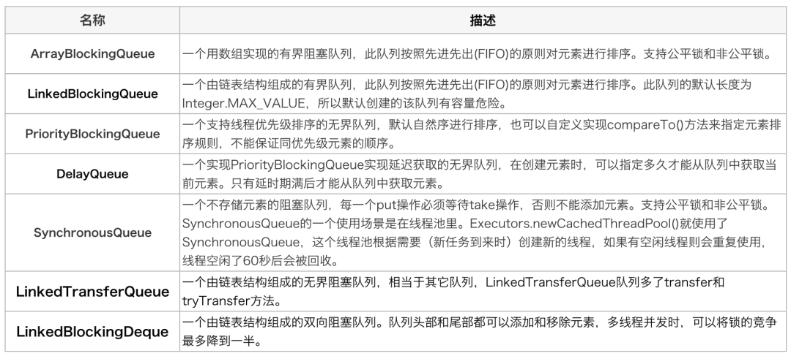
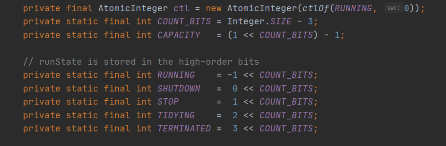

今天开启JUC系列的第一篇，ThreadPoolExecutor线程池。通过这篇文章，彻底把线程池给搞懂。

来吧~

<!-- more -->

### 先看几个关于线程池的阿里规范


阿里的《Java开发手册》中，并发处理的第三条，**线程资源必须通过线程池提供，不允许在应用中自行显式创建线程**。其实下面的说明也说的很清楚，线程池的好处在于减少在创建和销毁线程上所消耗的时间和系统资源开销。其实这类利用了一种“池化”的思想，比如本次说讲述的线程池，数据库连接池、JVM的常量池等，都是一种空间换时间的思想。

那么怎么利用线程池呢？第三条中**不允许通过Executors进行创建，而是通过ThreadPoolExecutor的方式**。那么问题来了，为什么不允许呢？Executors这个工具类提供哪些默认的实现呢？那么到底该怎样使用ThreadPoolExecutor呢？开发手册说这样的处理方式能够让写的同学更加明确线程池的运行规则，那么我们接下来就从源码的分析线程池验证开发手册这样说的规则意义在哪里？

### ThreadPoolExecutor的重要参数



通过构造函数我们可以看出来，线程池一共有7个重要的参数，他们的意义在注释里面也很清楚。

1. **corePoolSize**: 核心线程数，不管创建以后是否空闲，线程池都需要保持的线程数，除非设置了**allowCoreThreadTimeOut**。

   这里我们知道如果想管理核心线程池的数量，可以设置**allowCoreThreadTimeOut**这个参数为true时，核心线程在空闲了keepAliveTime 时候也会被回收。

2. **maximumPoolSize**：线程池中最多可以允许创建的线程个数

3. **keepAliveTime**：线程存活时间。当线程数超过core时，这是最大可以让空闲线程存活的时间。

4. **unit：**线程存活时间的单位。

5. **workQueue**：存放待处理的任务。当线程数超过核心线程数大小后，提交的任务就会被存放在这里。这里要注意，注释里这样写：*This queue will hold only the {@code Runnable} tasks submitted by the {@code execute} method.* 这些Runnable任务只能被**execute**方法执行。

6. **threadFactory**：线程工厂，用来创建线程的工厂。

   上面开发手册第2条要求：创建线程或线程池时请指定有意义的线程名称。这里就是要求我们自己实现线程工厂，定义线程组名称，在jstack问题排查时，非常有帮助。

7. **handler** ：拒绝策略。当队列任务满了之后，工作的线程数也到了maximumPoolSize，这个时候再提交的任务就需要执行拒绝策略。

   具体的拒绝策略有：抛出异常、交还给调用线程来执行、丢弃掉最老的任务、直接丢弃。

   因为我用Springboot项目看的源码，第五种是Tomcat的拒绝策略，我们最后分析下Tomcat的线程池有什么区别。

   

### 线程池执行过程



这里借用美团的线程池技术文章里面的一张图。美团其他的技术文章都很优秀，推荐学习。

文字描述就是：当有新任务来临时，判断线程池中活跃的线程数是否小于核心线程数，如果是，则创建线程。这里需要注意的是，**即便有小于核心线程数的线程存活，也是创建新线程，直到数量达到核心线程数**。直到线程数达到核心线程数时，会把任务放入到阻塞队列中。如果阻塞队列也满了之后，则创建小于最大线程数的线程。直到线程数达到最大线程数，如果此时还有任务，则执行拒绝策略。

### 为什么不允许使用Executors创建线程？

回答这个问题，我们先看下有哪些阻塞队列呢？



再瞅瞅Executors有哪些默认的实现？

1. **newFixedThreadPool**固定线程数的线程池。线程数量由用户传入，核心线程数等于最大线程数。阻塞队列使用**LinkedBlockingQueue**。这是一个由链表结构组成的有界队列，默认队列长度为Integer.MAX_VALUE。这意味着不管有多少任务来，都会放到阻塞队列里，**可能会堆积大量的请求，导致OOM**。

```java
public static ExecutorService newFixedThreadPool(int nThreads) {
    return new ThreadPoolExecutor(nThreads, nThreads,
                                  0L, TimeUnit.MILLISECONDS,
                                  new LinkedBlockingQueue<Runnable>());
}
```

2. **newSingleThreadExecutor**单线程线程池。只有一个线程，核心线程数等于最大线程数等于1。阻塞队列同样使用**LinkedBlockingQueue**，**可能会堆积大量的请求，导致OOM**。

```java
public static ExecutorService newSingleThreadExecutor() {
    return new FinalizableDelegatedExecutorService
        (new ThreadPoolExecutor(1, 1,
                                0L, TimeUnit.MILLISECONDS,
                                new LinkedBlockingQueue<Runnable>()));
}
```

3. **newCachedThreadPool**可缓存线程池。核心线程数等于0，最大线程数为Integer.MAX_VALUE。使用SynchronousQueue队列，这是一个不存储元素的队列，意味着来一个任务就生成一个线程处理。**可能会创建大量的线程，导致OOM。**

```java
public static ExecutorService newCachedThreadPool() {
    return new ThreadPoolExecutor(0, Integer.MAX_VALUE,
                                  60L, TimeUnit.SECONDS,
                                  new SynchronousQueue<Runnable>());
}
```

4. **ScheduledThreadPoolExecutor**定时线程池。核心线程数由用户传入，最大线程数为Integer.MAX_VALUE，阻塞队列使用DelayedWorkQueue，这是一个无界队列。

```java
public ScheduledThreadPoolExecutor(int corePoolSize) {
    super(corePoolSize, Integer.MAX_VALUE, 0, NANOSECONDS,
          new DelayedWorkQueue());
}
```

还有就是**NewSingleThreadScheduledExecutor** 单线程用于定时周期性执行任务，**NewWorkStealingPool** 创建一个工作窃取。

### ThreadPoolExecutor分析

#### ctl和线程状态

先看下ThreadPoolExecutor的几个关键属性。



**ctl**是描述线程池运行状态和线程池中有效线程数量的一个字段。包括两部分数据：线程池的运行状态（runState）、线程池内有效线程数量（workerCount）。可以看出，ctl 高3位保存runState，低29位保存workerCount。

线程池运行状态主要有五种：

1. **RUNNING**： 能够接受提交的任务，也能处理阻塞队列中的任务。
2. **SHUTDOWN**： 关闭状态，不在接受新提交的任务，但继续处理阻塞队列里面的任务。在线程池处于RUNNING状态时，调用**shutdown()**方法会是线程池进入该状态。
3. **STOP**： 不能接受新任务，也不处理队列中的任务，同时会中断正在处理任务的线程。在线程池处于RUNNING或者SHUTDOWN状态时，调用**shutdownNow()**方法时，会是线程池进入该状态。
4. **TIDYING**： 如果所有任务都终止了，workerCount 有效线程数为0，线程池进入该状态后调用terminated() 方法进入TERMINATED 状态。
5. **TERMINATED**： 在terminated() 方法执行完后进入该状态，默认terminated()方法中什么也没有做。


### Worker类

Worker类的主要功能是：每一个**线程**都会被包装为**Worker对象**。可以看到Worker类继承AQS，并实现了Runnable接口。

实现Runnable接口，因此一个worker对象启动之后就会调用worker类中的run方法。

继承AQS，则可以通过AQS来实现独占锁的功能。通过tryAcquire方法，可以看出worker是不允许重入的。只要请不到锁就会返回false。不允许 重入的重要特点是：通过是否能获取锁，可以判断线程是否空闲以及是否可以被中断。

具体Worker类的运行我们 接下来看如何使用的。

```java
private final class Worker
    extends AbstractQueuedSynchronizer
    implements Runnable
{
    /**
     * This class will never be serialized, but we provide a
     * serialVersionUID to suppress a javac warning.
     */
    private static final long serialVersionUID = 6138294804551838833L;

    /** Thread this worker is running in.  Null if factory fails. */
    final Thread thread;
    /** Initial task to run.  Possibly null. */
    Runnable firstTask;
    /** Per-thread task counter */
    volatile long completedTasks;

    /**
     * Creates with given first task and thread from ThreadFactory.
     * @param firstTask the first task (null if none)
     */
    Worker(Runnable firstTask) {
        setState(-1); // inhibit interrupts until runWorker
        this.firstTask = firstTask;
        this.thread = getThreadFactory().newThread(this);
    }

    /** Delegates main run loop to outer runWorker  */
    public void run() {
        runWorker(this);
    }

    // Lock methods
    //
    // The value 0 represents the unlocked state.
    // The value 1 represents the locked state.

    protected boolean isHeldExclusively() {
        return getState() != 0;
    }

    protected boolean tryAcquire(int unused) {
        if (compareAndSetState(0, 1)) {
            setExclusiveOwnerThread(Thread.currentThread());
            return true;
        }
        return false;
    }

    protected boolean tryRelease(int unused) {
        setExclusiveOwnerThread(null);
        setState(0);
        return true;
    }

    public void lock()        { acquire(1); }
    public boolean tryLock()  { return tryAcquire(1); }
    public void unlock()      { release(1); }
    public boolean isLocked() { return isHeldExclusively(); }

    void interruptIfStarted() {
        Thread t;
        if (getState() >= 0 && (t = thread) != null && !t.isInterrupted()) {
            try {
                t.interrupt();
            } catch (SecurityException ignore) {
            }
        }
    }
}
```

### execute方法

execute()方法用来提交任务。

```java
public void execute(Runnable command) {
    if (command == null)
        throw new NullPointerException();
	//ctl高3位记录线程池状态，低29位记录线程数。
    int c = ctl.get();
    //workerCountOf方法取出低29位的值，表示当前活动的线程数。
    //如果小于核心线程数，则新建一个worker放入线程池中，该worker内包含着任务command。
    if (workerCountOf(c) < corePoolSize) {
        if (addWorker(command, true))
            //添加成功后返回
            return;
        c = ctl.get();
    }
    //如果活动线程数大于核心线程数，则判断如果当前线程池处于运行状态，并且将任务成功加入到阻塞队列中
    //则执行if方法内部
    if (isRunning(c) && workQueue.offer(command)) {
        //重新获取ctl值。
        int recheck = ctl.get();
        //再次判断线程池状态，如果不是运行状态，因为刚刚把任务加入到队列中了，此时需要将任务移除队列
        //同时执行拒绝策略对该任务进行处理，方法返回。
        if (! isRunning(recheck) && remove(command))
            reject(command);
        //如果线程池处于运行状态，则获取线程池中有效线程数，如果有效线程数为0，则执行addworker方法。
        //保证有线程执行。
        //addWorker(null, false);null表示线程池中创建一个线程，但不去执行
        // false，将线程池线程数量上限设置为maximumPoolSize
        else if (workerCountOf(recheck) == 0)
            addWorker(null, false);
    }
    //执行到这里，说明：
    //1.线程池不是Running 2. 是running状态，线程数大于核心线程数，且队列满了
    //然后调用addWorker，第二个参数设置为false,将线程池的线程数量上限设置为maximumPoolSize
    else if (!addWorker(command, false))
        reject(command);
}
```

这个方法是线程池执行的入口。如果线程池处于RUNNING状态，则:

1. workerCount < corePoolSize，则addwork创建并启动线程 来执行提交的任务
2. workerCount >= corePoolSize且workQueue.offer(command)，说明阻塞队列未满，则将任务添加到阻塞队列中。
3. 如果workerCount >= corePoolSize && workerCount < maximumPoolSize，则阻塞队列已满，则addwork创建并启动一个线程来执行提交的任务
4. workerCount >= maximumPoolSize且阻塞队列已满，则执行拒绝策略。

下面对addwork方法分析之后，再来看这段逻辑，会理解的更加明白。主要是addwork的两个参数的含义。

### addWorker方法

addwork方法主要是创建一个线程加入到线程池执行。有两个参数，第一个参数Runnable firstTask，用于指定新增的线程执行的第一个任务。core参数为true时，则新增线程时会判断如果当前线程数小于核心线程数。fasle时新增线程前需要判断活动线程数是否小于最大线程数。

```java
private boolean addWorker(Runnable firstTask, boolean core) {
    retry:
    for (;;) {
        int c = ctl.get();
        //获取线程池运行状态
        int rs = runStateOf(c);
		//因为running状态为-1，shutdown状态为0
        //rs >= SHUTDOWN则表示不再接受新任务
        //  !(rs == SHUTDOWN &&firstTask == null &&! workQueue.isEmpty())
        //接着判断以下三个条件，只要有一个不满足，则返回false.
        //1.如果线程池处于shutdown状态，返回false
        //2.firstTask任务为空
        //3.阻塞队列不为空
        if (rs >= SHUTDOWN &&
            ! (rs == SHUTDOWN &&
               firstTask == null &&
               ! workQueue.isEmpty()))
            return false;

        for (;;) {
            //获取线程数
            int wc = workerCountOf(c);
            //如果线程数超过最大数量 （1左移29位减1（29个1））则返回false
            //core为true，则跟corePoolSize比较，为false则跟maximumPoolSize比较
            if (wc >= CAPACITY ||
                wc >= (core ? corePoolSize : maximumPoolSize))
                return false;
            //尝试CAS添加worker，如果成功，则跳出第一个for循环
            if (compareAndIncrementWorkerCount(c))
                break retry;
            //如果添加失败，则重新获取ctl值，判断运行状态，说明状态被改变了，返回第一个for循环继续执行
            c = ctl.get();  // Re-read ctl
            if (runStateOf(c) != rs)
                continue retry;
            // else CAS failed due to workerCount change; retry inner loop
        }
    }

    boolean workerStarted = false;
    boolean workerAdded = false;
    Worker w = null;
    try {
        //程序走到这里，说明尝试增加workerCount成功，则要开始创建线程执行任务了
        //根据firsttask来创建 worker对象。
        w = new Worker(firstTask);
        //worker继承Runnable接口，因此执行 初始化时，会
        //this.thread = getThreadFactory().newThread(this);
        //将自己传进去 ，创建线程。
        final Thread t = w.thread;
        if (t != null) {
            //首先获取锁
            final ReentrantLock mainLock = this.mainLock;
            mainLock.lock();
            try {
                // Recheck while holding lock.
                // Back out on ThreadFactory failure or if
                // shut down before lock acquired.
                int rs = runStateOf(ctl.get());
				//1.rs < SHUTDOWN说明是Running状态
                //2.或者 处于shutdown状态且first为null，向线程池中添加线程。
                //因为处于shutdown状态时，不会添加任务，但是需要执行workQueue中的任务。
                //第二种情况，这里暂时有疑问
                if (rs < SHUTDOWN ||
                    (rs == SHUTDOWN && firstTask == null)) {
                    if (t.isAlive()) // precheck that t is startable
                        throw new IllegalThreadStateException();
                    //将worker添加到workers,workers是一个HashSet。
                    workers.add(w);
                    int s = workers.size();
                    if (s > largestPoolSize)
                        largestPoolSize = s;
                    workerAdded = true;
                }
            } finally {
                mainLock.unlock();
            }
            //如果添加成功，则启动线程。
            if (workerAdded) {
                //启动后，会调用worker类中的run方法。
                t.start();
                workerStarted = true;
            }
        }
    } finally {
        if (! workerStarted)
            addWorkerFailed(w);
    }
    return workerStarted;
}
```

接下来分析线程是如何执行任务的。

### runWorker方法

上面addworker之后，会启动线程，线程会调用worker里面的run方法。

```java
public void run() {
    runWorker(this);
}
```

**beforeExecute**方法和**afterExecute**方法在ThreadPoolExecutor类中是空的，留给子类来实现。这里可以自定义实现，用于记录线程执行前后一些重要信息。

```java
final void runWorker(Worker w) {
    Thread wt = Thread.currentThread();
    //获取第一个任务
    Runnable task = w.firstTask;
    //取出后，将firstTask置为null
    w.firstTask = null;
    //允许中断
    w.unlock(); // allow interrupts
    //是否因为异常退出循环
    boolean completedAbruptly = true;
    try {
        //如果task为空，则getTask来获取任务。
        while (task != null || (task = getTask()) != null) {
            w.lock();
            // If pool is stopping, ensure thread is interrupted;
            //翻译：如果线程池正在停止，则保证线程是中断状态。
            // if not, ensure thread is not interrupted.  This
            // requires a recheck in second case to deal with
            // shutdownNow race while clearing interrupt
            //翻译： 如果线程池不是正在停止，要保证线程不是中断状态
            if ((runStateAtLeast(ctl.get(), STOP) ||
                 (Thread.interrupted() &&
                  runStateAtLeast(ctl.get(), STOP))) &&
                !wt.isInterrupted())
                wt.interrupt();
            try {
                beforeExecute(wt, task);
                Throwable thrown = null;
                try {
                    //执行任务
                    task.run();
                } catch (RuntimeException x) {
                    thrown = x; throw x;
                } catch (Error x) {
                    thrown = x; throw x;
                } catch (Throwable x) {
                    thrown = x; throw new Error(x);
                } finally {
                    afterExecute(task, thrown);
                }
            } finally {
                task = null;
                w.completedTasks++;
                w.unlock();
            }
        }
        completedAbruptly = false;
    } finally {
        //如果取不到任务，则执行
        processWorkerExit(w, completedAbruptly);
    }
}
```

### getTask方法

getTask方法是从队列中获取任务。

```java
private Runnable getTask() {
    //用来标记上一次从阻塞队列中获取任务是否超时
    boolean timedOut = false; // Did the last poll() time out?

    for (;;) {
        int c = ctl.get();
        int rs = runStateOf(c);

        // Check if queue empty only if necessary.
        if (rs >= SHUTDOWN && (rs >= STOP || workQueue.isEmpty())) {
            decrementWorkerCount();
            return null;
        }

        int wc = workerCountOf(c);

        // Are workers subject to culling?
        boolean timed = allowCoreThreadTimeOut || wc > corePoolSize;

        if ((wc > maximumPoolSize || (timed && timedOut))
            && (wc > 1 || workQueue.isEmpty())) {
            if (compareAndDecrementWorkerCount(c))
                return null;
            continue;
        }

        try {
            Runnable r = timed ?
                workQueue.poll(keepAliveTime, TimeUnit.NANOSECONDS) :
                workQueue.take();
            if (r != null)
                return r;
            timedOut = true;
        } catch (InterruptedException retry) {
            timedOut = false;
        }
    }
}
```


>参考列表
>
>1. http://www.ideabuffer.cn/2017/04/04/%E6%B7%B1%E5%85%A5%E7%90%86%E8%A7%A3Java%E7%BA%BF%E7%A8%8B%E6%B1%A0%EF%BC%9AThreadPoolExecutor/
>2. https://mp.weixin.qq.com/s?__biz=MzIxNTQ4MzE1NA==&mid=2247483741&idx=1&sn=238fc933c3b9b19ab1754b23283ac6fd&chksm=9796d720a0e15e364f4105c29de606e7329760a41607136a722dc97bb177f9362aeacd92f762&scene=21#wechat_redirect
>3. https://mp.weixin.qq.com/s?__biz=MzIxNTQ4MzE1NA==&mid=2247485707&idx=1&sn=237055cf8fe1c2674040a5b1cd65f1f5&chksm=9796df76a0e15660547f649d3ed71e2b648d0c311b73d96814a2b2c1a79b7c06dcc7d0cae1a6&scene=126&sessionid=1587805357&key=8789ad4c0cbeb143d447f685d4f03e5d963a1723f62ac35c68e4aebce994297a2f8f2ea78afd290e36589fae177b5713bdab58259ef6c1fe01e6aeb06d3a9884428695bfd0af6334b2c122f6b5f97841&ascene=1&uin=MzUzODgzMzE1&devicetype=Windows+10&version=62090045&lang=zh_CN&exportkey=AcZGDJYk8ivvrIjje38wVHA%3D&pass_ticket=AOmyib5g8q3bhsRCyHhHt2b013En%2F%2Futtoo0Ibup4qcr73qHE9jUkYG8Mkgpb3Nq
>4. http://www.ideabuffer.cn/2017/04/04/%E6%B7%B1%E5%85%A5%E7%90%86%E8%A7%A3Java%E7%BA%BF%E7%A8%8B%E6%B1%A0%EF%BC%9AThreadPoolExecutor/
>5. https://mp.weixin.qq.com/s?__biz=MjM5NjQ5MTI5OA==&mid=2651751537&idx=1&sn=c50a434302cc06797828782970da190e&chksm=bd125d3c8a65d42aaf58999c89b6a4749f092441335f3c96067d2d361b9af69ad4ff1b73504c&scene=21#wechat_redirect

