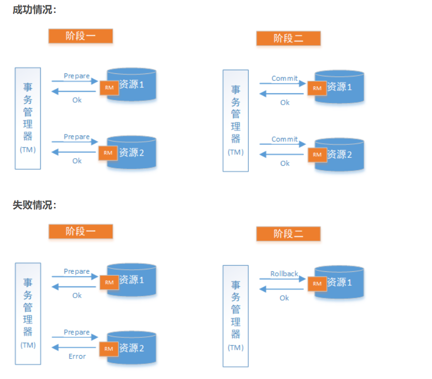

在分布式事务之初始seata中，我们提到常见的分布式事务解决方案有：2PC方案、3PC方案、TCC方案、本地消息表方案和可靠消息最终一致性方案等。我们今天就来对着几个分布式方案进行归纳。

<!-- more -->

在介绍分布式方案前，我们先对几个分布式相关理论进行总结。

### CAP理论

CAP理论指的是 在一个分布式系统中，最多只能满足C A P中的两个需求。其中，

1. C : Consistency **一致性**。指的是同一个数据多个实例中是否实时相同。
2. A ：Availability **可用性**。一定时间内、系统可以返回一个明确的结果，则表示该系统可用。
3. P ：Partition tolerance : **分区容错性**。即使出现单个服务实例宕机，分布式系统中其他服务实例仍然可以提供服务。

首先，我们需要明确的是，在这三个属性中，**分区容错性是首先需要保证的**，不然分布式系统也就没有意义了。所以我们只能在 **一致性** 和 **可用性** 之间选择。对于我们业务系统来说，**首先要保证的是系统的可用性**，如果系统因为系统异常、响应时间过长等导致系统不可用，那么系统也就没有存在的意义。

另外，对于我们分布式系统来说，注册中心是比不可少的。因此我们可以进行对比：

1. **zookeeper支持CP**，任何时刻对zk进行访问，都能得到一致性的结果。当zk进行leader选举的时候，zk集权是不对外提供服务的。这个我们对ZK原理讲解的时候再来探讨。
2. **Eureka支持AP**，Eureka集群中，所有节点都是平等的，所以即使其中某台实例宕机，也会将请求自动转发到其他节点，所以是支持可用性，但是不能保证一致性，因为各节点之间异步复制，所有可能存在某个时刻节点之间数据不同。

### BASE理论

BASE理论是对CAP中一致性和可用性之间做的权衡。

BASE理论说的是：

1. **Basic Available 基本可用**。系统在某些极端情况下，仍然可以保证可用性，即一定时间内仍然可以返回一个明确的结果。
2. **Soft state（软状态）**。同一数据在不同实例中，可以不需要保持实时一致。
3. **Eventually consistent（最终一致性）**。虽然不需要实时一致，但是要保证在经过一定时间后仍然是一致的。

所以BASE理论的核心思想是：**虽然无法做到强一致性，但是我们可以降低要求，采用适当的方式达到最终一致性。**

### 分布式事务解决方案 

#### 2PC 二阶段提交

2PC即两阶段提交协议，将整个事务流程分为两个阶段，

**1. 准备阶段 **

事务管理器给每个参与者发送prepare消息，每个数据库参与者在本地执行事务，并写本地undo/redo日志，此时事务还没有提交。（undo日志是记录修改前的数据，用于数据库回滚。redo日志是记录修改后的数据，用于提交事务后写入数据文件）

**2.提交阶段**

如果事务管理器收到了参与者的执行失败或者超时信息，直接给每个参与者发送回滚rollback消息；否则，发送提交信息。参与者根据事务管理器的执行进行提交或者回滚操作，并释放事务处理过程中的锁资源。

#### 3PC 三阶段提交

三阶段比二阶段有两个改动点：

1. 引入超时机制。同时在协调者和参与者都引入了超时机制
2. 在第一个阶段和第二个阶段引入一个准备阶段。

因此整个事务流程分为三个阶段：

**1. CanCommit阶段**

协调者向参与者发送cancommit请求，询问是否可以执行事务，然后等待参与者的响应。参与者认为自身可以顺利执行事务，则返回yes，并且进入预备状态，否则返回no。

**2.PreCommit阶段**

协调者根据参与者的返回情况作出不同的反应：

1. **如果第一阶段所有参与者反馈都是yes**，那么 协调者向参与者发送PreCommit请求，并且 进入PrePared阶段；参与者接收到PreCommit请求后，执行事务操作，并将写本地undo/redo日志；如果参与者成功执行了事务操作，则返回ack响应，并且等待最终指令。
2. **如果第一阶段有任何一个参与者发送了No或者等待超时之后，协调者都没有收到参与者的响应**，就执行事务的abort操作。协调者向所有参与者发送abort请求，那么整个事务到此结束，说明第一阶段没有参与者没有准备好。

**3.doCommit阶段**

这个阶段执行真正的事务提交，也可以分为以下两种情况：

1. **执行提交**。

协调者向接受到所有参与者的第二阶段的ack响应，那么协调者的状态由预提交状态进入提交状态，并向所有参与者发送doCommit请求。

参与者接收到doCommit请求后，执行真正的事务提交，并在事务提交后，释放所有事务资源，并且向协调者发送ack响应。

协调者接收到所有参与者的第三阶段的ack响应后，完成事务。

**2.中断事务**

协调者没有接收到参与者第二阶段的ack响应，那么就执行中断事务。协调者向所有参与者发送abort请求。

参与者接受到abort请求之后，利用其在第二阶段的undo信息来执行事务的回滚操作，并在回滚之后释放所有事务资源。

参与者完成事务回滚之后，向协调者发送ack消息。

协调者接收到参与者的ack消息之后，结束整个事务。

### TCC 补偿式事务

TCC即 Try Commit Cancel，采用补偿机制。

**1.Try**  尝试待执行的业务

这个过程并未真正执行业务，只是完成所有业务的一致性检查，并预留好执行所需的全部资源。

**2.Confirm** 执行业务

这个过程真正开始执行业务，由于第一阶段已经完成了一致性检查，因此本过程直接执行，并不做任何检查，并且在执行的过程，会使用Try阶段预留的业务资源

**3.Cancel** : 取消执行的业务

如果业务执行失败，则进入Cancel阶段，它会释放所有占用的业务资源，并且回滚Confirm阶段进行的操作。

缺点就是：**大量业务侵入代码，每个分支都需要try confirm cancel三个操作**。

### 本地消息表

本地消息表也正是目前我们项目中使用到的方案，下面进行具体介绍。

1. A系统执行本地事务，并且在A系统的消息表中插入一条记录，状态为待确认，这两个操作在一个事务中，因为在同一个数据库，因此可以保证。
2. 准备一个后台程序，源源不断的把消息表中的message传送给MQ。如果失败，则重试，可以允许数据重复。
3. B系统作为消费者，接收到MQ的消息，在一个事务中，首先在B系统的消息表中插入一条数据，然后执行B系统的业务逻辑。
   1. 如果判重表中存在 ，说明已经消费过这条数据，那么不执行业务逻辑，实现幂等性。
   2. 如果B系统业务操作成功，则更新消息表的状态，然后通知A系统修改A系统的消息表状态为成功。
   3. 如果B系统业务操作失败则事务回滚，则不去通知A系统修改A系统的消息表。因为A系统的定时任务会不断轮询自己的消息表，将待确认的消息继续重新发送给B直到B成功为止。