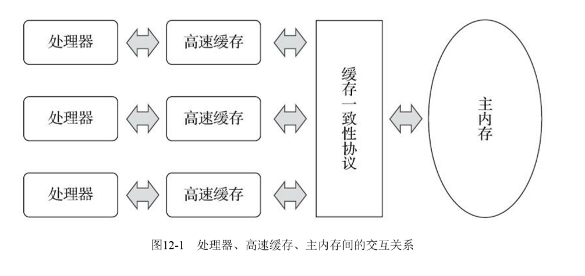
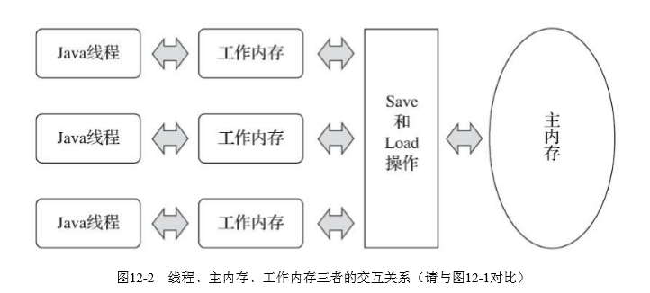

前面分析了Synchronized关键字以及CAS无锁机制。今天一起来了解volatile，先讲述一些相关JVM的知识，一并作为笔记记录下来。大部分内容来自《深入理解Java虚拟机》第三版，这本书也应该是每个Javaer案头的必备书了吧。

<!-- more -->

## 硬件效率与一致性

在了解volatile是如果工作的之前，我们需要先了解几个概念。

### CPU缓存

由于计算机的存储设备与处理器的运算速度有几个数量级的差距，所以现代计算机系统都不得不引入一层或者多层读写速度尽可能接近处理器速度的高速缓存来作为内存和处理器之间的缓冲：将运算需要使用的数据复制到缓存上，让运算能快速进行，当运算结束之后再从缓存同步回内存之中，这样处理器就无须等待缓慢的内存读写了。

### 缓存一致性问题

基于高速缓存的存储交互很好的解决了处理器与内存速度之间的矛盾，但是也为系统带来了更高的复杂度，它引发了一个新的问题：***缓存一致性***。在多路处理器系统中，每个处理器都有自己的高速缓存，而他们又共享同一主内存，这种系统成为共享内存多路系统。**当多个处理器的运算任务都设计到同一块主内存区域时，将可能导致各自的内存数据不一致，这就是缓存一致性问题**。

解决方案一般有两种：

1. **总线锁**。总线是计算机各种功能部件之间传送信息的公共通信干线，负责cpu与外界所有部件的通信。因此，当cpu对其缓存汇总的数据进行操作的时候，往总线发送一个Lock信号，这个时候，其他cpu收到这个信号之后就不操作自己缓存中对应的数据，当操作结束后，释放锁以后，所有cpu就去内存中获取最新数据更新。但是锁总线会导致cpu性能出现下降，因此，出现另一中解决方案。
2. **缓存锁**：不对总线进行锁定，对缓存的共享对象进行锁定。当被修改的共享内存写回到内存时，处理器不在总线上声明Lock信号，而是修改内部的内存地址，并通过缓存一致性协议来解决原子性问题，每个处理器通过嗅探总线上传播的数据来检查自己缓存的值是不是过期了，当处理器发现自己缓存行对应的内存地址被修改，就会将当前处理器的缓存行设置为无效状态。使用比较广泛的缓存一致性协议有**MESI**。

>MESI协议实际上是表示缓存的四种状态
>
>**M(Modify)****表示共享数据只缓存在当前cpu缓存中，并且是被修改的状态，也就是缓存的数据与主内存中的数据不一致
>
>**E(Exclusive)**表示缓存的独占状态，数据只缓存在当前cpu缓存中，并且没有被修改
>
>**S(Shared)** 表示数据可能被多个cpu缓存，并且各个缓存中的数据和主内存数据一致
>
>**I(Invalid)** 表示缓存已经失效
>
>缓存一致性的工作原理是：
>
>1. 如果缓存的状态是I，那么就从内存中读取，否则直接从缓存中读取
>2. 如果缓存处于M或者E的cpu嗅探到其他cpu有读的操作，就把自己的缓存写入到内存，并把自己的状态设置为S
>3. 只有缓存状态是M 或者 E时，cpu才可以修改缓存中的数据，修改后，缓存状态变为M

## Java内存模型

### 主内存与工作内存

Java内存模型是用来屏蔽各种硬件和操作系统的内存访问差异的一种规范，以实现Java程序在各种平台下都能达到一致的内存访问效果。

Java内存模型规定，所有变量都存储在主内存。每条线程都拥有自己的工作内存，线程的工作内存中保存了被该线程使用的变量的主内存副本，线程对变量的所有操作都必须在工作内存中进行，而不能直接读写主内存中的数据。不同线程之间也无法直接访问对方工作内存中的变量，线程之间的变量值传递均需要通过主内存来完成。

### 内存间交互操作

Java内存模型定义了8种操作来完成如何从主内存拷贝到工作内存、如果从工作内存同步到主内从这一类的细节。lock、unlock、read、load、use、assign、store、wtire，但基于理解难度和严谨性考虑，已经放弃采用这8中操作去定义Java内存模型的访问协议，缩减为4中：read write lock unlock。

### 原子性、可见性和有序性

Java内存模型是围绕着在并发过程中如何处理原子性、可见性和有序性这三个特征来建立的。

#### 原子性

原子性不用多说，就是一个操作或者多个操作要么全部执行要么全部不执行。JMM保证对基本数据类型的访问、读写都是具备原子性的，如果需要对更大的原子性进行保证，则只能通过锁或者Synchronized关键字来实现。

#### 可见性

可见性就是指当一个线程修改了共享变量的值时，其他线程能够立即得知到这个修改。Java内存模型是通过在变量修改后将新值同步回主内存，在变量读取前从主内存刷新变量值这种依赖主内存作为传递媒介的方式实现可见性的，无论对于普通变量还是volatile变量都是如此。只不过volatile变量可以保证新值能够立即同步到主内存，以及每次使用前立即从主内存刷新，换句话说就是volatile保证了多线程操作变量时的可见性，而普通变量则做不到。同时synchronized 和final也能实现可见性。

#### 有序性

Java程序中天然的有序性可以总结为一句话：如果在本线程内观察，所有操作都是有序的，如果在一个线程中观察另一个线程，所有操作都是无序的。前半句是指“线程内似表现为串行的语义”，后半句是指“指令重排序现象”和“工作内存与主内存同步延迟”。

Java语言提供了volatile和synchronized两个关键字来保证线程之间操作的有序性。volatile关键字本身包含了禁止指令重排序的语义；而synchronized则是由“一个变量在同一时刻只允许一条线程对其进行lock操作”，这个规则决定了持有同一个锁的两个同步块只能串行的进入。

### 先行发生原则

1. 程序次序规则：在一个线程内，按照控制流的顺序，书写前面的操作先行书写后面的操作
2. 管程锁定规则：一个unlock操作先行发生于后面对同一个锁的lock操作。
3. volatile变量规则：对一个volatile变量的写操作先行发生于后面对这个变量的读操作。
4. 线程启动规则：Thread对象的start方法先行发生于此线程的每一个动作
5. 线程终止规则：线程中所有操作都先行发生于对此线程的终止检测。
6. 线程中断规则：对线程interrupt方法的调用先行发生于被中断线程检测到中断事件的发生
7. 对象终结原则：一个对象的初始化完成先行发生于它的finalize方法的开始
8. 传递性：操作A先行发生于操作B，操作B先行发生于操作C，那么A先行发生于操作C。

## 总结

以上是Java线程模型的相关知识，不得不说纯理论的东西，确实晦涩难懂，下篇我们从实际的volatile来解析volatile是如何解决Java线程模型中可见性和有序性的问题。

>参考列表
>
>1.《深入理解Java虚拟机》 周志明 第三版